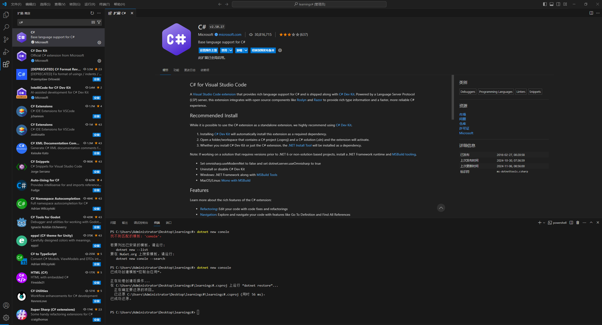
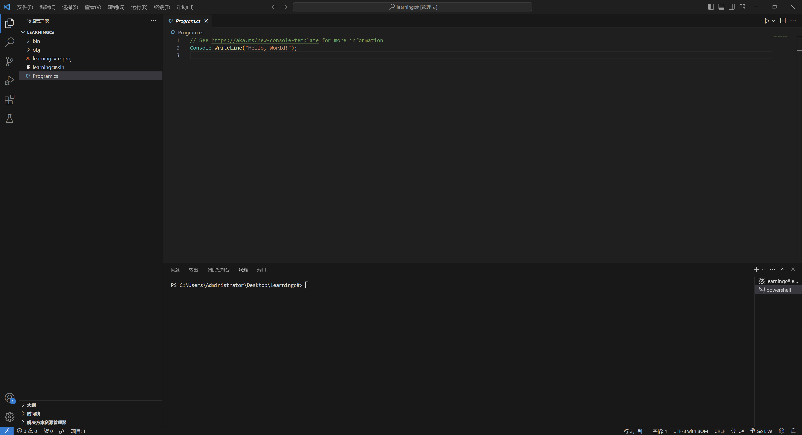
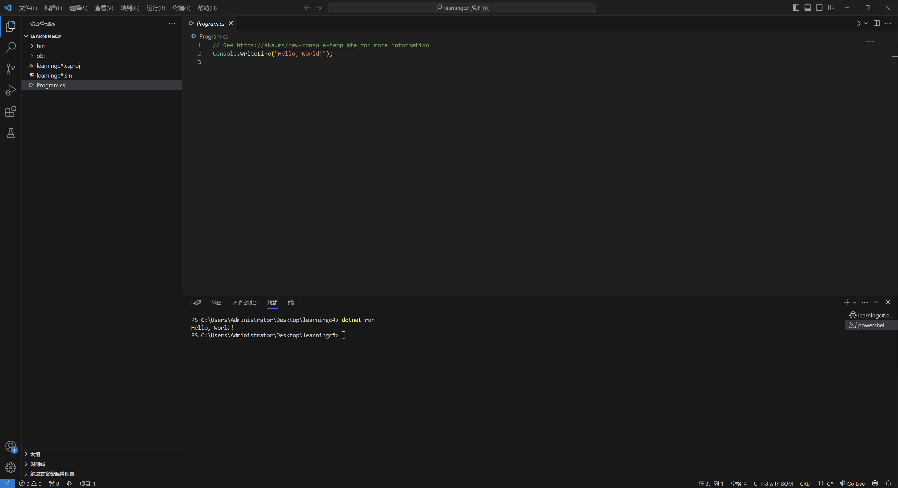

# 02、VScode编辑器上编译C\#

### .NET 下载 

C#语言是基于.NET框架之下编译和运行。这些实现通常打包成一个软件开发包（SDK， Software Development Kit），其中包含语言编译器、执行引擎、语言可访问的功能架构以及其他的工具。

.NET 下载地址：[.NET 下载(Linux、macOS 和 Windows)](https://link.zhihu.com/?target=https%3A//dotnet.microsoft.com/zh-cn/download/dotnet) （推荐下载.NET Core)

### VS Code 编辑器安装 

VS Code具有开源、轻量、免费、简洁等特点。VSCode依赖命令行（Dotnet CLI "Command-Line Interface" ）创建初始的C#程序基架编译和运行。

VS Code下载地址：[Download Visual Studio Code - Mac, Linux, Windows](https://link.zhihu.com/?target=https%3A//code.visualstudio.com/Download)

### VScode上编译C#文件 

下载插件：C#

<figure><figcaption></figcaption></figure>

在桌面新建一个工程文件夹，并且VS Code中打开，在菜单栏中打开终端，输入dotnet new console 初始化程序。

<figure><figcaption></figcaption></figure>

调出终端，输入dotnet run 运行。

<figure><figcaption></figcaption></figure>
