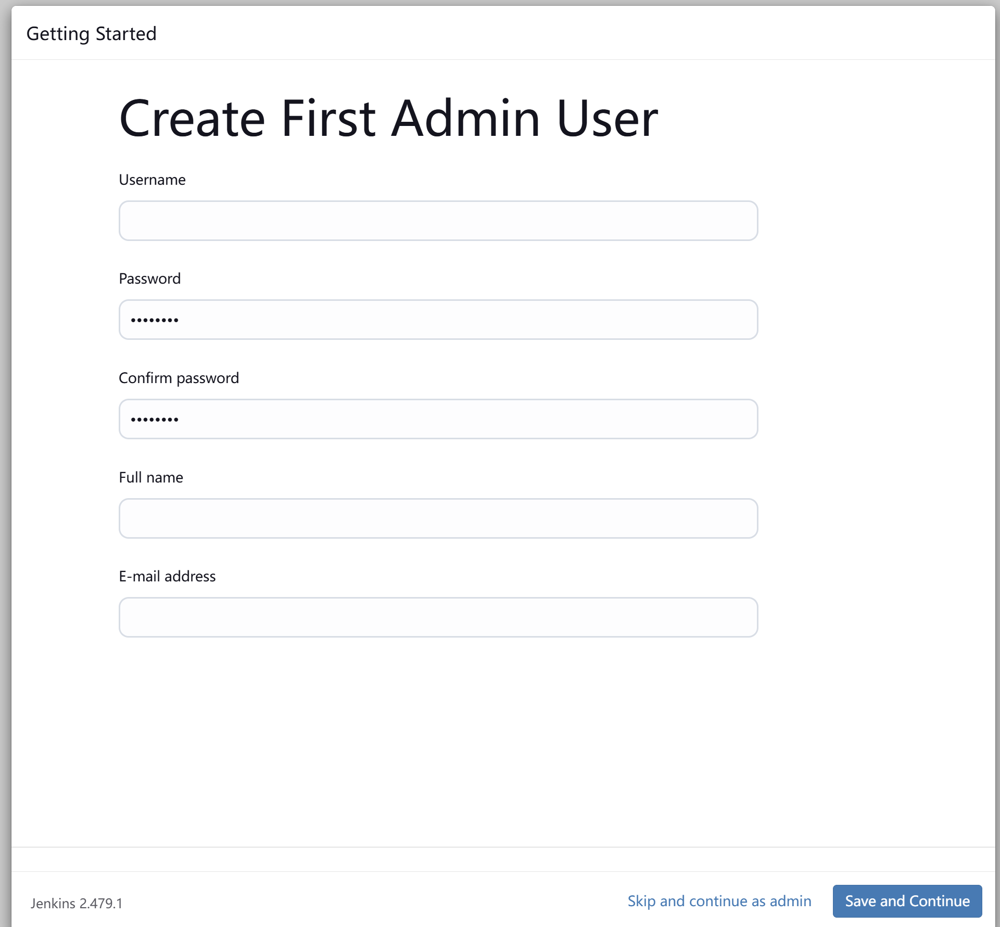
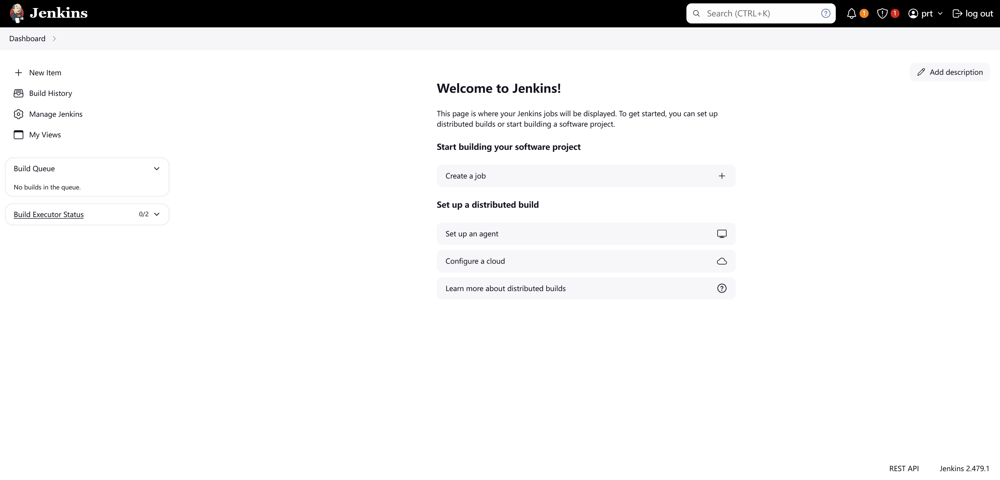

# 01、安装jenkins

## 介绍

Jenkins 是一个独立的开源自动化服务器，可用于自动化与构建、测试、交付或部署软件相关的各种任务。

jenkins 是最老牌功能最全的devops平台，适合市面上99%的场景，如果你刚接触 devops，那么从jenkins出发是个不错的选择。

jeinkins 可以通过本机系统包、Docker 安装，甚至可以在任何安装了 Java 运行时环境 (JRE) 的机器上独立运行。

## 安装

使用 docker 安装对于新手比价友好，也是官方推荐的第一种安装方式，我们打开官网安装文档：[https://www.jenkins.io/doc/book/installing/docker/](https://www.jenkins.io/doc/book/installing/docker/)&#x20;

### prerequisites

* &#x20;256 MB 内存
* 1 GB 磁盘空间

### 安装步骤

```
docker network create jenkins
```

<pre><code>// 启动 dind 镜像，需要确保网络畅通
docker run --name jenkins-docker --rm --detach \
  --privileged --network jenkins --network-alias docker \
<strong>  --env DOCKER_TLS_CERTDIR=/certs \
</strong>  --volume jenkins-docker-certs:/certs/client \
  --volume jenkins-data:/var/jenkins_home \
  --publish 2376:2376 \
  docker:dind --storage-driver overlay2
</code></pre>

```
// 建一个 docekrfile ，将下面内容粘贴进文件

FROM jenkins/jenkins:2.479.1-jdk17
USER root
RUN apt-get update && apt-get install -y lsb-release
RUN curl -fsSLo /usr/share/keyrings/docker-archive-keyring.asc \
  https://download.docker.com/linux/debian/gpg
RUN echo "deb [arch=$(dpkg --print-architecture) \
  signed-by=/usr/share/keyrings/docker-archive-keyring.asc] \
  https://download.docker.com/linux/debian \
  $(lsb_release -cs) stable" > /etc/apt/sources.list.d/docker.list
RUN apt-get update && apt-get install -y docker-ce-cli
USER jenkins
RUN jenkins-plugin-cli --plugins "blueocean docker-workflow"
```

```
// 构建镜像
docker build -t myjenkins-blueocean:2.479.1-1 .
```

```
docker run --name jenkins-blueocean --restart=on-failure --detach \
  --network jenkins --env DOCKER_HOST=tcp://docker:2376 \
  --env DOCKER_CERT_PATH=/certs/client --env DOCKER_TLS_VERIFY=1 \
  --publish 8080:8080 --publish 50000:50000 \
  --volume jenkins-data:/var/jenkins_home \
  --volume jenkins-docker-certs:/certs/client:ro \
  myjenkins-blueocean:2.479.1-1
```

### 安装后设置

打开 localhost:8080, 来到解锁界面，这里需要获取管理员密码，可以执行下面命令获取到：

```sh
sudo docker exec ${CONTAINER_ID or CONTAINER_NAME} cat /var/jenkins_home/secrets/initialAdminPassword 
```

<figure><figcaption></figcaption></figure>

[解锁 Jenkins](https://www.jenkins.io/doc/book/installing/docker/#unlocking-jenkins)后，会出现**“自定义 Jenkins”**页面。作为初始设置的一部分，您可以在此处安装任意数量的有用插件。这里我们选择第一个，仅仅安装默认插件。

<figure><figcaption></figcaption></figure>

选择完成后，插件开始安装，耐心等待即可：

<figure><figcaption></figcaption></figure>

插件安装完成后会要求我们创建一个管理员账号，输入账号密码邮箱即可：

<figure><figcaption></figcaption></figure>

创建完管理员账号后，会要求我们确认回调地址，回调地址用来接收一些外部系统的调用，包括电子邮件通知、PR 状态更新以及为构建步骤提供的`BUILD_URL`环境变量。你需要看看默认的地址是否合适：

<figure><figcaption></figcaption></figure>

到此，jenkins 已经安装完毕，下面就是熟悉 jenkins 的各种功能了：

<figure><figcaption></figcaption></figure>
