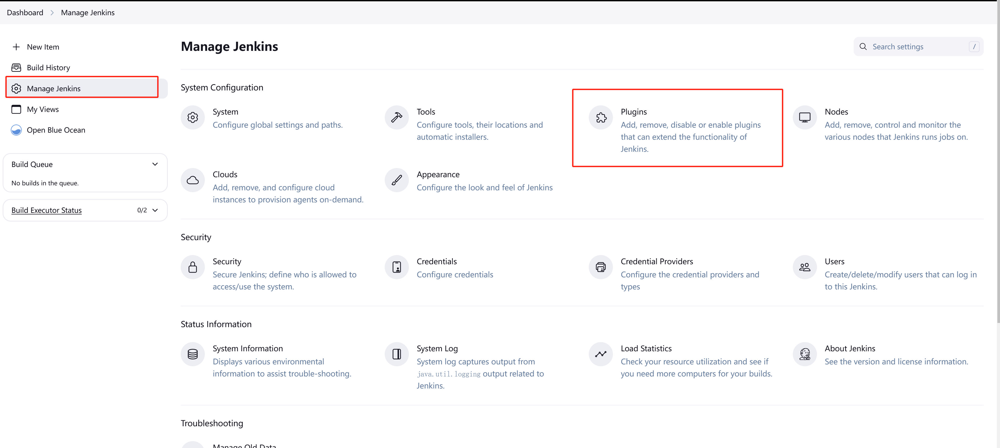

# 02、创建你的第一条pipeline

## 什么是 jenkins

上一节我们安装好了 jenkins，这节课我们熟悉下什么是 pipeline。

Jenkins Pipeline（或简称“Pipeline”）是一套插件，支持在 Jenkins 中实施和集成_持续交付管道_。

Jenkins Pipeline 提供了一组可扩展的工具，用于将简单到复杂的交付管道“作为代码”进行建模。 Jenkins Pipeline 的定义通常写入文本文件（称为`Jenkinsfile` ），然后将其嵌入项目的源码存储库。&#x20;

## 前置条件

我们需要安装 docker pipeline 插件，默认是已经安装了，你也可以去插件列表检查下。

<figure><figcaption></figcaption></figure>

