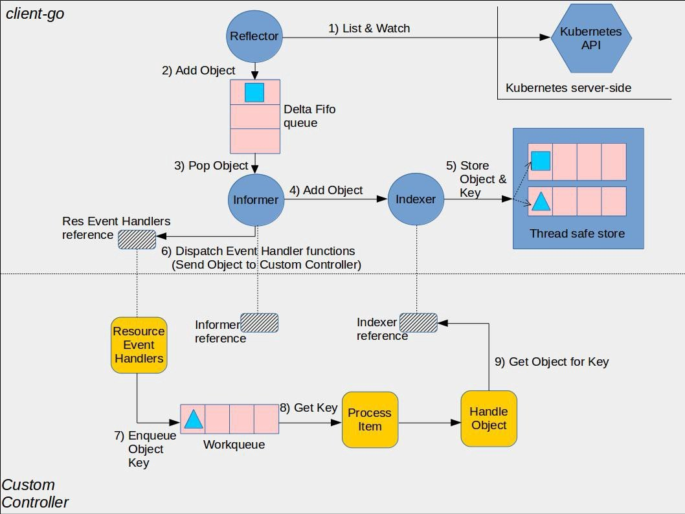

# 02-Informer

### 背景

Informer 机制是 Kubernetes 客户端库 client-go 中的一个核心功能，用于高效地同步和监控集群中资源，例如 Pod、Service、Deployment 等，其整体流程如下：

<figure><figcaption></figcaption></figure>

从图上我们可以看到 Informer 包含2个蓝色组件，分别是Reflector，Indexer。

其中 Reflector 是用来和 apiserver 建立链接，实时获取最新的数据并交给 Informer，Informer 拿到数据存放到 Indexer 中并通知下游 controller。

### Pod informer

下面我们来讲下如何使用 pod informer 来监听集群中 pod 变化，打开k8s代码,跳转到 `staging/src/k8s.io/client-go/informers/core/v1/pod.go`

```go
// PodInformer provides access to a shared informer and lister for
// Pods.
type PodInformer interface {
	Informer() cache.SharedIndexInformer
	Lister() v1.PodLister
}

type podInformer struct {
	factory          internalinterfaces.SharedInformerFactory
	tweakListOptions internalinterfaces.TweakListOptionsFunc
	namespace        string
}

// 返回一个 sharedIndexInformer ,本质上是调用了 sharedInformerFactory 的 InformerFor 方法，我在下面贴出来了，sharedInformerFactory 是个工厂方法，这里初始化了 podInformer 并存储在 factory 的 informers map 中
func (f *podInformer) Informer() cache.SharedIndexInformer {
	return f.factory.InformerFor(&corev1.Pod{}, f.defaultInformer)
}

// 返回一个 PodList , 可以用来列出 indexer 中的数据，这里的 indexer 是本地的，因此是拿出的pod是只读的，无法修改
func (f *podInformer) Lister() v1.PodLister {
	return v1.NewPodLister(f.Informer().GetIndexer())
}

// InformerFor returns the SharedIndexInformer for obj using an internal
// client.
func (f *sharedInformerFactory) InformerFor(obj runtime.Object, newFunc internalinterfaces.NewInformerFunc) cache.SharedIndexInformer {
	f.lock.Lock()
	defer f.lock.Unlock()

	informerType := reflect.TypeOf(obj)
	informer, exists := f.informers[informerType]
	if exists {
		return informer
	}

	resyncPeriod, exists := f.customResync[informerType]
	if !exists {
		resyncPeriod = f.defaultResync
	}

	informer = newFunc(f.client, resyncPeriod)
	informer.SetTransform(f.transform)
	f.informers[informerType] = informer

	return informer
}


// --------------------------------- 构造方法 ---------------------------------

// NewPodInformer constructs a new informer for Pod type.
// Always prefer using an informer factory to get a shared informer instead of getting an independent
// one. This reduces memory footprint and number of connections to the server.
func NewPodInformer(client kubernetes.Interface, namespace string, resyncPeriod time.Duration, indexers cache.Indexers) cache.SharedIndexInformer {
	return NewFilteredPodInformer(client, namespace, resyncPeriod, indexers, nil)
}

// NewFilteredPodInformer constructs a new informer for Pod type.
// Always prefer using an informer factory to get a shared informer instead of getting an independent
// one. This reduces memory footprint and number of connections to the server.
func NewFilteredPodInformer(client kubernetes.Interface, namespace string, resyncPeriod time.Duration, indexers cache.Indexers, tweakListOptions internalinterfaces.TweakListOptionsFunc) cache.SharedIndexInformer {
	return cache.NewSharedIndexInformer(
		&cache.ListWatch{
			ListFunc: func(options metav1.ListOptions) (runtime.Object, error) {
				if tweakListOptions != nil {
					tweakListOptions(&options)
				}
				return client.CoreV1().Pods(namespace).List(context.TODO(), options)
			},
			WatchFunc: func(options metav1.ListOptions) (watch.Interface, error) {
				if tweakListOptions != nil {
					tweakListOptions(&options)
				}
				return client.CoreV1().Pods(namespace).Watch(context.TODO(), options)
			},
		},
		&corev1.Pod{},
		resyncPeriod,
		indexers,
	)
}

func (f *podInformer) defaultInformer(client kubernetes.Interface, resyncPeriod time.Duration) cache.SharedIndexInformer {
	return NewFilteredPodInformer(client, f.namespace, resyncPeriod, cache.Indexers{cache.NamespaceIndex: cache.MetaNamespaceIndexFunc}, f.tweakListOptions)
}


```

从 podInformer 我们可以看出，不管是什么类型的 Informer ，其本质都是一个 cache.SharedIndexInformer 类型，这个 SharedIndexInformer 类型共享同一个 Indexers ，不同的只是过滤函数 ListWatch。那我们学习的重点其实就集中在了 SharedIndexInformer。

### SharedInformerFactory 结构

```go

// `*sharedIndexInformer` implements SharedIndexInformer and has three
// main components.  One is an indexed local cache, `indexer Indexer`.
// The second main component is a Controller that pulls
// objects/notifications using the ListerWatcher and pushes them into
// a DeltaFIFO --- whose knownObjects is the informer's local cache
// --- while concurrently Popping Deltas values from that fifo and
// processing them with `sharedIndexInformer::HandleDeltas`.  Each
// invocation of HandleDeltas, which is done with the fifo's lock
// held, processes each Delta in turn.  For each Delta this both
// updates the local cache and stuffs the relevant notification into
// the sharedProcessor.  The third main component is that
// sharedProcessor, which is responsible for relaying those
// notifications to each of the informer's clients.
type sharedIndexInformer struct {
	indexer    Indexer
	controller Controller

	processor             *sharedProcessor
	cacheMutationDetector MutationDetector

	listerWatcher ListerWatcher

	// objectType is an example object of the type this informer is expected to handle. If set, an event
	// with an object with a mismatching type is dropped instead of being delivered to listeners.
	objectType runtime.Object

	// objectDescription is the description of this informer's objects. This typically defaults to
	objectDescription string

	// resyncCheckPeriod is how often we want the reflector's resync timer to fire so it can call
	// shouldResync to check if any of our listeners need a resync.
	resyncCheckPeriod time.Duration
	// defaultEventHandlerResyncPeriod is the default resync period for any handlers added via
	// AddEventHandler (i.e. they don't specify one and just want to use the shared informer's default
	// value).
	defaultEventHandlerResyncPeriod time.Duration
	// clock allows for testability
	clock clock.Clock

	started, stopped bool
	startedLock      sync.Mutex

	// blockDeltas gives a way to stop all event distribution so that a late event handler
	// can safely join the shared informer.
	blockDeltas sync.Mutex

	// Called whenever the ListAndWatch drops the connection with an error.
	watchErrorHandler WatchErrorHandler

	transform TransformFunc
}
```

controller：informer内部的一个controller，这个controller包含reflector：根据用户定义的ListWatch方法获取对象并更新增量队列 DeltaFIFO

indexer：底层缓存，其实就是一个map记录对象，再通过一些其他map在插入删除对象是根据索引函数维护索引key如ns与对象pod的关系

processor：知道如何处理DeltaFIFO队列中的对象，实现是sharedProcessor，本质是通知 listeners(监听者们) 你的资源发生变化了

### 实战演练一 : 单个 Informer

使用单个Informer，一般生产环境不推荐

```go
// source simulates an apiserver object endpoint.
source := fcache.NewFakeControllerSource()

// Let's do threadsafe output to get predictable test results.
deletionCounter := make(chan string, 1000)

// Make a controller that immediately deletes anything added to it, and
// logs anything deleted.
_, controller := NewInformer(
	source,
	&v1.Pod{},
	time.Millisecond*100,
	ResourceEventHandlerDetailedFuncs{
		AddFunc: func(obj interface{}, isInInitialList bool) {
			source.Delete(obj.(runtime.Object))
		},
		DeleteFunc: func(obj interface{}) {
			key, err := DeletionHandlingMetaNamespaceKeyFunc(obj)
			if err != nil {
				key = "oops something went wrong with the key"
			}

			// Report this deletion.
			deletionCounter <- key
		},
	},
)

// Run the controller and run it until we close stop.
stop := make(chan struct{})
defer close(stop)
go controller.Run(stop)

// Let's add a few objects to the source.
testIDs := []string{"a-hello", "b-controller", "c-framework"}
for _, name := range testIDs {
	// Note that these pods are not valid-- the fake source doesn't
	// call validation or anything.
	source.Add(&v1.Pod{ObjectMeta: metav1.ObjectMeta{Name: name}})
}

// Let's wait for the controller to process the things we just added.
outputSet := sets.String{}
for i := 0; i < len(testIDs); i++ {
	outputSet.Insert(<-deletionCounter)
}

for _, key := range outputSet.List() {
	fmt.Println(key)
}

// Output:

// a-hello
// b-controller
// c-framework
```

### 实战演练二：使用工厂方法

使用工厂方法来获取 Informer，效率高，不浪费，推荐

```go
// 创建一个informer factory
kubeInformerFactory := kubeinformers.NewSharedInformerFactory(kubeClient, time.Second*30)
// factory已经为所有k8s的内置资源对象提供了创建对应informer实例的方法，调用具体informer实例的Lister或Informer方法
// 就完成了将informer注册到factory的过程 
deploymentLister := kubeInformerFactory.Apps().V1().Deployments().Lister()
deploymentLister := kubeInformerFactory.Core().V1().Pods().Lister()

// 这里使用 Informer 也行, 本质上 Informer 会调用  f.factory.InformerFor(&corev1.Pod{}, f.defaultInformer) 来初始化

// deploymentLister := kubeInformerFactory.Apps().V1().Deployments().Informer()
// deploymentLister := kubeInformerFactory.Core().V1().Pods().Informer()
// 启动注册到factory的所有informer
kubeInformerFactory.Start(stopCh)
```

### 启动源码

```go
kubeInformerFactory := kubeinformers.NewSharedInformerFactory(kubeClient, time.Second*30)
deploymentLister := kubeInformerFactory.Apps().V1().Deployments().Lister()
kubeInformerFactory.Start(stopCh)
```

上节课我们讲了如何使用 SharedInformerFactory 创建一个 deployment informer，这节课我们深入到 informer 的启动源码。

```go
func (f *sharedInformerFactory) Start(stopCh <-chan struct{}) {
	f.lock.Lock()
	defer f.lock.Unlock()

	if f.shuttingDown {
		return
	}

	for informerType, informer := range f.informers {
		if !f.startedInformers[informerType] {
			f.wg.Add(1)
			// We need a new variable in each loop iteration,
			// otherwise the goroutine would use the loop variable
			// and that keeps changing.
			informer := informer
			go func() {
				defer f.wg.Done()
				informer.Run(stopCh)
			}()
			f.startedInformers[informerType] = true
		}
	}

```

启动factory下的所有informer，其实就是启动每个informer中的 Refector 和 Processor，核心代码如下：

```go
// Run begins processing items, and will continue until a value is sent down stopCh or it is closed.
// It's an error to call Run more than once.
// Run blocks; call via go.
func (c *controller) Run(stopCh <-chan struct{}) {
	defer utilruntime.HandleCrash()
	go func() {
		<-stopCh
		c.config.Queue.Close()
	}()
	r := NewReflectorWithOptions(
		c.config.ListerWatcher,
		c.config.ObjectType,
		c.config.Queue,
		ReflectorOptions{
			ResyncPeriod:    c.config.FullResyncPeriod,
			MinWatchTimeout: c.config.MinWatchTimeout,
			TypeDescription: c.config.ObjectDescription,
			Clock:           c.clock,
		},
	)
	r.ShouldResync = c.config.ShouldResync
	r.WatchListPageSize = c.config.WatchListPageSize
	if c.config.WatchErrorHandler != nil {
		r.watchErrorHandler = c.config.WatchErrorHandler
	}

	c.reflectorMutex.Lock()
	c.reflector = r
	c.reflectorMutex.Unlock()

	var wg wait.Group

    // 1.通过调用 ListAndWatch 来同步apiserver中的数据,这里只是将数据放入 deltaFifo queue
	wg.StartWithChannel(stopCh, r.Run)

    // 2. 不断从 deltaFifo 中获取数据，存储到 indexer 中并通知下游控制器
	wait.Until(c.processLoop, time.Second, stopCh)
	wg.Wait()
}
```

### deltaFIFO pop出来的对象处理逻辑 （processLoop）

先看看controller怎么处理DeltaFIFO中的对象，需要注意DeltaFIFO中的Deltas的结构，是一个slice，保存同一个对象的所有增量事件。

* 判断 delta 类型，当类型为 Sync, Replaced, Added, Updated 时候，先看看本地是否有这个资源，有的话更新，没有的话创建；
* 判断 delta 类型，当类型为 Deleted 时候，删除本地数据
* 通知 handler 相应事件，这里的 handler 就是我们经常说的 ResourceEventHandler interface{}, sharedIndexInformer 默认实现

```go
// Multiplexes updates in the form of a list of Deltas into a Store, and informs
// a given handler of events OnUpdate, OnAdd, OnDelete
func processDeltas(
	// Object which receives event notifications from the given deltas
	handler ResourceEventHandler,
	clientState Store,
	deltas Deltas,
	isInInitialList bool,
) error {
	// from oldest to newest
	for _, d := range deltas {
		obj := d.Object

		switch d.Type {
		case Sync, Replaced, Added, Updated:
			if old, exists, err := clientState.Get(obj); err == nil && exists {
				if err := clientState.Update(obj); err != nil {
					return err
				}
				handler.OnUpdate(old, obj)
			} else {
				if err := clientState.Add(obj); err != nil {
					return err
				}
				handler.OnAdd(obj, isInInitialList)
			}
		case Deleted:
			if err := clientState.Delete(obj); err != nil {
				return err
			}
			handler.OnDelete(obj)
		}
	}
	return nil
}

type ResourceEventHandler interface {
	OnAdd(obj interface{}, isInInitialList bool)
	OnUpdate(oldObj, newObj interface{})
	OnDelete(obj interface{})
}

// Conforms to ResourceEventHandler
func (s *sharedIndexInformer) OnAdd(obj interface{}, isInInitialList bool) {
	// Invocation of this function is locked under s.blockDeltas, so it is
	// save to distribute the notification
	s.cacheMutationDetector.AddObject(obj)
    // 资源添加时间，调用distribute 通知所有注册的监听者
	s.processor.distribute(addNotification{newObj: obj, isInInitialList: isInInitialList}, false)
}

```
