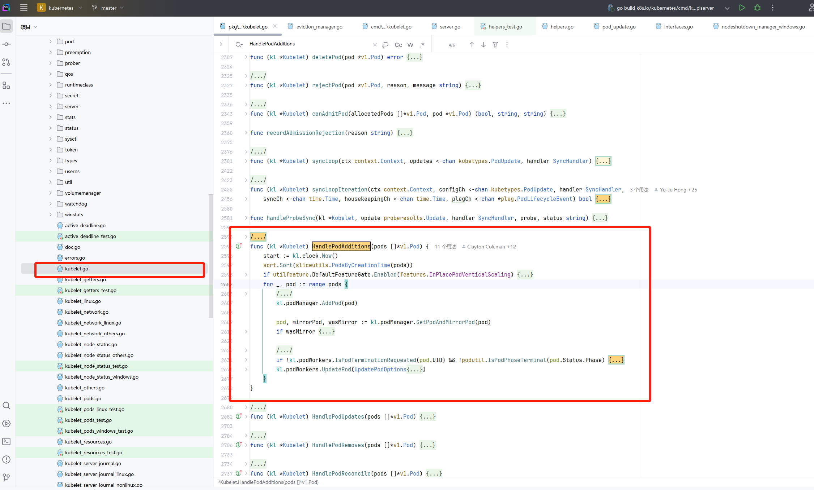

# 01-kubelet 创建pod 流程

kubelet 系列源码分析基于 1.33 版本 ，具体 commit ：b84cb65f932ae02d06db26c5f9290489e97f9048

## 前言

由于源码很多，不可能面面俱到，所以一开始我们就要**设定范围**，看什么，不看什么。而我们今天的目标就是 **pod 的创建** 其他都和我们没有关系。所以，`kubelet` 本身的初始化等其他细节我们看到就略过。

## 码前提问

看源码之前都自己先提出一些问题，这些问题能帮助我们更快的进入状态，以便能快速定位到所需的关键。

1. kubelet 怎么知道要创建 pod 的？
2. 是 kubelet 本身去操作 CRI 的吗？还是有别人的帮助？
3. pod 创建完毕之后需要做通知或其他操作吗？

## 源码分析


由于是第一篇，我就把详细的寻找过程也写进来，给小白提供思路。可略过。

1. 在 IDE(我使用 Goland) 中打开 `pkg/kubelet/kubelet.go`
2. `shift + command + -` 折叠所有方法
3. 通过方法名寻找合适的需要查看的代码

### HandlePodAdditions

<figure><figcaption></figcaption></figure>

显然这方法是用于操作 pod 的，再看了一眼注释没错！

#### 向上的引用链路

> 通过 IDE command+点击方法名称可以看到哪里调用了这个方法

我习惯先看向上的链路，也就是是谁调用的这个方法，整个链路很清晰：

```
Run -> syncLoop -> syncLoopIteration -> HandlePodAdditions
```

### syncLoop

然后简单查看一下 `syncLoop`，从这里我们就可以理解到，kubelet 本质处理模式就是事件循环处理。启动之后通过一个 `syncLoop` 来不断循环处理过来的事件，在 `syncLoopIteration` 中根据不同的事件类型通过不同的方法处理事件，这个函数是 kubelet 的核心循环，确保了 Pod 的状态始终与期望状态保持一致，是 kubelet 实现自主管理的关键所在。

1\)  配置更新事件 (configCh)

* 支持多种操作类型：ADD（添加）、UPDATE（更新）、REMOVE（删除）、RECONCILE（协调）等
* DELETE 操作被视为 UPDATE，因为需要支持优雅删除
* 每次处理完更新后，都会将源标记为就绪（AddSource）

2\) PLEG 事件 (plegCh)

* PLEG (Pod Lifecycle Event Generator) 负责监控容器运行时的状态变化
* 当容器状态发生变化时，触发相应的 Pod 同步
* 对于已死亡的容器，会调用 cleanUpContainersInPod 进行清理

3\) 定期同步事件 (syncCh)

* 通过 getPodsToSync 获取待同步的 Pod 列表
* 批量处理这些 Pod 的同步操作

4\) 健康检查更新

```go
case update := <-kl.livenessManager.Updates():
case update := <-kl.readinessManager.Updates():
case update := <-kl.startupManager.Updates():
```

* 处理三种探针的结果：存活探针、就绪探针和启动探针
* 根据探针结果更新容器状态
* 触发相应的 Pod 同步操作

5\) 容器管理器更新

* 处理容器管理器的更新事件
* 主要处理设备更新等事件
* 触发相关 Pod 的重新同步

6\) housekeeping 事件

* 定期进行 Pod 清理工作
* 只有当所有源都就绪时才执行清理
* 监控清理操作的执行时间，如果超时会记录警告

```go
// syncLoopIteration reads from various channels and dispatches pods to the
// given handler.
//
// Arguments:
// 1.  configCh:       a channel to read config events from
// 2.  handler:        the SyncHandler to dispatch pods to
// 3.  syncCh:         a channel to read periodic sync events from
// 4.  housekeepingCh: a channel to read housekeeping events from
// 5.  plegCh:         a channel to read PLEG updates from
//
// Events are also read from the kubelet liveness manager's update channel.
//
// The workflow is to read from one of the channels, handle that event, and
// update the timestamp in the sync loop monitor.
//
// Here is an appropriate place to note that despite the syntactical
// similarity to the switch statement, the case statements in a select are
// evaluated in a pseudorandom order if there are multiple channels ready to
// read from when the select is evaluated.  In other words, case statements
// are evaluated in random order, and you can not assume that the case
// statements evaluate in order if multiple channels have events.
//
// With that in mind, in truly no particular order, the different channels
// are handled as follows:
//
//   - configCh: dispatch the pods for the config change to the appropriate
//     handler callback for the event type
//   - plegCh: update the runtime cache; sync pod
//   - syncCh: sync all pods waiting for sync
//   - housekeepingCh: trigger cleanup of pods
//   - health manager: sync pods that have failed or in which one or more
//     containers have failed health checks
func (kl *Kubelet) syncLoopIteration(ctx context.Context, configCh <-chan kubetypes.PodUpdate, handler SyncHandler,
    syncCh <-chan time.Time, housekeepingCh <-chan time.Time, plegCh <-chan *pleg.PodLifecycleEvent) bool {
    select {
    case u, open := <-configCh:
       // Update from a config source; dispatch it to the right handler
       // callback.
       if !open {
          klog.ErrorS(nil, "Update channel is closed, exiting the sync loop")
          return false
       }

       switch u.Op {
       case kubetypes.ADD:
          klog.V(2).InfoS("SyncLoop ADD", "source", u.Source, "pods", klog.KObjSlice(u.Pods))
          // After restarting, kubelet will get all existing pods through
          // ADD as if they are new pods. These pods will then go through the
          // admission process and *may* be rejected. This can be resolved
          // once we have checkpointing.
          handler.HandlePodAdditions(u.Pods)
       case kubetypes.UPDATE:
          klog.V(2).InfoS("SyncLoop UPDATE", "source", u.Source, "pods", klog.KObjSlice(u.Pods))
          handler.HandlePodUpdates(u.Pods)
       case kubetypes.REMOVE:
          klog.V(2).InfoS("SyncLoop REMOVE", "source", u.Source, "pods", klog.KObjSlice(u.Pods))
          handler.HandlePodRemoves(u.Pods)
       case kubetypes.RECONCILE:
          klog.V(4).InfoS("SyncLoop RECONCILE", "source", u.Source, "pods", klog.KObjSlice(u.Pods))
          handler.HandlePodReconcile(u.Pods)
       case kubetypes.DELETE:
          klog.V(2).InfoS("SyncLoop DELETE", "source", u.Source, "pods", klog.KObjSlice(u.Pods))
          // DELETE is treated as a UPDATE because of graceful deletion.
          handler.HandlePodUpdates(u.Pods)
       case kubetypes.SET:
          // TODO: Do we want to support this?
          klog.ErrorS(nil, "Kubelet does not support snapshot update")
       default:
          klog.ErrorS(nil, "Invalid operation type received", "operation", u.Op)
       }

       kl.sourcesReady.AddSource(u.Source)

    case e := <-plegCh:
       if isSyncPodWorthy(e) {
          // PLEG event for a pod; sync it.
          if pod, ok := kl.podManager.GetPodByUID(e.ID); ok {
             klog.V(2).InfoS("SyncLoop (PLEG): event for pod", "pod", klog.KObj(pod), "event", e)
             handler.HandlePodSyncs([]*v1.Pod{pod})
          } else {
             // If the pod no longer exists, ignore the event.
             klog.V(4).InfoS("SyncLoop (PLEG): pod does not exist, ignore irrelevant event", "event", e)
          }
       }

       if e.Type == pleg.ContainerDied {
          if containerID, ok := e.Data.(string); ok {
             kl.cleanUpContainersInPod(e.ID, containerID)
          }
       }
    case <-syncCh:
       // Sync pods waiting for sync
       podsToSync := kl.getPodsToSync()
       if len(podsToSync) == 0 {
          break
       }
       klog.V(4).InfoS("SyncLoop (SYNC) pods", "total", len(podsToSync), "pods", klog.KObjSlice(podsToSync))
       handler.HandlePodSyncs(podsToSync)
    case update := <-kl.livenessManager.Updates():
       if update.Result == proberesults.Failure {
          handleProbeSync(kl, update, handler, "liveness", "unhealthy")
       }
    case update := <-kl.readinessManager.Updates():
       ready := update.Result == proberesults.Success
       kl.statusManager.SetContainerReadiness(update.PodUID, update.ContainerID, ready)

       status := "not ready"
       if ready {
          status = "ready"
       }
       handleProbeSync(kl, update, handler, "readiness", status)
    case update := <-kl.startupManager.Updates():
       started := update.Result == proberesults.Success
       kl.statusManager.SetContainerStartup(update.PodUID, update.ContainerID, started)

       status := "unhealthy"
       if started {
          status = "started"
       }
       handleProbeSync(kl, update, handler, "startup", status)
    case update := <-kl.containerManager.Updates():
       pods := []*v1.Pod{}
       for _, p := range update.PodUIDs {
          if pod, ok := kl.podManager.GetPodByUID(types.UID(p)); ok {
             klog.V(3).InfoS("SyncLoop (containermanager): event for pod", "pod", klog.KObj(pod), "event", update)
             pods = append(pods, pod)
          } else {
             // If the pod no longer exists, ignore the event.
             klog.V(4).InfoS("SyncLoop (containermanager): pod does not exist, ignore devices updates", "event", update)
          }
       }
       if len(pods) > 0 {
          // Updating the pod by syncing it again
          // We do not apply the optimization by updating the status directly, but can do it later
          handler.HandlePodSyncs(pods)
       }

    case <-housekeepingCh:
       if !kl.sourcesReady.AllReady() {
          // If the sources aren't ready or volume manager has not yet synced the states,
          // skip housekeeping, as we may accidentally delete pods from unready sources.
          klog.V(4).InfoS("SyncLoop (housekeeping, skipped): sources aren't ready yet")
       } else {
          start := time.Now()
          klog.V(4).InfoS("SyncLoop (housekeeping)")
          if err := handler.HandlePodCleanups(ctx); err != nil {
             klog.ErrorS(err, "Failed cleaning pods")
          }
          duration := time.Since(start)
          if duration > housekeepingWarningDuration {
             klog.ErrorS(fmt.Errorf("housekeeping took too long"), "Housekeeping took longer than expected", "expected", housekeepingWarningDuration, "actual", duration.Round(time.Millisecond))
          }
          klog.V(4).InfoS("SyncLoop (housekeeping) end", "duration", duration.Round(time.Millisecond))
       }
    }
    return true
}
```

### Synchandler

我们再回过头来看看 HandlePodAdditions 方法，这个函数是 syncHandler 接口中的一个。

```go
// SyncHandler is an interface implemented by Kubelet, for testability
type SyncHandler interface {
    HandlePodAdditions(pods []*v1.Pod)
    HandlePodUpdates(pods []*v1.Pod)
    HandlePodRemoves(pods []*v1.Pod)
    HandlePodReconcile(pods []*v1.Pod)
    HandlePodSyncs(pods []*v1.Pod)
    HandlePodCleanups(ctx context.Context) error
}
```

我们点开这些接口的具体实现，会发现主要逻辑就是下面这样：

```go
  for _, pod := range pods {
    // 省略 。。 
    kl.podManager.AddPod(pod)
    // 省略 。。
    kl.podWorkers.UpdatePod(UpdatePodOptions{
      Pod:        pod,
      MirrorPod:  mirrorPod,
      UpdateType: kubetypes.SyncPodCreate,
      StartTime:  start,
    })
  }
```

在 `podManager` 中添加，在 `podWorkers` 中更新。也就是 `kubelet` 有两个帮手：`podManager` 和 `podWorkers` 。

podManager 负责管理 Pod 的本地缓存和状态。它作为 kubelet 中 Pod 相关操作的数据源，维护着 kubelet 所管理的所有 Pod 的信息。

podWorker 是 kubelet 中负责管理单个 Pod 生命周期的工作器组件。它为每个 Pod 维护一个独立的工作队列和 goroutine，确保 Pod 的操作按顺序执行且互不干扰。

## PodWorker.UpdatePod

通常第一次看源码容易迷失的大多数原因就来源于大量的代码被吓怕了。还是那句话，**我是来看 pod 如何创建的**。所以其他的什么 if 判断全部都可以扔掉，因为它们都是在处理 pod 的其他状态，对于**创建**无关。

```go
// pkg/kubelet/pod_workers.go:926
// start the pod worker goroutine if it doesn't exist
  podUpdates, exists := p.podUpdates[uid]
  if !exists {
    // spawn a pod worker
    go func() {
      p.podWorkerLoop(uid, outCh)
    }()
  }


  // notify the pod worker there is a pending update
  status.pendingUpdate = &options
  status.working = true
  klog.V(4).InfoS("Notifying pod of pending update", "pod", klog.KRef(ns, name), "podUID", uid, "workType", status.WorkType())
  select {
  case podUpdates <- struct{}{}:
  default:
  }
```

1. 创建一个 goroutine 执行 **podWorkerLoop**（当 uid 查不到的时候也就是不存在的时候）
2. 通知 pod worker 需要处理了

根据这样的流程，你可以按照下面的路径开始理解和寻觅：

1. podWorkerLoop `pkg/kubelet/pod_workers.go:1214`
2. SyncPod `pkg/kubelet/pod_workers.go:1286`
3. Kubelet.SyncPod `pkg/kubelet/kubelet.go:1687`
4. kl.containerRuntime.SyncPod `pkg/kubelet/kubelet.go:2023`
5. startContainer `pkg/kubelet/kuberuntime/kuberuntime_container.go:1353`

这些流程中，比较重要的函数是 SyncPod ，我们看下函数的注释：

```go
// SyncPod syncs the running pod into the desired pod by executing following steps:
//
//  1. Compute sandbox and container changes.
//  2. Kill pod sandbox if necessary.
//  3. Kill any containers that should not be running.
//  4. Create sandbox if necessary.
//  5. Create ephemeral containers.
//  6. Create init containers.
//  7. Resize running containers (if InPlacePodVerticalScaling==true)
//  8. Create normal containers.
func (m *kubeGenericRuntimeManager) SyncPod(ctx context.Context, pod *v1.Pod, podStatus *kubecontainer.PodStatus, pullSecrets []v1.Secret, backOff *flowcontrol.Backoff) (result kubecontainer.PodSyncResult) 
```

`SyncPod` 的注释写的很清楚，步骤 123… ，这就是我们所说的 pod 的创建过程，有关 sandbox 我们稍后文章再说，你可以简单理解为**这里在创建 pod 所需要的环境**。其中我们关注到两个步骤：

* 步骤 6：创建 init 容器，这就是我们会在实际中用到的在 spec 中配置 initContainers，能帮助你在真正的业务容器启动前运行一些容器去初始化一些数据或环境变量，当然它的用途很多。
* 步骤 8：创建 normal 容器，这就是真正的我们常用的业务容器了。

而创建容器的方法是 `startContainer` ：

```go
/ startContainer starts a container and returns a message indicates why it is failed on error.
// It starts the container through the following steps:
// * pull the image
// * create the container
// * start the container
// * run the post start lifecycle hooks (if applicable)
func (m *kubeGenericRuntimeManager) startContainer(ctx context.Context, podSandboxID string, podSandboxConfig *runtimeapi.PodSandboxConfig, spec *startSpec, pod *v1.Pod, podStatus *kubecontainer.PodStatus, pullSecrets []v1.Secret, podIP string, podIPs []string, imageVolumes kubecontainer.ImageVolumes) (string, error) {
```

同样的，注释步骤很清晰，就是拉取镜像、创建镜像、启动，而这些最终的操作都落到了 `ContainerManager` 具体会在 `vendor/k8s.io/cri-api/pkg/apis/services.go:34` 也就是我们常说的 `CRI` 了。

### 码后解答

1. `kubelet` 怎么知道要创建 pod 的？
   1. 在 `syncLoop` 中有 `updates chan` 这个通道传递了 `kubetypes.PodUpdate` 事件，有事件（创建的事件）来的时候就会创建 pod。
2. 是 `kubelet` 本身去操作 CRI 的吗？还是有别人的帮助？
   1. 在 `kubelet` 有 `kubeGenericRuntimeManager` 其中有 `RuntimeService` 也就是 `ContainerManager` 也就是最终得 CRI。
3. pod 创建完毕之后需要做通知或其他操作吗？
   1. 没有，创建只管创建，职责很清晰。

## 总结提升

事件循环，这是一个非常常见的设计，就是如同 `kubelet` 一样，通过 `syncLoop` 来不断循环来读取事件，通过不同类型的事件来执行对应操作。这样的优点就是解耦，并且职责清晰，还能通过事件类型来不断地扩展相对应的功能。当然其中配合 go 中 channel 和 select 写起来更加舒适。


<figure><figcaption></figcaption></figure>


