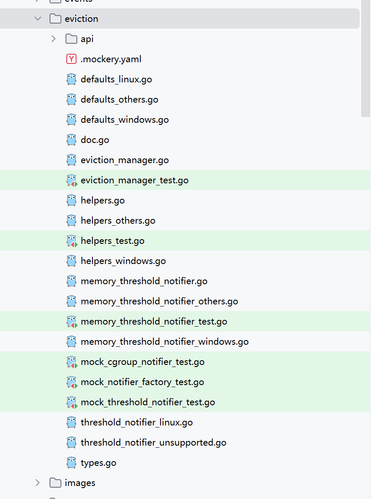

# 03-kubelet 驱逐

kubelet 监控集群节点的内存、磁盘空间和文件系统等资源。 当这些资源中的一个或者多个达到特定的消耗水平， kubelet 可以主动地使节点上一个或者多个 Pod 被驱逐，当处理不可压缩的计算资源（例如内存或磁盘）时，这一点尤其重要。如果两种资源都用尽，则节点将变得不稳定。

kubelet 借助内核 OOM 机制来自动杀死 Qos 级别较低的容器 (通常是`BestEffort`)，这种方式让系统容易返回不稳定状态，因为由于OOM而被杀死的容器要么重新启动，要么安排新的POD到节点。

取而代之的是，我们更喜欢一个系统， `kubelet`可以亲自监视并防止整个计算资源的饥饿，并且在可能发生的情况下，主动地失败了一个或多个POD，因此工作负载可以当/如果其备份控制器创建一个新的POD时，请移动并安排在其他地方。这个就是**驱逐机制**。**驱逐机制是对 Qos 的补充**，两者并不直接相关，比较独立。

## Qos （服务质量）

QoS是`Quality of Service`的缩写，即服务质量。QoS 主要影响 OOM Killer 行为，不直接影响 kubelet 驱逐决策。

QoS主要分为`Guaranteed`、`Burstable`和`Best-Effort`三个级别，优先级从高到低。那么怎么决定某个pod属于哪个QoS分类呢？根据pod yaml中的cpu和内存资源定义决定。

内核资源不够时候，会根据 Qos 级别来自动杀死进程。

### **Guaranteed**

`Guaranteed` Pod 具有最严格的资源限制，并且最不可能面临驱逐。 在这些 Pod 超过其自身的限制或者没有可以从 Node 抢占的低优先级 Pod 之前， 这些 Pod 保证不会被杀死。这些 Pod 不可以获得超出其指定 limit 的资源。这些 Pod 也可以使用 [`static`](https://kubernetes.io/zh-cn/docs/tasks/administer-cluster/cpu-management-policies/#static-policy) CPU 管理策略来使用独占的 CPU。

**判据**

同时满足以下情形的pod属于Guaranteed级别：

* Pod 中的每个容器必须有内存 limit 和内存 request。
* 对于 Pod 中的每个容器，内存 limit 必须等于内存 request。
* Pod 中的每个容器必须有 CPU limit 和 CPU request。
* 对于 Pod 中的每个容器，CPU limit 必须等于 CPU request。

```yaml
containers:
  - name: test-a
    resources:
      limits:
        cpu: 10m
        memory: 1Gi
      requests:
        cpu: 10m
        memory: 1Gi
  - name: test-b
    resources:
      limits:
        cpu: 100m
        memory: 100Mi
      requests:
        cpu: 100m
        memory: 100Mi
```

### Burstable <a href="#burstable" id="burstable"></a>

`Burstable` Pod 有一些基于 request 的资源下限保证，但不需要特定的 limit。 如果未指定 limit，则默认为其 limit 等于 Node 容量，这允许 Pod 在资源可用时灵活地增加其资源。 在由于 Node 资源压力导致 Pod 被驱逐的情况下，只有在所有 `BestEffort` Pod 被驱逐后 这些 Pod 才会被驱逐。因为 `Burstable` Pod 可以包括没有资源 limit 或资源 request 的容器， 所以 `Burstable` Pod 可以尝试使用任意数量的节点资源。

**判据**

Pod 被赋予 `Burstable` QoS 类的几个判据：

* Pod 不满足针对 QoS 类 `Guaranteed` 的判据。
* Pod 中至少一个容器有内存或 CPU 的 request 或 limit。

```yaml
containers:
  - name: test-a
...
  - name: test-b
    resources:
      limits:
        memory: 200Mi
      requests:
        memory: 100Mi
```

### BestEffort <a href="#besteffort" id="besteffort"></a>

`BestEffort` QoS 类中的 Pod 可以使用未专门分配给其他 QoS 类中的 Pod 的节点资源。 例如若你有一个节点有 16 核 CPU 可供 kubelet 使用，并且你将 4 核 CPU 分配给一个 `Guaranteed` Pod， 那么 `BestEffort` QoS 类中的 Pod 可以尝试任意使用剩余的 12 核 CPU。

如果节点遇到资源压力，kubelet 将优先驱逐 `BestEffort` Pod。

**判据**

如果 Pod 不满足 `Guaranteed` 或 `Burstable` 的判据，则它的 QoS 类为 `BestEffort`。 换言之，只有当 Pod 中的所有容器没有内存 limit 或内存 request，也没有 CPU limit 或 CPU request 时，Pod 才是 `BestEffort`。Pod 中的容器可以请求（除 CPU 或内存之外的） 其他资源并且仍然被归类为 `BestEffort`

```yaml
...
containers:
  - name: test-a
...
  - name: test-b
...
```

## Eviction （驱逐）

### 代码目录

pkg/kubelet/eviction/eviction\_manager.go

<figure><figcaption></figcaption></figure>

### 驱逐策略

**软驱逐**

软驱逐机制表示，当node节点的memory、nodefs等资源达到一定的阈值后，需要持续观察一段时间（宽限期），如果期间该资源又恢复到低于阈值，则不进行pod的驱逐，若高于阈值持续了一段时间（宽限期），则触发pod的驱逐。

**硬驱逐**

硬驱逐策略没有宽限期，当达到硬驱逐条件时，kubelet会立即触发pod的驱逐，而不是优雅终止。

### Manager 接口

```go
// Manager evaluates when an eviction threshold for node stability has been met on the node.
type Manager interface {
    // Start starts the control loop to monitor eviction thresholds at specified interval.
    Start(diskInfoProvider DiskInfoProvider, podFunc ActivePodsFunc, podCleanedUpFunc PodCleanedUpFunc, monitoringInterval time.Duration)

    // IsUnderMemoryPressure returns true if the node is under memory pressure.
    IsUnderMemoryPressure() bool

    // IsUnderDiskPressure returns true if the node is under disk pressure.
    IsUnderDiskPressure() bool

    // IsUnderPIDPressure returns true if the node is under PID pressure.
    IsUnderPIDPressure() bool
}
```

这是 Kubelet 中的驱逐管理器(Eviction Manager)接口，主要负责监控节点资源状态并管理 Pod 驱逐。这里可以看到监控节点三种资源：

* 内存使用
* 磁盘使用
* PID 使用

Start 方法是驱逐管理器的核心方法，用于启动资源监控和驱逐控制循环。

### ManagerImpl 实现

我们可以看到实现接口的是 `managerImpl`（可以，这个命名很 java） 实现了 `Manager` 接口，然后看关键的 `Start` 方法：

```go
// Start starts the control loop to observe and response to low compute resources.
func (m *managerImpl) Start(diskInfoProvider DiskInfoProvider, podFunc ActivePodsFunc, podCleanedUpFunc PodCleanedUpFunc, monitoringInterval time.Duration) {
    thresholdHandler := func(message string) {
       klog.InfoS(message)
       m.synchronize(diskInfoProvider, podFunc)
    }
    klog.InfoS("Eviction manager: starting control loop")
    // 启动实时驱逐
    if m.config.KernelMemcgNotification || runtime.GOOS == "windows" {
       for _, threshold := range m.config.Thresholds {
          if threshold.Signal == evictionapi.SignalMemoryAvailable || threshold.Signal == evictionapi.SignalAllocatableMemoryAvailable {
             notifier, err := NewMemoryThresholdNotifier(threshold, m.config.PodCgroupRoot, &CgroupNotifierFactory{}, thresholdHandler)
             if err != nil {
                klog.InfoS("Eviction manager: failed to create memory threshold notifier", "err", err)
             } else {
                go notifier.Start()
                m.thresholdNotifiers = append(m.thresholdNotifiers, notifier)
             }
          }
       }
    }
    // start the eviction manager monitoring
    // 启动轮询驱逐
    go func() {
       for {
          evictedPods, err := m.synchronize(diskInfoProvider, podFunc)
          if evictedPods != nil && err == nil {
             klog.InfoS("Eviction manager: pods evicted, waiting for pod to be cleaned up", "pods", klog.KObjSlice(evictedPods))
             m.waitForPodsCleanup(podCleanedUpFunc, evictedPods)
          } else {
             if err != nil {
                klog.ErrorS(err, "Eviction manager: failed to synchronize")
             }
             time.Sleep(monitoringInterval)
          }
       }
    }()
}
```

其中就有几个细节：

1. 根据每个配置的限制阈值创建 `NewMemoryThresholdNotifier`
2. 每个 `Notifier` 都是一个独立的协程去启动 `go notifier.Start()`
3. 有一个单独的协程去监听 pod 执行 `m.synchronize`
4. evictionManager.Start方法中包含了两部分的启动，实时驱逐和轮训驱逐, 如果配置了`KernelMemcgNotification.`则会针对memory内存资源，利用kernel memcg notification，根据内核实时通知，调用`m.synchronize`方法执行驱逐逻辑

### MemoryThresholdNotifier <a href="#memorythresholdnotifier" id="memorythresholdnotifier"></a>

我在没有看过源码之前，对于 cgroup 是有一个简单的了解的，知道 docker 就是通过 linux 的 namespace 和 cgroup 来隔离的。但我不明白的是，通知是怎么来的，如果让我自己去实现那么肯定是定期循环查询内存超过阈值则进行通知，肯定性能不好。

于是，我就追着 `go notifier.Start()` 的 Start 找到了, 这里注意你的操作系统，如果是windows，代码会跳转到  memory\_threshold\_notifier\_windows.go ，由于我们主要学习 linux 源码, 故 window 版本不再详细讲解。

```go
// pkg/kubelet/eviction/memory_threshold_notifier_others.go:105
func (m *linuxMemoryThresholdNotifier) Start() {
	klog.InfoS("Eviction manager: created memoryThresholdNotifier", "notifier", m.Description())
	for range m.events {
		m.handler(fmt.Sprintf("eviction manager: %s crossed", m.Description()))
	}
}
```

可以看到，这里非常简单，就是不断地 handler events 这个 channel 的事件。所以，我们需要找到哪里在往 events 这个 channel 里面写入事件。引用位置只有一个那就是 `UpdateThreshold` 。

```go
type linuxMemoryThresholdNotifier struct {
	threshold  evictionapi.Threshold
	cgroupPath string
	events     chan struct{}
	factory    NotifierFactory
	handler    func(string)
	notifier   CgroupNotifier
}

// UpdateThreshold 更新内存阈值并设置通知器
// 参数 summary: 包含节点资源使用统计信息
func (m *linuxMemoryThresholdNotifier) UpdateThreshold(summary *statsapi.Summary) error {
    // 获取节点内存统计信息
    memoryStats := summary.Node.Memory
    
    // 如果是可分配资源的驱逐阈值,则使用 pods 系统容器的内存统计
    if isAllocatableEvictionThreshold(m.threshold) {
        allocatableContainer, err := getSysContainer(summary.Node.SystemContainers, statsapi.SystemContainerPods)
        if err != nil {
            return err
        }
        memoryStats = allocatableContainer.Memory
    }

    // 检查内存统计数据的完整性
    if memoryStats == nil || memoryStats.UsageBytes == nil || memoryStats.WorkingSetBytes == nil || memoryStats.AvailableBytes == nil {
        return fmt.Errorf("summary was incomplete. Expected MemoryStats and all subfields to be non-nil, but got %+v", memoryStats)
    }

    // 计算阈值
    // 非活跃文件缓存 = 总使用量 - 工作集使用量
    inactiveFile := resource.NewQuantity(int64(*memoryStats.UsageBytes-*memoryStats.WorkingSetBytes), resource.BinarySI)
    // 总容量 = 可用内存 + 工作集使用量
    capacity := resource.NewQuantity(int64(*memoryStats.AvailableBytes+*memoryStats.WorkingSetBytes), resource.BinarySI)
    // 获取驱逐阈值
    evictionThresholdQuantity := evictionapi.GetThresholdQuantity(m.threshold.Value, capacity)
    
    // 计算 cgroup 内存阈值
    // memcgThreshold = 容量 - 驱逐阈值 + 非活跃文件缓存
    memcgThreshold := capacity.DeepCopy()
    memcgThreshold.Sub(*evictionThresholdQuantity)
    memcgThreshold.Add(*inactiveFile)

    klog.V(3).InfoS("Eviction manager: setting notifier to capacity", "notifier", m.Description(), "capacity", memcgThreshold.String())

    // 如果存在旧的通知器,先停止它
    if m.notifier != nil {
        m.notifier.Stop()
    }

    // 创建新的 cgroup 通知器
    newNotifier, err := m.factory.NewCgroupNotifier(m.cgroupPath, memoryUsageAttribute, memcgThreshold.Value())
    if err != nil {
        return err
    }

    // 保存新通知器并启动监控
    m.notifier = newNotifier
    go m.notifier.Start(m.events)
    return nil
}

```

这里我们就见到主角了，`NewCgroupNotifier` 也就是 `Cgroup` 了。这里有个细节是 factory 是 `NotifierFactory` 也就是利用了设计模式中的工厂模式，抽象了一下生成的方法。

### CgroupNotifyier

```go
// linuxCgroupNotifier 实现了 cgroup 内存阈值通知机制
type linuxCgroupNotifier struct {
    eventfd  int        // 用于接收事件的文件描述符
    epfd     int        // epoll 实例的文件描述符
    stop     chan struct{} // 停止通知的信号通道
    stopLock sync.Mutex    // 保护 stop 操作的互斥锁
}

// NewCgroupNotifier 创建一个新的 cgroup 通知器
func NewCgroupNotifier(path, attribute string, threshold int64) (CgroupNotifier, error) {
    // 如果是 cgroupv2，返回一个禁用的通知器
    // cgroupv2 不支持使用 cgroup.event_control 监控内存阈值
    if libcontainercgroups.IsCgroup2UnifiedMode() {
        return &disabledThresholdNotifier{}, nil
    }

    // 初始化过程:
    // 1. 打开要监控的属性文件(如 memory.usage_in_bytes)
    watchfd, err := unix.Open(fmt.Sprintf("%s/%s", path, attribute), unix.O_RDONLY|unix.O_CLOEXEC, 0)
    
    // 2. 打开 cgroup 事件控制文件
    controlfd, err := unix.Open(fmt.Sprintf("%s/cgroup.event_control", path), unix.O_WRONLY|unix.O_CLOEXEC, 0)
    
    // 3. 创建 eventfd 用于接收通知
    eventfd, err := unix.Eventfd(0, unix.EFD_CLOEXEC)
    
    // 4. 创建 epoll 实例
    epfd, err := unix.EpollCreate1(unix.EPOLL_CLOEXEC)
    
    // 5. 写入配置到 cgroup.event_control
    config := fmt.Sprintf("%d %d %d", eventfd, watchfd, threshold)
    _, err = unix.Write(controlfd, []byte(config))

    return &linuxCgroupNotifier{...}, nil
}

// Start 启动通知监听
func (n *linuxCgroupNotifier) Start(eventCh chan<- struct{}) {
    // 1. 将 eventfd 添加到 epoll 监控
    err := unix.EpollCtl(n.epfd, unix.EPOLL_CTL_ADD, n.eventfd, &unix.EpollEvent{
        Fd:     int32(n.eventfd),
        Events: unix.EPOLLIN,
    })

    // 2. 循环等待事件
    for {
        select {
        case <-n.stop:
            return
        default:
            // 等待 epoll 事件
            event, err := wait(n.epfd, n.eventfd, notifierRefreshInterval)
            if event {
                // 读取事件数据
                _, err = unix.Read(n.eventfd, buf)
                // 发送通知
                eventCh <- struct{}{}
            }
        }
    }
}

// wait 等待 epoll 事件
func wait(epfd, eventfd int, timeout time.Duration) (bool, error) {
    // 等待 epoll 事件
    events := make([]unix.EpollEvent, numFdEvents+1)
    timeoutMS := int(timeout / time.Millisecond)
    n, err := unix.EpollWait(epfd, events, timeoutMS)
    
    // 处理各种事件类型：
    // - EPOLLHUP: 挂起事件
    // - EPOLLERR: 错误事件
    // - EPOLLIN: 可读事件
    for _, event := range events[:n] {
        if event.Fd == int32(eventfd) {
            if event.Events&unix.EPOLLHUP != 0 || 
               event.Events&unix.EPOLLERR != 0 || 
               event.Events&unix.EPOLLIN != 0 {
                return true, nil
            }
        }
    }
    return false, nil
}

// Stop 停止通知器
func (n *linuxCgroupNotifier) Stop() {
    n.stopLock.Lock()
    defer n.stopLock.Unlock()
    
    // 检查是否已经停止
    select {
    case <-n.stop:
        return
    default:
        // 关闭文件描述符
        unix.Close(n.eventfd)
        unix.Close(n.epfd)
        // 关闭停止信号通道
        close(n.stop)
    }
}
```

这段代码实现了 Linux cgroup 的内存阈值通知机制：通过在 cgroup 的 event\_control 文件中配置 eventfd、watchfd 和阈值，让内核在内存使用超过阈值时通过 eventfd 发送通知；使用 epoll 机制高效地监听这个 eventfd，当收到通知时，通过 channel 通知上层的 kubelet 驱逐管理器，从而触发相应的 Pod 驱逐操作，以此来保护节点的内存资源。

### Synchronize

还记得我们在 `managerImpl` 中看到的 `Start` 方法吗？不记得你可以回到上面再看下，在最后有一个调用 `synchronize` 的过程，这个方法会返回一个需要被驱逐的 pod。于是乎，我们需要知道在 `synchronize` 方法中是如何得到需要被驱逐的 pod 的。


```go
// synchronize 是驱逐管理器的主控制循环
// 返回被杀死的 Pod，如果没有 Pod 被杀死则返回 nil 
func (m *managerImpl) synchronize(diskInfoProvider DiskInfoProvider, podFunc ActivePodsFunc) ([]*v1.Pod, error) {
// 1. 基础检查
// 如果没有配置阈值且不启用本地存储隔离，直接返回
if len(thresholds) == 0 && !m.localStorageCapacityIsolation {
    return nil, nil
}

// 2. 文件系统检查
// 检查是否有专用的镜像文件系统
if m.dedicatedImageFs == nil {
    hasImageFs, err := diskInfoProvider.HasDedicatedImageFs(ctx)
    // ... 初始化文件系统相关配置
}

// 3. 获取状态
// 获取活跃 Pod 列表
activePods := podFunc()
// 获取节点摘要统计信息
summary, err := m.summaryProvider.Get(ctx, updateStats)

// 4. 更新通知器阈值
if m.clock.Since(m.thresholdsLastUpdated) > notifierRefreshInterval {
    // 更新所有阈值通知器
    for _, notifier := range m.thresholdNotifiers {
        notifier.UpdateThreshold(summary)
    }
}

// 5. 获取观察结果
// 收集资源使用观察结果
observations, statsFunc := makeSignalObservations(summary)

// 6. 检查阈值
// 检查哪些阈值被触发
thresholds = thresholdsMet(thresholds, observations, false)

// 7. 更新节点状态
// 根据阈值更新节点状况
nodeConditions := nodeConditions(thresholds)

// 8. 本地存储驱逐
if m.localStorageCapacityIsolation {
    if evictedPods := m.localStorageEviction(activePods, statsFunc); len(evictedPods) > 0 {
        return evictedPods, nil
    }
}

// 9. 资源回收
// 尝试回收节点级资源
if m.reclaimNodeLevelResources(ctx, thresholdToReclaim.Signal, resourceToReclaim) {
    return nil, nil
}

// 10. Pod 驱逐
// 对 Pod 进行排序
rank(activePods, statsFunc)

// 选择并驱逐一个 Pod
for i := range activePods {
    pod := activePods[i]
    // 设置优雅期限
    gracePeriodOverride := int64(immediateEvictionGracePeriodSeconds)
    
    // 执行驱逐
    if m.evictPod(pod, gracePeriodOverride, message, annotations, condition) {
        return []*v1.Pod{pod}, nil
    }
}

return nil, nil
}
```

synchronize 是 kubelet 驱逐管理器的核心控制循环，它通过收集节点资源使用情况、检查配置的阈值是否触发、更新阈值通知器、尝试回收节点级资源（如容器镜像），当这些措施无法缓解资源压力时，会根据驱逐策略选择一个 Pod 进行驱逐，以此来保护节点的稳定运行，每次循环最多驱逐一个 Pod，整个过程是渐进式和可控的。

### 计算驱逐顺序

对 pod 的驱逐顺序主要取决于三个因素：

* pod 的资源使用情况是否超过其 requests；
* pod 的 priority 值；
* pod 的内存使用情况；

三个因素的判断顺序也是根据注册进 `orderedBy` 的顺序。这里 `orderedBy` 函数的多级排序也是 Kubernetes 里一个值得学习（抄作业）的一个实现，代码如下：

```go
// rankMemoryPressure orders the input pods for eviction in response to memory pressure.
// It ranks by whether or not the pod's usage exceeds its requests, then by priority, and
// finally by memory usage above requests.
func rankMemoryPressure(pods []*v1.Pod, stats statsFunc) {
    orderedBy(exceedMemoryRequests(stats), priority, memory(stats)).Sort(pods)
}

// OrderedBy returns a Sorter that sorts using the cmp functions, in order.
// Call its Sort method to sort the data.
func orderedBy(cmp ...cmpFunc) *multiSorter {
	return &multiSorter{
		cmp: cmp,
	}
}

// exceedMemoryRequests compares whether or not pods' memory usage exceeds their requests
func exceedMemoryRequests(stats statsFunc) cmpFunc {
	return func(p1, p2 *v1.Pod) int {
		p1Stats, p1Found := stats(p1)
		p2Stats, p2Found := stats(p2)
		if !p1Found || !p2Found {
			// prioritize evicting the pod for which no stats were found
			return cmpBool(!p1Found, !p2Found)
		}

		p1Memory := memoryUsage(p1Stats.Memory)
		p2Memory := memoryUsage(p2Stats.Memory)
		p1ExceedsRequests := p1Memory.Cmp(v1resource.GetResourceRequestQuantity(p1, v1.ResourceMemory)) == 1
		p2ExceedsRequests := p2Memory.Cmp(v1resource.GetResourceRequestQuantity(p2, v1.ResourceMemory)) == 1
		// prioritize evicting the pod which exceeds its requests
		return cmpBool(p1ExceedsRequests, p2ExceedsRequests)
	}
}

```


### Admit 阶段抢占式驱逐

&#x20;kubelet 检查pod是否能在这个节点被起来 (admit) 失败时候的一次补救，驱逐优先级低的 pod 来释放资源

```go
func (kl *Kubelet) HandlePodAdditions(pods []*v1.Pod) {
	for _, pod := range pods {
		
		// Check if we can admit the pod; if not, reject it.
		if ok, reason, message := kl.canAdmitPod(allocatedPods, pod); !ok {
		kl.podWorkers.UpdatePod(UpdatePodOptions{
			Pod:        pod,
			MirrorPod:  mirrorPod,
			UpdateType: kubetypes.SyncPodCreate,
			StartTime:  start,
		})
	}
}
func (w *predicateAdmitHandler) Admit(attrs *PodAdmitAttributes) PodAdmitResult {

    // 省略。。
    reasons := generalFilter(podWithoutMissingExtendedResources, nodeInfo)
    fit := len(reasons) == 0
    if !fit {
       reasons, err = w.admissionFailureHandler.HandleAdmissionFailure(admitPod, reasons)
       fit = len(reasons) == 0 && err == nil
       if err != nil {
          message := fmt.Sprintf("Unexpected error while attempting to recover from admission failure: %v", err)
          klog.InfoS("Failed to admit pod, unexpected error while attempting to recover from admission failure", "pod", klog.KObj(admitPod), "err", err)
          return PodAdmitResult{
             Admit:   fit,
             Reason:  UnexpectedAdmissionError,
             Message: message,
          }
       }
    }
    
 // 这是一个专门处理关键 Pod（Critical Pod）准入失败的处理器。当关键 Pod 因为资源不足而无法被调度时，它会通过驱逐其他 Pod 来确保关键 Pod 能够运行。  
 // 只处理因资源不足导致的准入失败 ,驱逐策略遵循 QoS 等级顺序：
 // BestEffort（尽力而为型）优先驱逐
 // Burstable（可突发型）其次
// Guaranteed（有保证型）最后考虑
 // HandleAdmissionFailure gracefully handles admission rejection, and, in some cases,
// to allow admission of the pod despite its previous failure.
func (c *CriticalPodAdmissionHandler) HandleAdmissionFailure(admitPod *v1.Pod, failureReasons []lifecycle.PredicateFailureReason) ([]lifecycle.PredicateFailureReason, error) {
	if !kubetypes.IsCriticalPod(admitPod) {
		return failureReasons, nil
	}
	// InsufficientResourceError is not a reason to reject a critical pod.
	// Instead of rejecting, we free up resources to admit it, if no other reasons for rejection exist.
	nonResourceReasons := []lifecycle.PredicateFailureReason{}
	resourceReasons := []*admissionRequirement{}
	for _, reason := range failureReasons {
		if r, ok := reason.(*lifecycle.InsufficientResourceError); ok {
			resourceReasons = append(resourceReasons, &admissionRequirement{
				resourceName: r.ResourceName,
				quantity:     r.GetInsufficientAmount(),
			})
		} else {
			nonResourceReasons = append(nonResourceReasons, reason)
		}
	}
	if len(nonResourceReasons) > 0 {
		// Return only reasons that are not resource related, since critical pods cannot fail admission for resource reasons.
		return nonResourceReasons, nil
	}
	err := c.evictPodsToFreeRequests(admitPod, admissionRequirementList(resourceReasons))
	// if no error is returned, preemption succeeded and the pod is safe to admit.
	return nil, err
}   

// evictPodsToFreeRequests takes a list of insufficient resources, and attempts to free them by evicting pods
// based on requests.  For example, if the only insufficient resource is 200Mb of memory, this function could
// evict a pod with request=250Mb.
func (c *CriticalPodAdmissionHandler) evictPodsToFreeRequests(admitPod *v1.Pod, insufficientResources admissionRequirementList) error {
	podsToPreempt, err := getPodsToPreempt(admitPod, c.getPodsFunc(), insufficientResources)
	if err != nil {
		return fmt.Errorf("preemption: error finding a set of pods to preempt: %v", err)
	}
	for _, pod := range podsToPreempt {
		// record that we are evicting the pod
		c.recorder.Eventf(pod, v1.EventTypeWarning, events.PreemptContainer, message)
		// this is a blocking call and should only return when the pod and its containers are killed.
		klog.V(3).InfoS("Preempting pod to free up resources", "pod", klog.KObj(pod), "podUID", pod.UID, "insufficientResources", insufficientResources)
		err := c.killPodFunc(pod, true, nil, func(status *v1.PodStatus) {
			status.Phase = v1.PodFailed
			status.Reason = events.PreemptContainer
			status.Message = message
			podutil.UpdatePodCondition(status, &v1.PodCondition{
				Type:    v1.DisruptionTarget,
				Status:  v1.ConditionTrue,
				Reason:  v1.PodReasonTerminationByKubelet,
				Message: "Pod was preempted by Kubelet to accommodate a critical pod.",
			})
		})
		if err != nil {
			klog.ErrorS(err, "Failed to evict pod", "pod", klog.KObj(pod))
			// In future syncPod loops, the kubelet will retry the pod deletion steps that it was stuck on.
			continue
		}
		if len(insufficientResources) > 0 {
			metrics.Preemptions.WithLabelValues(insufficientResources[0].resourceName.String()).Inc()
		} else {
			metrics.Preemptions.WithLabelValues("").Inc()
		}
		klog.InfoS("Pod evicted successfully", "pod", klog.KObj(pod))
	}
	return nil
}
```

## 总结

1. pod 的资源限制条件何时会被检查？
   * 有两种，cgroup 会触发监听内存，一旦资源超过限制就会有事件，从而触发 hander 也就是 `synchronize` 立刻检查；还有一种就是定时执行 `synchronize` 间隔是 `monitoringInterval` 默认是 10s
2. pod 何时会被驱逐？
   * Qos内核自动 OOM killer
   * 节点压力驱逐
   * 当关键 Pod 因为资源不足而无法被调度时，它会通过驱逐其他 Pod 来确保关键 Pod 能够运行。
3. pod 驱逐的策略是什么？
   * 每次先驱逐最不满足要求且消耗最大的那**一个**，并不会一次把不满足要求的都驱逐，因为可能驱逐一个之后，后面的使用资源是可以满足余下的 pod 的。
