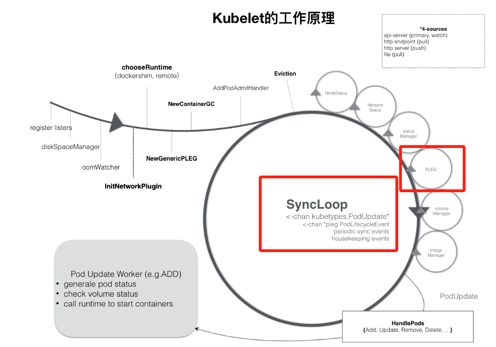

# 04-kubelet pleg

kubelet 的工作核心，就是一个控制循环，即：SyncLoop（图中的大圆圈）。而驱动这个控制循环运行的事件中，有个叫做 PLEG 的组件，负责告诉 kubelet 容器运行时状态变更事件。

<figure><figcaption></figcaption></figure>

```go
// syncLoopIteration reads from various channels and dispatches pods to the
// given handler.
//
// Arguments:
// 1.  configCh:       a channel to read config events from
// 2.  handler:        the SyncHandler to dispatch pods to
// 3.  syncCh:         a channel to read periodic sync events from
// 4.  housekeepingCh: a channel to read housekeeping events from
// 5.  plegCh:         a channel to read PLEG updates from
//   - plegCh: update the runtime cache; sync pod

func (kl *Kubelet) syncLoopIteration(ctx context.Context, configCh <-chan kubetypes.PodUpdate, handler SyncHandler,
    syncCh <-chan time.Time, housekeepingCh <-chan time.Time, plegCh <-chan *pleg.PodLifecycleEvent) bool {
    select {
    case u, open := <-configCh:
    case e := <-plegCh:
       if isSyncPodWorthy(e) {
          // PLEG event for a pod; sync it.
          if pod, ok := kl.podManager.GetPodByUID(e.ID); ok {
             klog.V(2).InfoS("SyncLoop (PLEG): event for pod", "pod", klog.KObj(pod), "event", e)
             handler.HandlePodSyncs([]*v1.Pod{pod})
          } else {
             // If the pod no longer exists, ignore the event.
             klog.V(4).InfoS("SyncLoop (PLEG): pod does not exist, ignore irrelevant event", "event", e)
          }
       }

       if e.Type == pleg.ContainerDied {
          if containerID, ok := e.Data.(string); ok {
             kl.cleanUpContainersInPod(e.ID, containerID)
          }
       }
    case <-syncCh:
    case update := <-kl.livenessManager.Updates():
    case update := <-kl.readinessManager.Updates():
    case update := <-kl.startupManager.Updates():
    case update := <-kl.containerManager.Updates():
    case <-housekeepingCh:  
}
```

## 基本概念

Kubelet是一个节点守护程序，它可以管理节点上的 pod ，驱动 pod status 使其匹配 spec 。为此，kubelet需要对 pod spec 和 container  status 做出反应。

**PLEG** 全称是 **Pod Lifecycle Event Generator**，PLEG 的主要职责是定期检查节点上所有 Pod 的状态，并与上一次检查的结果进行比较，从而检测出 Pod 状态的变化（如容器启动、停止、崩溃等）。这些状态变化会被封装成事件，供 Kubelet 的其他模块（如同步循环）使用。这样可以提高 kubelet 性能和可拓展性。

## 前世今生

在 1.1 及之前的 kubelet 中是没有 PLEG 的实现的。kubelet 会为每个 pod 单独启动一个 worker，这个 worker 负责向 container runtime 查询该 pod 对应的 sandbox 和 container 的状态，并进行状态同步逻辑的执行。这种 one worker per pod 的 polling 模型给 kubelet 带来了较大的性能损耗。即使这个 pod 没有任何的状态变化，也要不停的对 container runtime 进行主动查询。

因此在 1.2 中，kubelet 引入了 PLEG，将所有 container runtime 上 sandbox 和 container 的状态变化事件统一到 PLEG 这个单独的组件中，实现了 one worker all pods。这种实现相比于 one worker per pod 已经带来了较大的性能提升，详细实现会在后文进行介绍。但是默认情况下，仍然需要每秒一次的主动向 container runtime 查询，在 node 负载很高的情况下，依然会有一定的性能问题，比较常见的情况是导致 node not ready，错误原因是 `PLEG is not healthy`。

在 1.26 中，kubelet 引入了 Evented PLEG，为了和之前的 PLEG 实现区别，之前的 PLEG 称为 Generic PLEG。当然，Evented PLEG 并不是为了取代 Generic PLEG，而是和 Generic PLEG 配合，降低 Generic PLEG 的 polling 频率，从而提高性能的同时，也能保证实时性。


<figure><figcaption></figcaption></figure>

## 事件类型

```go
type PodLifeCycleEventType string

const (
    // 1. 容器启动事件
    ContainerStarted PodLifeCycleEventType = "ContainerStarted"
    
    // 2. 容器退出事件
    ContainerDied PodLifeCycleEventType = "ContainerDied"
    
    // 3. 容器移除事件
    ContainerRemoved PodLifeCycleEventType = "ContainerRemoved"
    
    // 4. Pod 同步事件
    PodSync PodLifeCycleEventType = "PodSync"
    
    // 5. 容器状态变更事件
    ContainerChanged PodLifeCycleEventType = "ContainerChanged"
    
    // 6. 条件满足事件
    ConditionMet PodLifeCycleEventType = "ConditionMet"
)
// PodLifecycleEvent is an event that reflects the change of the pod state.
type PodLifecycleEvent struct {
	// The pod ID.
	ID types.UID
	// The type of the event.
	Type PodLifeCycleEventType
	// The accompanied data which varies based on the event type.
	//   - ContainerStarted/ContainerStopped: the container name (string).
	//   - All other event types: unused.
	Data interface{}
}
```

## PLEG 的两种实现

Kubernetes 提供了两种 PLEG 实现:

### GenericPLEG (传统实现):

```go

// GenericPLEG 是一个基于定期 list 来发现容器变化的简单 PLEG 实现。
// 它作为临时替代方案，用于那些尚未支持完善事件生成器的容器运行时。
//
// 注意：GenericPLEG 假设容器不会在一个 relist 周期内完成创建、终止和垃圾回收。
// 如果发生这种情况，将会丢失该容器的所有事件。在 relist 失败的情况下，
// 这个时间窗口可能会变得更长。
type GenericPLEG struct {
    // runtime 是容器运行时接口，用于与容器运行时交互
    // 通过它可以获取容器状态、执行容器操作等
    runtime kubecontainer.Runtime

    // eventChannel 是事件通道，订阅者通过此通道监听容器生命周期事件
    // 当发现容器状态变化时，相关事件会被发送到此通道
    eventChannel chan *PodLifecycleEvent

    // podRecords 是 Pod/容器信息的内部缓存
    // 用于存储上一次 relist 时的 Pod 状态，用于状态对比
    podRecords podRecords

    // relistTime 记录最后一次执行 relist 的时间
    // 使用 atomic.Value 确保并发安全
    relistTime atomic.Value

    // cache 用于存储同步 Pod 所需的运行时状态
    // 这个缓存对于提高性能和减少对容器运行时的直接调用很重要
    cache kubecontainer.Cache

    // clock 用于测试目的，允许在测试中注入模拟时钟
    // 这样可以更好地控制时间相关的测试
    clock clock.Clock

    // podsToReinspect 记录在 relist 过程中获取状态失败的 Pod
    // 这些 Pod 将在下一次 relist 时重试
    podsToReinspect map[types.UID]*kubecontainer.Pod

    // stopCh 是用于停止 Generic PLEG 的通道
    // 关闭此通道将导致 PLEG 停止运行
    stopCh chan struct{}

    // relistLock 用于对 Generic PLEG 的 relist 操作加锁
    // 确保同一时间只有一个 relist 操作在执行
    relistLock sync.Mutex

    // isRunning 标识 Generic PLEG 是否正在运行
    // 用于控制 PLEG 的启动和停止状态
    isRunning bool

    // runningMu 用于对 Generic PLEG 的启动/停止操作加锁
    // 确保启动和停止操作的线程安全
    runningMu sync.Mutex

    // relistDuration 包含 relist 相关的参数
    // 如 relist 周期、超时时间等
    relistDuration *RelistDuration

    // podCacheMutex 用于序列化 relist 调用的 updateCache 和 UpdateCache 接口
    // 防止并发更新缓存导致的问题
    podCacheMutex sync.Mutex

    // logger 用于上下文日志记录
    // 提供结构化的日志输出
    logger klog.Logger

    // watchConditions 跟踪 Pod 的监视条件
    // 是一个从 Pod UID 到条件键到条件的映射
    // 用于跟踪需要监视的特定 Pod 状态条件
    watchConditions     map[types.UID]map[string]versionedWatchCondition

    // watchConditionsLock 保护 watchConditions 的并发访问
    // 确保对监视条件的操作是线程安全的
    watchConditionsLock sync.Mutex
}


// Start spawns a goroutine to relist periodically.
func (g *GenericPLEG) Start() {
	g.runningMu.Lock()
	defer g.runningMu.Unlock()
	if !g.isRunning {
		g.isRunning = true
		g.stopCh = make(chan struct{})
		go wait.Until(g.Relist, g.relistDuration.RelistPeriod, g.stopCh)
	}
}

// Relist queries the container runtime for list of pods/containers, compare
// with the internal pods/containers, and generates events accordingly.
func (g *GenericPLEG) Relist() {
	g.relistLock.Lock()
	

	timestamp := g.clock.Now()

	// Get all the pods.
	podList, err := g.runtime.GetPods(ctx, true)
	g.updateRelistTime(timestamp)
	
	for pid := range g.podRecords {
		// updateCache() will inspect the pod and update the cache. If an
		// error occurs during the inspection, we want PLEG to retry again
		// in the next relist. To achieve this, we do not update the
		// associated podRecord of the pod, so that the change will be
		// detect again in the next relist.
		// TODO: If many pods changed during the same relist period,
		// inspecting the pod and getting the PodStatus to update the cache
		// serially may take a while. We should be aware of this and
		// parallelize if needed.
		status, updated, err := g.updateCache(ctx, pod, pid)
        
}


```

Generic PLEG 定时向 runtime 进行查询，这个过程称为 relist，这里会调用 cri 的 `ListPodSandbox` 和 `ListContainers`接口。runtime 返回所有的数据之后，PLEG 会根据podID 调用 cri 的 `GetPosStatus` 接口获取详细信息并更新到缓存中。同时，组装成事件向 PLEG Channel 发送。kubelet 会在 pod sync loop 中监听 PLEG Channel，从而针对状态变化执行相应的逻辑，来尽量保证 pod spec 和 status 的一致。

<figure><figcaption></figcaption></figure>


### EventedPLEG (新实现):

```go
// EventedPLEG 是基于容器运行时事件的 PLEG 实现
// 它通过监听容器运行时的事件流来实时获取容器状态变化
type EventedPLEG struct {
    // runtime 是容器运行时接口
    // 用于执行容器操作和获取容器信息
    runtime kubecontainer.Runtime

    // runtimeService 是运行时服务接口
    // 提供 CRI（容器运行时接口）相关的操作
    // 主要用于获取容器事件流
    runtimeService internalapi.RuntimeService

    // eventChannel 是事件通道
    // 订阅者通过此通道接收 Pod 生命周期事件
    // 当收到容器运行时事件时，会转换并发送到此通道
    eventChannel chan *PodLifecycleEvent

    // cache 用于存储同步 Pod 所需的运行时状态
    // 缓存容器状态以提高性能，减少对运行时的直接调用
    cache kubecontainer.Cache

    // clock 用于测试目的
    // 允许在测试中注入模拟时钟，便于时间相关的测试
    clock clock.Clock

    // genericPleg 是通用 PLEG 的实例
    // 用作后备机制，在需要时强制执行 relist
    // 当事件流出现问题时可以降级到这个实现
    genericPleg podLifecycleEventGeneratorHandler

    // eventedPlegMaxStreamRetries 指定从运行时获取容器事件时的最大重试次数
    // 超过此次数后，将降级使用 genericPleg
    eventedPlegMaxStreamRetries int

    // relistDuration 包含 relist 相关的参数
    // 如重列举周期、超时时间等
    // 用于配置后备的 genericPleg
    relistDuration *RelistDuration

    // stopCh 是用于停止 Evented PLEG 的通道
    // 关闭此通道将导致 PLEG 停止运行
    stopCh chan struct{}

    // stopCacheUpdateCh 用于停止缓存全局时间戳的定期更新
    // 关闭此通道将停止缓存更新
    stopCacheUpdateCh chan struct{}

    // runningMu 用于对 Evented PLEG 的启动/停止操作加锁
    // 确保启动和停止操作的线程安全
    runningMu sync.Mutex

    // logger 用于上下文日志记录
    // 提供结构化的日志输出
    logger klog.Logger
}
```

引入 Evented PLEG 后，通过调用 runtime 的 `GetContainerEvents（需要runtime支持）` 来监听 runtime 中的事件，然后生成 pod 的 event，并发送到 PLEG Channel 中供 kubelet pod sync loop 消费。

如果 Evented 不能按照预期工作（比如 runtime 不支持 GetContainerEvents），降级到 Generic PLEG。

```go
// Start starts the Evented PLEG
func (e *EventedPLEG) Start() {
    e.runningMu.Lock()
    defer e.runningMu.Unlock()
    if isEventedPLEGInUse() {
       return
    }
    setEventedPLEGUsage(true)
    e.stopCh = make(chan struct{})
    e.stopCacheUpdateCh = make(chan struct{})
    go wait.Until(e.watchEventsChannel, 0, e.stopCh)
    go wait.Until(e.updateGlobalCache, globalCacheUpdatePeriod, e.stopCacheUpdateCh)
}

func (e *EventedPLEG) watchEventsChannel() {
	containerEventsResponseCh := make(chan *runtimeapi.ContainerEventResponse, cap(e.eventChannel))
	defer close(containerEventsResponseCh)

	// Get the container events from the runtime.
	go func() {
		numAttempts := 0
		for {
			if numAttempts >= e.eventedPlegMaxStreamRetries {
				if isEventedPLEGInUse() {
					// Fall back to Generic PLEG relisting since Evented PLEG is not working.
					e.logger.V(4).Info("Fall back to Generic PLEG relisting since Evented PLEG is not working")
					e.Stop()
					e.genericPleg.Stop()       // Stop the existing Generic PLEG which runs with longer relisting period when Evented PLEG is in use.
					e.Update(e.relistDuration) // Update the relisting period to the default value for the Generic PLEG.
					e.genericPleg.Start()
					break
				}
			}

			err := e.runtimeService.GetContainerEvents(context.Background(), containerEventsResponseCh, func(runtimeapi.RuntimeService_GetContainerEventsClient) {
				metrics.EventedPLEGConn.Inc()
			})
			if err != nil {
				metrics.EventedPLEGConnErr.Inc()
				numAttempts++
				e.Relist() // Force a relist to get the latest container and pods running metric.
				e.logger.V(4).Info("Evented PLEG: Failed to get container events, retrying: ", "err", err)
			}
		}
	}()

	if isEventedPLEGInUse() {
		e.processCRIEvents(containerEventsResponseCh)
	}
}
```

<figure><figcaption></figcaption></figure>

<figure><figcaption></figcaption></figure>
