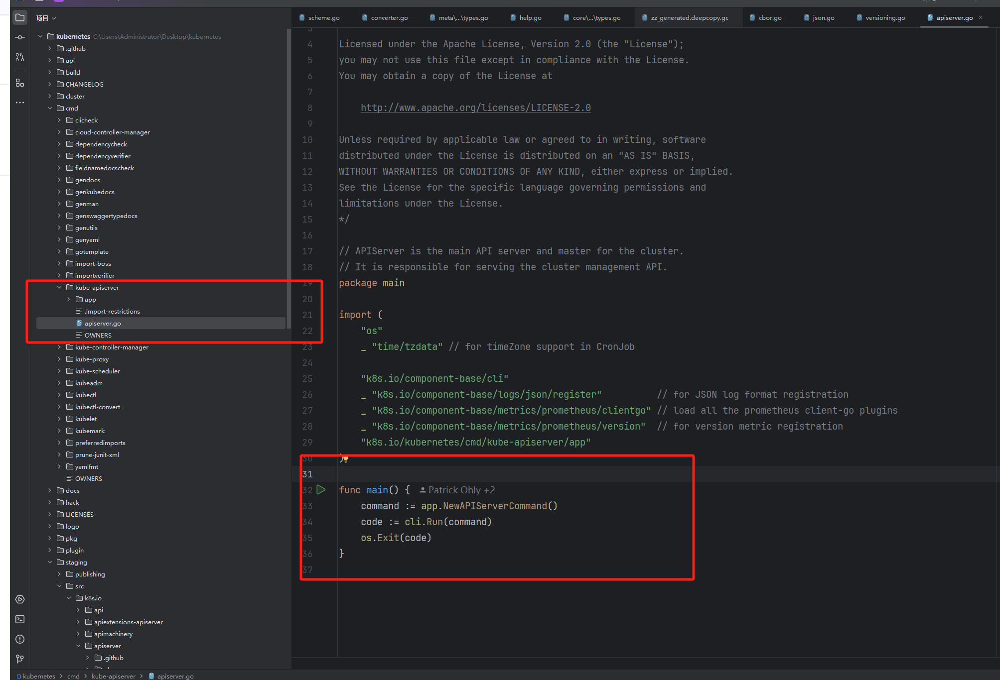

# 5.3 apiserver 源码分析 01 - 服务启动分析

## 入口

kube-apiserver 入口在 cmd/kube-apiserver/apiserver.go 文件中，只有三行代码，我们来详细解读下。

<figure><figcaption></figcaption></figure>

1\. 版权声明和许可证：

* 文件开头是版权声明，表明该代码属于 Kubernetes 作者，并且遵循 Apache License 2.0 许可证。

2\. 包声明：

* package main：声明这是一个可执行程序的主包。

3.导入包：

* os：用于与操作系统交互。
* \_ "time/tzdata"：导入 tzdata 包以支持时区功能，特别是在 CronJob 中。
* k8s.io/component-base/cli：用于命令行接口的运行。
* \_ "k8s.io/component-base/logs/json/register"：注册 JSON 日志格式。
* \_ "k8s.io/component-base/metrics/prometheus/clientgo"：加载所有 Prometheus 客户端插件。
* \_ "k8s.io/component-base/metrics/prometheus/version"：注册版本指标。
* k8s.io/kubernetes/cmd/kube-apiserver/app：导入 kube-apiserver 应用程序的核心逻辑。

4\. 主函数：

* func main()：程序的入口函数。
* command := app.NewAPIServerCommand()：创建一个新的 API 服务器命令。
* code := cli.Run(command)：运行命令行接口，并返回退出代码。
* os.Exit(code)：以返回的退出代码终止程序。

## NewAPIServerCommand()

这段代码定义了一个名为 NewAPIServerCommand 的函数，用于创建一个 \*cobra.Command 对象，该对象是 Kubernetes API 服务器的命令行接口。

```go
// NewAPIServerCommand creates a *cobra.Command object with default parameters
func NewAPIServerCommand() *cobra.Command {
// 注册或获取默认的特性门控，用于控制 Kubernetes 中的可选功能。
_, featureGate := featuregate.DefaultComponentGlobalsRegistry.ComponentGlobalsOrRegister(
		featuregate.DefaultKubeComponent, utilversion.DefaultBuildEffectiveVersion(), utilfeature.DefaultMutableFeatureGate)
	// 创建一个新的服务器运行选项实例，包含了 API 服务器的配置选项
	s := options.NewServerRunOptions()
	// 设置一个信号上下文，用于处理系统信号（如终止信号）以优雅地关闭服务器。
	ctx := genericapiserver.SetupSignalContext()

	cmd := &cobra.Command{
		Use: "kube-apiserver",
		Long: `The Kubernetes API server validates and configures data
for the api objects which include pods, services, replicationcontrollers, and
others. The API Server services REST operations and provides the frontend to the
cluster's shared state through which all other components interact.`,

		// stop printing usage when the command errors
		SilenceUsage: true,
		PersistentPreRunE: func(*cobra.Command, []string) error {
			if err := featuregate.DefaultComponentGlobalsRegistry.Set(); err != nil {
				return err
			}
			// silence client-go warnings.
			// kube-apiserver loopback clients should not log self-issued warnings.
			rest.SetDefaultWarningHandler(rest.NoWarnings{})
			return nil
		},
		RunE: func(cmd *cobra.Command, args []string) error {
			verflag.PrintAndExitIfRequested()
			fs := cmd.Flags()
			// Activate logging as soon as possible, after that
			// show flags with the final logging configuration.
			if err := logsapi.ValidateAndApply(s.Logs, featureGate); err != nil {
				return err
			}
			cliflag.PrintFlags(fs)

			// set default options
			completedOptions, err := s.Complete(ctx)
			if err != nil {
				return err
			}

			// validate options
			if errs := completedOptions.Validate(); len(errs) != 0 {
				return utilerrors.NewAggregate(errs)
			}
			// add feature enablement metrics
			featureGate.AddMetrics()
		        // 服务启动入口
			return Run(ctx, completedOptions)
		},
		Args: func(cmd *cobra.Command, args []string) error {
			for _, arg := range args {
				if len(arg) > 0 {
					return fmt.Errorf("%q does not take any arguments, got %q", cmd.CommandPath(), args)
				}
			}
			return nil
		},
	}
	cmd.SetContext(ctx)

	fs := cmd.Flags()
	namedFlagSets := s.Flags()
	verflag.AddFlags(namedFlagSets.FlagSet("global"))
	globalflag.AddGlobalFlags(namedFlagSets.FlagSet("global"), cmd.Name(), logs.SkipLoggingConfigurationFlags())
	options.AddCustomGlobalFlags(namedFlagSets.FlagSet("generic"))
	for _, f := range namedFlagSets.FlagSets {
		fs.AddFlagSet(f)
	}

	cols, _, _ := term.TerminalSize(cmd.OutOrStdout())
	cliflag.SetUsageAndHelpFunc(cmd, namedFlagSets, cols)

	return cmd
}
```

Kubernetes API 服务器的启动入口位于 RunE 函数中，这是 cobra.Command 的一个字段。具体来说，启动过程是通过调用 Run(ctx, completedOptions) 来实现的：

```go
		// 这是命令的主要执行函数，负责启动 API 服务器。
		RunE: func(cmd *cobra.Command, args []string) error {
		
			// 日志和 flag 解析
			verflag.PrintAndExitIfRequested()
			fs := cmd.Flags()
			// Activate logging as soon as possible, after that
			// show flags with the final logging configuration.
			if err := logsapi.ValidateAndApply(s.Logs, featureGate); err != nil {
				return err
			}
			cliflag.PrintFlags(fs)

			// set default options （默认设置）
			completedOptions, err := s.Complete(ctx)
			if err != nil {
				return err
			}

			// validate options
			if errs := completedOptions.Validate(); len(errs) != 0 {
				return utilerrors.NewAggregate(errs)
			}
			// add feature enablement metrics
			featureGate.AddMetrics()
			// 在 Run 函数中，API 服务器的配置被创建和完成，
			// 然后通过 CreateServerChain 创建服务器链，
			// 最后调用 prepared.Run(ctx) 启动服务器。
			return Run(ctx, completedOptions)
		},
		

// Run runs the specified APIServer.  This should never exit.
func Run(ctx context.Context, opts options.CompletedOptions) error {
	// To help debugging, immediately log version
	klog.Infof("Version: %+v", utilversion.Get())

	klog.InfoS("Golang settings", "GOGC", os.Getenv("GOGC"), "GOMAXPROCS", os.Getenv("GOMAXPROCS"), "GOTRACEBACK", os.Getenv("GOTRACEBACK"))

	config, err := NewConfig(opts)
	if err != nil {
		return err
	}
	completed, err := config.Complete()
	if err != nil {
		return err
	}
	server, err := CreateServerChain(completed)
	if err != nil {
		return err
	}

	prepared, err := server.PrepareRun()
	if err != nil {
		return err
	}

	return prepared.Run(ctx)
}
	
```


### NewConfig

NewConfig 的函数，用于创建 Kubernetes API 服务器的配置对象。该函数负责初始化和配置 API 服务器所需的各种组件，但并不实际启动服务器。注意三个服务对象 kubeAPIs/apiExtensions/aggregator 都有通用配置 genericConfig 和自己的特殊配置。

```go
// NewConfig creates all the resources for running kube-apiserver, but runs none of them.
func NewConfig(opts options.CompletedOptions) (*Config, error) {
	// 配置对象初始化,创建一个新的 Config 对象，并将传入的选项赋值给它。
	c := &Config{
		Options: opts,
	}
	// 通用配置构建,调用该函数构建通用的 API 服务器配置，包括版本信息、存储工厂等。
	genericConfig, versionedInformers, storageFactory, err := controlplaneapiserver.BuildGenericConfig(
		opts.CompletedOptions,
		[]*runtime.Scheme{legacyscheme.Scheme, apiextensionsapiserver.Scheme, aggregatorscheme.Scheme},
		controlplane.DefaultAPIResourceConfigSource(),
		generatedopenapi.GetOpenAPIDefinitions,
	)
	if err != nil {
		return nil, err
	}
	// 创建 Kubernetes API 服务器的具体配置，包括服务解析器和插件初始化器。
	kubeAPIs, serviceResolver, pluginInitializer, err := CreateKubeAPIServerConfig(opts, genericConfig, versionedInformers, storageFactory)
	if err != nil {
		return nil, err
	}
	c.KubeAPIs = kubeAPIs
	// 创建 API 扩展配置，处理自定义资源定义（CRD）等。
	apiExtensions, err := controlplaneapiserver.CreateAPIExtensionsConfig(*kubeAPIs.ControlPlane.Generic, kubeAPIs.ControlPlane.VersionedInformers, pluginInitializer, opts.CompletedOptions, opts.MasterCount,
		serviceResolver, webhook.NewDefaultAuthenticationInfoResolverWrapper(kubeAPIs.ControlPlane.ProxyTransport, kubeAPIs.ControlPlane.Generic.EgressSelector, kubeAPIs.ControlPlane.Generic.LoopbackClientConfig, kubeAPIs.ControlPlane.Generic.TracerProvider))
	if err != nil {
		return nil, err
	}
	c.ApiExtensions = apiExtensions
	// 创建 API 聚合器的配置，用于处理聚合 API。
	aggregator, err := controlplaneapiserver.CreateAggregatorConfig(*kubeAPIs.ControlPlane.Generic, opts.CompletedOptions, kubeAPIs.ControlPlane.VersionedInformers, serviceResolver, kubeAPIs.ControlPlane.ProxyTransport, kubeAPIs.ControlPlane.Extra.PeerProxy, pluginInitializer)
	if err != nil {
		return nil, err
	}
	c.Aggregator = aggregator

	return c, nil
}
```

### Complete

集中管理配置的初始化和验证，提高了代码的可读性、可维护性和可靠性。

例如，Aggregator.Complete()、KubeAPIs.Complete() 和 ApiExtensions.Complete() 都是对各自配置项的初始化操作。当需要更改配置的初始化逻辑时，只需修改 Complete 方法，而不需要在代码的其他部分进行修改。这提高了代码的可维护性和可扩展性。通过在 Complete 方法中进行验证，可以确保所有配置项在使用前都是完整且一致的。这减少了运行时错误的可能性。

```go
func (c *Config) Complete() (CompletedConfig, error) {
	return CompletedConfig{&completedConfig{
		Options: c.Options,

		Aggregator:    c.Aggregator.Complete(),
		KubeAPIs:      c.KubeAPIs.Complete(),
		ApiExtensions: c.ApiExtensions.Complete(),

		ExtraConfig: c.ExtraConfig,
	}}, nil
}


// Complete fills in any fields not set that are required to have valid data. It's mutating the receiver.
func (c *Config) Complete() CompletedConfig {
	if c.ControlPlane.PeerEndpointReconcileInterval == 0 && c.EndpointReconcilerConfig.Interval != 0 {
		// default this to the endpoint reconciler value before the generic
		// controlplane completion can kick in
		c.ControlPlane.PeerEndpointReconcileInterval = c.EndpointReconcilerConfig.Interval
	}

	cfg := completedConfig{
		c.ControlPlane.Complete(),
		&c.Extra,
	}

	serviceIPRange, apiServerServiceIP, err := options.ServiceIPRange(cfg.Extra.ServiceIPRange)
	if err != nil {
		klog.Fatalf("Error determining service IP ranges: %v", err)
	}
	if cfg.Extra.ServiceIPRange.IP == nil {
		cfg.Extra.ServiceIPRange = serviceIPRange
	}
	if cfg.Extra.APIServerServiceIP == nil {
		cfg.Extra.APIServerServiceIP = apiServerServiceIP
	}

	// override the default discovery addresses in the generic controlplane adding service IP support
	discoveryAddresses := discovery.DefaultAddresses{DefaultAddress: cfg.ControlPlane.Generic.ExternalAddress}
	discoveryAddresses.CIDRRules = append(discoveryAddresses.CIDRRules,
		discovery.CIDRRule{IPRange: cfg.Extra.ServiceIPRange, Address: net.JoinHostPort(cfg.Extra.APIServerServiceIP.String(), strconv.Itoa(cfg.Extra.APIServerServicePort))})
	cfg.ControlPlane.Generic.DiscoveryAddresses = discoveryAddresses

	if cfg.Extra.ServiceNodePortRange.Size == 0 {
		// TODO: Currently no way to specify an empty range (do we need to allow this?)
		// We should probably allow this for clouds that don't require NodePort to do load-balancing (GCE)
		// but then that breaks the strict nestedness of ServiceType.
		// Review post-v1
		cfg.Extra.ServiceNodePortRange = kubeoptions.DefaultServiceNodePortRange
		klog.Infof("Node port range unspecified. Defaulting to %v.", cfg.Extra.ServiceNodePortRange)
	}

	if cfg.Extra.EndpointReconcilerConfig.Interval == 0 {
		cfg.Extra.EndpointReconcilerConfig.Interval = DefaultEndpointReconcilerInterval
	}

	if cfg.Extra.MasterEndpointReconcileTTL == 0 {
		cfg.Extra.MasterEndpointReconcileTTL = DefaultEndpointReconcilerTTL
	}

	if cfg.Extra.EndpointReconcilerConfig.Reconciler == nil {
		cfg.Extra.EndpointReconcilerConfig.Reconciler = c.createEndpointReconciler()
	}

	if cfg.Extra.RepairServicesInterval == 0 {
		cfg.Extra.RepairServicesInterval = repairLoopInterval
	}

	return CompletedConfig{&cfg}
}
```

### CreateServerChain

实际上，kube-apiserver 并不是一个单独的 server，而是由 AggregatorServer、KubeAPIServer、APIExtensionsServer 三者串联组成的。AggregatorServer 是所有请求的入口，当 AggregatorServer 可以处理该请求就由 AggregatorServer 请求，如果没有匹配的路由，那么这个请求就会被转发给下一个处理器。

AggregatorServer面对两类不同的子Server：第一类是KubeAPIServer和APIExtensionsServer，它和AggregatorServer处于同一个Web应用中；第二类是CustomServer，使用者可以通过编写和部署自己的 API Server来为定制资源提供特殊的实现，它部署在集群中的Pod上，通过Service的方式暴露服务，对于AggregatorServer来说CustomServer是远程的。这也就是人们常说的两种主要扩展 APIServer 资源的方式Aggregator 和 APIExtensionsServer 。

当一个HTTP请求到达AggregatorServer，AggregatorServer判断是本地LocalServer要响应的，会将请求交给KubeAPIServer；判断是CustomServer要响应的，会以proxy的方式将请求交给对应的CustomServer

<figure><figcaption></figcaption></figure>

```go
// CreateServerChain creates the apiservers connected via delegation.
func CreateServerChain(config CompletedConfig) (*aggregatorapiserver.APIAggregator, error) {
	// 创建一个处理未找到资源请求的处理器
	notFoundHandler := notfoundhandler.New(config.KubeAPIs.ControlPlane.Generic.Serializer, genericapifilters.NoMuxAndDiscoveryIncompleteKey)
	apiExtensionsServer, err := config.ApiExtensions.New(genericapiserver.NewEmptyDelegateWithCustomHandler(notFoundHandler))
	if err != nil {
		return nil, err
	}
	// 检查自定义资源定义（CRD）API 是否启用。
	crdAPIEnabled := config.ApiExtensions.GenericConfig.MergedResourceConfig.ResourceEnabled(apiextensionsv1.SchemeGroupVersion.WithResource("customresourcedefinitions"))

	// 创建一个新的 Kubernetes API 服务器，并将其连接到 apiExtensionsServer
	kubeAPIServer, err := config.KubeAPIs.New(apiExtensionsServer.GenericAPIServer)
	if err != nil {
		return nil, err
	}

	// aggregator comes last in the chain
	// 创建一个聚合器服务器，将其放在服务器链的最后。这个服务器负责将多个 API 服务器聚合在一起。
	aggregatorServer, err := controlplaneapiserver.CreateAggregatorServer(config.Aggregator, kubeAPIServer.ControlPlane.GenericAPIServer, apiExtensionsServer.Informers.Apiextensions().V1().CustomResourceDefinitions(), crdAPIEnabled, apiVersionPriorities)
	if err != nil {
		// we don't need special handling for innerStopCh because the aggregator server doesn't create any go routines
		return nil, err
	}

	return aggregatorServer, nil
}


func CreateAggregatorServer(aggregatorConfig aggregatorapiserver.CompletedConfig, delegateAPIServer genericapiserver.DelegationTarget, crds apiextensionsinformers.CustomResourceDefinitionInformer, crdAPIEnabled bool, apiVersionPriorities map[schema.GroupVersion]APIServicePriority) (*aggregatorapiserver.APIAggregator, error) {
	// 1. 使用提供的 aggregatorConfig 和 delegateAPIServer 创建一个新的聚合器服务器
	aggregatorServer, err := aggregatorConfig.NewWithDelegate(delegateAPIServer)
	if err != nil {
		return nil, err
	}

	// 2. 创建自动注册控制器
	// 为所有内建APIGroup的各个Version生成APIService
	// 内建的APIGroup的各个Version都会有一个对应的APIService resource被生成出来,交给上述Controller去存到etcd
	// create controllers for auto-registration
	apiRegistrationClient, err := apiregistrationclient.NewForConfig(aggregatorConfig.GenericConfig.LoopbackClientConfig)
	if err != nil {
		return nil, err
	}
	autoRegistrationController := autoregister.NewAutoRegisterController(aggregatorServer.APIRegistrationInformers.Apiregistration().V1().APIServices(), apiRegistrationClient)
	apiServices := apiServicesToRegister(delegateAPIServer, autoRegistrationController, apiVersionPriorities)

	type controller interface {
		Run(workers int, stopCh <-chan struct{})
		WaitForInitialSync()
	}
	// 3. CRD 注册控制器
	// 为由CRD创建出的APIGroup的各个Version生成APIService
	// 类似内建APIGroup,CR的APIGroup各个Version同样要有APIService resource去对应,建好后同样交给上述Controller去存到etcd
	// 这还需要用到Controller去监控CR的创建,因为CR随时会被用户创建无法提前全部拿到
	var crdRegistrationController controller
	if crdAPIEnabled {
		crdRegistrationController = crdregistration.NewCRDRegistrationController(
			crds,
			autoRegistrationController)
	}

	// Imbue all builtin group-priorities onto the aggregated discovery
	if aggregatorConfig.GenericConfig.AggregatedDiscoveryGroupManager != nil {
		for gv, entry := range apiVersionPriorities {
			aggregatorConfig.GenericConfig.AggregatedDiscoveryGroupManager.SetGroupVersionPriority(metav1.GroupVersion(gv), int(entry.Group), int(entry.Version))
		}
	}

	//4. 在Post start hook中启动以上两个Controller:一个是保管APIService Resource的,一个是监控CR创建的
	err = aggregatorServer.GenericAPIServer.AddPostStartHook("kube-apiserver-autoregistration", func(context genericapiserver.PostStartHookContext) error {
		if crdAPIEnabled {
			go crdRegistrationController.Run(5, context.Done())
		}
		go func() {
			// let the CRD controller process the initial set of CRDs before starting the autoregistration controller.
			// this prevents the autoregistration controller's initial sync from deleting APIServices for CRDs that still exist.
			// we only need to do this if CRDs are enabled on this server.  We can't use discovery because we are the source for discovery.
			if crdAPIEnabled {
				klog.Infof("waiting for initial CRD sync...")
				crdRegistrationController.WaitForInitialSync()
				klog.Infof("initial CRD sync complete...")
			} else {
				klog.Infof("CRD API not enabled, starting APIService registration without waiting for initial CRD sync")
			}
			autoRegistrationController.Run(5, context.Done())
		}()
		return nil
	})
	if err != nil {
		return nil, err
	}
	// 5. 添加启动顺序健康检查：
	err = aggregatorServer.GenericAPIServer.AddBootSequenceHealthChecks(
		makeAPIServiceAvailableHealthCheck(
			"autoregister-completion",
			apiServices,
			aggregatorServer.APIRegistrationInformers.Apiregistration().V1().APIServices(),
		),
	)
	if err != nil {
		return nil, err
	}

	return aggregatorServer, nil
}

```

#### 自动注册机制

在 Kubernetes 中，自动注册 API 服务通常通过 APIService 资源和自动注册控制器来实现。以下是实现自动注册的步骤：

1\.  实现自定义 API 服务器：

* 首先，你需要实现一个自定义的 API 服务器。这个服务器可以使用 Kubernetes 提供的 kube-aggregator 库来简化开发。

2\.  创建 Kubernetes Service：

* 为你的自定义 API 服务器创建一个 Kubernetes Service。这将为你的 API 服务器提供一个稳定的网络端点。

3.定义 APIService 资源：

创建一个 APIService 资源来描述你的 API 服务器。APIService 资源包含了 API 组、版本、优先级、服务引用等信息。例如：

```yaml
     apiVersion: apiregistration.k8s.io/v1
     kind: APIService
     metadata:
       name: v1.myapi.example.com
     spec:
       service:
         name: myapi-service
         namespace: default
       group: myapi.example.com
       version: v1
       insecureSkipTLSVerify: true
       groupPriorityMinimum: 1000
       versionPriority: 15
```

4. 部署 APIService 资源：

将 APIService 资源应用到 Kubernetes 集群中。这会将你的自定义 API 服务器注册到 Kubernetes API 服务器中。

5\.  自动注册控制器：

* 自动注册控制器会监控 APIService 资源的变化，并根据这些变化自动注册或注销 API 服务。
* 在代码中，自动注册控制器通常通过 AutoRegisterController 类来实现，它会处理 APIService 资源的创建、更新和删除事件。

<figure><figcaption></figcaption></figure>

```go
type APIService struct {
	metav1.TypeMeta `json:",inline"`
	// Standard object's metadata.
	// More info: https://git.k8s.io/community/contributors/devel/sig-architecture/api-conventions.md#metadata
	// +optional
	metav1.ObjectMeta `json:"metadata,omitempty" protobuf:"bytes,1,opt,name=metadata"`

	// Spec contains information for locating and communicating with a server
	Spec APIServiceSpec `json:"spec,omitempty" protobuf:"bytes,2,opt,name=spec"`
	// Status contains derived information about an API server
	Status APIServiceStatus `json:"status,omitempty" protobuf:"bytes,3,opt,name=status"`
}

// APIServiceSpec中有一个很重要的Service属性：
// Service指向这个APIService背后的Server，为空时代表这是由本地APIserver支持的。
// 如果HTTP请求对应的APIService的Service属性为空，则将请求交给KubeAPIServer；
// 如果Service属性不为空，会以proxy的方式将请求交给对应的CustomServer 
// APIServiceSpec contains information for locating and communicating with a server.
// Only https is supported, though you are able to disable certificate verification.
type APIServiceSpec struct {
	// Service is a reference to the service for this API server.  It must communicate
	// on port 443.
	// If the Service is nil, that means the handling for the API groupversion is handled locally on this server.
	// The call will simply delegate to the normal handler chain to be fulfilled.
	// +optional
	Service *ServiceReference `json:"service,omitempty" protobuf:"bytes,1,opt,name=service"`
	// Group is the API group name this server hosts
	Group string `json:"group,omitempty" protobuf:"bytes,2,opt,name=group"`
	// Version is the API version this server hosts.  For example, "v1"
	Version string `json:"version,omitempty" protobuf:"bytes,3,opt,name=version"`

	// InsecureSkipTLSVerify disables TLS certificate verification when communicating with this server.
	// This is strongly discouraged.  You should use the CABundle instead.
	InsecureSkipTLSVerify bool `json:"insecureSkipTLSVerify,omitempty" protobuf:"varint,4,opt,name=insecureSkipTLSVerify"`
	// CABundle is a PEM encoded CA bundle which will be used to validate an API server's serving certificate.
	// If unspecified, system trust roots on the apiserver are used.
	// +listType=atomic
	// +optional
	CABundle []byte `json:"caBundle,omitempty" protobuf:"bytes,5,opt,name=caBundle"`

	// GroupPriorityMinimum is the priority this group should have at least. Higher priority means that the group is preferred by clients over lower priority ones.
	// Note that other versions of this group might specify even higher GroupPriorityMinimum values such that the whole group gets a higher priority.
	// The primary sort is based on GroupPriorityMinimum, ordered highest number to lowest (20 before 10).
	// The secondary sort is based on the alphabetical comparison of the name of the object.  (v1.bar before v1.foo)
	// We'd recommend something like: *.k8s.io (except extensions) at 18000 and
	// PaaSes (OpenShift, Deis) are recommended to be in the 2000s
	GroupPriorityMinimum int32 `json:"groupPriorityMinimum" protobuf:"varint,7,opt,name=groupPriorityMinimum"`

	// VersionPriority controls the ordering of this API version inside of its group.  Must be greater than zero.
	// The primary sort is based on VersionPriority, ordered highest to lowest (20 before 10).
	// Since it's inside of a group, the number can be small, probably in the 10s.
	// In case of equal version priorities, the version string will be used to compute the order inside a group.
	// If the version string is "kube-like", it will sort above non "kube-like" version strings, which are ordered
	// lexicographically. "Kube-like" versions start with a "v", then are followed by a number (the major version),
	// then optionally the string "alpha" or "beta" and another number (the minor version). These are sorted first
	// by GA > beta > alpha (where GA is a version with no suffix such as beta or alpha), and then by comparing major
	// version, then minor version. An example sorted list of versions:
	// v10, v2, v1, v11beta2, v10beta3, v3beta1, v12alpha1, v11alpha2, foo1, foo10.
	VersionPriority int32 `json:"versionPriority" protobuf:"varint,8,opt,name=versionPriority"`

	// leaving this here so everyone remembers why proto index 6 is skipped
	// Priority int64 `json:"priority" protobuf:"varint,6,opt,name=priority"`
}
```

#### NewWithDelegate

`NewWithDelegate()`方法中包含监控APIService更新的Controller，该Controller最终会调用APIAggregator的`AddAPIService()`和`RemoveAPIService()`方法。

1. 检查和更新现有的代理处理器

* 如果 proxyHandler 已经存在于 s.proxyHandlers 中，说明该 API 服务已经被注册过，需要更新。
* &#x20;更新 proxyHandler 的 API 服务信息，并通知相关的聚合控制器（如 openAPIAggregationController 和 discoveryAggregationController）进行更新。

2. 构建代理路径

* 根据 apiService.Spec.Group 和 apiService.Spec.Version 构建代理路径 proxyPath。
* 对于遗留的 API 服务（legacyAPIServiceName），使用特殊的路径 /api。

3. 注册新的代理处理器：

* 创建一个新的 proxyHandler，并初始化其各种字段。
* 更新 proxyHandler 的 API 服务信息。

4. 将 proxyHandler 添加到相关的聚合控制器中。

* 注册代理处理器到服务器的处理器链：
* 将 proxyHandler 注册到 GenericAPIServer 的处理器链中，处理对应的 proxyPath 请求。

5. 处理遗留 API 服务：

* 如果是遗留 API 服务，直接返回，不需要进一步处理。

6. 注册 API 组的聚合端点：

* 检查 apiService.Spec.Group 是否已经注册过，如果没有，注册新的 API 组聚合端点。
* 创建 apiGroupHandler，用于处理 API 组的发现请求。
* 将 apiGroupHandler 注册到 GenericAPIServer 的处理器链中。

7. 更新已处理的组版本信息：

* 将新的 API 版本信息插入到 s.handledGroupVersions 中，标记该组版本已被处理

```go
// NewWithDelegate returns a new instance of APIAggregator from the given config.
func (c completedConfig) NewWithDelegate(delegationTarget genericapiserver.DelegationTarget) (*APIAggregator, error) {
 // 此处省略代码    
}
	
	

// AddAPIService adds an API service.  It is not thread-safe, so only call it on one thread at a time please.
// It's a slow moving API, so its ok to run the controller on a single thread
func (s *APIAggregator) AddAPIService(apiService *v1.APIService) error {
	// if the proxyHandler already exists, it needs to be updated. The aggregation bits do not
	// since they are wired against listers because they require multiple resources to respond
	if proxyHandler, exists := s.proxyHandlers[apiService.Name]; exists {
		proxyHandler.updateAPIService(apiService)
		if s.openAPIAggregationController != nil {
			s.openAPIAggregationController.UpdateAPIService(proxyHandler, apiService)
		}
		if s.openAPIV3AggregationController != nil {
			s.openAPIV3AggregationController.UpdateAPIService(proxyHandler, apiService)
		}
		// Forward calls to discovery manager to update discovery document
		if s.discoveryAggregationController != nil {
			handlerCopy := *proxyHandler
			handlerCopy.setServiceAvailable()
			s.discoveryAggregationController.AddAPIService(apiService, &handlerCopy)
		}
		return nil
	}

	proxyPath := "/apis/" + apiService.Spec.Group + "/" + apiService.Spec.Version
	// v1. is a special case for the legacy API.  It proxies to a wider set of endpoints.
	if apiService.Name == legacyAPIServiceName {
		proxyPath = "/api"
	}

	// register the proxy handler
	proxyHandler := &proxyHandler{
		localDelegate:              s.delegateHandler,
		proxyCurrentCertKeyContent: s.proxyCurrentCertKeyContent,
		proxyTransportDial:         s.proxyTransportDial,
		serviceResolver:            s.serviceResolver,
		rejectForwardingRedirects:  s.rejectForwardingRedirects,
		tracerProvider:             s.tracerProvider,
	}
	proxyHandler.updateAPIService(apiService)
	if s.openAPIAggregationController != nil {
		s.openAPIAggregationController.AddAPIService(proxyHandler, apiService)
	}
	if s.openAPIV3AggregationController != nil {
		s.openAPIV3AggregationController.AddAPIService(proxyHandler, apiService)
	}
	if s.discoveryAggregationController != nil {
		s.discoveryAggregationController.AddAPIService(apiService, proxyHandler)
	}

	s.proxyHandlers[apiService.Name] = proxyHandler
	s.GenericAPIServer.Handler.NonGoRestfulMux.Handle(proxyPath, proxyHandler)
	s.GenericAPIServer.Handler.NonGoRestfulMux.UnlistedHandlePrefix(proxyPath+"/", proxyHandler)

	// if we're dealing with the legacy group, we're done here
	if apiService.Name == legacyAPIServiceName {
		return nil
	}

	// if we've already registered the path with the handler, we don't want to do it again.
	versions, exist := s.handledGroupVersions[apiService.Spec.Group]
	if exist {
		versions.Insert(apiService.Spec.Version)
		return nil
	}

	// it's time to register the group aggregation endpoint
	groupPath := "/apis/" + apiService.Spec.Group
	groupDiscoveryHandler := &apiGroupHandler{
		codecs:    aggregatorscheme.Codecs,
		groupName: apiService.Spec.Group,
		lister:    s.lister,
		delegate:  s.delegateHandler,
	}
	// aggregation is protected
	s.GenericAPIServer.Handler.NonGoRestfulMux.Handle(groupPath, groupDiscoveryHandler)
	s.GenericAPIServer.Handler.NonGoRestfulMux.UnlistedHandle(groupPath+"/", groupDiscoveryHandler)
	s.handledGroupVersions[apiService.Spec.Group] = sets.New[string](apiService.Spec.Version)
	return nil
}
	
	
```

`/apis/<group>/<version>`开头的请求的最终是由`proxyHandler.ServeHTTP()`来处理，代码如下：

```go
func (r *proxyHandler) ServeHTTP(w http.ResponseWriter, req *http.Request) {
	value := r.handlingInfo.Load()
	if value == nil {
		r.localDelegate.ServeHTTP(w, req)
		return
	}
	handlingInfo := value.(proxyHandlingInfo)
	if handlingInfo.local {
		if r.localDelegate == nil {
			http.Error(w, "", http.StatusNotFound)
			return
		}
		r.localDelegate.ServeHTTP(w, req)
		return
	}

	if !handlingInfo.serviceAvailable {
		proxyError(w, req, "service unavailable", http.StatusServiceUnavailable)
		return
	}

	if handlingInfo.transportBuildingError != nil {
		proxyError(w, req, handlingInfo.transportBuildingError.Error(), http.StatusInternalServerError)
		return
	}

	user, ok := genericapirequest.UserFrom(req.Context())
	if !ok {
		proxyError(w, req, "missing user", http.StatusInternalServerError)
		return
	}

	// write a new location based on the existing request pointed at the target service
	location := &url.URL{}
	location.Scheme = "https"
	rloc, err := r.serviceResolver.ResolveEndpoint(handlingInfo.serviceNamespace, handlingInfo.serviceName, handlingInfo.servicePort)
	if err != nil {
		klog.Errorf("error resolving %s/%s: %v", handlingInfo.serviceNamespace, handlingInfo.serviceName, err)
		proxyError(w, req, "service unavailable", http.StatusServiceUnavailable)
		return
	}
	location.Host = rloc.Host
	location.Path = req.URL.Path
	location.RawQuery = req.URL.Query().Encode()

	newReq, cancelFn := apiserverproxyutil.NewRequestForProxy(location, req)
	defer cancelFn()

	if handlingInfo.proxyRoundTripper == nil {
		proxyError(w, req, "", http.StatusNotFound)
		return
	}

	proxyRoundTripper := handlingInfo.proxyRoundTripper
	upgrade := httpstream.IsUpgradeRequest(req)

	var userUID string
	if utilfeature.DefaultFeatureGate.Enabled(genericfeatures.RemoteRequestHeaderUID) {
		userUID = user.GetUID()
	}

	proxyRoundTripper = transport.NewAuthProxyRoundTripper(user.GetName(), userUID, user.GetGroups(), user.GetExtra(), proxyRoundTripper)

	if utilfeature.DefaultFeatureGate.Enabled(genericfeatures.APIServerTracing) && !upgrade {
		tracingWrapper := tracing.WrapperFor(r.tracerProvider)
		proxyRoundTripper = tracingWrapper(proxyRoundTripper)
	}

	// If we are upgrading, then the upgrade path tries to use this request with the TLS config we provide, but it does
	// NOT use the proxyRoundTripper.  It's a direct dial that bypasses the proxyRoundTripper.  This means that we have to
	// attach the "correct" user headers to the request ahead of time.
	if upgrade {
		transport.SetAuthProxyHeaders(newReq, user.GetName(), userUID, user.GetGroups(), user.GetExtra())
	}

	handler := proxy.NewUpgradeAwareHandler(location, proxyRoundTripper, true, upgrade, &responder{w: w})
	if r.rejectForwardingRedirects {
		handler.RejectForwardingRedirects = true
	}
	utilflowcontrol.RequestDelegated(req.Context())
	handler.ServeHTTP(w, newReq)
}
```

### server.PrepareRun()

这段代码定义了一个名为 PrepareRun 的方法，属于 APIAggregator 结构体。该方法的主要功能是为 API 聚合器准备运行环境，具体包括设置 OpenAPI 规范和聚合的发现文档，并调用通用的 PrepareRun 方法。

1. 如果 openAPIV3Config 不为空，代码会添加一个启动钩子，名为 "apiservice-openapiv3-controller"，用于启动 OpenAPI v3 的聚合控制器
2. 调用 GenericAPIServer 的 PrepareRun 方法，返回一个 prepared 对象。这个对象是一个可运行的服务器实例。
3. 在通用的 PrepareRun 调用之后，代码会延迟 OpenAPI 的设置，直到委托者有机会设置他们的 OpenAPI 处理程序。

```go

// PrepareRun prepares the aggregator to run, by setting up the OpenAPI spec &
// aggregated discovery document and calling the generic PrepareRun.
func (s *APIAggregator) PrepareRun() (preparedAPIAggregator, error) {
        // 在post start hook中去启动OpenAPI Controller
	// add post start hook before generic PrepareRun in order to be before /healthz installation
	if s.openAPIConfig != nil {
		s.GenericAPIServer.AddPostStartHookOrDie("apiservice-openapi-controller", func(context genericapiserver.PostStartHookContext) error {
			go s.openAPIAggregationController.Run(context.Done())
			return nil
		})
	}

	if s.openAPIV3Config != nil {
		s.GenericAPIServer.AddPostStartHookOrDie("apiservice-openapiv3-controller", func(context genericapiserver.PostStartHookContext) error {
			go s.openAPIV3AggregationController.Run(context.Done())
			return nil
		})
	}

	//  调用s.GenericAPIServer.PrepareRun()方法
	prepared := s.GenericAPIServer.PrepareRun()

	// delay OpenAPI setup until the delegate had a chance to setup their OpenAPI handlers
	if s.openAPIConfig != nil {
		specDownloader := openapiaggregator.NewDownloader()
		openAPIAggregator, err := openapiaggregator.BuildAndRegisterAggregator(
			&specDownloader,
			s.GenericAPIServer.NextDelegate(),
			s.GenericAPIServer.Handler.GoRestfulContainer.RegisteredWebServices(),
			s.openAPIConfig,
			s.GenericAPIServer.Handler.NonGoRestfulMux)
		if err != nil {
			return preparedAPIAggregator{}, err
		}
		s.openAPIAggregationController = openapicontroller.NewAggregationController(&specDownloader, openAPIAggregator)
	}

	if s.openAPIV3Config != nil {
		specDownloaderV3 := openapiv3aggregator.NewDownloader()
		openAPIV3Aggregator, err := openapiv3aggregator.BuildAndRegisterAggregator(
			specDownloaderV3,
			s.GenericAPIServer.NextDelegate(),
			s.GenericAPIServer.Handler.GoRestfulContainer,
			s.openAPIV3Config,
			s.GenericAPIServer.Handler.NonGoRestfulMux)
		if err != nil {
			return preparedAPIAggregator{}, err
		}
		s.openAPIV3AggregationController = openapiv3controller.NewAggregationController(openAPIV3Aggregator)
	}

	return preparedAPIAggregator{APIAggregator: s, runnable: prepared}, nil
}

```

### prepered.Run()


Apiserver 最终启动是通过 RunWithContext() 这个方法，代码如下：


```go
func (s preparedAPIAggregator) Run(ctx context.Context) error {
    return s.runnable.RunWithContext(ctx)
}

type runnable interface {
	RunWithContext(ctx context.Context) error
}

func (s preparedAPIAggregator) Run(ctx context.Context) error {
	return s.runnable.RunWithContext(ctx)
}


// RunWithContext spawns the secure http server. It only returns if ctx is canceled
// or the secure port cannot be listened on initially.
// This is the diagram of what contexts/channels/signals are dependent on each other:
//
// |                                   ctx
// |                                    |
// |           ---------------------------------------------------------
// |           |                                                       |
// |    ShutdownInitiated (shutdownInitiatedCh)                        |
// |           |                                                       |
// | (ShutdownDelayDuration)                                    (PreShutdownHooks)
// |           |                                                       |
// |  AfterShutdownDelayDuration (delayedStopCh)   PreShutdownHooksStopped (preShutdownHooksHasStoppedCh)
// |           |                                                       |
// |           |-------------------------------------------------------|
// |                                    |
// |                                    |
// |               NotAcceptingNewRequest (notAcceptingNewRequestCh)
// |                                    |
// |                                    |
// |           |----------------------------------------------------------------------------------|
// |           |                        |              |                                          |
// |        [without                 [with             |                                          |
// | ShutdownSendRetryAfter]  ShutdownSendRetryAfter]  |                                          |
// |           |                        |              |                                          |
// |           |                        ---------------|                                          |
// |           |                                       |                                          |
// |           |                      |----------------|-----------------------|                  |
// |           |                      |                                        |                  |
// |           |         (NonLongRunningRequestWaitGroup::Wait)   (WatchRequestWaitGroup::Wait)   |
// |           |                      |                                        |                  |
// |           |                      |------------------|---------------------|                  |
// |           |                                         |                                        |
// |           |                         InFlightRequestsDrained (drainedCh)                      |
// |           |                                         |                                        |
// |           |-------------------|---------------------|----------------------------------------|
// |                               |                     |
// |                       stopHttpServerCtx     (AuditBackend::Shutdown())
// |                               |
// |                       listenerStoppedCh
// |                               |
// |      HTTPServerStoppedListening (httpServerStoppedListeningCh)

func (s preparedGenericAPIServer) RunWithContext(ctx context.Context) error {
    // 获取上下文的 Done 通道，用于监听关闭信号
    stopCh := ctx.Done()
    // 初始化延迟停止信号通道
    delayedStopCh := s.lifecycleSignals.AfterShutdownDelayDuration
    // 初始化关闭启动信号通道
    shutdownInitiatedCh := s.lifecycleSignals.ShutdownInitiated

    // 在方法结束时清理资源
    defer s.Destroy()

    // 启动调试服务器，如果启用了 UDS（Unix Domain Socket）调试
    if s.UnprotectedDebugSocket != nil {
        go func() {
            defer utilruntime.HandleCrash()
            klog.Error(s.UnprotectedDebugSocket.Run(stopCh))
        }()
    }

    // 启动一个协程，监听 MuxAndDiscoveryComplete 信号
    go func() {
        for _, muxAndDiscoveryCompletedSignal := range s.GenericAPIServer.MuxAndDiscoveryCompleteSignals() {
            select {
            case <-muxAndDiscoveryCompletedSignal:
                continue
            case <-stopCh:
                klog.V(1).Infof("haven't completed %s, stop requested", s.lifecycleSignals.MuxAndDiscoveryComplete.Name())
                return
            }
        }
        s.lifecycleSignals.MuxAndDiscoveryComplete.Signal()
        klog.V(1).Infof("%s has all endpoints registered and discovery information is complete", s.lifecycleSignals.MuxAndDiscoveryComplete.Name())
    }()

    // 启动一个协程，监听 stopCh 并触发关闭信号
    go func() {
        defer delayedStopCh.Signal()
        defer klog.V(1).InfoS("[graceful-termination] shutdown event", "name", delayedStopCh.Name())

        <-stopCh

        // 触发关闭启动信号
        shutdownInitiatedCh.Signal()
        klog.V(1).InfoS("[graceful-termination] shutdown event", "name", shutdownInitiatedCh.Name())

        // 等待关闭延迟时间
        time.Sleep(s.ShutdownDelayDuration)
    }()

    // 设置关闭超时
    shutdownTimeout := s.ShutdownTimeout
    if s.ShutdownSendRetryAfter {
        shutdownTimeout = 2 * time.Second
        klog.V(1).InfoS("[graceful-termination] using HTTP Server shutdown timeout", "shutdownTimeout", shutdownTimeout)
    }

    // 管理 HTTP 服务器的关闭
    notAcceptingNewRequestCh := s.lifecycleSignals.NotAcceptingNewRequest
    drainedCh := s.lifecycleSignals.InFlightRequestsDrained
    stopHTTPServerCtx, stopHTTPServer := context.WithCancelCause(context.WithoutCancel(ctx))
    go func() {
        defer stopHTTPServer(errors.New("time to stop HTTP server"))

        timeToStopHttpServerCh := notAcceptingNewRequestCh.Signaled()
        if s.ShutdownSendRetryAfter {
            timeToStopHttpServerCh = drainedCh.Signaled()
        }

        <-timeToStopHttpServerCh
    }()

    // 启动审计后端
    if s.AuditBackend != nil {
        if err := s.AuditBackend.Run(drainedCh.Signaled()); err != nil {
            return fmt.Errorf("failed to run the audit backend: %v", err)
        }
    }

    // 非阻塞运行服务器 【****重要代码*****】
    stoppedCh, listenerStoppedCh, err := s.NonBlockingRunWithContext(stopHTTPServerCtx, shutdownTimeout)
    if err != nil {
        return err
    }

    // 监听 HTTP 服务器停止信号
    httpServerStoppedListeningCh := s.lifecycleSignals.HTTPServerStoppedListening
    go func() {
        <-listenerStoppedCh
        httpServerStoppedListeningCh.Signal()
        klog.V(1).InfoS("[graceful-termination] shutdown event", "name", httpServerStoppedListeningCh.Name())
    }()

    // 管理请求处理
    preShutdownHooksHasStoppedCh := s.lifecycleSignals.PreShutdownHooksStopped
    go func() {
        defer klog.V(1).InfoS("[graceful-termination] shutdown event", "name", notAcceptingNewRequestCh.Name())
        defer notAcceptingNewRequestCh.Signal()

        <-delayedStopCh.Signaled()
        <-preShutdownHooksHasStoppedCh.Signaled()
    }()

    // 等待非长时间运行请求完成
    nonLongRunningRequestDrainedCh := make(chan struct{})
    go func() {
        defer close(nonLongRunningRequestDrainedCh)
        defer klog.V(1).Info("[graceful-termination] in-flight non long-running request(s) have drained")

        <-notAcceptingNewRequestCh.Signaled()
        s.NonLongRunningRequestWaitGroup.Wait()
    }()

    // 等待活动监视请求完成
    activeWatchesDrainedCh := make(chan struct{})
    go func() {
        defer close(activeWatchesDrainedCh)

        <-notAcceptingNewRequestCh.Signaled()
        if s.ShutdownWatchTerminationGracePeriod <= time.Duration(0) {
            klog.V(1).InfoS("[graceful-termination] not going to wait for active watch request(s) to drain")
            return
        }

        grace := s.ShutdownWatchTerminationGracePeriod
        activeBefore, activeAfter, err := s.WatchRequestWaitGroup.Wait(func(count int) (utilwaitgroup.RateLimiter, context.Context, context.CancelFunc) {
            qps := float64(count) / grace.Seconds()
            if qps < 200 {
                qps = 200
            }

            ctx, cancel := context.WithTimeout(context.Background(), grace)
            return rate.NewLimiter(rate.Limit(qps), 1), ctx, cancel
        })
        klog.V(1).InfoS("[graceful-termination] active watch request(s) have drained",
            "duration", grace, "activeWatchesBefore", activeBefore, "activeWatchesAfter", activeAfter, "error", err)
    }()

    go func() {
        defer klog.V(1).InfoS("[graceful-termination] shutdown event", "name", drainedCh.Name())
        defer drainedCh.Signal()

        <-nonLongRunningRequestDrainedCh
        <-activeWatchesDrainedCh
    }()

    klog.V(1).Info("[graceful-termination] waiting for shutdown to be initiated")
    <-stopCh

    // 运行关闭钩子
    func() {
        defer func() {
            preShutdownHooksHasStoppedCh.Signal()
            klog.V(1).InfoS("[graceful-termination] pre-shutdown hooks completed", "name", preShutdownHooksHasStoppedCh.Name())
        }()
        err = s.RunPreShutdownHooks()
    }()
    if err != nil {
        return err
    }

    // 等待所有请求完成
    <-drainedCh.Signaled()

    if s.AuditBackend != nil {
        s.AuditBackend.Shutdown()
        klog.V(1).InfoS("[graceful-termination] audit backend shutdown completed")
    }

    // 等待服务器停止
    <-listenerStoppedCh
    <-stoppedCh

    klog.V(1).Info("[graceful-termination] apiserver is exiting")
    return nil
}

```


比较重要的是下面的 NonBlockingRunWithContext() 代码, 通过调用 Serve 方法来启动服务：

```go
// NonBlockingRunWithContext spawns the secure http server. An error is
// returned if the secure port cannot be listened on.
// The returned channel is closed when the (asynchronous) termination is finished.
func (s preparedGenericAPIServer) NonBlockingRunWithContext(ctx context.Context, shutdownTimeout time.Duration) (<-chan struct{}, <-chan struct{}, error) {
    // Use an internal stop channel to allow cleanup of the listeners on error.
    internalStopCh := make(chan struct{})
    var stoppedCh <-chan struct{}
    var listenerStoppedCh <-chan struct{}
    if s.SecureServingInfo != nil && s.Handler != nil {
       var err error
       stoppedCh, listenerStoppedCh, err = s.SecureServingInfo.Serve(s.Handler, shutdownTimeout, internalStopCh)
       if err != nil {
          close(internalStopCh)
          return nil, nil, err
       }
    }

    // Now that listener have bound successfully, it is the
    // responsibility of the caller to close the provided channel to
    // ensure cleanup.
    go func() {
       <-ctx.Done()
       close(internalStopCh)
    }()

    s.RunPostStartHooks(ctx)

    if _, err := systemd.SdNotify(true, "READY=1\n"); err != nil {
       klog.Errorf("Unable to send systemd daemon successful start message: %v\n", err)
    }

    return stoppedCh, listenerStoppedCh, nil
}

// Serve 运行安全的 HTTP 服务器。只有在证书无法加载或初始监听调用失败时才会失败。
// 实际的服务器循环（可以通过关闭 stopCh 停止）在一个 goroutine 中运行，即 Serve 不会阻塞。
// 它返回一个 stoppedCh，当所有非劫持的活动请求都已处理完毕时关闭。
// 它返回一个 listenerStoppedCh，当底层 HTTP 服务器停止监听时关闭。
func (s *SecureServingInfo) Serve(handler http.Handler, shutdownTimeout time.Duration, stopCh <-chan struct{}) (<-chan struct{}, <-chan struct{}, error) {
    // 如果监听器为空，则返回错误
    if s.Listener == nil {
        return nil, nil, fmt.Errorf("listener must not be nil")
    }

    // 获取 TLS 配置
    tlsConfig, err := s.tlsConfig(stopCh)
    if err != nil {
        return nil, nil, err
    }

    // 创建一个新的 HTTP 服务器
    secureServer := &http.Server{
        Addr:           s.Listener.Addr().String(), // 服务器地址
        Handler:        handler,                    // 请求处理器
        MaxHeaderBytes: 1 << 20,                    // 最大头字节数
        TLSConfig:      tlsConfig,                  // TLS 配置

        IdleTimeout:       90 * time.Second, // 空闲超时时间，匹配 http.DefaultTransport 的保持活动超时时间
        ReadHeaderTimeout: 32 * time.Second, // 读取头超时时间，略低于 requestTimeoutUpperBound
    }

    // 定义资源体的 99% 分位数大小
    const resourceBody99Percentile = 256 * 1024

    // 配置 HTTP/2 服务器选项
    http2Options := &http2.Server{
        IdleTimeout: 90 * time.Second, // 空闲超时时间，匹配 http.DefaultTransport 的保持活动超时时间
    }

    // 缩小每个流的上传缓冲区和最大帧大小
    http2Options.MaxUploadBufferPerStream = resourceBody99Percentile
    http2Options.MaxReadFrameSize = resourceBody99Percentile

    // 使用覆盖的并发流设置，或明确设置默认值 250，以便我们可以适当地调整 MaxUploadBufferPerConnection
    if s.HTTP2MaxStreamsPerConnection > 0 {
        http2Options.MaxConcurrentStreams = uint32(s.HTTP2MaxStreamsPerConnection)
    } else {
        // 匹配客户端使用的 http2.initialMaxConcurrentStreams
        // 这使得恶意客户端只能打开 400 个流，然后我们强制关闭连接
        http2Options.MaxConcurrentStreams = 100
    }

    // 增加连接缓冲区大小以处理指定数量的并发流
    http2Options.MaxUploadBufferPerConnection = http2Options.MaxUploadBufferPerStream * int32(http2Options.MaxConcurrentStreams)

    // 如果未禁用 HTTP/2，则应用设置到服务器
    if !s.DisableHTTP2 {
        if err := http2.ConfigureServer(secureServer, http2Options); err != nil {
            return nil, nil, fmt.Errorf("error configuring http2: %v", err)
        }
    }

    // 使用 tlsHandshakeErrorWriter 处理 TLS 握手错误消息
    tlsErrorWriter := &tlsHandshakeErrorWriter{os.Stderr}
    tlsErrorLogger := log.New(tlsErrorWriter, "", 0)
    secureServer.ErrorLog = tlsErrorLogger

    // 记录服务器正在安全地提供服务的信息
    klog.Infof("Serving securely on %s", secureServer.Addr)
    // 运行服务器
    return RunServer(secureServer, s.Listener, shutdownTimeout, stopCh)
}

```

熟悉 golang 写 web 服务的同学都知道， 只要传入一个 handler 方法就可以实现路由匹配，所以我们看看 handler 初始化代码：

```go
apiServerHandler := NewAPIServerHandler(name, c.Serializer, handlerChainBuilder, delegationTarget.UnprotectedHandler())

func NewAPIServerHandler(name string, s runtime.NegotiatedSerializer, handlerChainBuilder HandlerChainBuilderFn, notFoundHandler http.Handler) *APIServerHandler {
	nonGoRestfulMux := mux.NewPathRecorderMux(name)
	if notFoundHandler != nil {
		nonGoRestfulMux.NotFoundHandler(notFoundHandler)
	}

	gorestfulContainer := restful.NewContainer()
	gorestfulContainer.Router(restful.CurlyRouter{}) // e.g. for proxy/{kind}/{name}/{*}
	gorestfulContainer.RecoverHandler(func(panicReason interface{}, httpWriter http.ResponseWriter) {
		logStackOnRecover(s, panicReason, httpWriter)
	})
	gorestfulContainer.ServiceErrorHandler(func(serviceErr restful.ServiceError, request *restful.Request, response *restful.Response) {
		serviceErrorHandler(s, serviceErr, request, response)
	})

	director := director{
		name:               name,
		goRestfulContainer: gorestfulContainer,
		nonGoRestfulMux:    nonGoRestfulMux,
	}

	return &APIServerHandler{
		FullHandlerChain:   handlerChainBuilder(director),
		GoRestfulContainer: gorestfulContainer,
		NonGoRestfulMux:    nonGoRestfulMux,
		Director:           director,
	}
}
```

**1) NewAPIServerHandler 接受四个参数：**

* name：一个字符串，用于标识这个 API 服务器。
* s：一个 runtime.NegotiatedSerializer 类型的参数，用于序列化和反序列化 API 请求和响应。
* handlerChainBuilder：一个 HandlerChainBuilderFn 类型的函数，用于构建完整的处理链。
* notFoundHandler：一个 http.Handler，用于处理未找到的请求。

**2) 创建 nonGoRestfulMux：**

* 使用 mux.NewPathRecorderMux(name) 创建一个新的路径记录器多路复用器 nonGoRestfulMux。
* 如果提供了 notFoundHandler，则将其设置为 nonGoRestfulMux 的未找到处理器。

**3) 创建 gorestfulContainer：**

* 创建一个新的 restful.Container 实例 gorestfulContainer。
* 设置路由器为 restful.CurlyRouter，这是一种支持路径参数的路由器。
* 设置恢复处理器 RecoverHandler，用于在发生 panic 时记录堆栈信息。
* 设置服务错误处理器 ServiceErrorHandler，用于处理服务错误。

**4) 创建一个 director 结构体实例，包含 name、goRestfulContainer 和 nonGoRestfulMux。**

**5) 返回 APIServerHandler 实例：**

* FullHandlerChain：通过 handlerChainBuilder 构建的完整处理链。
* GoRestfulContainer：用于处理 GoRestful 请求的容器。
* NonGoRestfulMux：用于处理非 GoRestful 请求的多路复用器。
* Director：用于决定请求的处理路径。

### **假设我们有一个 API 服务器，支持以下路径：**

* /apis：用于 API 发现。
* /apis/v1/namespaces：用于获取命名空间列表。
* /custom：一个自定义路径，由非 GoRestful 处理器处理。

**1） 访问 /apis 路径**

* 请求路径为 /apis，director 会检查 goRestfulContainer 中注册的 Web 服务。
* 由于 /apis 是一个特殊路径，director 会将请求交给 goRestfulContainer 处理。
* goRestfulContainer 处理请求并返回 API 发现信息。

**2） 访问 /apis/v1/namespaces 路径**

* 请求路径为 /apis/v1/namespaces，director 会检查 goRestfulContainer 中注册的 Web 服务。
* 如果路径匹配某个 Web 服务的根路径，director 会将请求交给 goRestfulContainer 处理。
* goRestfulContainer 处理请求并返回命名空间列表。

**3） 访问 /custom 路径**

* 请求路径为 /custom，director 会检查 goRestfulContainer 中注册的 Web 服务。
* 如果没有匹配的 Web 服务，director 会将请求交给 nonGoRestfulMux 处理。
* nonGoRestfulMux 处理请求并返回相应的响应。
