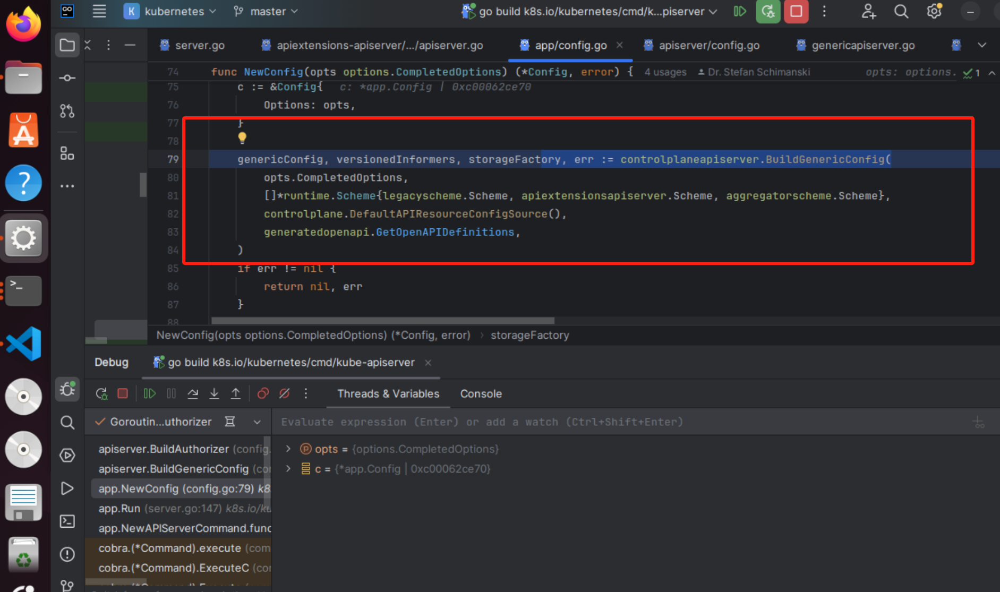
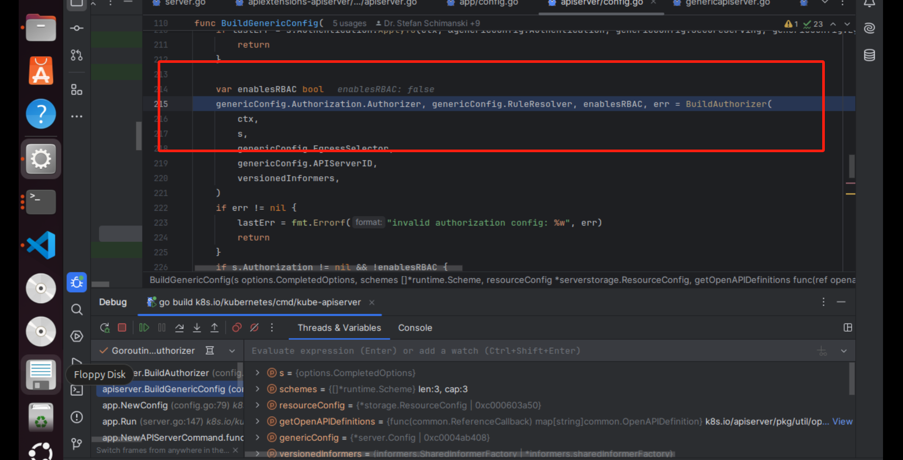

# 5.8 鉴权

## 引言

kube-apiserver 中与权限相关的主要有三种机制，即认证、鉴权和准入控制。上节讲到认证流程。

认证与鉴权很容易混淆：

* 认证(Authentication), 负责检查你是谁，识别 user
* 鉴权(Authorization), 你能做什么，是否允许 User 对资源的操作

k8s一共支持6种鉴权，需要在APIServer启动时以参数`--authorization-mode`的形式指定，多种策略同时指定时使用 ' , ' 号连接，默认启用了Node授权和RBAC授权模块：`kube-apiserver --authorization-mode=Node,RBAC`

```go
const (
	// ModeAlwaysAllow is the mode to set all requests as authorized
	ModeAlwaysAllow string = "AlwaysAllow"
	// ModeAlwaysDeny is the mode to set no requests as authorized
	ModeAlwaysDeny string = "AlwaysDeny"
	// ModeABAC is the mode to use Attribute Based Access Control to authorize
	ModeABAC string = "ABAC"
	// ModeWebhook is the mode to make an external webhook call to authorize
	ModeWebhook string = "Webhook"
	// ModeRBAC is the mode to use Role Based Access Control to authorize
	ModeRBAC string = "RBAC"
	// ModeNode is an authorization mode that authorizes API requests made by kubelets.
	ModeNode string = "Node"
)
```

## 使用的请求属性[ ](https://kubernetes.io/zh-cn/docs/reference/access-authn-authz/authorization/#%E9%89%B4%E6%9D%83%E4%B8%AD%E4%BD%BF%E7%94%A8%E7%9A%84%E8%AF%B7%E6%B1%82%E5%B1%9E%E6%80%A7) <a href="#jian-quan-zhong-shi-yong-de-qing-qiu-shu-xing" id="jian-quan-zhong-shi-yong-de-qing-qiu-shu-xing"></a>

* **用户** —— 身份验证期间提供的 `user` 字符串。
* **组** —— 经过身份验证的用户所属的组名列表。
* **额外信息** —— 由身份验证层提供的任意字符串键到字符串值的映射。
* **API** —— 指示请求是否针对 API 资源。
* **请求路径** —— 各种非资源端点的路径，如 `/api` 或 `/healthz`。
* **API 请求动词** —— API 动词 `get`、`list`、`create`、`update`、`patch`、`watch`、 `proxy`、`redirect`、`delete` 和 `deletecollection` 用于资源请求。 要确定资源 API 端点的请求动词，请参阅[请求动词和鉴权](https://kubernetes.io/zh-cn/docs/reference/access-authn-authz/authorization/#determine-the-request-verb)。
* **HTTP 请求动词** —— HTTP 动词 `get`、`post`、`put` 和 `delete` 用于非资源请求。
* **资源** —— 正在访问的资源的 ID 或名称（仅限资源请求）- 对于使用 `get`、`update`、`patch` 和 `delete` 动词的资源请求，你必须提供资源名称。
* **子资源** —— 正在访问的子资源（仅限资源请求）。
* **名字空间** —— 正在访问的对象的名称空间（仅适用于名字空间资源请求）。
* **API 组** —— 正在访问的 [API 组](https://kubernetes.io/zh-cn/docs/concepts/overview/kubernetes-api/#api-groups-and-versioning) （仅限资源请求）。空字符串表示[核心 API 组](https://kubernetes.io/zh-cn/docs/reference/using-api/#api-groups)。


## 源码分析

### 加载流程

鉴权相关代码从中`DefaultBuildHandlerChain`函数开始执行，和认证类似:

```go
// // k8s.io/apiserver/pkg/server/config.go
func DefaultBuildHandlerChain(apiHandler http.Handler, c *Config) http.Handler {
    handler := apiHandler

   
    handler = genericapifilters.WithAuthorization(handler, c.Authorization.Authorizer, c.Serializer)

    handler = genericapifilters.WithAuthentication(handler, c.Authentication.Authenticator, failedHandler, c.Authentication.APIAudiences, c.Authentication.RequestHeaderConfig)
    handler = filterlatency.TrackStarted(handler, c.TracerProvider, "authentication")

    handler = genericfilters.WithCORS(handler, c.CorsAllowedOriginList, nil, nil, nil, "true")
    
    
    // 省略...
    
    
    handler = genericapifilters.WithAuditInit(handler)
    return handler
}
```

`WithAuthentization`调用`Authorize`进行鉴权：

```go
// staging/src/k8s.io/apiserver/pkg/endpoints/filters/authorization.go
func withAuthorization(handler http.Handler, a authorizer.Authorizer, s runtime.NegotiatedSerializer, metrics recordAuthorizationMetricsFunc) http.Handler {
    if a == nil {
       klog.Warning("Authorization is disabled")
       return handler
    }
    return http.HandlerFunc(func(w http.ResponseWriter, req *http.Request) {
       ctx := req.Context()
       authorizationStart := time.Now()

       attributes, err := GetAuthorizerAttributes(ctx)
       if err != nil {
          responsewriters.InternalError(w, req, err)
          return
       }
       authorized, reason, err := a.Authorize(ctx, attributes)

       authorizationFinish := time.Now()
       defer func() {
          metrics(ctx, authorized, err, authorizationStart, authorizationFinish)
       }()

       // an authorizer like RBAC could encounter evaluation errors and still allow the request, so authorizer decision is checked before error here.
       if authorized == authorizer.DecisionAllow {
          audit.AddAuditAnnotations(ctx,
             decisionAnnotationKey, decisionAllow,
             reasonAnnotationKey, reason)
          handler.ServeHTTP(w, req)
          return
       }
       if err != nil {
          audit.AddAuditAnnotation(ctx, reasonAnnotationKey, reasonError)
          responsewriters.InternalError(w, req, err)
          return
       }

       klog.V(4).InfoS("Forbidden", "URI", req.RequestURI, "reason", reason)
       audit.AddAuditAnnotations(ctx,
          decisionAnnotationKey, decisionForbid,
          reasonAnnotationKey, reason)
       responsewriters.Forbidden(ctx, attributes, w, req, reason, s)
    })
}
```

配置初始化：

<figure><figcaption></figcaption></figure>

<figure><figcaption></figcaption></figure>

<figure><figcaption></figcaption></figure>

```go
// pkg/kubeapiserver/authorizer/config.go
// New returns the right sort of union of multiple authorizer.Authorizer objects
// based on the authorizationMode or an error.
// stopCh is used to shut down config reload goroutines when the server is shutting down.
//
// Note: the cel compiler construction depends on feature gates and the compatibility version to be initialized.
func (config Config) New(ctx context.Context, serverID string) (authorizer.Authorizer, authorizer.RuleResolver, error) {
    if len(config.AuthorizationConfiguration.Authorizers) == 0 {
       return nil, nil, fmt.Errorf("at least one authorization mode must be passed")
    }

    r := &reloadableAuthorizerResolver{
       initialConfig:    config,
       apiServerID:      serverID,
       lastLoadedConfig: config.AuthorizationConfiguration,
       reloadInterval:   time.Minute,
       compiler:         authorizationcel.NewDefaultCompiler(),
    }

    seenTypes := sets.New[authzconfig.AuthorizerType]()

    // Build and store authorizers which will persist across reloads
    for _, configuredAuthorizer := range config.AuthorizationConfiguration.Authorizers {
       seenTypes.Insert(configuredAuthorizer.Type)

       // Keep cases in sync with constant list in k8s.io/kubernetes/pkg/kubeapiserver/authorizer/modes/modes.go.
       switch configuredAuthorizer.Type {
       case authzconfig.AuthorizerType(modes.ModeNode):
          var slices resourceinformers.ResourceSliceInformer
          if utilfeature.DefaultFeatureGate.Enabled(features.DynamicResourceAllocation) {
             slices = config.VersionedInformerFactory.Resource().V1beta1().ResourceSlices()
          }
          node.RegisterMetrics()
          graph := node.NewGraph()
          node.AddGraphEventHandlers(
             graph,
             config.VersionedInformerFactory.Core().V1().Nodes(),
             config.VersionedInformerFactory.Core().V1().Pods(),
             config.VersionedInformerFactory.Core().V1().PersistentVolumes(),
             config.VersionedInformerFactory.Storage().V1().VolumeAttachments(),
             slices, // Nil check in AddGraphEventHandlers can be removed when always creating this.
          )
          r.nodeAuthorizer = node.NewAuthorizer(graph, nodeidentifier.NewDefaultNodeIdentifier(), bootstrappolicy.NodeRules())

       case authzconfig.AuthorizerType(modes.ModeABAC):
          var err error
          r.abacAuthorizer, err = abac.NewFromFile(config.PolicyFile)
          if err != nil {
             return nil, nil, err
          }
       case authzconfig.AuthorizerType(modes.ModeRBAC):
          r.rbacAuthorizer = rbac.New(
             &rbac.RoleGetter{Lister: config.VersionedInformerFactory.Rbac().V1().Roles().Lister()},
             &rbac.RoleBindingLister{Lister: config.VersionedInformerFactory.Rbac().V1().RoleBindings().Lister()},
             &rbac.ClusterRoleGetter{Lister: config.VersionedInformerFactory.Rbac().V1().ClusterRoles().Lister()},
             &rbac.ClusterRoleBindingLister{Lister: config.VersionedInformerFactory.Rbac().V1().ClusterRoleBindings().Lister()},
          )
       }
    }

    // Require all non-webhook authorizer types to remain specified in the file on reload
    seenTypes.Delete(authzconfig.TypeWebhook)
    r.requireNonWebhookTypes = seenTypes

    // Construct the authorizers / ruleResolvers for the given configuration
    authorizer, ruleResolver, err := r.newForConfig(r.initialConfig.AuthorizationConfiguration)
    if err != nil {
       return nil, nil, err
    }

    r.current.Store(&authorizerResolver{
       authorizer:   authorizer,
       ruleResolver: ruleResolver,
    })

    if r.initialConfig.ReloadFile != "" {
       go r.runReload(ctx)
    }

    return r, r, nil
}
```

### 接口方法

```go
// Authorizer makes an authorization decision based on information gained by making
// zero or more calls to methods of the Attributes interface.  It returns nil when an action is
// authorized, otherwise it returns an error.
type Authorizer interface {
	Authorize(a Attributes) (authorized Decision, reason string, err error)
}
type Decision int

const (
	// 拒绝
	DecisionDeny Decision = iota
	// 允许，则鉴权流程视为成功，请求顺利进入
	DecisionAllow
	// 无操作，进入下一个鉴权模块，相当于pass
	DecisionNoOpinion
)
```

所有的鉴权模块(鉴权器)都要实现这个`Authorize`方法,返回鉴权结果。

* Decision代表鉴权结果，有
  * 拒绝 DecisionDeny
  * 通过 DecisionAllow
  * 未表态 DecisionNoOpinion
* reason代表拒绝的原因

### 规则解析器

规则解析器可以根据认证之后所得到的用户信息，获取该用户对应的资源对象的操作权限。

```go
// RuleResolver provides a mechanism for resolving the list of rules that apply to a given user within a namespace.
type RuleResolver interface {
	// RulesFor get the list of cluster wide rules, the list of rules in the specific namespace, incomplete status and errors.
	RulesFor(ctx context.Context, user user.Info, namespace string) ([]ResourceRuleInfo, []NonResourceRuleInfo, bool, error)
}
```

以这里的返回值类型`ResourceRuleInfo`为例，默认的`DefaultResourceRuleInfo`结构体是这样的:

```go
// DefaultResourceRuleInfo holds information that describes a rule for the resource
type DefaultResourceRuleInfo struct {
	Verbs         []string
	APIGroups     []string
	Resources     []string
	ResourceNames []string
}
```

例如对pod资源的任意操作权限的描述可以描述为:

```
DefaultResourceRuleInfo{
	Verbs         []string{"*"}
	APIGroups     []string{"*"}
	Resources     []string{"pod"}
}
```

这个DefaultResourceRuleInfo对象描述的规则是，允许对所有api group 的pod资源进行的所有类型的操作，包括{"get", "list", "update", "patch","create", "delete", "watch", "deletecollection"}操作。


## RBAC

RBAC 授权器是目前使用最为广泛的授权模型，用户通过加入某些角色从而得到这些角色的操作权限，这极大地简化了权限管理。

<figure><figcaption></figcaption></figure>

<figure><figcaption></figcaption></figure>

在 kube-apiserver中的 RBAC 授权器中，新增了角色与集群绑定的概念。所以 kube-apiserver提供了4种对象来表达基于角色的授权，它们分别&#x662F;_**Role**、**ClusterRole**、**RoleBinding**_ 和 _**ClusterRoleBinding**_，这4种数据类型定义在vendor/k8s.io/api/rbac/v1/types.go中。

Role 角色是一组用户的集合，与规则相关联，Role 只能被赋予某一 namespace 的权限，即创建 Role 时必须指定Role 所属的 namespace。

下面是一个位于 "ns-a" 名字空间的 Role 的示例，可用来授予对 pods 的读访问权限：

```yaml
apiVersion: rbac.authorization.k8s.io/v1
kind: Role
metadata:
  namespace: ns-a  # 定义于 namespace 下
  name: pod-reader
rules:
- apiGroups: [""] 
  resources: ["pods"]
  verbs: ["get", "watch", "list"]
```

ClusterRole 集群角色也是一组用户的集合，与规则相关联，但ClusterRole被授予集群范围的权限，即不但能够作用于某个namespace下，还可以作用于cluster范围下。

下面是一个 ClusterRole 的示例，可用来为任一特定名字空间中的 Secret 授予读访问权限， 或者跨名字空间的访问权限（取决于该角色是如何绑定的）：

<pre class="language-yaml"><code class="lang-yaml"><strong>apiVersion: rbac.authorization.k8s.io/v1
</strong>kind: ClusterRole
metadata:
  # "namespace" 被忽略，因为 ClusterRoles 不受名字空间限制
  name: secret-reader
rules:
- apiGroups: [""]  # 资源组，"" 缺省为 core 组资源，其它诸如 apps 等
  # 在 HTTP 层面，用来访问 Secret 资源的名称为 "secrets"
  resources: ["secrets"]  # 资源，比如 pods、deployments、services、secrets 等
  verbs: ["get", "watch", "list"]  # 操作动词，如 get、list、watch、create、delete、update 等
</code></pre>

要启用 RBAC，在启动 [API 服务器](https://kubernetes.io/zh-cn/docs/concepts/architecture/#kube-apiserver)时将 `--authorization-config` 标志设置为包含 `RBAC` 授权者的文件； 例如：

```yaml
apiVersion: apiserver.config.k8s.io/v1
kind: AuthorizationConfiguration
authorizers:
  ...
  - type: RBAC
  ...
```

或者，启动 [API 服务器](https://kubernetes.io/zh-cn/docs/concepts/architecture/#kube-apiserver)时， 将 `--authorization-mode` 标志设置为包含 `RBAC` 的逗号分隔列表； 例如：

```shell
kube-apiserver --authorization-mode=...,RBAC --<其他选项> --<其他选项>
```

**代码实现**

```go
func (r *RBACAuthorizer) Authorize(requestAttributes authorizer.Attributes) (authorizer.Decision, string, error) {
	ruleCheckingVisitor := &authorizingVisitor{requestAttributes: requestAttributes}
  // 规则解析器解析请求的属性，返回鉴权结果，判断匹配用的是ruleCheckingVisitor.visit方法
	r.authorizationRuleResolver.VisitRulesFor(requestAttributes.GetUser(), requestAttributes.GetNamespace(), ruleCheckingVisitor.visit)
	if ruleCheckingVisitor.allowed {
		return authorizer.DecisionAllow, ruleCheckingVisitor.reason, nil
	}

	...

	reason := ""
	if len(ruleCheckingVisitor.errors) > 0 {
		reason = fmt.Sprintf("RBAC: %v", utilerrors.NewAggregate(ruleCheckingVisitor.errors))
	}
	return authorizer.DecisionNoOpinion, reason, nil
}
```

对比规则和请求属性，返回 true or false 的 visit 方法：

```go
func (v *authorizingVisitor) visit(source fmt.Stringer, rule *rbacv1.PolicyRule, err error) bool {
	if rule != nil && RuleAllows(v.requestAttributes, rule) {
    // 请求与规则匹配，则鉴权成功
		v.allowed = true
		v.reason = fmt.Sprintf("RBAC: allowed by %s", source.String())
    // 返回false是为了提前break鉴权过程
		return false
	}
	if err != nil {
		v.errors = append(v.errors, err)
	}
	return true
}
```

获取规则并调用visit方法的是`VisitRulesFor`接口方法，找一下`VisitRulesFor`方法:

```go
func (r *DefaultRuleResolver) VisitRulesFor(user user.Info, namespace string, visitor func(source fmt.Stringer, rule *rbacv1.PolicyRule, err error) bool) {
  // 先拿到所有的ClusterRoleBinding对象，ClusterRoleBinding资源是cluster级别的，不区分命名空间
	if clusterRoleBindings, err := r.clusterRoleBindingLister.ListClusterRoleBindings(); err != nil {
		if !visitor(nil, nil, err) {
			return
		}
	} else {
		sourceDescriber := &clusterRoleBindingDescriber{}
		for _, clusterRoleBinding := range clusterRoleBindings {
      // clusterRoleBinding.Subjects指定的绑定的用户对象，对比请求的所属用户，不匹配则continue
			subjectIndex, applies := appliesTo(user, clusterRoleBinding.Subjects, "")
			if !applies {
				continue
			}
			rules, err := r.GetRoleReferenceRules(clusterRoleBinding.RoleRef, "")
			if err != nil {
				if !visitor(nil, nil, err) {
					return
				}
				continue
			}
			sourceDescriber.binding = clusterRoleBinding
			sourceDescriber.subject = &clusterRoleBinding.Subjects[subjectIndex]
			for i := range rules {
        // visit方法返回false是代表鉴权成功了，提前break鉴权过程
				if !visitor(sourceDescriber, &rules[i], nil) {
					return
				}
			}
		}
	}
	
  // 如果指定了namespace，再取命名空间级别的roleBinding资源对象，重复一次上面的过程
	if len(namespace) > 0 {
		if roleBindings, err := r.roleBindingLister.ListRoleBindings(namespace); err != nil {
			if !visitor(nil, nil, err) {
				return
			}
		} else {
			sourceDescriber := &roleBindingDescriber{}
			for _, roleBinding := range roleBindings {
				subjectIndex, applies := appliesTo(user, roleBinding.Subjects, namespace)
				if !applies {
					continue
				}
				rules, err := r.GetRoleReferenceRules(roleBinding.RoleRef, namespace)
				if err != nil {
					if !visitor(nil, nil, err) {
						return
					}
					continue
				}
				sourceDescriber.binding = roleBinding
				sourceDescriber.subject = &roleBinding.Subjects[subjectIndex]
				for i := range rules {
					if !visitor(sourceDescriber, &rules[i], nil) {
						return
					}
				}
			}
		}
	}
}
```

**过程总结**


参考代码片中的注释，rbac鉴权过程如下:

* 1.取到所有的clusterRoleBinding/roleBindings资源对象，遍历它们对比请求用户
* 2.对比roleBindings/clusterRoleBinding指向的用户(主体)与请求用户，相同则选中，不相同continue
* 3.对比规则与请求属性，符合则提前结束鉴权

## Node鉴权器


上面有提过，node鉴权器是专为kubelet组件设计的，按照kubeadm集群的默认配置，它是排序在第一位的鉴权器，为什么把它放在后面再讲呢，因为node鉴权器本质上也是利用了rbac鉴权器，是通过为`system:node`这个内置用户授权来实现的，来看一下。

**默认Node规则生成**

```go
func NodeRules() []rbacv1.PolicyRule {
	nodePolicyRules := []rbacv1.PolicyRule{
		// Needed to check API access.  These creates are non-mutating
		rbacv1helpers.NewRule("create").Groups(authenticationGroup).Resources("tokenreviews").RuleOrDie(),
		rbacv1helpers.NewRule("create").Groups(authorizationGroup).Resources("subjectaccessreviews", "localsubjectaccessreviews").RuleOrDie(),

		// Needed to build serviceLister, to populate env vars for services
		rbacv1helpers.NewRule(Read...).Groups(legacyGroup).Resources("services").RuleOrDie(),

		// Nodes can register Node API objects and report status.
		// Use the NodeRestriction admission plugin to limit a node to creating/updating its own API object.
		rbacv1helpers.NewRule("create", "get", "list", "watch").Groups(legacyGroup).Resources("nodes").RuleOrDie(),
		rbacv1helpers.NewRule("update", "patch").Groups(legacyGroup).Resources("nodes/status").RuleOrDie(),
		rbacv1helpers.NewRule("update", "patch").Groups(legacyGroup).Resources("nodes").RuleOrDie(),

		// TODO: restrict to the bound node as creator in the NodeRestrictions admission plugin
		rbacv1helpers.NewRule("create", "update", "patch").Groups(legacyGroup).Resources("events").RuleOrDie(),

		// TODO: restrict to pods scheduled on the bound node once field selectors are supported by list/watch authorization
		rbacv1helpers.NewRule(Read...).Groups(legacyGroup).Resources("pods").RuleOrDie(),

		// Needed for the node to create/delete mirror pods.
		// Use the NodeRestriction admission plugin to limit a node to creating/deleting mirror pods bound to itself.
		rbacv1helpers.NewRule("create", "delete").Groups(legacyGroup).Resources("pods").RuleOrDie(),
		// Needed for the node to report status of pods it is running.
		// Use the NodeRestriction admission plugin to limit a node to updating status of pods bound to itself.
		rbacv1helpers.NewRule("update", "patch").Groups(legacyGroup).Resources("pods/status").RuleOrDie(),
		// Needed for the node to create pod evictions.
		// Use the NodeRestriction admission plugin to limit a node to creating evictions for pods bound to itself.
		rbacv1helpers.NewRule("create").Groups(legacyGroup).Resources("pods/eviction").RuleOrDie(),

		// Needed for imagepullsecrets, rbd/ceph and secret volumes, and secrets in envs
		// Needed for configmap volume and envs
		// Use the Node authorization mode to limit a node to get secrets/configmaps referenced by pods bound to itself.
		rbacv1helpers.NewRule("get", "list", "watch").Groups(legacyGroup).Resources("secrets", "configmaps").RuleOrDie(),
		// Needed for persistent volumes
		// Use the Node authorization mode to limit a node to get pv/pvc objects referenced by pods bound to itself.
		rbacv1helpers.NewRule("get").Groups(legacyGroup).Resources("persistentvolumeclaims", "persistentvolumes").RuleOrDie(),

		// TODO: add to the Node authorizer and restrict to endpoints referenced by pods or PVs bound to the node
		// Needed for glusterfs volumes
		rbacv1helpers.NewRule("get").Groups(legacyGroup).Resources("endpoints").RuleOrDie(),
		// Used to create a certificatesigningrequest for a node-specific client certificate, and watch
		// for it to be signed. This allows the kubelet to rotate it's own certificate.
		rbacv1helpers.NewRule("create", "get", "list", "watch").Groups(certificatesGroup).Resources("certificatesigningrequests").RuleOrDie(),
	}

	if utilfeature.DefaultFeatureGate.Enabled(features.ExpandPersistentVolumes) {
		// Use the Node authorization mode to limit a node to update status of pvc objects referenced by pods bound to itself.
		// Use the NodeRestriction admission plugin to limit a node to just update the status stanza.
		pvcStatusPolicyRule := rbacv1helpers.NewRule("get", "update", "patch").Groups(legacyGroup).Resources("persistentvolumeclaims/status").RuleOrDie()
		nodePolicyRules = append(nodePolicyRules, pvcStatusPolicyRule)
	}

	if utilfeature.DefaultFeatureGate.Enabled(features.TokenRequest) {
		// Use the Node authorization to limit a node to create tokens for service accounts running on that node
		// Use the NodeRestriction admission plugin to limit a node to create tokens bound to pods on that node
		tokenRequestRule := rbacv1helpers.NewRule("create").Groups(legacyGroup).Resources("serviceaccounts/token").RuleOrDie()
		nodePolicyRules = append(nodePolicyRules, tokenRequestRule)
	}

	// CSI
	if utilfeature.DefaultFeatureGate.Enabled(features.CSIPersistentVolume) {
		volAttachRule := rbacv1helpers.NewRule("get").Groups(storageGroup).Resources("volumeattachments").RuleOrDie()
		nodePolicyRules = append(nodePolicyRules, volAttachRule)
		if utilfeature.DefaultFeatureGate.Enabled(features.CSIDriverRegistry) {
			csiDriverRule := rbacv1helpers.NewRule("get", "watch", "list").Groups("storage.k8s.io").Resources("csidrivers").RuleOrDie()
			nodePolicyRules = append(nodePolicyRules, csiDriverRule)
		}
	}
	if utilfeature.DefaultFeatureGate.Enabled(features.KubeletPluginsWatcher) &&
		utilfeature.DefaultFeatureGate.Enabled(features.CSINodeInfo) {
		csiNodeInfoRule := rbacv1helpers.NewRule("get", "create", "update", "patch", "delete").Groups("storage.k8s.io").Resources("csinodes").RuleOrDie()
		nodePolicyRules = append(nodePolicyRules, csiNodeInfoRule)
	}

	// Node leases
	if utilfeature.DefaultFeatureGate.Enabled(features.NodeLease) {
		nodePolicyRules = append(nodePolicyRules, rbacv1helpers.NewRule("get", "create", "update", "patch", "delete").Groups("coordination.k8s.io").Resources("leases").RuleOrDie())
	}

	// RuntimeClass
	if utilfeature.DefaultFeatureGate.Enabled(features.RuntimeClass) {
		nodePolicyRules = append(nodePolicyRules, rbacv1helpers.NewRule("get", "list", "watch").Groups("node.k8s.io").Resources("runtimeclasses").RuleOrDie())
	}
	return nodePolicyRules
}
```

这里初始化了kubelet工作所需要的资源的权限，如(node/pod/cm/secret/pvc等)

**Authorize代码实现**

```go
func (r *NodeAuthorizer) Authorize(attrs authorizer.Attributes) (authorizer.Decision, string, error) {
  // 判断是不是node发起的请求(所属的group是不是system:node)
	nodeName, isNode := r.identifier.NodeIdentity(attrs.GetUser())
	if !isNode {
		// reject requests from non-nodes
		return authorizer.DecisionNoOpinion, "", nil
	}
	if len(nodeName) == 0 {
		// reject requests from unidentifiable nodes
		klog.V(2).Infof("NODE DENY: unknown node for user %q", attrs.GetUser().GetName())
		return authorizer.DecisionNoOpinion, fmt.Sprintf("unknown node for user %q", attrs.GetUser().GetName()), nil
	}

	// subdivide access to specific resources
	if attrs.IsResourceRequest() {
    // 根据请求属性(路径)获取资源类型，不同类型资源不同的方式处理
		requestResource := schema.GroupResource{Group: attrs.GetAPIGroup(), Resource: attrs.GetResource()}
		switch requestResource {
		case secretResource:
			return r.authorizeReadNamespacedObject(nodeName, secretVertexType, attrs)
		case configMapResource:
			return r.authorizeReadNamespacedObject(nodeName, configMapVertexType, attrs)
		case pvcResource:
			if r.features.Enabled(features.ExpandPersistentVolumes) {
				if attrs.GetSubresource() == "status" {
					return r.authorizeStatusUpdate(nodeName, pvcVertexType, attrs)
				}
			}
			return r.authorizeGet(nodeName, pvcVertexType, attrs)
		case pvResource:
			return r.authorizeGet(nodeName, pvVertexType, attrs)
		case vaResource:
			if r.features.Enabled(features.CSIPersistentVolume) {
				return r.authorizeGet(nodeName, vaVertexType, attrs)
			}
			return authorizer.DecisionNoOpinion, fmt.Sprintf("disabled by feature gate %s", features.CSIPersistentVolume), nil
		case svcAcctResource:
			if r.features.Enabled(features.TokenRequest) {
				return r.authorizeCreateToken(nodeName, serviceAccountVertexType, attrs)
			}
			return authorizer.DecisionNoOpinion, fmt.Sprintf("disabled by feature gate %s", features.TokenRequest), nil
		case leaseResource:
			if r.features.Enabled(features.NodeLease) {
				return r.authorizeLease(nodeName, attrs)
			}
			return authorizer.DecisionNoOpinion, fmt.Sprintf("disabled by feature gate %s", features.NodeLease), nil
		case csiNodeResource:
			if r.features.Enabled(features.KubeletPluginsWatcher) && r.features.Enabled(features.CSINodeInfo) {
				return r.authorizeCSINode(nodeName, attrs)
			}
			return authorizer.DecisionNoOpinion, fmt.Sprintf("disabled by feature gates %s and %s", features.KubeletPluginsWatcher, features.CSINodeInfo), nil
		}

	}

	// Access to other resources is not subdivided, so just evaluate against the statically defined node rules
	if rbac.RulesAllow(attrs, r.nodeRules...) {
		return authorizer.DecisionAllow, "", nil
	}
	return authorizer.DecisionNoOpinion, "", nil
}
```

## WebHook鉴权器


**简介**


与上一篇中的WebHook认证器类似，WebHook鉴权器也是依赖于集群外部的鉴权服务器，将鉴权请求POST发送给外部的鉴权服务器。

`Webhook` 模式需要一个 HTTP 配置文件，通过 `--authorization-webhook-config-file=SOME_FILENAME` 的参数声明。

配置文件的格式使用 [kubeconfig](https://kubernetes.io/zh/docs/tasks/access-application-cluster/configure-access-multiple-clusters/)。在文件中，"users" 代表着 API 服务器的 webhook，而 "cluster" 代表着远程服务。

使用 HTTPS 客户端认证的配置例子：

```go
# Kubernetes API 版本
apiVersion: v1
# API 对象种类
kind: Config
# clusters 代表远程服务。
clusters:
  - name: name-of-remote-authz-service
    cluster:
      # 对远程服务进行身份认证的 CA。
      certificate-authority: /path/to/ca.pem
      # 远程服务的查询 URL。必须使用 'https'。
      server: https://authz.example.com/authorize

# users 代表 API 服务器的 webhook 配置
users:
  - name: name-of-api-server
    user:
      client-certificate: /path/to/cert.pem # webhook plugin 使用 cert
      client-key: /path/to/key.pem          # cert 所对应的 key

# kubeconfig 文件必须有 context。需要提供一个给 API 服务器。
current-context: webhook
contexts:
- context:
    cluster: name-of-remote-authz-service
    user: name-of-api-server
  name: webhook
```

> 摘自官方文档[Webhook 模式](https://kubernetes.io/zh/docs/reference/access-authn-authz/webhook/)

**代码实现**


```go
func (w *WebhookAuthorizer) Authorize(attr authorizer.Attributes) (decision authorizer.Decision, reason string, err error) {
	r := &authorization.SubjectAccessReview{}
	if user := attr.GetUser(); user != nil {
		r.Spec = authorization.SubjectAccessReviewSpec{
			User:   user.GetName(),
			UID:    user.GetUID(),
			Groups: user.GetGroups(),
			Extra:  convertToSARExtra(user.GetExtra()),
		}
	}

	if attr.IsResourceRequest() {
		r.Spec.ResourceAttributes = &authorization.ResourceAttributes{
			Namespace:   attr.GetNamespace(),
			Verb:        attr.GetVerb(),
			Group:       attr.GetAPIGroup(),
			Version:     attr.GetAPIVersion(),
			Resource:    attr.GetResource(),
			Subresource: attr.GetSubresource(),
			Name:        attr.GetName(),
		}
	} else {
		r.Spec.NonResourceAttributes = &authorization.NonResourceAttributes{
			Path: attr.GetPath(),
			Verb: attr.GetVerb(),
		}
	}
  // 将请求的主体/资源/操作等字段放在一个json里
	key, err := json.Marshal(r.Spec)
	if err != nil {
		return w.decisionOnError, "", err
	}
  // 从本地的缓存里取，有则不发起远端post请求了
	if entry, ok := w.responseCache.Get(string(key)); ok {
		r.Status = entry.(authorization.SubjectAccessReviewStatus)
	} else {
		var (
			result *authorization.SubjectAccessReview
			err    error
		)
		webhook.WithExponentialBackoff(w.initialBackoff, func() error {
      // 缓存里没有，则发起post请求给远端鉴权服务器
			result, err = w.subjectAccessReview.Create(r)
			return err
		})
		if err != nil {
			// An error here indicates bad configuration or an outage. Log for debugging.
			klog.Errorf("Failed to make webhook authorizer request: %v", err)
			return w.decisionOnError, "", err
		}
		r.Status = result.Status
    // 长度不超过10000则缓存结果
		if shouldCache(attr) {
			if r.Status.Allowed {
				w.responseCache.Add(string(key), r.Status, w.authorizedTTL)
			} else {
				w.responseCache.Add(string(key), r.Status, w.unauthorizedTTL)
			}
		}
	}
	switch {
    // 根据远端鉴权服务器的响应状态，返回鉴权结果
	case r.Status.Denied && r.Status.Allowed:
		return authorizer.DecisionDeny, r.Status.Reason, fmt.Errorf("webhook subject access review returned both allow and deny response")
	case r.Status.Denied:
		return authorizer.DecisionDeny, r.Status.Reason, nil
	case r.Status.Allowed:
		return authorizer.DecisionAllow, r.Status.Reason, nil
	default:
		return authorizer.DecisionNoOpinion, r.Status.Reason, nil
	}

}
```

## 总结


鉴权的流程与认证的流程大体类似，但也有所不同，例如认证器链的执行顺序是无序的，而鉴权器链的执行顺序是有序的(按参数指定的顺序)。另外鉴权器的数量没有认证器那么多，因此相对容易理解一些。
