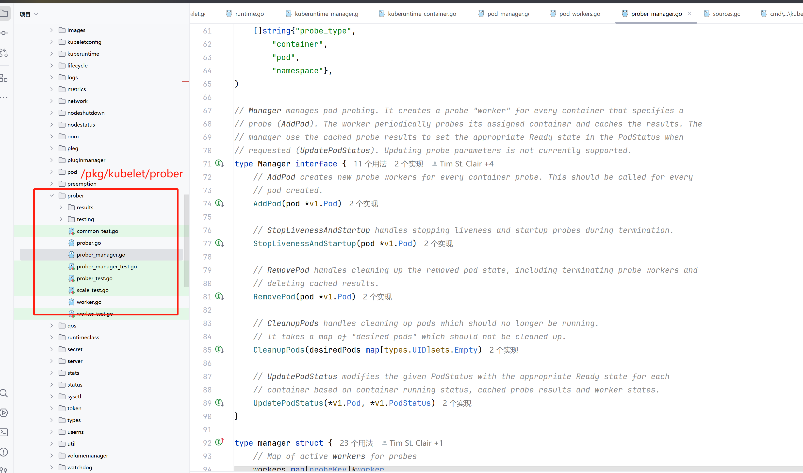

# 02-kubelet 探针

## 引言

k8s 如何知道一个 pod 的健康状态呢？就是通过今天要说的 Probe 也就是探针来检查 pod 的状态。一方面可以监控 pod 的健康状态，重启不健康的 pod；另一方面还可以监控 pod 的服务状态，当 pod 能提供服务时才会将流量打进来。

探针这个东西就和 request limit 一样，你不配置的话，绝大多数适合，使用起来也问题不大。甚至在一开始的时候我都没注意到这个配置，但是当你的服务非常注重 SLA(承诺服务可用性) 或者你的容器出现了异常，无法服务又没有正确退出的时候，这个配置就显得非常有用了。而在实际中，不合适的探针配置也可能会导致奇怪的问题。

## 探测类型 <a href="#types-of-probe" id="types-of-probe"></a>

针对运行中的容器，`kubelet` 可以选择是否执行以下三种探针，以及如何针对探测结果作出反应：

`livenessProbe`指示容器是否正在运行。如果存活态探测失败，则 kubelet 会杀死容器， 并且容器将根据其[重启策略](https://kubernetes.io/zh-cn/docs/concepts/workloads/pods/pod-lifecycle/#restart-policy)决定未来。如果容器不提供存活探针， 则默认状态为 `Success`。

`readinessProbe`指示容器是否准备好为请求提供服务。如果就绪态探测失败， 端点控制器将从与 Pod 匹配的所有服务的端点列表中删除该 Pod 的 IP 地址。 初始延迟之前的就绪态的状态值默认为 `Failure`。 如果容器不提供就绪态探针，则默认状态为 `Success`。

`startupProbe`指示容器中的应用是否已经启动。如果提供了启动探针，则所有其他探针都会被 禁用，直到此探针成功为止。如果启动探测失败，`kubelet` 将杀死容器， 而容器依其[重启策略](https://kubernetes.io/zh-cn/docs/concepts/workloads/pods/pod-lifecycle/#restart-policy)进行重启。 如果容器没有提供启动探测，则默认状态为 `Success`。

## 源码分析 <a href="#yuan-ma-fen-xi" id="yuan-ma-fen-xi"></a>

### 源码位置

这次当然是搜索 probe 或者你搜索具体 `livenessProbe` 也可以找到对应的定义和接口。

<figure><figcaption></figcaption></figure>

### prober\_manager.go

首先映入眼帘的就是 `prober_manager.go` 从命名就可以看出它是管理员，那先来看一下内部的定义

```go
// Manager manages pod probing. It creates a probe "worker" for every container that specifies a
// probe (AddPod). The worker periodically probes its assigned container and caches the results. The
// manager use the cached probe results to set the appropriate Ready state in the PodStatus when
// requested (UpdatePodStatus). Updating probe parameters is not currently supported.
type Manager interface {
    // AddPod creates new probe workers for every container probe. This should be called for every
    // pod created.
    AddPod(pod *v1.Pod)

    // StopLivenessAndStartup handles stopping liveness and startup probes during termination.
    StopLivenessAndStartup(pod *v1.Pod)

    // RemovePod handles cleaning up the removed pod state, including terminating probe workers and
    // deleting cached results.
    RemovePod(pod *v1.Pod)

    // CleanupPods handles cleaning up pods which should no longer be running.
    // It takes a map of "desired pods" which should not be cleaned up.
    CleanupPods(desiredPods map[types.UID]sets.Empty)

    // UpdatePodStatus modifies the given PodStatus with the appropriate Ready state for each
    // container based on container running status, cached probe results and worker states.
    UpdatePodStatus(*v1.Pod, *v1.PodStatus)
}

type manager struct {
    // Map of active workers for probes
    workers map[probeKey]*worker
    // Lock for accessing & mutating workers
    workerLock sync.RWMutex

    // The statusManager cache provides pod IP and container IDs for probing.
    statusManager status.Manager

    // readinessManager manages the results of readiness probes
    readinessManager results.Manager

    // livenessManager manages the results of liveness probes
    livenessManager results.Manager

    // startupManager manages the results of startup probes
    startupManager results.Manager

    // prober executes the probe actions.
    prober *prober

    start time.Time
}
```

\
`workers map[probeKey]*worker` 包含了所有 worker，然后一个锁，那既然这样，可以猜测 worker 就是最终干活的了。也应该是它来完成最终的 探针 工作。

看完结构，再看方法，manager 有两个很重要的方法用来添加或删除需要探测的pod：

* `func (m *manager) AddPod(pod *v1.Pod)`
* `func (m *manager) RemovePod(pod *v1.Pod)`\


下面的代码就是 `AddPod` 中遍历找到所有探针的配置，然后进行创建，可以看到，如果 `workers` map 中没有，那么就会新建一个 worker **并且开一个协程去跑这个 worker** 。

```go
func (m *manager) AddPod(pod *v1.Pod) {
    m.workerLock.Lock()
    defer m.workerLock.Unlock()

    key := probeKey{podUID: pod.UID}
    for _, c := range append(pod.Spec.Containers, getRestartableInitContainers(pod)...) {
       key.containerName = c.Name

       if c.StartupProbe != nil {
          key.probeType = startup
          if _, ok := m.workers[key]; ok {
             klog.V(8).ErrorS(nil, "Startup probe already exists for container",
                "pod", klog.KObj(pod), "containerName", c.Name)
             return
          }
          w := newWorker(m, startup, pod, c)
          m.workers[key] = w
          go w.run()
       }

       if c.ReadinessProbe != nil {
          key.probeType = readiness
          if _, ok := m.workers[key]; ok {
             klog.V(8).ErrorS(nil, "Readiness probe already exists for container",
                "pod", klog.KObj(pod), "containerName", c.Name)
             return
          }
          w := newWorker(m, readiness, pod, c)
          m.workers[key] = w
          go w.run()
       }

       if c.LivenessProbe != nil {
          key.probeType = liveness
          if _, ok := m.workers[key]; ok {
             klog.V(8).ErrorS(nil, "Liveness probe already exists for container",
                "pod", klog.KObj(pod), "containerName", c.Name)
             return
          }
          w := newWorker(m, liveness, pod, c)
          m.workers[key] = w
          go w.run()
       }
    }
}
```

那么只要知道谁调用了 `AddPod` 方法就能知道什么时候探针被启动了。我们发现调用的位置只有一个：`pkg/kubelet/kubelet.go:2014` 也就是：`func (kl *Kubelet) SyncPod` 方法中。

此时让我们回忆一下 kubelet 创建 pod 的时候的调用过程：

1.podWorkerLoop `pkg/kubelet/pod_workers.go:1214`

2.SyncPod `pkg/kubelet/pod_workers.go:1286`

3.Kubelet.SyncPod `pkg/kubelet/kubelet.go:1687`

4.kl.containerRuntime.SyncPod `pkg/kubelet/kubelet.go:2023`

5.startContainer `pkg/kubelet/kuberuntime/kuberuntime_container.go:1353`

\
没错就是第三步骤，而且注意是在第四步骤之前哦。

对于 pod 中每个 container ，调用  run 方法进行探活。

我们再来看看 w.run 方法的具体实现：

```go
// run periodically probes the container.
func (w *worker) run() {
    ctx := context.Background()
    probeTickerPeriod := time.Duration(w.spec.PeriodSeconds) * time.Second

    // If kubelet restarted the probes could be started in rapid succession.
    // Let the worker wait for a random portion of tickerPeriod before probing.
    // Do it only if the kubelet has started recently.
    if probeTickerPeriod > time.Since(w.probeManager.start) {
       time.Sleep(time.Duration(rand.Float64() * float64(probeTickerPeriod)))
    }

    probeTicker := time.NewTicker(probeTickerPeriod)

    defer func() {
       // Clean up.
       probeTicker.Stop()
       if !w.containerID.IsEmpty() {
          w.resultsManager.Remove(w.containerID)
       }

       w.probeManager.removeWorker(w.pod.UID, w.container.Name, w.probeType)
       ProberResults.Delete(w.proberResultsSuccessfulMetricLabels)
       ProberResults.Delete(w.proberResultsFailedMetricLabels)
       ProberResults.Delete(w.proberResultsUnknownMetricLabels)
       ProberDuration.Delete(w.proberDurationSuccessfulMetricLabels)
       ProberDuration.Delete(w.proberDurationUnknownMetricLabels)
    }()

probeLoop:
   // doProbe 比较重要
    for w.doProbe(ctx) {
       // Wait for next probe tick.
       select {
       case <-w.stopCh:
          break probeLoop
       case <-probeTicker.C:
          // continue
       case <-w.manualTriggerCh:
          // Updating the periodic timer to run the probe again at intervals of probeTickerPeriod
          // starting from the moment a manual run occurs.
          probeTicker.Reset(probeTickerPeriod)
          klog.V(4).InfoS("Triggerd Probe by manual run", "probeType", w.probeType, "pod", klog.KObj(w.pod), "podUID", w.pod.UID, "containerName", w.container.Name)
          // continue
       }
    }
}
```

函数 doProbe 负责执行单次容器探测并记录结果:

```go
// doProbe 执行单次容器探测并记录结果
// 返回值 keepGoing 表示是否继续执行探测
func (w *worker) doProbe(ctx context.Context) (keepGoing bool) {
    // 使用 defer 处理可能的 panic，确保探测工作可以继续
    defer func() { recover() }() 
    defer runtime.HandleCrash(func(_ interface{}) { keepGoing = true })

    startTime := time.Now()
    // 获取 Pod 状态
    status, ok := w.probeManager.statusManager.GetPodStatus(w.pod.UID)
    if !ok {
        // Pod 未创建或已删除
        klog.V(3).InfoS("No status for pod", "pod", klog.KObj(w.pod))
        return true
    }

    // 如果 Pod 已终止则停止工作
    if status.Phase == v1.PodFailed || status.Phase == v1.PodSucceeded {
        klog.V(3).InfoS("Pod is terminated, exiting probe worker",
            "pod", klog.KObj(w.pod), "phase", status.Phase)
        return false
    }

    // 获取容器状态，先检查普通容器，再检查 Init 容器
    c, ok := podutil.GetContainerStatus(status.ContainerStatuses, w.container.Name)
    if !ok || len(c.ContainerID) == 0 {
        c, ok = podutil.GetContainerStatus(status.InitContainerStatuses, w.container.Name)
        if !ok || len(c.ContainerID) == 0 {
            // 容器未创建或已删除
            klog.V(3).InfoS("Probe target container not found",
                "pod", klog.KObj(w.pod), "containerName", w.container.Name)
            return true // 等待更多信息
        }
    }

    // 处理容器 ID 变化（比如容器重启）
    if w.containerID.String() != c.ContainerID {
        if !w.containerID.IsEmpty() {
            w.resultsManager.Remove(w.containerID)
        }
        w.containerID = kubecontainer.ParseContainerID(c.ContainerID)
        w.resultsManager.Set(w.containerID, w.initialValue, w.pod)
        // 新容器，恢复探测
        w.onHold = false
    }

    // 如果探测被挂起，等待新容器
    if w.onHold {
        return true
    }

    // 处理非运行状态的容器
    if c.State.Running == nil {
        klog.V(3).InfoS("Non-running container probed",
            "pod", klog.KObj(w.pod), "containerName", w.container.Name)
        if !w.containerID.IsEmpty() {
            w.resultsManager.Set(w.containerID, results.Failure, w.pod)
        }
        // 如果容器不会重启则终止探测
        return c.State.Terminated == nil ||
            w.pod.Spec.RestartPolicy != v1.RestartPolicyNever
    }

    // Pod 优雅终止处理
    if w.pod.ObjectMeta.DeletionTimestamp != nil && (w.probeType == liveness || w.probeType == startup) {
        // ... 现有代码 ...
    }

    // 遵守初始延迟时间
    if int32(time.Since(c.State.Running.StartedAt.Time).Seconds()) < w.spec.InitialDelaySeconds {
        return true
    }

    // 处理容器启动状态和不同类型探针的执行时机
    if c.Started != nil && *c.Started {
        if w.probeType == startup {
            return true // 容器已启动，停止 startup 探测
        }
    } else {
        if w.probeType != startup {
            return true // 容器未启动，仅执行 startup 探测
        }
    }

    // 执行探测
    result, err := w.probeManager.prober.probe(ctx, w.probeType, w.pod, status, w.container, w.containerID)
    if err != nil {
        return true // 探测错误，忽略结果
    }

    // 更新 Prometheus 指标
    switch result {
    case results.Success:
        // ... 现有代码 ...
    }

    // 跟踪连续结果次数
    if w.lastResult == result {
        w.resultRun++
    } else {
        w.lastResult = result
        w.resultRun = 1
    }

    // 检查是否达到成功/失败阈值
    if (result == results.Failure && w.resultRun < int(w.spec.FailureThreshold)) ||
        (result == results.Success && w.resultRun < int(w.spec.SuccessThreshold)) {
        return true // 未达到阈值，保持状态不变
    }

    // 更新探测结果
    w.resultsManager.Set(w.containerID, result, w.pod)

    // 特殊处理 liveness 和 startup 探针失败
    if (w.probeType == liveness && result == results.Failure) || w.probeType == startup {
        // 暂停探测直到容器重启，避免在容器停止时执行探测导致状态损坏
        w.onHold = true
        w.resultRun = 0
    }

    return true
}


// probe 函数执行容器探测
// 参数说明：
// - ctx: 上下文
// - probeType: 探测类型（readiness/liveness/startup）
// - pod: 被探测的 Pod
// - status: Pod 当前状态
// - container: 被探测的容器
// - containerID: 容器 ID
// 返回探测结果和错误信息
func (pb *prober) probe(ctx context.Context, probeType probeType, pod *v1.Pod, status v1.PodStatus, container v1.Container, containerID kubecontainer.ContainerID) (results.Result, error) {
    // 根据探测类型获取对应的探测配置
    var probeSpec *v1.Probe
    switch probeType {
    case readiness:
        probeSpec = container.ReadinessProbe  // 就绪性探测
    case liveness:
        probeSpec = container.LivenessProbe   // 存活性探测
    case startup:
        probeSpec = container.StartupProbe    // 启动探测
    default:
        // 未知的探测类型，返回失败
        return results.Failure, fmt.Errorf("unknown probe type: %q", probeType)
    }

    // 如果没有配置探测，默认认为成功
    if probeSpec == nil {
        klog.InfoS("Probe is nil", "probeType", probeType, "pod", klog.KObj(pod), "podUID", pod.UID, "containerName", container.Name)
        return results.Success, nil
    }

    // 执行探测，最多重试 maxProbeRetries 次
    result, output, err := pb.runProbeWithRetries(ctx, probeType, probeSpec, pod, status, container, containerID, maxProbeRetries)

    // 处理探测错误
    if err != nil {
        // 记录错误日志
        klog.V(1).ErrorS(err, "Probe errored", "probeType", probeType, "pod", klog.KObj(pod), "podUID", pod.UID, "containerName", container.Name, "probeResult", result)
        // 记录容器事件
        pb.recordContainerEvent(pod, &container, v1.EventTypeWarning, events.ContainerUnhealthy, "%s probe errored and resulted in %s state: %s", probeType, result, err)
        return results.Failure, err
    }

    // 根据探测结果进行处理
    switch result {
    case probe.Success:
        // 探测成功
        klog.V(3).InfoS("Probe succeeded", "probeType", probeType, "pod", klog.KObj(pod), "podUID", pod.UID, "containerName", container.Name)
        return results.Success, nil

    case probe.Warning:
        // 探测成功但有警告
        // 记录警告事件
        pb.recordContainerEvent(pod, &container, v1.EventTypeWarning, events.ContainerProbeWarning, "%s probe warning: %s", probeType, output)
        klog.V(3).InfoS("Probe succeeded with a warning", "probeType", probeType, "pod", klog.KObj(pod), "podUID", pod.UID, "containerName", container.Name, "output", output)
        return results.Success, nil

    case probe.Failure:
        // 探测失败
        // 记录失败日志和事件
        klog.V(1).InfoS("Probe failed", "probeType", probeType, "pod", klog.KObj(pod), "podUID", pod.UID, "containerName", container.Name, "probeResult", result, "output", output)
        pb.recordContainerEvent(pod, &container, v1.EventTypeWarning, events.ContainerUnhealthy, "%s probe failed: %s", probeType, output)
        return results.Failure, nil

    case probe.Unknown:
        // 探测结果未知
        klog.V(1).InfoS("Probe unknown without error", "probeType", probeType, "pod", klog.KObj(pod), "podUID", pod.UID, "containerName", container.Name, "probeResult", result)
        return results.Failure, nil

    default:
        // 不支持的探测结果
        klog.V(1).InfoS("Unsupported probe result", "probeType", probeType, "pod", klog.KObj(pod), "podUID", pod.UID, "containerName", container.Name, "probeResult", result)
        return results.Failure, nil
    }
}


// runProbeWithRetries tries to probe the container in a finite loop, it returns the last result
// if it never succeeds.
func (pb *prober) runProbeWithRetries(ctx context.Context, probeType probeType, p *v1.Probe, pod *v1.Pod, status v1.PodStatus, container v1.Container, containerID kubecontainer.ContainerID, retries int) (probe.Result, string, error) {
	var err error
	var result probe.Result
	var output string
	for i := 0; i < retries; i++ {
		result, output, err = pb.runProbe(ctx, probeType, p, pod, status, container, containerID)
		if err == nil {
			return result, output, nil
		}
	}
	return result, output, err
}

```

最终我们会调用 runProbe 方法根据具体不同的探针类型去执行不同的探针方法：

* Exec 探测：在容器内执行命令
* HTTP GET 探测：发送 HTTP 请求检查服务
* TCP Socket 探测：检查端口是否可连接
* gRPC 探测：检查 gRPC 服务状态

```go
func (pb *prober) runProbe(ctx context.Context, probeType probeType, p *v1.Probe, pod *v1.Pod, status v1.PodStatus, container v1.Container, containerID kubecontainer.ContainerID) (probe.Result, string, error) {
	timeout := time.Duration(p.TimeoutSeconds) * time.Second
	switch {
	case p.Exec != nil:
		klog.V(4).InfoS("Exec-Probe runProbe", "pod", klog.KObj(pod), "containerName", container.Name, "execCommand", p.Exec.Command)
		command := kubecontainer.ExpandContainerCommandOnlyStatic(p.Exec.Command, container.Env)
		return pb.exec.Probe(pb.newExecInContainer(ctx, container, containerID, command, timeout))

	case p.HTTPGet != nil:
		req, err := httpprobe.NewRequestForHTTPGetAction(p.HTTPGet, &container, status.PodIP, "probe")
		if err != nil {
			// Log and record event for Unknown result
			klog.V(4).InfoS("HTTP-Probe failed to create request", "error", err)
			return probe.Unknown, "", err
		}
		if klogV4 := klog.V(4); klogV4.Enabled() {
			port := req.URL.Port()
			host := req.URL.Hostname()
			path := req.URL.Path
			scheme := req.URL.Scheme
			headers := p.HTTPGet.HTTPHeaders
			klogV4.InfoS("HTTP-Probe", "scheme", scheme, "host", host, "port", port, "path", path, "timeout", timeout, "headers", headers, "probeType", probeType)
		}
		return pb.http.Probe(req, timeout)

	case p.TCPSocket != nil:
		port, err := probe.ResolveContainerPort(p.TCPSocket.Port, &container)
		if err != nil {
			klog.V(4).InfoS("TCP-Probe failed to resolve port", "error", err)
			return probe.Unknown, "", err
		}
		host := p.TCPSocket.Host
		if host == "" {
			host = status.PodIP
		}
		klog.V(4).InfoS("TCP-Probe", "host", host, "port", port, "timeout", timeout)
		return pb.tcp.Probe(host, port, timeout)

	case p.GRPC != nil:
		host := status.PodIP
		service := ""
		if p.GRPC.Service != nil {
			service = *p.GRPC.Service
		}
		klog.V(4).InfoS("GRPC-Probe", "host", host, "service", service, "port", p.GRPC.Port, "timeout", timeout)
		return pb.grpc.Probe(host, service, int(p.GRPC.Port), timeout)

	default:
		klog.V(4).InfoS("Failed to find probe builder for container", "containerName", container.Name)
		return probe.Unknown, "", fmt.Errorf("missing probe handler for %s:%s", format.Pod(pod), container.Name)
	}
}
```
