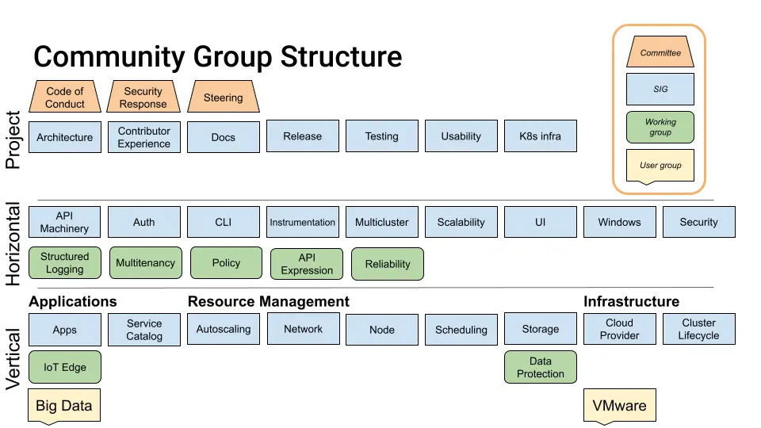

# 07-kubelet nodestatus

k8s是一个管理容器的系统，而kubelet是每个工作节点（Node）上的“小管家”。它的主要任务是管理节点上的Pod（你可以把Pod理解为一个或多个容器的组合），包括创建、删除Pod，以及检查它们是否健康。同时，kubelet还会定期向Kubernetes的控制中心（kube-apiserver）汇报节点的状态，比如节点是否正常运行、资源使用情况等。

控制中心的其他组件会根据kubelet上报的信息做出相应的决策。比如：

* **kube-controller-manager**：它会根据节点的状态决定是否给节点打上“污点”（Taint），或者把节点上的Pod赶走（驱逐）。污点可以阻止新的Pod被调度到这个节点上。
* **kube-scheduler**：它会根据节点的状态来决定把新的Pod调度到哪个节点上运行。

所以，节点的状态对整个Kubernetes集群非常重要。这篇文章会通过分析kubelet和kube-controller-manager的代码，来讲解节点的状态是如何变化的，以及节点上的Pod是如何随着节点状态的变化而变化的。

（注：本文源码基于 1.33 版本）

下图是 kubelet 上报状态的一个示意图。

<figure><figcaption></figcaption></figure>

从图中，我们可以看到 kubelet 有两条路径上报 node 的状态：

* 状态同步：sync node status loop （橙色圆圈）
* 续期租约：renew lease （绿色圆圈）

代码如下：

```go
// Run starts the kubelet reacting to config updates
func (kl *Kubelet) Run(updates <-chan kubetypes.PodUpdate) {


    if kl.kubeClient != nil {
       // Start two go-routines to update the status.
       // 开启两个携程来同步状态，携程1定期向 apiserver来同步状态，携程2在kubelet启动时候同步一次后退出
       //
       // The first will report to the apiserver every nodeStatusUpdateFrequency and is aimed to provide regular status intervals,
       // while the second is used to provide a more timely status update during initialization and runs an one-shot update to the apiserver
       // once the node becomes ready, then exits afterwards.
       //
       // Introduce some small jittering to ensure that over time the requests won't start
       // accumulating at approximately the same time from the set of nodes due to priority and
       // fairness effect.
       
       // *****************************状态同步************************************
       // 携程1
       go func() {
          // Call updateRuntimeUp once before syncNodeStatus to make sure kubelet had already checked runtime state
          // otherwise when restart kubelet, syncNodeStatus will report node notReady in first report period
          kl.updateRuntimeUp()

          wait.JitterUntil(kl.syncNodeStatus, kl.nodeStatusUpdateFrequency, 0.04, true, wait.NeverStop)
       }()
       // 携程2，加速启动
       go kl.fastStatusUpdateOnce()

       // start syncing lease
       // *****************************续期租约************************************
       go kl.nodeLeaseController.Run(context.Background())

       // Mirror pods for static pods may not be created immediately during node startup
       // due to node registration or informer sync delays. They will be created eventually
       //  when static pods are resynced (every 1-1.5 minutes).
       // To ensure kube-scheduler is aware of static pod resource usage faster,
       // mirror pods are created as soon as the node registers.
       // 补充携程，注册静态pod，节点启动期间可能不会立即创建静态 Pod 的镜像 Pod，因为节点未注册或者节点通知器未同步。
       // 当静态 pod 重新同步时（每 1-1.5 分钟），它们最终会被创建。然而，在这 1-1.5 分钟的延迟期间，kube-scheduler 可能会过度使用资源
       // 到节点并最终导致 kubelet 拒绝,为了确保 kube-scheduler 能够更快地了解静态 pod 资源的使用情况，节点注册后立即创建镜像容器。
       go kl.fastStaticPodsRegistration(ctx)
    }
    
    kl.syncLoop(ctx, updates, kl)
}
```


## 状态同步

kubelet 启动时会启动2个协程

* syncNodeStatus: 会定期同步节点状态到 kube-apiserver
* fastStatusUpdateOnce)：在kubelet启动时执行一次，用来加速启动。如何加速启动可以参考 [https://github.com/kubernetes/kubernetes/pull/112618](https://github.com/kubernetes/kubernetes/pull/112618)

### syncNodeStatus

10s 检查一次，如果5分钟内节点状态没有变化不上报，有变化立马上报

```go
// syncNodeStatus should be called periodically from a goroutine.
// It synchronizes node status to master if there is any change or enough time
// passed from the last sync, registering the kubelet first if necessary.
func (kl *Kubelet) syncNodeStatus() {
    kl.syncNodeStatusMux.Lock()
    defer kl.syncNodeStatusMux.Unlock()
    ctx := context.Background()

    if kl.kubeClient == nil || kl.heartbeatClient == nil {
       return
    }
    if kl.registerNode {
       // This will exit immediately if it doesn't need to do anything.
       kl.registerWithAPIServer()
    }
    if err := kl.updateNodeStatus(ctx); err != nil {
       klog.ErrorS(err, "Unable to update node status")
    }
}
// updateNodeStatus updates node status to master with retries if there is any
// change or enough time passed from the last sync.
func (kl *Kubelet) updateNodeStatus(ctx context.Context) error {
	klog.V(5).InfoS("Updating node status")
	for i := 0; i < nodeStatusUpdateRetry; i++ {
		if err := kl.tryUpdateNodeStatus(ctx, i); err != nil {
			if i > 0 && kl.onRepeatedHeartbeatFailure != nil {
				kl.onRepeatedHeartbeatFailure()
			}
			klog.ErrorS(err, "Error updating node status, will retry")
		} else {
			return nil
		}
	}
	return fmt.Errorf("update node status exceeds retry count")
}


// tryUpdateNodeStatus 尝试将节点状态更新到 master
// 当节点状态发生变化或距离上次同步时间超过阈值时会进行更新
func (kl *Kubelet) tryUpdateNodeStatus(ctx context.Context, tryNumber int) error {
    // 在大规模集群中,这里的 Node 对象的 GET 和 PUT 操作
    // 是 apiserver 和 etcd 负载的主要来源
    // 为了减轻控制平面的负载:
    // - 第一次尝试时从本地 lister 获取数据(可能有轻微延迟但冲突很少)
    // - 如果发生冲突,后续重试直接从 etcd 获取数据
    var originalNode *v1.Node
    var err error

    if tryNumber == 0 {
        // 第一次尝试 - 从本地 lister 获取节点信息
        originalNode, err = kl.nodeLister.Get(string(kl.nodeName))
    } else {
        // 重试 - 直接从 API Server 获取节点信息
        opts := metav1.GetOptions{}
        originalNode, err = kl.heartbeatClient.CoreV1().Nodes().Get(ctx, string(kl.nodeName), opts)
    }
    if err != nil {
        return fmt.Errorf("error getting node %q: %v", kl.nodeName, err)
    }
    if originalNode == nil {
        return fmt.Errorf("nil %q node object", kl.nodeName)
    }

    // 更新节点状态,返回更新后的节点对象和是否发生变化
    node, changed := kl.updateNode(ctx, originalNode)
    
    // 判断是否需要更新节点状态:
    // 1. 节点状态发生变化 或
    // 2. 距离上次报告时间超过了设定的时长（5min）
    shouldPatchNodeStatus := changed || kl.clock.Since(kl.lastStatusReportTime) >= kl.nodeStatusReportFrequency

    if !shouldPatchNodeStatus {
        // 不需要更新状态时,仅标记卷的使用情况
        kl.markVolumesFromNode(node)
        return nil
    }

    // 需要更新状态时,通过 patch 操作更新节点状态
    updatedNode, err := kl.patchNodeStatus(originalNode, node)
    if err == nil {
        // 更新成功后,标记更新后节点的卷使用情况
        kl.markVolumesFromNode(updatedNode)
    }
    return err
}

```


## 租约续约&#x20;

### kubelet&#x20;

kubelet 会在启动时，开启一个协程，调用 kube-apiserver 接口获取 kube-node-lease 命名空间下的本节点租约信息，如果未获取到，则创建租约；如果可以获取到租约，则尝试定期去续期租约，这个协程会以 renewInterval 的周期去续期租约。renewInterval  在初始化的时候被设置为了租约有效期的 0.25 倍，而租约有效期 NodeLeaseDurationSeconds 默认值是 40s，所以 renewInterval 为 10s。这个可以保证正常情况下，租约在过期前有足够的时间被续期。

```go
// pkg/kubelet/kubelet.go
// Run starts the kubelet reacting to config updates
func (kl *Kubelet) Run(updates <-chan kubetypes.PodUpdate) {
       //续期租约
       go kl.nodeLeaseController.Run(context.Background())
}

// staging/src/k8s.io/component-helpers/apimachinery/lease/controller.go
// Run runs the controller
func (c *controller) Run(ctx context.Context) {
	if c.leaseClient == nil {
		klog.FromContext(ctx).Info("lease controller has nil lease client, will not claim or renew leases")
		return
	}
	wait.JitterUntilWithContext(ctx, c.sync, c.renewInterval, 0.04, true)
}       
```

### nodelifecycle&#x20;

我们再看看 kube-controler-mgr 中的 nodelifecycyle 控制器是如何处理租约的。

如果租约过期，说明 kubelet 所在的节点因为某些原因无法上报，控制器将节点状态设置为 Unknow，并驱逐该节点上的 pod。

```go
// pkg/controller/nodelifecycle/node_lifecycle_controller.go:830
// tryUpdateNodeHealth checks a given node's conditions and tries to update it. Returns grace period to
// which given node is entitled, state of current and last observed Ready Condition, and an error if it occurred.
func (nc *Controller) tryUpdateNodeHealth(ctx context.Context, node *v1.Node) (time.Duration, v1.NodeCondition, *v1.NodeCondition, error) {
  
// nodeHealth.probeTimestamp 为上次租约续期时间，
// 如果当前时间戳 > 上次续约时间戳 + gracePeriod
// 那么认为租约已经过期，也即 kubelet 没有及时续约
// kube-controler-mgr 会把节点状态设置为 Unknown，然后再其他协程中会给节点打污点，驱逐节点上的 pod。
// 上述的 gracePeriod 有两种情况：
// kubelet刚刚启动时设置为 nodeStartupGracePeriod （60s）
// kubelet启动后设置为 nodeMonitorGracePeriod (50s)
	if nc.now().After(nodeHealth.probeTimestamp.Add(gracePeriod)) {
		// NodeReady condition or lease was last set longer ago than gracePeriod, so
		// update it to Unknown (regardless of its current value) in the master.
		node.Status.Conditions = append(node.Status.Conditions, v1.NodeCondition{
			Type:               nodeConditionType,
			Status:             v1.ConditionUnknown,
			Reason:             "NodeStatusNeverUpdated",
			Message:            "Kubelet never posted node status.",
			LastHeartbeatTime:  node.CreationTimestamp,
			LastTransitionTime: nowTimestamp,
		})
}
```


