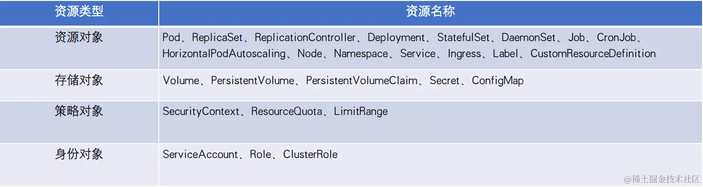

# 5.1 k8s核心数据结构分析


## apiserver 
<figure><figcaption></figcaption></figure>

## 概述

理解 Kubernetes 核心数据结构，在阅读源码时可以事半功倍并能够深刻理解 Kubernetes 核心设计。在整个 Kubernetes 体系架构中，资源是 Kubernetes 最重要的概念，可以说 Kubernetes 的生态系统都围绕着资源运作。Kubernetes 系统虽然有相当复杂和众多的功能，但它本质上是一个资源控制系统——注册、管理、调度资源并维护资源的状态。

###### 在 Kubernetes 庞大而复杂的系统中，只有资源是远远不够的，Kubernetes 将资源再次分组和版本化，形成 Group（资源组）、Version（资源版本）、Resource（资源）。在 Kubernetes API Server 中它们又称为 APIGroup、APIVersion、APIResource。此外还有 Kind（资源种类），描述 Resource 的种类，与 Resource 为同一级别。

<figure><figcaption></figcaption></figure>


### 组
k8s系统支持多个 Group，每个 Group 支持多个 Version，每个 Version 支持多个 Resource，其中部分资源同时会拥有自己的子资源 SubResource。一个资源对象的表现形式为：

<group>/<version>, Kind=<kind>

例如 apps/v1，Kind=Deployment

k8s 早期是没有组的概念，是 1.1 版本引入的，那么 k8s 为什么要在版本的基础上增加组呢？ 主要是支持不同资源组能够以不同的速度发展，方便迭代。

### 资源操作

对每个资源都可以进行一系列操作即 Verbs，Verbs 对 Etcd 集群存储中的资源对象做增、删、改、查等操作。k8s资源分为两种：Kubernetes Resource 内置资源和Custom Resource 自定义资源，自定义资源可以通过CRD实现。

### 版本演进

在Kubernetes开发中，我们经常可以看到不同的版本如：`alpha`, `beta`, `stable` 。那么这些不同的版本有什么区别呢？

我在 https://github.com/kubernetes/community/blob/master/contributors/devel/sig-architecture/api_changes.md#alpha-beta-and-stable-versions 这里找到了答案，以下是此部分翻译内容：

新功能的开发经历了以下一系列的状态，不断发展成熟：

### Development Level 开发级别

-   对象版本：没有规定
-   可用性：不会提交到主要的kubernetes仓库，因此在官方的正式发布版本中并不可用
-   用户：其他在此功能和概念上有紧密合作的开发者（比如client的开发者）
-   可升级性，可靠性，完整性，和支持：没有要求和保证

### Alpha Level

-   对象版本：包含`alpha` 的API版本命名（比如：`v1alpha1`）
-   可用性：提交到了主要 kubernetest 仓库； 出现在正式的发布版本中； 功能是默认出于非启用状态，但是可以通过 flag 启用
-   用户：开发者以及一些希望对早期功能给出反馈的专家用户
-   完整性：一部分API操作，CLI命令，以及UI支持也许还未实现； API还未经过 API审查（即，在一般的代码审查的基础上，对API进行深入的，有针对性的审查）
-   可升级性：

    -   API对象模式和语义可能在未来的版本中变更，无需在现有的集群中保留该对象；
    -   移除可升级性的担忧可以方便开发者快速的进行开发；特别的，API版本可以比miner release（次要发布）更快节奏的增加，并且开发者不需要维护多个版本；
    -   当API对象的模式和语义以不兼容的方式变更时，开发人员需要增加API版本
-   集群可靠性：由于功能相对较新，所以可能缺乏完全的e2e测试，通过flag的方式启用功能可能会暴露一些集群不稳定的bug（比如，一个在控制循环（control loop）的中的bug可能造成迅速创建过多的对象，导致API存储资源耗尽）
-   支持：并不保证一定会完成改功能，该功能可能会在未来的版本中完全被弃用
-   建议的使用场景：因为其可升级性问题，以及缺乏长期支持的问题，该版本API只建议临时的测试集群使用

### Beta Level

-   对象版本：包含 `beta` 的API版本命名(比如：`v1beta1`)
-   可用性：官方发布版本中存在，默认开启
-   用户：对于提供反馈感兴趣的用户
-   完整性：所有的API操作，CLI命令以及UI支持都应该实现了；具有完整的e2e测试；API已经过API审查并通过，虽然beta期间使用经常会冒出API审查没有考虑到的问题
-   可升级性：

    -   对象的结构和语义可能会在未来的版本中变更；变更发生时，升级路线将会被记录；
    -   在一些情况下，对象会被自动的转化为新的版本；而在另一些情况下，可能需要人工升级；
    -   人工升级可能要求依赖新功能的部分下线，并要求手动将对象转为新版本；
    -   人工转化时，需要提供文档记录转化过程；
-   集群可靠性：因为该功能目前具有e2e测试，所以通过flag启用功能，并不会造成其他不想关功能的bug；但是由于是一个新功能，所以可能会有一些次级bug
-   支持：项目承诺会完成这个功能，一般在接下来的一个稳定版本中；一般会在3个月之内完成，有时可能会更久；发布的版本应该至少在一个次级发布周期中，同时支持两个练习的版本（比如 `v1beta1`和`v1bata2`, 或 `v1beta2`和`v1`），这样用户可以有足够的时间来升级
-   建议的使用场景：临时的测试环境；也可以短暂的部署在生产环境以获取用户反馈

### Stable Level

-   对象版本：格式为 `vX`, 其中`X`是整数（比如：`v1`） 的API版本命名
-   可用性：官方发布版本中存在，默认开启
-   用户：所有用
-   完整性：必须在释放的一致性配置文件中，进行SIG架构批准的一致性测试（比如：不可移植或 可选功能，可能不再默认的配置中）
-   可升级性：只有具有严格兼容性的变更才允许在接下来的发布版本中加入
-   集群可靠性：高
-   支持：该API版本竟在接下来的很多发布版本中存在
-   建议的使用场景：任何场景

### 内部版本和外部版本

每个资源至少有两个版本，External Version 外部版本用于对外暴露给用户请求的接口所使用的资源对象。Internal Version 内部版本不对外暴露，仅在 Kubernetes API Server 内部使用。

例如，Deployment 资源，它所属的外部版本表现形式为 apps/v1，内部版本表现形式为
- External Object：外部版本资源对象，也称为 Versioned Object（即拥有资源版本的资源对象）。外部版本用于对外暴露给用户请求的接口所使用的资源对象，例如，用户在通过 YAML 或 JSON 格式的描述文件创建资源对象时，所使用的时外部版本的资源对象。外部版本的资源对象通过资源版本（Alpha、Beta、Stable）进行标识。
- Internal Object：内部版本资源对象。内部版本不对外暴露，仅在 Kubernetes API Server 内部使用。内部版本用于多资源版本的转换，例如将 v1beta1 版本转换为 v1 版本，其过程为 v1beta1 -> internal -> v1，即先将 v1beta1 转换为内部版本，再转换为 v1 版本。内部版本资源对象通过 runtime.APIVersionInternal（即 __internal）进行标识。

资源的外部版本代码定义在 staging/src/k8s.io/api/<group>/<version>/ 目录下，资源的内部版本代码定义在 pkg/apis/<group> 目录下。例如Deployment 资源，它的外部版本定义在 pkg/apis/apps/{v1,v1beta1,v1beta2}/ 目录下，它的内部版本定义在 pkg/apis/apps/ 目录下（内部版本一般与资源组在同一级目录下）。

资源的外部版本和内部版本时需要相互转换的，而用于转换的函数需要事先初始化到资源注册表（Scheme）中。多个外部版本（External Version）之间的资源进行相互转换，都需要通过内部版本（Internal Version）进行中转。这也是 Kubernetes 能实现多资源版本转换的关键。

<figure><figcaption></figcaption></figure>

## 资源类型

我们可以通过 kubetl api-resources 命令查看所有的资源类型

```shell
➜  ~ kubectl api-resources
NAME                              SHORTNAMES   APIVERSION                         NAMESPACED   KIND
bindings                                       v1                                 true         Binding
componentstatuses                 cs           v1                                 false        ComponentStatus
configmaps                        cm           v1                                 true         ConfigMap
endpoints                         ep           v1                                 true         Endpoints
events                            ev           v1                                 true         Event
limitranges                       limits       v1                                 true         LimitRange
namespaces                        ns           v1                                 false        Namespace
nodes                             no           v1                                 false        Node
persistentvolumeclaims            pvc          v1                                 true         PersistentVolumeClaim
```
我们可以通过 kubectl api-versions：列出当前支持的资源组和资源版本


```shell
➜  ~ k api-versions
admissionregistration.k8s.io/v1
apiextensions.k8s.io/v1
apiregistration.k8s.io/v1
apps/v1
authentication.k8s.io/v1
authorization.k8s.io/v1
autoscaling/v1
autoscaling/v2
batch.tutorial.kubebuilder.io/v1
batch/v1
certificates.k8s.io/v1
coordination.k8s.io/v1
discovery.k8s.io/v1
events.k8s.io/v1
flowcontrol.apiserver.k8s.io/v1
flowcontrol.apiserver.k8s.io/v1beta3
networking.k8s.io/v1
node.k8s.io/v1
policy/v1
rbac.authorization.k8s.io/v1
scheduling.k8s.io/v1
storag
```
下表列举了一些常用的资源类型，完整请看官方文档：

<figure><figcaption></figcaption></figure>

## 资源元信息

k8s的核心数据结构放在 staging/src/k8s.io/apimachinery/pkg/apis/meta/v1/types.go 里面，首先先看一下描述：


TypeMeta用来表示API请求和响应当中的元信息，包含了资源类型和资源版本。

```go

// Package v1 contains API types that are common to all versions.
//
// The package contains two categories of types:
//   - external (serialized) types that lack their own version (e.g TypeMeta)
//   - internal (never-serialized) types that are needed by several different
//     api groups, and so live here, to avoid duplication and/or import loops
//     (e.g. LabelSelector).
//
// In the future, we will probably move these categories of objects into
// separate packages.
package v1

// TypeMeta describes an individual object in an API response or request
// with strings representing the type of the object and its API schema version.
// Structures that are versioned or persisted should inline TypeMeta.
//
// +k8s:deepcopy-gen=false
type TypeMeta struct {
	// Kind is a string value representing the REST resource this object represents.
	// Servers may infer this from the endpoint the client submits requests to.
	// Cannot be updated.
	// In CamelCase.
	// More info: https://git.k8s.io/community/contributors/devel/sig-architecture/api-conventions.md#types-kinds
	// +optional
	Kind string `json:"kind,omitempty" protobuf:"bytes,1,opt,name=kind"`

	// APIVersion defines the versioned schema of this representation of an object.
	// Servers should convert recognized schemas to the latest internal value, and
	// may reject unrecognized values.
	// More info: https://git.k8s.io/community/contributors/devel/sig-architecture/api-conventions.md#resources
	// +optional
	APIVersion string `json:"apiVersion,omitempty" protobuf:"bytes,2,opt,name=apiVersion"`
}

```


```go
// ObjectMeta is metadata that all persisted resources must have, which includes all objects
// users must create.
type ObjectMeta struct {
	// Name must be unique within a namespace. Is required when creating resources, although
	// some resources may allow a client to request the generation of an appropriate name
	// automatically. Name is primarily intended for creation idempotence and configuration
	// definition.
	// Cannot be updated.
	// More info: https://kubernetes.io/docs/concepts/overview/working-with-objects/names#names
	// +optional
	Name string `json:"name,omitempty" protobuf:"bytes,1,opt,name=name"`

	// GenerateName is an optional prefix, used by the server, to generate a unique
	// name ONLY IF the Name field has not been provided.
	// If this field is used, the name returned to the client will be different
	// than the name passed. This value will also be combined with a unique suffix.
	// The provided value has the same validation rules as the Name field,
	// and may be truncated by the length of the suffix required to make the value
	// unique on the server.
	//
	// If this field is specified and the generated name exists, the server will return a 409.
	//
	// Applied only if Name is not specified.
	// More info: https://git.k8s.io/community/contributors/devel/sig-architecture/api-conventions.md#idempotency
	// +optional
	GenerateName string `json:"generateName,omitempty" protobuf:"bytes,2,opt,name=generateName"`

	// Namespace defines the space within which each name must be unique. An empty namespace is
	// equivalent to the "default" namespace, but "default" is the canonical representation.
	// Not all objects are required to be scoped to a namespace - the value of this field for
	// those objects will be empty.
	//
	// Must be a DNS_LABEL.
	// Cannot be updated.
	// More info: https://kubernetes.io/docs/concepts/overview/working-with-objects/namespaces
	// +optional
	Namespace string `json:"namespace,omitempty" protobuf:"bytes,3,opt,name=namespace"`

	// Deprecated: selfLink is a legacy read-only field that is no longer populated by the system.
	// +optional
	SelfLink string `json:"selfLink,omitempty" protobuf:"bytes,4,opt,name=selfLink"`

	// UID is the unique in time and space value for this object. It is typically generated by
	// the server on successful creation of a resource and is not allowed to change on PUT
	// operations.
	//
	// Populated by the system.
	// Read-only.
	// More info: https://kubernetes.io/docs/concepts/overview/working-with-objects/names#uids
	// +optional
	UID types.UID `json:"uid,omitempty" protobuf:"bytes,5,opt,name=uid,casttype=k8s.io/kubernetes/pkg/types.UID"`

	// An opaque value that represents the internal version of this object that can
	// be used by clients to determine when objects have changed. May be used for optimistic
	// concurrency, change detection, and the watch operation on a resource or set of resources.
	// Clients must treat these values as opaque and passed unmodified back to the server.
	// They may only be valid for a particular resource or set of resources.
	//
	// Populated by the system.
	// Read-only.
	// Value must be treated as opaque by clients and .
	// More info: https://git.k8s.io/community/contributors/devel/sig-architecture/api-conventions.md#concurrency-control-and-consistency
	// +optional
	ResourceVersion string `json:"resourceVersion,omitempty" protobuf:"bytes,6,opt,name=resourceVersion"`

	// A sequence number representing a specific generation of the desired state.
	// Populated by the system. Read-only.
	// +optional
	Generation int64 `json:"generation,omitempty" protobuf:"varint,7,opt,name=generation"`

	// CreationTimestamp is a timestamp representing the server time when this object was
	// created. It is not guaranteed to be set in happens-before order across separate operations.
	// Clients may not set this value. It is represented in RFC3339 form and is in UTC.
	//
	// Populated by the system.
	// Read-only.
	// Null for lists.
	// More info: https://git.k8s.io/community/contributors/devel/sig-architecture/api-conventions.md#metadata
	// +optional
	CreationTimestamp Time `json:"creationTimestamp,omitempty" protobuf:"bytes,8,opt,name=creationTimestamp"`

	// DeletionTimestamp is RFC 3339 date and time at which this resource will be deleted. This
	// field is set by the server when a graceful deletion is requested by the user, and is not
	// directly settable by a client. The resource is expected to be deleted (no longer visible
	// from resource lists, and not reachable by name) after the time in this field, once the
	// finalizers list is empty. As long as the finalizers list contains items, deletion is blocked.
	// Once the deletionTimestamp is set, this value may not be unset or be set further into the
	// future, although it may be shortened or the resource may be deleted prior to this time.
	// For example, a user may request that a pod is deleted in 30 seconds. The Kubelet will react
	// by sending a graceful termination signal to the containers in the pod. After that 30 seconds,
	// the Kubelet will send a hard termination signal (SIGKILL) to the container and after cleanup,
	// remove the pod from the API. In the presence of network partitions, this object may still
	// exist after this timestamp, until an administrator or automated process can determine the
	// resource is fully terminated.
	// If not set, graceful deletion of the object has not been requested.
	//
	// Populated by the system when a graceful deletion is requested.
	// Read-only.
	// More info: https://git.k8s.io/community/contributors/devel/sig-architecture/api-conventions.md#metadata
	// +optional
	DeletionTimestamp *Time `json:"deletionTimestamp,omitempty" protobuf:"bytes,9,opt,name=deletionTimestamp"`

	// Number of seconds allowed for this object to gracefully terminate before
	// it will be removed from the system. Only set when deletionTimestamp is also set.
	// May only be shortened.
	// Read-only.
	// +optional
	DeletionGracePeriodSeconds *int64 `json:"deletionGracePeriodSeconds,omitempty" protobuf:"varint,10,opt,name=deletionGracePeriodSeconds"`

	// Map of string keys and values that can be used to organize and categorize
	// (scope and select) objects. May match selectors of replication controllers
	// and services.
	// More info: https://kubernetes.io/docs/concepts/overview/working-with-objects/labels
	// +optional
	Labels map[string]string `json:"labels,omitempty" protobuf:"bytes,11,rep,name=labels"`

	// Annotations is an unstructured key value map stored with a resource that may be
	// set by external tools to store and retrieve arbitrary metadata. They are not
	// queryable and should be preserved when modifying objects.
	// More info: https://kubernetes.io/docs/concepts/overview/working-with-objects/annotations
	// +optional
	Annotations map[string]string `json:"annotations,omitempty" protobuf:"bytes,12,rep,name=annotations"`

	// List of objects depended by this object. If ALL objects in the list have
	// been deleted, this object will be garbage collected. If this object is managed by a controller,
	// then an entry in this list will point to this controller, with the controller field set to true.
	// There cannot be more than one managing controller.
	// +optional
	// +patchMergeKey=uid
	// +patchStrategy=merge
	// +listType=map
	// +listMapKey=uid
	OwnerReferences []OwnerReference `json:"ownerReferences,omitempty" patchStrategy:"merge" patchMergeKey:"uid" protobuf:"bytes,13,rep,name=ownerReferences"`

	// Must be empty before the object is deleted from the registry. Each entry
	// is an identifier for the responsible component that will remove the entry
	// from the list. If the deletionTimestamp of the object is non-nil, entries
	// in this list can only be removed.
	// Finalizers may be processed and removed in any order.  Order is NOT enforced
	// because it introduces significant risk of stuck finalizers.
	// finalizers is a shared field, any actor with permission can reorder it.
	// If the finalizer list is processed in order, then this can lead to a situation
	// in which the component responsible for the first finalizer in the list is
	// waiting for a signal (field value, external system, or other) produced by a
	// component responsible for a finalizer later in the list, resulting in a deadlock.
	// Without enforced ordering finalizers are free to order amongst themselves and
	// are not vulnerable to ordering changes in the list.
	// +optional
	// +patchStrategy=merge
	// +listType=set
	Finalizers []string `json:"finalizers,omitempty" patchStrategy:"merge" protobuf:"bytes,14,rep,name=finalizers"`

	// Tombstone: ClusterName was a legacy field that was always cleared by
	// the system and never used.
	// ClusterName string `json:"clusterName,omitempty" protobuf:"bytes,15,opt,name=clusterName"`

	// ManagedFields maps workflow-id and version to the set of fields
	// that are managed by that workflow. This is mostly for internal
	// housekeeping, and users typically shouldn't need to set or
	// understand this field. A workflow can be the user's name, a
	// controller's name, or the name of a specific apply path like
	// "ci-cd". The set of fields is always in the version that the
	// workflow used when modifying the object.
	//
	// +optional
	// +listType=atomic
	ManagedFields []ManagedFieldsEntry `json:"managedFields,omitempty" protobuf:"bytes,17,rep,name=managedFields"`
}

```


```go

// OwnerReference contains enough information to let you identify an owning
// object. An owning object must be in the same namespace as the dependent, or
// be cluster-scoped, so there is no namespace field.
// +structType=atomic
type OwnerReference struct {
	// API version of the referent.
	APIVersion string `json:"apiVersion" protobuf:"bytes,5,opt,name=apiVersion"`
	// Kind of the referent.
	// More info: https://git.k8s.io/community/contributors/devel/sig-architecture/api-conventions.md#types-kinds
	Kind string `json:"kind" protobuf:"bytes,1,opt,name=kind"`
	// Name of the referent.
	// More info: https://kubernetes.io/docs/concepts/overview/working-with-objects/names#names
	Name string `json:"name" protobuf:"bytes,3,opt,name=name"`
	// UID of the referent.
	// More info: https://kubernetes.io/docs/concepts/overview/working-with-objects/names#uids
	UID types.UID `json:"uid" protobuf:"bytes,4,opt,name=uid,casttype=k8s.io/apimachinery/pkg/types.UID"`
	// If true, this reference points to the managing controller.
	// +optional
	Controller *bool `json:"controller,omitempty" protobuf:"varint,6,opt,name=controller"`
	// If true, AND if the owner has the "foregroundDeletion" finalizer, then
	// the owner cannot be deleted from the key-value store until this
	// reference is removed.
	// See https://kubernetes.io/docs/concepts/architecture/garbage-collection/#foreground-deletion
	// for how the garbage collector interacts with this field and enforces the foreground deletion.
	// Defaults to false.
	// To set this field, a user needs "delete" permission of the owner,
	// otherwise 422 (Unprocessable Entity) will be returned.
	// +optional
	BlockOwnerDeletion *bool `json:"blockOwnerDeletion,omitempty" protobuf:"varint,7,opt,name=blockOwnerDeletion"`
}
```
