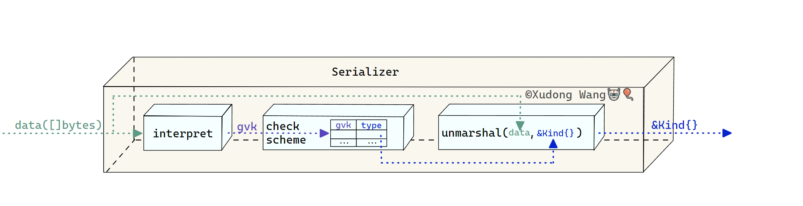

# 5.13 序列化器与序列化器工厂

## 资源的内部版本

我们知道，在Go语言中，JSON编码的字节序列（`[]byte`）与Go类型（`struct`）之间的转换其实十分简单，只要利用标准库`encoding/json`的`json.Unmarshal`以及`json.Marshal`就可以轻松完成。

而在Kubernetes中，对资源的编/解码还包括一些特殊的机制，这些特有的机制也导致了`apimachinery`库中编/解码相关代码的复杂性。

而这些特殊机制的本质来自于Kubernetes的中一个特殊概念——资源的\_内部版本\_（internal/hub version）。

我们之前已经多次强调了资源版本这个重要概念，不过资源的多版本对于`kube-apiserver`来说，这却是一个相当棘手的问题。 `kube-apiserver`从处理HTTP请求开始到最终将资源存入`etcd`中这中间有一系列步骤流程需要完成，这不在本文的讨论范围之内。总之，对于`kube-apiserver`组件来说，如果不针对资源的多版本情况加以额外处理，这意味着它需要为资源的每个版本重写相同的逻辑，这显然不是一个好的方式。

因此，资源的\_内部版本\_的提出是为了解决`kube-apiserver`在处理资源多版本时的痛点。 具体来说，`kube-apiserver`在反序列化HTTP请求体中的资源时，会再将资源转化为\_内部版本\_进而可以**统一**处理。

目前为止，我们只是介绍了`kube-apiserver`在接受到HTTP请求后，会将资源序列化后转化为其内部版本。 其实在此之后内部版本还需要再转化成其\_存储版本\_存入`etcd`中。 文档[API Changes](https://github.com/kubernetes/community/blob/master/contributors/devel/sig-architecture/api\_changes.md#operational-overview) 里简单概括了资源在一次HTTP请求里所要经历的各次转化：

> 1. A user POSTs a Pod object to /api/v7beta1/...
> 2. The JSON is unmarshalled into a v7beta1.Pod structure
> 3. Default values are applied to the v7beta1.Pod
> 4. The v7beta1.Pod is converted to an hub.Pod internal version
> 5. The hub.Pod is validated, and any errors are returned to the user
> 6. The hub.Pod is converted to a v6.Pod (because v6 is the latest stable version)
> 7. The v6.Pod is marshalled into JSON and written to etcd

除此以外，在HTTP请求返回时，还需要再将内部版本转化为发送时的版本返回给客户端。这个反向转化的过程我们不再赘述。

## Kubernetes编/解码体系演化历史 <a href="#kubernetes-bian-jie-ma-ti-xi-yan-hua-li-shi" id="kubernetes-bian-jie-ma-ti-xi-yan-hua-li-shi"></a>

在我看来，Kubernetes整体编/解码体系的演化和形成共分为四个阶段："古代"，"近代" [Pull Request #196](https://github.com/kubernetes/kubernetes/pull/196)，"现代" [Pull Request #723](https://github.com/kubernetes/kubernetes/pull/723)，"当代" [Pull Request #17922](https://github.com/kubernetes/kubernetes/pull/17922) Codec时期也正是 **现在** Kubernetes所使用的编/解码体系。

### 古代阶段

所谓"古代"是指自Kubernetes源码公布开始，编/解码甚至还未形成体系的时期，`kube-apiserver`在HTTP请求的handler中直接使用`json.Marshal`完成序列化。

### 近代阶段

"近代"是指Kubernetes编/解码体系开始逐渐形成的时期。这个时期社区开发者为Kubernetes的编/解码引入了一些关键性的机制，这些机制也一直被沿用至今。这些机制包括：

1.  [Pull Request #196](https://github.com/kubernetes/kubernetes/pull/196)

    伴随着`kind`字段引入API类型的同时，`Encode()/Decode()`函数用于替代`json.Marshal()/json.Unmarshal`也正式进入Kubernetes源码中， 编/解码体系开始处于萌芽阶段。 具体来说，PR作者引入了两个与编/解码有关的机制：

    * "智能推断"机制——在解码的初始阶段根据JSON字节序列的`kind`字段提前获取API类型信息


    ```go
    findKind := struct {
        Kind string `json:"kind,omitempty" yaml:"kind,omitempty"`
    }{}
    err := yaml.Unmarshal(data, &findKind)
    ```

    原理其实非常简单，先创建只有一个`Kind`字段的空结构体`findKind`，再尝试将原始字节序列`data`解码为`findKind`结构，这样就可以率先"捕获"原始字节中包含的`kind`信息。

* "API类型注册"机制——将所有的API类型[1](https://caozhuozi.github.io/crd-controller-from-scratch/docs/apimachinery/serializer#fn-1)事先注册，在"智能推断"机制获取API类型信息后查表直接获取API类型。

1.  [Pull Request #565](https://github.com/kubernetes/kubernetes/pull/565)

    伴随着`apiVersion`字段引入API类型，API对象的\_内部版本\_的概念开始出现。相应地，"版本转化"机制也开始正式进入编/解码流程。
2.  [Pull Request #672](https://github.com/kubernetes/kubernetes/pull/672)

    在这个PR中，作者引入"版本转化函数注册"机制，用于优化版本转化流程；

在"近代"阶段，所有编/解码代码被放置在`pkg/api/helper.go`中——这说明编/解码在当时并未引起社区足够的重视。

### 现代阶段（Scheme大一统时期）

"现代" 阶段是指从 [Pull Request #723](https://github.com/kubernetes/kubernetes/pull/723)开始的时期。 在该PR中，作者其实没有引入新的机制或是改动原来的编/解码逻辑，作者只是把原来`pkg/api/helper.go`中分散的编/解码逻辑和机制整体迁移并封装到了一个叫做`Scheme`的类型中。同时删除了原先的`pkg/api/helper.go`文件。 我们把 [Pull Request #723](https://github.com/kubernetes/kubernetes/pull/723)单独提升到一个阶段的原因是：经过整理后的编/解码代码逻辑异常清晰，一个`Scheme`类型囊括了"近代"阶段所断断续续引入的各个机制。

```go
// Scheme defines an entire encoding and decoding scheme.
type Scheme struct {
    // versionMap allows one to figure out the go type of an object with
    // the given version and name.
    versionMap map[string]map[string]reflect.Type

    // converter stores all registered conversion functions. It also has
    // default coverting behavior.
    converter *Converter

    // MetaInsertionFactory is used to create an object to store and retrieve
    // the version and kind information for all objects. The default uses the
    // keys "version" and "kind" respectively.
    MetaInsertionFactory MetaInsertionFactory
}
```

其中：

* `MetaInsertionFactory`成员用于"智能推断"机制；
* `versionMap`成员用于"API类型注册"机制；
* `converter`成员用于"版本转化"。

以经过整理后的解码函数为例：

pkg/api/conversion/decode.go

```go
nversion/decode.go
// Decode converts a YAML or JSON string back into a pointer to an api object.
// Deduces the type based upon the fields added by the MetaInsertionFactory
// technique. The object will be converted, if necessary, into the
// s.InternalVersion type before being returned. Decode will refuse to decode
// objects without a version, because that's probably an error.
func (s *Scheme) Decode(data []byte) (interface{}, error) {
    version, kind, err := s.DataVersionAndKind(data)
    if err != nil {
        return nil, err
    }
    if version == "" {
        return nil, fmt.Errorf("version not set in '%s'", string(data))
    }
    obj, err := s.NewObject(version, kind)
    if err != nil {
        return nil, err
    }
    // yaml is a superset of json, so we use it to decode here. That way,
    // we understand both.
    err = yaml.Unmarshal(data, obj)
    if err != nil {
        return nil, err
    }

    // Version and Kind should be blank in memory.
    err = s.SetVersionAndKind("", "", obj)
    if err != nil {
        return nil, err
    }

    // Convert if needed.
    if s.InternalVersion != version {
        objOut, err := s.NewObject(s.InternalVersion, kind)
        if err != nil {
            return nil, err
        }
        err = s.converter.Convert(obj, objOut, 0)
        if err != nil {
            return nil, err
        }
        obj = objOut
    }
    return obj, nil
}
```

解码过程可以清晰地划分为5个步骤：

1.  智能推断

    调用`DataVersionAndKind()`函数推断字节序列的`kind`和`apiVersion`（彼时，API分组的概念还没有出现）。
2.  创建API对象载体

    获取API对象的类型和版本信息后，调用`NewObject()`创建一个对应类型和版本的API对象的"空载体"。
3.  反序列化

    调用`Unmarshal()`将字节序列序列化到上一步创建的API对象载体中；
4. 版本转化
   * 调用`SetVersionAndKind()`函数将API对象的`apiVersion`和`kind`字段至空;
   * 调用`NewObject()`创建API对象的内部版本的"空载体";
   * 调用`Convert()`将API对象转化为其内部版本。
5. 返回内部版本

其中有一些细节需要单独说明：

*   `Scheme`的`NewObject()`方法用于创建给定类型和版本的API对象的空"载体"。

    ```go
    // NewObject returns a new object of the given version and name,
    // or an error if it hasn't been registered.
    func (s *Scheme) NewObject(versionName, typeName string) (interface{}, error) {
        if types, ok := s.versionMap[versionName]; ok {
            if t, ok := types[typeName]; ok {
                return reflect.New(t).Interface(), nil
            }
            return nil, fmt.Errorf("No type '%v' for version '%v'", typeName, versionName)
        }
        return nil, fmt.Errorf("No version '%v'", versionName)
    }
    ```

    具体实现上它需要查询`versionMap`这张表，只有在这张表中注册过的API类型才能被创建。
*   `Scheme`的`DataVersionAndKind()`方法用于"智能推断"。

    ```go
    // DataAPIVersionAndKind will return the APIVersion and Kind of the given wire-format
    // enconding of an API Object, or an error.
    func (s *Scheme) DataVersionAndKind(data []byte) (version, kind string, err error) {
        findKind := s.MetaInsertionFactory.Create("", "")
        // yaml is a superset of json, so we use it to decode here. That way,
        // we understand both.
        err = yaml.Unmarshal(data, findKind)
        if err != nil {
            return "", "", fmt.Errorf("couldn't get version/kind: %v", err)
        }
        version, kind = s.MetaInsertionFactory.Interpret(findKind)
        return version, kind, nil
    }

    ```


在实现上它依赖于`MetaInsertionFactory`成员。具体的智能推理过程原理基本与"近代"阶段一致，我们不再赘述。

下图总结了此时期的解码过程（不包括版本转化）：

<figure><figcaption></figcaption></figure>

### 当代阶段

Kubernetes如今使用的编/解码体系来自于一次重大重构:相关提案 [Issues #7111](https://github.com/kubernetes/kubernetes/issues/7111)及实现 [Pull Request #17922](https://github.com/kubernetes/kubernetes/pull/17922)。

> 当时Kubernetes版本已经来达了[v1.2.0-alpha.7](https://github.com/kubernetes/kubernetes/tree/v1.2.0-alpha.7)，Kubernetes API类型系统（_资源_，_API分组_，_kind_，`runtime.Object`接口，\_GVK\_等）已经基本趋向成熟。 而此前我们所介绍的三个阶段甚至都在Kubernetes仓库打的第一个tag[v0.2](https://github.com/kubernetes/kubernetes/tree/v0.2)之前。

由于 [Pull Request #17922](https://github.com/kubernetes/kubernetes/pull/17922)奠定了如今的Kubernetes编/解码体系，并且在内容上进行了大量的重构。我们将把它放在单独的小节介绍。

## Codec体系

在提案 [Issue #7111](https://github.com/kubernetes/kubernetes/issues/7111)中，作者决定将`Scheme`解耦, 同时作者也给出了重构的大致方向与要解决的问题：

总结来说，作者决定将编/解码逻辑整体从`Scheme`中剥离，并保留`Scheme`类型的"API类型注册"机制，同时启用`Codec`概念专门用于负责编/解码。 因此，我们也可以把Kubernetes"当代"编/解码体系称为"Codec体系"。

### 接口

在上述提案的实现 [Pull Request #17922](https://github.com/kubernetes/kubernetes/pull/17922) 中，作者首先抽象了一系列接口：`Encoder`，`Decoder`，`Codec`， `NegotiatedSerializer`：

```go
// Encoder writes objects to a serialized form
type Encoder interface {
	// Encode writes an object to a stream. Implementations may return errors if the versions are
	// incompatible, or if no conversion is defined.
	Encode(obj Object, w io.Writer) error
	// Identifier returns an identifier of the encoder.
	// Identifiers of two different encoders should be equal if and only if for every input
	// object it will be encoded to the same representation by both of them.
	//
	// Identifier is intended for use with CacheableObject#CacheEncode method. In order to
	// correctly handle CacheableObject, Encode() method should look similar to below, where
	// doEncode() is the encoding logic of implemented encoder:
	//   func (e *MyEncoder) Encode(obj Object, w io.Writer) error {
	//     if co, ok := obj.(CacheableObject); ok {
	//       return co.CacheEncode(e.Identifier(), e.doEncode, w)
	//     }
	//     return e.doEncode(obj, w)
	//   }
	Identifier() Identifier
}

type Decoder interface {
    // Decode attempts to deserialize the provided data using either the innate typing of the scheme or the
    // default kind, group, and version provided. It returns a decoded object as well as the kind, group, and
    // version from the serialized data, or an error. If into is non-nil, it will be used as the target type
    // and implementations may choose to use it rather than reallocating an object. However, the object is not
    // guaranteed to be populated. The returned object is not guaranteed to match into. If defaults are
    // provided, they are applied to the data by default. If no defaults or partial defaults are provided, the
    // type of the into may be used to guide conversion decisions.
    Decode(data []byte, defaults *unversioned.GroupVersionKind, into Object) (Object, *unversioned.GroupVersionKind, error)
}
```


`Decoder`接口所描述的解码函数签名与"近代"和"现代"阶段的解码函数签名产生了较大的区别。 "近代"和"现代"阶段所用的解码函数签名其实通俗常见：`func Decode(data []byte) (interface{}, error)`。 除了原始字节序列数据`data`这个参数以外，还需要提供`defaults`以及`into`两个参数。这样设计解码方法的动机是带来了更多的灵活性。 PR作者希望解码器：

1. 如果调用者已经预先提供了解码后的\_kind\_"空载体"（`into`），解码器应该尽量使用调用者提供的载体而避免在内存中再分配一个新对象；
2. 通过原始字节序列（`data`）包含的GVK信息、调用者默认提供的GVK信息（`defaults`）、调用者提供的"空载体"（`into`）中包含的GVK信息共同推断出一个可能的GVK。

> 这样设计的一个好处是对于原始字节数据丢失或 GVK 信息残缺的情况下，我们可以通过调用者提供的GVK信息（`defaults`）甚至是`into`的GVK信息兜底。 当然，这种灵活性也带来了实现上的不方便。尤其是原始数据包含的实际GVK信息和调用者提供的GVK信息以及`into`的GVK不一致的情况。 因此在解码器接口的实现中（例如我们后续介绍的 JSON 序列化器），有相当一部分逻辑在处理这种情形。

*   `Codec`——\_编解编码器\_接口：

    ```go
    // Codec defines methods for serializing and deserializing API objects.
    // Codec接口抽象了实现类需要同时具备编码以及解码能力。
    type Codec interface {
        Decoder
        Encoder
    }
    ```


*   `NegotiatedSerializer`——\_协商序列化器\_接口：

    ```go
    // NegotiatedSerializer is an interface used for obtaining encoders, decoders, and serializers
    // for multiple supported media types. This would commonly be accepted by a server component
    // that performs HTTP content negotiation to accept multiple formats.
    type NegotiatedSerializer interface {
    	// SupportedMediaTypes is the media types supported for reading and writing single objects.
    	SupportedMediaTypes() []SerializerInfo

    	// EncoderForVersion returns an encoder that ensures objects being written to the provided
    	// serializer are in the provided group version.
    	EncoderForVersion(serializer Encoder, gv GroupVersioner) Encoder
    	// DecoderToVersion returns a decoder that ensures objects being read by the provided
    	// serializer are in the provided group version by default.
    	DecoderToVersion(serializer Decoder, gv GroupVersioner) Decoder
    }
    ```


PR作者用\_Negotiated(协商)\_命名此接口的动机正式来自于[_HTTP内容协商（HTTP Content negotiation）_](https://developer.mozilla.org/en-US/docs/Web/HTTP/Content\_negotiation)。 简单来说，\_HTTP内容协商\_是指服务端与客户端"协商"返回资源的具体表示形式的一种机制。 例如，根据文档 [Kubernetes API Concepts](https://kubernetes.io/docs/reference/using-api/api-concepts) ，`kube-apiserver`除了支持返回资源的JSON编码格式外，也支持返回资源的protobuf编码格式：

> [Alternate representations of resources](https://kubernetes.io/docs/reference/using-api/api-concepts/#alternate-representations-of-resources)
>
> List all of the pods on a cluster in Protobuf format.
>
> ```
> GET /api/v1/pods
> Accept: application/vnd.kubernetes.protobuf
> ---
> 200 OK
> Content-Type: application/vnd.kubernetes.protobuf
>
> ... binary encoded PodList object
> ```

因此，\_协商序列化器\_接口所要抽象的能力是支持同时对多种数据格式的编/解码。正如作者在提案 [Issue #7111](https://github.com/kubernetes/kubernetes/issues/7111) 中描述的那样：

> It's likely that there exists one canonical "marshaller" for most objects, but there may be alternate mechanisms. For example, JSON is canonical for Kube, but we may occasionally want to marshal an annotated YAML object that has description comments for each field interleaved.

具体来说：

* `SupportedMediaTypes()`描述了实现类需要返回此序列化器支持的所有编码格式；

\_协商序列化器\_除了可以"协商"编码格式以外，**它的另一个特点是支持"协商"版本转化时的目标版本**。 我们现在已经知道编/解码体系的"现代"阶段，编/解码时默认转化为其内部版本。而在这次重构中，作者决定支持任意不同版本之间的转化，正如作者在提案 [Issue #7111](https://github.com/kubernetes/kubernetes/issues/7111)中描述的那样：

> It should be possible to convert a versioned Go struct into a different versioned Go struct (typically by going to an intermediate format) on the server. This is "object versioning".

具体来说:

* `EncoderForVersion()/DecoderToVersion()`表示实现类可以根据指定的目标版本返回一个专门转化为该目标版本的编解码器；

另外，相比于之前的几个接口偏向底层，\_协商序列化器\_接口已经是**应用层**级别的封装。 `client-go`作为客户端库，它所使用的编解码器正是协商序列化器。[🎈](https://caozhuozi.github.io/crd-controller-from-scratch/docs/intro#%E7%BA%A6%E5%AE%9A)

### 实现

介绍完接口之后，我们接下来看作者是如何实现这些接口的。

**JSON序列化器**

作者在 [Pull Request #17922](https://github.com/kubernetes/kubernetes/pull/17922) 中同时提供了JSON和YAML两种序列化器的实现。

我们以JSON编解码器为例，它实现的接口是 `Codec`。

```go

// Serializer handles encoding versioned objects into the proper JSON form
type Serializer struct {
	meta    MetaFactory
	options SerializerOptions
	creater runtime.ObjectCreater
	typer   runtime.ObjectTyper

	identifier runtime.Identifier
}
```

其中，

* `meta`成员用于"智能推断"，它演化于"现代"时期的`MetaInsertionFactory`。
* `creater`成员用于根据给定的GVK三元组创建对应\_kind\_（空）实例。
* `typer`成员用于判定一个给定的API对象是否注册过。

> 尽管在提案 [Issue #7111](https://github.com/kubernetes/kubernetes/issues/7111) 中，作者虽然决定把编/解码逻辑从`Scheme`类型中剥离，但是作者仍然有意保留了`Scheme`"API对象注册"机制。正如作者提到的那样："Object versioning" requires the registration of an object Kind into an APIVersion for a specific API group. This was the original intent of runtime.Scheme.从 [Pull Request #17922](https://github.com/kubernetes/kubernetes/pull/17922) 之后，`Scheme`类型仅仅被用于：

* 注册所有的\_kind\_（API对象）；
* 判定给定的\_kind\_（API对象）是否注册；
* 根据给定的GVK三元组创建对应\_kind\_（API对象）的空实例（"载体"）。

> 所以在Kubernetes源码中，JSON序列化器在初始化`creater`，`typer`成员时使用的是`Scheme`对象。**所以JSON序列化器仍然依赖`Scheme`的注册机制工作**。

```go
// Decode attempts to convert the provided data into YAML or JSON, extract the stored schema kind, apply the provided default gvk, and then
// load that data into an object matching the desired schema kind or the provided into.
// If into is *runtime.Unknown, the raw data will be extracted and no decoding will be performed.
// If into is not registered with the typer, then the object will be straight decoded using normal JSON/YAML unmarshalling.
// If into is provided and the original data is not fully qualified with kind/version/group, the type of the into will be used to alter the returned gvk.
// If into is nil or data's gvk different from into's gvk, it will generate a new Object with ObjectCreater.New(gvk)
// On success or most errors, the method will return the calculated schema kind.
// The gvk calculate priority will be originalData > default gvk > into
func (s *Serializer) Decode(originalData []byte, gvk *schema.GroupVersionKind, into runtime.Object) (runtime.Object, *schema.GroupVersionKind, error) {
	data := originalData
	if s.options.Yaml {
		altered, err := yaml.YAMLToJSON(data)
		if err != nil {
			return nil, nil, err
		}
		data = altered
	}

	actual, err := s.meta.Interpret(data)
	if err != nil {
		return nil, nil, err
	}

	if gvk != nil {
		*actual = gvkWithDefaults(*actual, *gvk)
	}

	if unk, ok := into.(*runtime.Unknown); ok && unk != nil {
		unk.Raw = originalData
		unk.ContentType = runtime.ContentTypeJSON
		unk.GetObjectKind().SetGroupVersionKind(*actual)
		return unk, actual, nil
	}

	if into != nil {
		_, isUnstructured := into.(runtime.Unstructured)
		types, _, err := s.typer.ObjectKinds(into)
		switch {
		case runtime.IsNotRegisteredError(err), isUnstructured:
			strictErrs, err := s.unmarshal(into, data, originalData)
			if err != nil {
				return nil, actual, err
			}

			// when decoding directly into a provided unstructured object,
			// extract the actual gvk decoded from the provided data,
			// and ensure it is non-empty.
			if isUnstructured {
				*actual = into.GetObjectKind().GroupVersionKind()
				if len(actual.Kind) == 0 {
					return nil, actual, runtime.NewMissingKindErr(string(originalData))
				}
				// TODO(109023): require apiVersion here as well once unstructuredJSONScheme#Decode does
			}

			if len(strictErrs) > 0 {
				return into, actual, runtime.NewStrictDecodingError(strictErrs)
			}
			return into, actual, nil
		case err != nil:
			return nil, actual, err
		default:
			*actual = gvkWithDefaults(*actual, types[0])
		}
	}

	if len(actual.Kind) == 0 {
		return nil, actual, runtime.NewMissingKindErr(string(originalData))
	}
	if len(actual.Version) == 0 {
		return nil, actual, runtime.NewMissingVersionErr(string(originalData))
	}

	// use the target if necessary
	obj, err := runtime.UseOrCreateObject(s.typer, s.creater, *actual, into)
	if err != nil {
		return nil, actual, err
	}

	strictErrs, err := s.unmarshal(obj, data, originalData)
	if err != nil {
		return nil, actual, err
	} else if len(strictErrs) > 0 {
		return obj, actual, runtime.NewStrictDecodingError(strictErrs)
	}
	return obj, actual, nil
}

```

JSON序列化器的解码过程可以大致划分为5个步骤：

1.  智能推断

    获取原始字节序列（`originalData`）中的GVK信息。
2.  **共同**推断

    利用`originalData`、`gvk`、`into`中的GVK信息共同推断出一个GKV三元组。 补全顺序为原始字节数据包含的GVK信息优先于调用者给定的GVK信息（参数`gvk`）优先于调用者提供的目标对象载体（参数`into`）。
3.  创建/复用"载体"

    调用`UseOrCreateObject`创建一个新的对象"载体"或者使用调用者提供的`into`作为"载体"。 具体规则为：如果共同推断出的GVK三元组与`into`所携带的GVK信息不匹配，那么将会创建出一个与推断GVK匹配的对象做为目标"载体"；
4. 反序列化
5. 返回序列化后的对象以及**共同推断的GVK三元组**

我们可以看出JSON序列化器的解码过程与"现代"时期的解码过程产生了一些区别：

1. 多了"共同推断"的步骤
2. 少了"版本转化"的步骤

对于多出的"共同推断"步骤其实是容易理解的，毕竟此时`Decode()`方法签名已"今时不同往日"——三个参数全部包含有GVK信息。 可是为什么在解码过程中不再有"版本转化"步骤了呢？难道这次重构舍弃了Kubernetes的"版本转化"吗？

其实不然，PR作者其实有意而为之——JSON/YAML序列化器仅用于**纯粹**的序列化/反序列化任务。 真正带有版本转化的序列化器实现是`codec`，它所实现的也是`Codec`接口。


<pre class="language-go"><code class="lang-go"><strong>// pkg/runtime/serializer/versioning/versioning.go
</strong><strong>type codec struct {
</strong>	encoder   runtime.Encoder
	decoder   runtime.Decoder
	convertor runtime.ObjectConvertor
	creater   runtime.ObjectCreater
	typer     runtime.ObjectTyper
	defaulter runtime.ObjectDefaulter

	encodeVersion runtime.GroupVersioner
	decodeVersion runtime.GroupVersioner

	identifier runtime.Identifier

	// originalSchemeName is optional, but when filled in it holds the name of the scheme from which this codec originates
	originalSchemeName string
}
</code></pre>


* `convertor`成员用于"版本转化"步骤，这个成员可以认为是剥离自"近代"时期的`Scheme`中的`convertor`；
* `creater`成员用于根据给定的GVK三元组创建对应\_kind\_（API对象）的空实例（"载体"）；
* `typer`成员用于判定一个给定的\_kind\_（API对象）是否注册过；
* `encodeVersion`和`decodeVersion`成员是`codec`序列化器区别于"现代"（`Scheme`大一统）时期的编/解码逻辑的另一个特性——`codec`支持将版本转化为调用者指定的**目标版本**，而不是仅默认转化为内部版本。

所以，`codec`序列化器是对JSON/YAML序列化器的进一步封装。接下来我们来看看`codec`的解码方法的具体步骤：

```go
// Decode attempts a decode of the object, then tries to convert it to the internal version. If into is provided and the decoding is
// successful, the returned runtime.Object will be the value passed as into. Note that this may bypass conversion if you pass an
// into that matches the serialized version.
func (c *codec) Decode(data []byte, defaultGVK *schema.GroupVersionKind, into runtime.Object) (runtime.Object, *schema.GroupVersionKind, error) {
	// If the into object is unstructured and expresses an opinion about its group/version,
	// create a new instance of the type so we always exercise the conversion path (skips short-circuiting on `into == obj`)
	decodeInto := into
	if into != nil {
		if _, ok := into.(runtime.Unstructured); ok && !into.GetObjectKind().GroupVersionKind().GroupVersion().Empty() {
			decodeInto = reflect.New(reflect.TypeOf(into).Elem()).Interface().(runtime.Object)
		}
	}

	var strictDecodingErrs []error
	obj, gvk, err := c.decoder.Decode(data, defaultGVK, decodeInto)
	if err != nil {
		if strictErr, ok := runtime.AsStrictDecodingError(err); obj != nil && ok {
			// save the strictDecodingError and let the caller decide what to do with it
			strictDecodingErrs = append(strictDecodingErrs, strictErr.Errors()...)
		} else {
			return nil, gvk, err
		}
	}

	if d, ok := obj.(runtime.NestedObjectDecoder); ok {
		if err := d.DecodeNestedObjects(runtime.WithoutVersionDecoder{Decoder: c.decoder}); err != nil {
			if strictErr, ok := runtime.AsStrictDecodingError(err); ok {
				// save the strictDecodingError let and the caller decide what to do with it
				strictDecodingErrs = append(strictDecodingErrs, strictErr.Errors()...)
			} else {
				return nil, gvk, err

			}
		}
	}

	// aggregate the strict decoding errors into one
	var strictDecodingErr error
	if len(strictDecodingErrs) > 0 {
		strictDecodingErr = runtime.NewStrictDecodingError(strictDecodingErrs)
	}
	// if we specify a target, use generic conversion.
	if into != nil {
		// perform defaulting if requested
		if c.defaulter != nil {
			c.defaulter.Default(obj)
		}

		// Short-circuit conversion if the into object is same object
		if into == obj {
			return into, gvk, strictDecodingErr
		}

		if err := c.convertor.Convert(obj, into, c.decodeVersion); err != nil {
			return nil, gvk, err
		}

		return into, gvk, strictDecodingErr
	}

	// perform defaulting if requested
	if c.defaulter != nil {
		c.defaulter.Default(obj)
	}

	out, err := c.convertor.ConvertToVersion(obj, c.decodeVersion)
	if err != nil {
		return nil, gvk, err
	}
	return out, gvk, strictDecodingErr
}
```

1. 利用基础的 JSON/YAML序列化组件进行纯粹的反序列化步骤。
2. 版本转化
   * 如果调用这提供了目标API对象载体`into`，则将上一步反序列化结果转化为调用者提供的`into`对象；
   * 如果调用者没有提供目标API对象载体（`into`为`nil`），并且事先提供了目标版本的GV信息（`decodeVersion`）则转化为指定的目标版本；
   * 如果调用者即没有提供目标API对象载体（`into`为`nil`），也没有提供目标版本的GV信息（`decodeVersion`成员为`nil`）则将上一步反序列化的结果默认转化为内部版本。

### CodecFactory

我们现在已经知道`codec`序列化器提供了许多可定制化项。例如可以配置 JSON 或者 YAML 作为底层的序列化/反序列化组件，也可以事先配置好所要转化的目标版本信息。 因此，在该PR中，作者也同时提供了`CodecFactory`（_序列化器工厂_）——用于"生产"不同定制化的`codec`。

```go
// CodecFactory provides methods for retrieving codecs and serializers for specific
// versions and content types.
type CodecFactory struct {
	scheme    *runtime.Scheme
	universal runtime.Decoder
	accepts   []runtime.SerializerInfo

	legacySerializer runtime.Serializer
}
```

其中：

* `scheme`成员用于"API对象注册"；
* `accepts`成员用于存放**支持**的编/解码格式信息，包括：`"application/json"`以及`"application/yaml"`;
* `universal`成员意在提供一个**通用**快捷的解码器，它能够识别字节序列的数据格式（JSON/YAML）再找到对应的基础的序列化器进行反序列化。

另外，`CodecFactory`其实实现了`NegotiatedSerializer`（\_协商序列化器\_接口）:

```go
var _ runtime.NegotiatedSerializer = &CodecFactory{}

// SupportedMediaTypes returns the RFC2046 media types that this factory has serializers for.
func (f CodecFactory) SupportedMediaTypes() []string {
    return f.accepts
}

// DecoderToVersion returns a decoder that targets the provided group version.
func (f CodecFactory) DecoderToVersion(serializer runtime.Serializer, gv unversioned.GroupVersion) runtime.Decoder {
    return f.CodecForVersions(serializer, nil, []unversioned.GroupVersion{gv})
}

// EncoderForVersion returns an encoder that targets the provided group version.
func (f CodecFactory) EncoderForVersion(serializer runtime.Serializer, gv unversioned.GroupVersion) runtime.Encoder {
    return f.CodecForVersions(serializer, []unversioned.GroupVersion{gv}, nil)
}
```

它实现的`NegotiatedSerializer`接口的方法：

* `SupportedMediaTypes()`方法用于返回所支持的编码格式；
* `EncoderForVersion()/DecoderToVersion()`方法用于"生产"一个可以转化为指定目标版本的"定制化"`codec`；

**创建CodecFactory对象**

介绍完`CodecFactory`类型后，接下来我们再来看看如何创建一个`CodecFactory`类：

```go
// NewCodecFactory provides methods for retrieving serializers for the supported wire formats
// and conversion wrappers to define preferred internal and external versions. In the future,
// as the internal version is used less, callers may instead use a defaulting serializer and
// only convert objects which are shared internally (Status, common API machinery).
//
// Mutators can be passed to change the CodecFactoryOptions before construction of the factory.
// It is recommended to explicitly pass mutators instead of relying on defaults.
// By default, Pretty is enabled -- this is conformant with previously supported behavior.
//
// TODO: allow other codecs to be compiled in?
// TODO: accept a scheme interface
func NewCodecFactory(scheme *runtime.Scheme, mutators ...CodecFactoryOptionsMutator) CodecFactory {
	options := CodecFactoryOptions{Pretty: true}
	for _, fn := range mutators {
		fn(&options)
	}

	serializers := newSerializersForScheme(scheme, json.DefaultMetaFactory, options)
	return newCodecFactory(scheme, serializers)
}
```

开发者为我们封装的初始化函数十分简单——调用者仅需要提供一个`Scheme`对象即可，剩下的由初始化函数完成。

#### **WithoutConversion**

我们知道"版本转化"在`kube-apiserver`是个十分重要的行为。但是对于客户端（`client-go`）来说，它们在序列化/反序列化资源时其实并不需要"版本转化"。 针对这种需求，在[Kubernetes v1.15.0-alpha1](https://github.com/kubernetes/kubernetes/tree/v1.15.0-alpha1) [Pull Request #76098](https://github.com/kubernetes/kubernetes/pull/76098) 开发者给`CodecFactory`封装了一个"快捷"方法`WithoutConversion()`：

<pre class="language-go"><code class="lang-go">// WithoutConversion returns a NegotiatedSerializer that performs no conversion
<strong>// 用于返回一个在编/解码时不进行版本转化的CodecFactory。
</strong><strong>func (f CodecFactory) WithoutConversion() runtime.NegotiatedSerializer {
</strong>    // ...
}
</code></pre>

#### ParameterCodec

上述的`CodecFactory`主要用于HTTP**请求/返回体**（即\_资源\_）的编解/码。

在提案 [Issue #7111](https://github.com/kubernetes/kubernetes/issues/7111) 中，作者甚至 "贴心地" 提议为HTTP URL参数（Query Parameters）与Go对象之间的转换也专门封装成一种"编解码器"：

> There are places where we want to convert map\[string]interface{} (generic JSON object representation) or a map\[string]\[]string (url.Values) into a versioned Go struct, which is dependent on a type of marshaling (i.e. following JSON rules, or Query parameter rules).

在 [Pull Request #17922](https://github.com/kubernetes/kubernetes/pull/17922) 中，作者实现了`ParameterCodec`编解码器专门用于此目的：

```go
// parameterCodec implements conversion to and from query parameters and objects.
type parameterCodec struct {
	typer     ObjectTyper
	convertor ObjectConvertor
	creator   ObjectCreater
	defaulter ObjectDefaulter
}
```

例如，通常我们可以使用`apimachinery`库提供的 `metav1.ListOptions` 结构来基于条件地查询资源集合：

```go
listOptions := metav1.ListOptions{
        Limit: 1,
        LabelSelector: "app=foo",
    }
pods, _ := clientset.CoreV1().Pods("default").List(listOptions)
```

`client-go`其实在背后正是利用了`ParameterCodec`"编解码器"将`metav1.ListOptions`类型最终"解码"成 HTTP URL参数`limit=1&app=foo`。 另外，需要提及的是，`ParameterCodec`"编解码器"仍然基于`Scheme`注册机制工作（`typer`和`creator`成员）。也就是说，`metav1.ListOptions`类型也同样需要注册进`scheme`中。

## 小结


在本小节中，我们首先强调了在Kubernetes上下文中编/解码的特殊性，而这种特殊性本质上来自于资源的多版本以及版本间的相互转化。 之后我们总结了Kubernetes编/解码体系演化的四个重要阶段。 如今的Kubernetes体系主要基于两个组件：

* `Scheme`——\_kind\_注册
* `codec`——序列化/反序列化及资源版本转化

另外，我们还介绍了`CodecFactory`，它实现了`NegotiatedSerializer`（_协商序列化器_），支持多种编码格式，也可以用于生产"定制化"的`codec`。

同时我们也指出了对于客户端来说，它在序列化/反序列化资源时并不需要像Kubernetes API Server一样进行版本转。针对这种需求，`CodecFactory`的`WithoutConversion()`方法也对此提供了方便快捷的支持。
