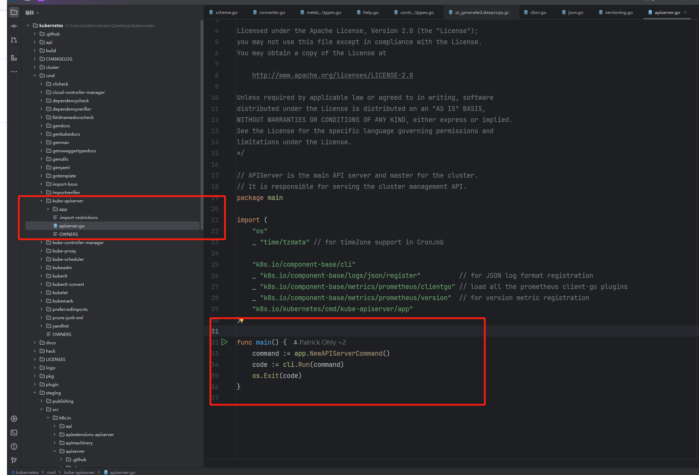

# 5.16 apiserver 源码分析 01

## 入口

kube-apiserver 入口在 cmd/kube-apiserver/apiserver.go 文件中，只有三行代码，我们一行一行看。

<figure><figcaption></figcaption></figure>

## NewAPIServerCommand()

这段代码定义了一个名为 `NewAPIServerCommand` 的函数，用于创建一个 `*cobra.Command` 对象，主要用于 Kubernetes API Server 的命令行接口

```go
// NewAPIServerCommand creates a *cobra.Command object with default parameters
func NewAPIServerCommand() *cobra.Command {
	_, featureGate := utilversion.DefaultComponentGlobalsRegistry.ComponentGlobalsOrRegister(
		utilversion.DefaultKubeComponent, utilversion.DefaultBuildEffectiveVersion(), utilfeature.DefaultMutableFeatureGate)
	s := options.NewServerRunOptions()

	cmd := &cobra.Command{
		Use: "kube-apiserver",
		Long: `The Kubernetes API server validates and configures data
for the api objects which include pods, services, replicationcontrollers, and
others. The API Server services REST operations and provides the frontend to the
cluster's shared state through which all other components interact.`,

		// stop printing usage when the command errors
		SilenceUsage: true,
		PersistentPreRunE: func(*cobra.Command, []string) error {
			if err := utilversion.DefaultComponentGlobalsRegistry.Set(); err != nil {
				return err
			}
			// silence client-go warnings.
			// kube-apiserver loopback clients should not log self-issued warnings.
			rest.SetDefaultWarningHandler(rest.NoWarnings{})
			return nil
		},
		RunE: func(cmd *cobra.Command, args []string) error {
			verflag.PrintAndExitIfRequested()
			fs := cmd.Flags()
			// Activate logging as soon as possible, after that
			// show flags with the final logging configuration.
			if err := logsapi.ValidateAndApply(s.Logs, featureGate); err != nil {
				return err
			}
			cliflag.PrintFlags(fs)

			// set default options
			completedOptions, err := s.Complete()
			if err != nil {
				return err
			}

			// validate options
			if errs := completedOptions.Validate(); len(errs) != 0 {
				return utilerrors.NewAggregate(errs)
			}
			// add feature enablement metrics
			featureGate.AddMetrics()
			return Run(cmd.Context(), completedOptions)
		},
		Args: func(cmd *cobra.Command, args []string) error {
			for _, arg := range args {
				if len(arg) > 0 {
					return fmt.Errorf("%q does not take any arguments, got %q", cmd.CommandPath(), args)
				}
			}
			return nil
		},
	}
	cmd.SetContext(genericapiserver.SetupSignalContext())

	fs := cmd.Flags()
	namedFlagSets := s.Flags()
	verflag.AddFlags(namedFlagSets.FlagSet("global"))
	globalflag.AddGlobalFlags(namedFlagSets.FlagSet("global"), cmd.Name(), logs.SkipLoggingConfigurationFlags())
	options.AddCustomGlobalFlags(namedFlagSets.FlagSet("generic"))
	for _, f := range namedFlagSets.FlagSets {
		fs.AddFlagSet(f)
	}

	cols, _, _ := term.TerminalSize(cmd.OutOrStdout())
	cliflag.SetUsageAndHelpFunc(cmd, namedFlagSets, cols)

	return cmd
}

```
