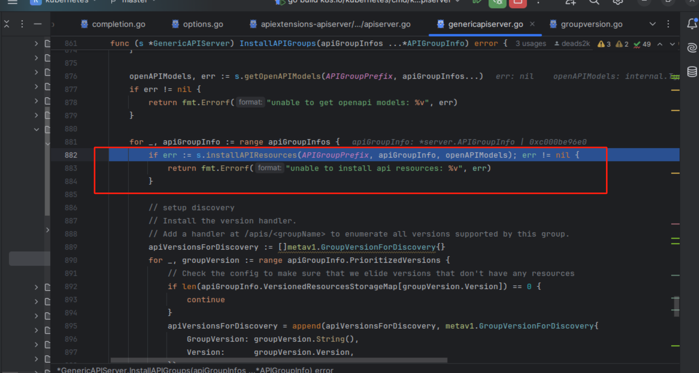
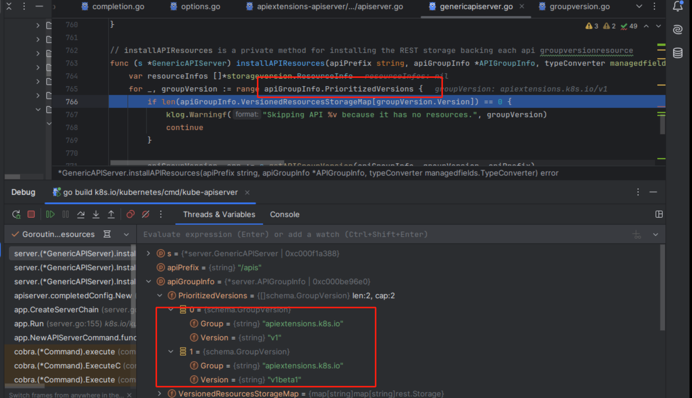
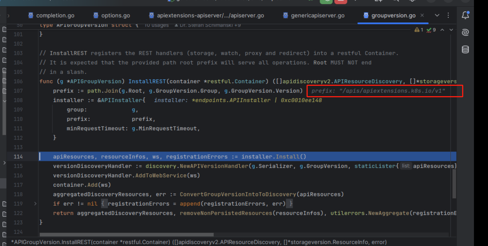
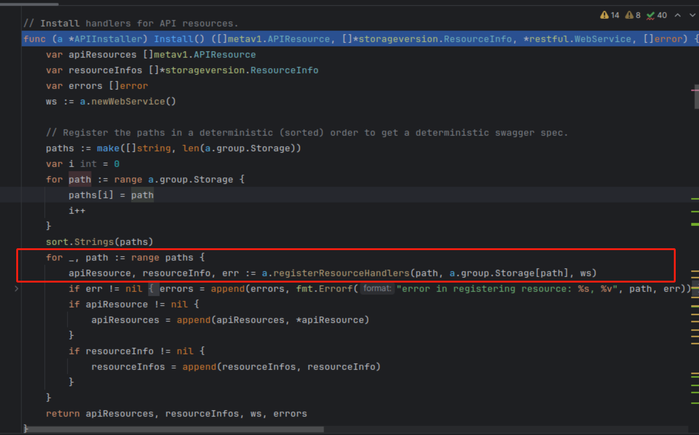
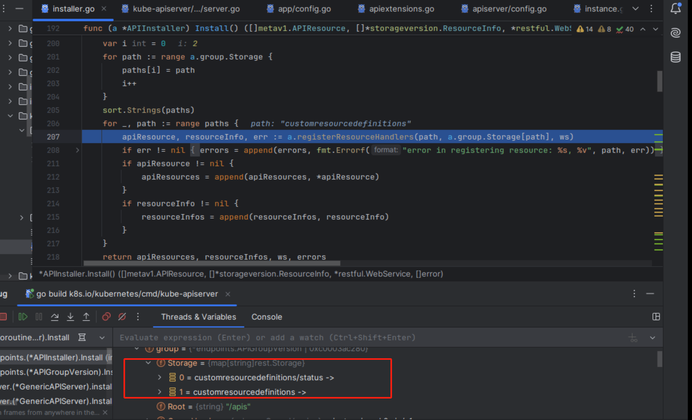
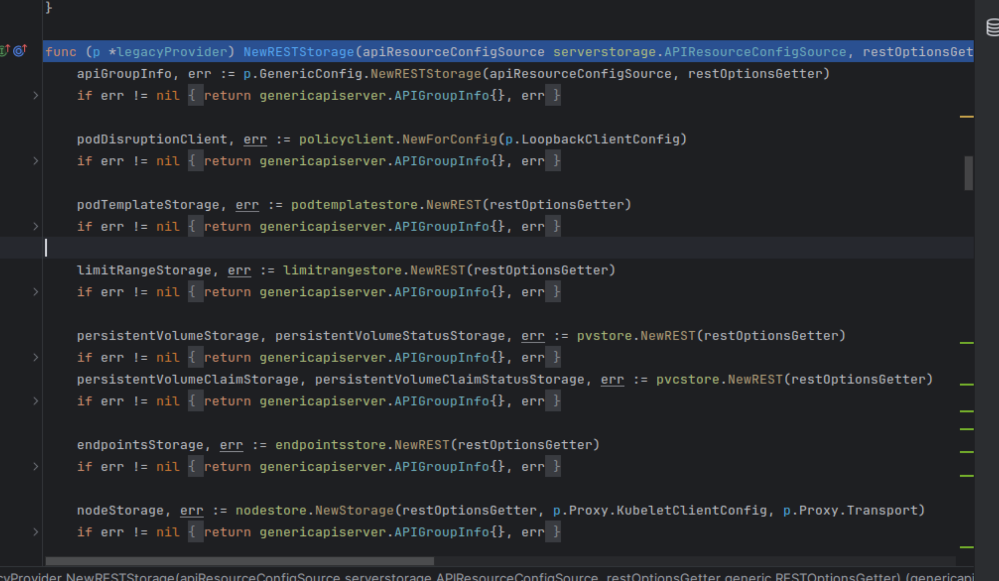
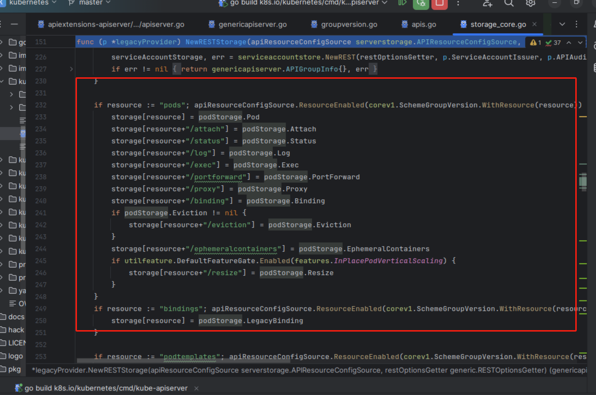
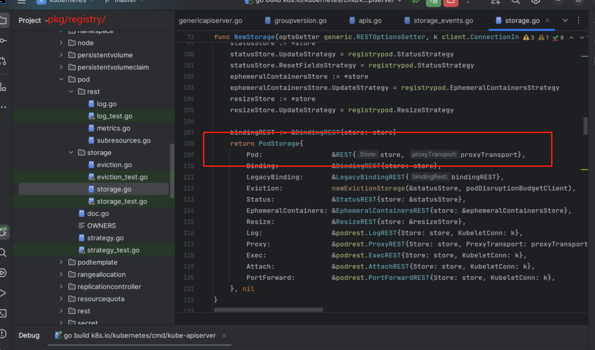
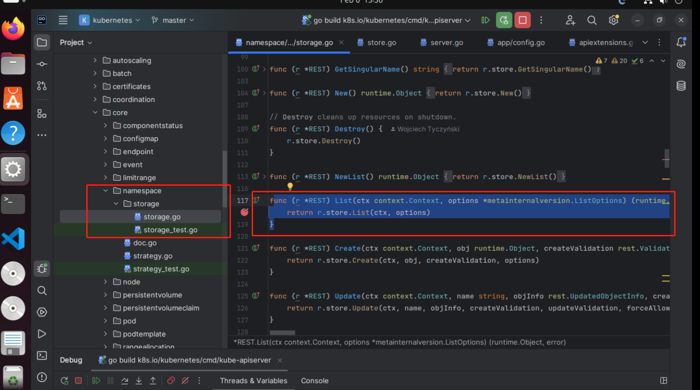
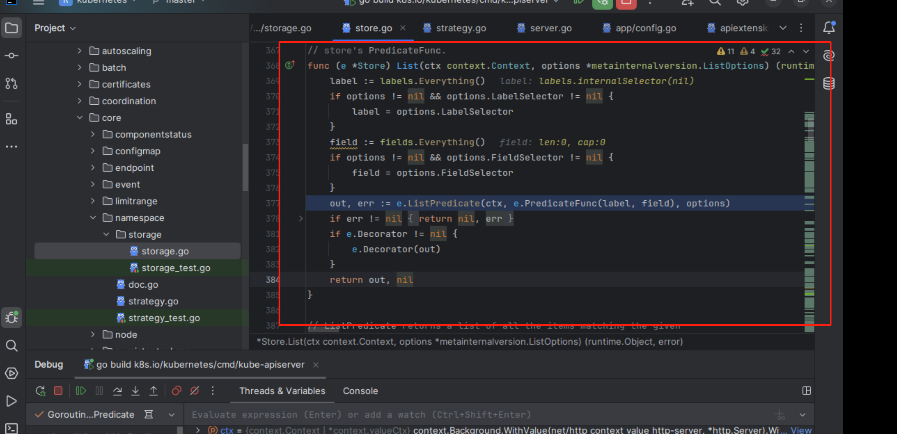

# 5.4 路由注册


&#x20;CreateServerChain 中的 New 方法里， 通过函数 InstallAPIs 进行路由注册。

```go
// CreateServerChain creates the apiservers connected via delegation.
func CreateServerChain(config CompletedConfig) (*aggregatorapiserver.APIAggregator, error) {
    notFoundHandler := notfoundhandler.New(config.KubeAPIs.ControlPlane.Generic.Serializer, genericapifilters.NoMuxAndDiscoveryIncompleteKey)
    apiExtensionsServer, err := config.ApiExtensions.New(genericapiserver.NewEmptyDelegateWithCustomHandler(notFoundHandler))
    if err != nil {
       return nil, err
    }
    crdAPIEnabled := config.ApiExtensions.GenericConfig.MergedResourceConfig.ResourceEnabled(apiextensionsv1.SchemeGroupVersion.WithResource("customresourcedefinitions"))

    kubeAPIServer, err := config.KubeAPIs.New(apiExtensionsServer.GenericAPIServer)
    if err != nil {
       return nil, err
    }

    // aggregator comes last in the chain
    aggregatorServer, err := controlplaneapiserver.CreateAggregatorServer(config.Aggregator, kubeAPIServer.ControlPlane.GenericAPIServer, apiExtensionsServer.Informers.Apiextensions().V1().CustomResourceDefinitions(), crdAPIEnabled, apiVersionPriorities)
    if err != nil {
       // we don't need special handling for innerStopCh because the aggregator server doesn't create any go routines
       return nil, err
    }

    return aggregatorServer, nil
}


// New returns a new instance of Master from the given config.
// Certain config fields will be set to a default value if unset.
// Certain config fields must be specified, including:
// KubeletClientConfig
func (c CompletedConfig) New(delegationTarget genericapiserver.DelegationTarget) (*Instance, error) {
	// 省略 。。。。 

	restStorageProviders, err := c.StorageProviders(client.Discovery())
	if err != nil {
		return nil, err
	}

	if err := s.ControlPlane.InstallAPIs(restStorageProviders...); err != nil {
		return nil, err
	}
	// 省略 。。。。 

	return s, nil

}
```


### ApiExtensions 路由注册：

<figure><figcaption></figcaption></figure>

注册了 v1 和 v1beta1 版本的路由


<figure><figcaption></figcaption></figure>

拼接前缀，这里 prefix 的值为 /apis/apiextensions.k8s.io/v1

<figure><figcaption></figcaption></figure>

调用 installer.Install 方法来注册路由，用的 web 框架是 go-restful

<figure><figcaption></figcaption></figure>

这里注册路由的路径 paths 数组的值是从 a.group.storage中获取的，目前有2个资源，分别为 customersourcedefinitions/status 和 customersourcedefinitions 。 正因为有了这两个资源，我们才能够对 crd 进行增删改查的操作。

<figure><figcaption></figcaption></figure>

这里我们着重看下 registerResourceHandlers 这个方法，其为 Kubernetes API 资源注册 HTTP 路由和处理程序。它根据资源的存储接口实现的不同功能（如创建、获取、删除等）来设置相应的 HTTP 动作（如 POST、GET、DELETE 等）。：

```go
func (a *APIInstaller) registerResourceHandlers(path string, storage rest.Storage, ws *restful.WebService) (*metav1.APIResource, *storageversion.ResourceInfo, error) {
	admit := a.group.Admit

	// 确定使用的外部版本
	optionsExternalVersion := a.group.GroupVersion
	if a.group.OptionsExternalVersion != nil {
		optionsExternalVersion = *a.group.OptionsExternalVersion
	}

	// 分割资源和子资源
	resource, subresource, err := splitSubresource(path)
	if err != nil {
		return nil, nil, err
	}

	// 获取组和版本信息
	group, version := a.group.GroupVersion.Group, a.group.GroupVersion.Version

	// 获取资源的完整限定类型
	fqKindToRegister, err := GetResourceKind(a.group.GroupVersion, storage, a.group.Typer)
	if err != nil {
		return nil, nil, err
	}

	// 创建版本化的对象指针
	versionedPtr, err := a.group.Creater.New(fqKindToRegister)
	if err != nil {
		return nil, nil, err
	}
	defaultVersionedObject := indirectArbitraryPointer(versionedPtr)
	kind := fqKindToRegister.Kind
	isSubresource := len(subresource) > 0

	// 确定命名空间范围
	var namespaceScoped bool
	if isSubresource {
		// 如果是子资源，命名空间范围由父资源定义
		parentStorage, ok := a.group.Storage[resource]
		if !ok {
			return nil, nil, fmt.Errorf("missing parent storage: %q", resource)
		}
		scoper, ok := parentStorage.(rest.Scoper)
		if !ok {
			return nil, nil, fmt.Errorf("%q must implement scoper", resource)
		}
		namespaceScoped = scoper.NamespaceScoped()
	} else {
		scoper, ok := storage.(rest.Scoper)
		if !ok {
			return nil, nil, fmt.Errorf("%q must implement scoper", resource)
		}
		namespaceScoped = scoper.NamespaceScoped()
	}

	// 确定存储支持的动词，其实就是看 storage 是否实现了相应接口
	creater, isCreater := storage.(rest.Creater)
	namedCreater, isNamedCreater := storage.(rest.NamedCreater)
	lister, isLister := storage.(rest.Lister)
	getter, isGetter := storage.(rest.Getter)
	getterWithOptions, isGetterWithOptions := storage.(rest.GetterWithOptions)
	gracefulDeleter, isGracefulDeleter := storage.(rest.GracefulDeleter)
	collectionDeleter, isCollectionDeleter := storage.(rest.CollectionDeleter)
	updater, isUpdater := storage.(rest.Updater)
	patcher, isPatcher := storage.(rest.Patcher)
	watcher, isWatcher := storage.(rest.Watcher)
	connecter, isConnecter := storage.(rest.Connecter)
	storageMeta, isMetadata := storage.(rest.StorageMetadata)
	storageVersionProvider, isStorageVersionProvider := storage.(rest.StorageVersionProvider)
	gvAcceptor, _ := storage.(rest.GroupVersionAcceptor)
	if !isMetadata {
		storageMeta = defaultStorageMetadata{}
	}

	if isNamedCreater {
		isCreater = true
	}

	// 处理列表操作
	var versionedList interface{}
	if isLister {
		list := lister.NewList()
		listGVKs, _, err := a.group.Typer.ObjectKinds(list)
		if err != nil {
			return nil, nil, err
		}
		versionedListPtr, err := a.group.Creater.New(a.group.GroupVersion.WithKind(listGVKs[0].Kind))
		if err != nil {
			return nil, nil, err
		}
		versionedList = indirectArbitraryPointer(versionedListPtr)
	}

	// 创建版本化的选项对象
	versionedListOptions, err := a.group.Creater.New(optionsExternalVersion.WithKind("ListOptions"))
	if err != nil {
		return nil, nil, err
	}
	versionedCreateOptions, err := a.group.Creater.New(optionsExternalVersion.WithKind("CreateOptions"))
	if err != nil {
		return nil, nil, err
	}
	versionedPatchOptions, err := a.group.Creater.New(optionsExternalVersion.WithKind("PatchOptions"))
	if err != nil {
		return nil, nil, err
	}
	versionedUpdateOptions, err := a.group.Creater.New(optionsExternalVersion.WithKind("UpdateOptions"))
	if err != nil {
		return nil, nil, err
	}

	// 处理删除操作
	var versionedDeleteOptions runtime.Object
	var versionedDeleterObject interface{}
	deleteReturnsDeletedObject := false
	if isGracefulDeleter {
		versionedDeleteOptions, err = a.group.Creater.New(optionsExternalVersion.WithKind("DeleteOptions"))
		if err != nil {
			return nil, nil, err
		}
		versionedDeleterObject = indirectArbitraryPointer(versionedDeleteOptions)

		if mayReturnFullObjectDeleter, ok := storage.(rest.MayReturnFullObjectDeleter); ok {
			deleteReturnsDeletedObject = mayReturnFullObjectDeleter.DeleteReturnsDeletedObject()
		}
	}

	// 创建版本化的状态对象
	versionedStatusPtr, err := a.group.Creater.New(optionsExternalVersion.WithKind("Status"))
	if err != nil {
		return nil, nil, err
	}
	versionedStatus := indirectArbitraryPointer(versionedStatusPtr)

	// 处理 GET 请求选项
	var (
		getOptions             runtime.Object
		versionedGetOptions    runtime.Object
		getOptionsInternalKind schema.GroupVersionKind
		getSubpath             bool
	)
	if isGetterWithOptions {
		getOptions, getSubpath, _ = getterWithOptions.NewGetOptions()
		getOptionsInternalKinds, _, err := a.group.Typer.ObjectKinds(getOptions)
		if err != nil {
			return nil, nil, err
		}
		getOptionsInternalKind = getOptionsInternalKinds[0]
		versionedGetOptions, err = a.group.Creater.New(a.group.GroupVersion.WithKind(getOptionsInternalKind.Kind))
		if err != nil {
			versionedGetOptions, err = a.group.Creater.New(optionsExternalVersion.WithKind(getOptionsInternalKind.Kind))
			if err != nil {
				return nil, nil, err
			}
		}
		isGetter = true
	}

	// 处理 WATCH 请求
	var versionedWatchEvent interface{}
	if isWatcher {
		versionedWatchEventPtr, err := a.group.Creater.New(a.group.GroupVersion.WithKind("WatchEvent"))
		if err != nil {
			return nil, nil, err
		}
		versionedWatchEvent = indirectArbitraryPointer(versionedWatchEventPtr)
	}

	// 处理 CONNECT 请求
	var (
		connectOptions             runtime.Object
		versionedConnectOptions    runtime.Object
		connectOptionsInternalKind schema.GroupVersionKind
		connectSubpath             bool
	)
	if isConnecter {
		connectOptions, connectSubpath, _ = connecter.NewConnectOptions()
		if connectOptions != nil {
			connectOptionsInternalKinds, _, err := a.group.Typer.ObjectKinds(connectOptions)
			if err != nil {
				return nil, nil, err
			}

			connectOptionsInternalKind = connectOptionsInternalKinds[0]
			versionedConnectOptions, err = a.group.Creater.New(a.group.GroupVersion.WithKind(connectOptionsInternalKind.Kind))
			if err != nil {
				versionedConnectOptions, err = a.group.Creater.New(optionsExternalVersion.WithKind(connectOptionsInternalKind.Kind))
				if err != nil {
					return nil, nil, err
				}
			}
		}
	}

	// 确定是否允许 watch 列表
	allowWatchList := isWatcher && isLister // 只有支持 watch 和 list 的类型才允许 watch 列表。
	nameParam := ws.PathParameter("name", "name of the "+kind).DataType("string")
	pathParam := ws.PathParameter("path", "path to the resource").DataType("string")

	params := []*restful.Parameter{}
	actions := []action{}

	// 确定资源类型
	var resourceKind string
	kindProvider, ok := storage.(rest.KindProvider)
	if ok {
		resourceKind = kindProvider.Kind()
	} else {
		resourceKind = kind
	}

	// 检查是否实现了 TableConvertor 接口
	tableProvider, isTableProvider := storage.(rest.TableConvertor)
	if isLister && !isTableProvider {
		// 所有的 lister 必须实现 TableProvider
		return nil, nil, fmt.Errorf("%q must implement TableConvertor", resource)
	}

	// 创建 API 资源对象
	var apiResource metav1.APIResource
	if utilfeature.DefaultFeatureGate.Enabled(features.StorageVersionHash) &&
		isStorageVersionProvider &&
		storageVersionProvider.StorageVersion() != nil {
		versioner := storageVersionProvider.StorageVersion()
		gvk, err := getStorageVersionKind(versioner, storage, a.group.Typer)
		if err != nil {
			return nil, nil, err
		}
		apiResource.StorageVersionHash = discovery.StorageVersionHash(gvk.Group, gvk.Version, gvk.Kind)
	}

	// 根据命名空间范围获取动作列表
	switch {
	case !namespaceScoped:
		// 处理非命名空间范围的资源，如节点。
		resourcePath := resource
		resourceParams := params
		itemPath := resourcePath + "/{name}"
		nameParams := append(params, nameParam)
		proxyParams := append(nameParams, pathParam)
		suffix := ""
		if isSubresource {
			suffix = "/" + subresource
			itemPath = itemPath + suffix
			resourcePath = itemPath
			resourceParams = nameParams
		}
		apiResource.Name = path
		apiResource.Namespaced = false
		apiResource.Kind = resourceKind
		namer := handlers.ContextBasedNaming{
			Namer:         a.group.Namer,
			ClusterScoped: true,
		}

		// 为标准 REST 动词（GET、PUT、POST 和 DELETE）注册处理程序。
		actions = appendIf(actions, action{"LIST", resourcePath, resourceParams, namer, false}, isLister)
		actions = appendIf(actions, action{"POST", resourcePath, resourceParams, namer, false}, isCreater)
		actions = appendIf(actions, action{"DELETECOLLECTION", resourcePath, resourceParams, namer, false}, isCollectionDeleter)
		// 在 1.11 中弃用
		actions = appendIf(actions, action{"WATCHLIST", "watch/" + resourcePath, resourceParams, namer, false}, allowWatchList)

		// 在项目路径上添加动作：/api/apiVersion/resource/{name}
		actions = appendIf(actions, action{"GET", itemPath, nameParams, namer, false}, isGetter)
		if getSubpath {
			actions = appendIf(actions, action{"GET", itemPath + "/{path:*}", proxyParams, namer, false}, isGetter)
		}
		actions = appendIf(actions, action{"PUT", itemPath, nameParams, namer, false}, isUpdater)
		actions = appendIf(actions, action{"PATCH", itemPath, nameParams, namer, false}, isPatcher)
		actions = appendIf(actions, action{"DELETE", itemPath, nameParams, namer, false}, isGracefulDeleter)
		// 在 1.11 中弃用
		actions = appendIf(actions, action{"WATCH", "watch/" + itemPath, nameParams, namer, false}, isWatcher)
		actions = appendIf(actions, action{"CONNECT", itemPath, nameParams, namer, false}, isConnecter)
		actions = appendIf(actions, action{"CONNECT", itemPath + "/{path:*}", proxyParams, namer, false}, isConnecter && connectSubpath)
	default:
		namespaceParamName := "namespaces"
		// 为标准 REST 动词（GET、PUT、POST 和 DELETE）注册处理程序。
		namespaceParam := ws.PathParameter("namespace", "object name and auth scope, such as for teams and projects").DataType("string")
		namespacedPath := namespaceParamName + "/{namespace}/" + resource
		namespaceParams := []*restful.Parameter{namespaceParam}

		resourcePath := namespacedPath
		resourceParams := namespaceParams
		itemPath := namespacedPath + "/{name}"
		nameParams := append(namespaceParams, nameParam)
		proxyParams := append(nameParams, pathParam)
		itemPathSuffix := ""
		if isSubresource {
			itemPathSuffix = "/" + subresource
			itemPath = itemPath + itemPathSuffix
			resourcePath = itemPath
			resourceParams = nameParams
		}
		apiResource.Name = path
		apiResource.Namespaced = true
		apiResource.Kind = resourceKind
		namer := handlers.ContextBasedNaming{
			Namer:         a.group.Namer,
			ClusterScoped: false,
		}

		actions = appendIf(actions, action{"LIST", resourcePath, resourceParams, namer, false}, isLister)
		actions = appendIf(actions, action{"POST", resourcePath, resourceParams, namer, false}, isCreater)
		actions = appendIf(actions, action{"DELETECOLLECTION", resourcePath, resourceParams, namer, false}, isCollectionDeleter)
		// 在 1.11 中弃用
		actions = appendIf(actions, action{"WATCHLIST", "watch/" + resourcePath, resourceParams, namer, false}, allowWatchList)

		actions = appendIf(actions, action{"GET", itemPath, nameParams, namer, false}, isGetter)
		if getSubpath {
			actions = appendIf(actions, action{"GET", itemPath + "/{path:*}", proxyParams, namer, false}, isGetter)
		}
		actions = appendIf(actions, action{"PUT", itemPath, nameParams, namer, false}, isUpdater)
		actions = appendIf(actions, action{"PATCH", itemPath, nameParams, namer, false}, isPatcher)
		actions = appendIf(actions, action{"DELETE", itemPath, nameParams, namer, false}, isGracefulDeleter)
		// 在 1.11 中弃用
		actions = appendIf(actions, action{"WATCH", "watch/" + itemPath, nameParams, namer, false}, isWatcher)
		actions = appendIf(actions, action{"CONNECT", itemPath, nameParams, namer, false}, isConnecter)
		actions = appendIf(actions, action{"CONNECT", itemPath + "/{path:*}", proxyParams, namer, false}, isConnecter && connectSubpath)
	}

	// 遍历所有动作并注册相应的路由
	for _, action := range actions {
		switch action.Verb {
		case "GET":
			// 处理 GET 请求
			doc := "get the specified " + kind
			if isSubresource {
				doc = "get " + subresource + " of the specified " + kind
			}
			handler := metrics.InstrumentRouteFunc(action.Verb, group, version, resource, subresource, requestScope, metrics.APIServerComponent, deprecated, removedRelease, restfulGetResource(getter, reqScope))
			handler = utilwarning.AddWarningsHandler(handler, warnings)
			route := ws.GET(action.Path).To(handler).
				Doc(doc).
				Param(ws.QueryParameter("pretty", "If 'true', then the output is pretty printed. Defaults to 'false' unless the user-agent indicates a browser or command-line HTTP tool (curl and wget).")).
				Operation("get"+namespaced+kind+strings.Title(subresource)+operationSuffix).
				Produces(append(storageMeta.ProducesMIMETypes(action.Verb), mediaTypes...)...).
				Returns(http.StatusOK, "OK", producedObject).
				Writes(producedObject)
			if err := AddObjectParams(ws, route, versionedGetOptions); err != nil {
				return nil, nil, err
			}
			addParams(route, action.Params)
			routes = append(routes, route)
		case "LIST":
			// 处理 LIST 请求
			doc := "list objects of kind " + kind
			if isSubresource {
				doc = "list " + subresource + " of objects of kind " + kind
			}
			handler := metrics.InstrumentRouteFunc(action.Verb, group, version, resource, subresource, requestScope, metrics.APIServerComponent, deprecated, removedRelease, restfulListResource(lister, watcher, reqScope, false, a.minRequestTimeout))
			handler = utilwarning.AddWarningsHandler(handler, warnings)
			route := ws.GET(action.Path).To(handler).
				Doc(doc).
				Param(ws.QueryParameter("pretty", "If 'true', then the output is pretty printed. Defaults to 'false' unless the user-agent indicates a browser or command-line HTTP tool (curl and wget).")).
				Operation("list"+namespaced+kind+strings.Title(subresource)+operationSuffix).
				Produces(append(storageMeta.ProducesMIMETypes(action.Verb), allMediaTypes...)...).
				Returns(http.StatusOK, "OK", versionedList).
				Writes(versionedList)
			if err := AddObjectParams(ws, route, versionedListOptions); err != nil {
				return nil, nil, err
			}
			switch {
			case isLister && isWatcher:
				doc := "list or watch objects of kind " + kind
				if isSubresource {
					doc = "list or watch " + subresource + " of objects of kind " + kind
				}
				route.Doc(doc)
			case isWatcher:
				doc := "watch objects of kind " + kind
				if isSubresource {
					doc = "watch " + subresource + "of objects of kind " + kind
				}
				route.Doc(doc)
			}
			addParams(route, action.Params)
			routes = append(routes, route)
		case "PUT":
			// 处理 PUT 请求
			doc := "replace the specified " + kind
			if isSubresource {
				doc = "replace " + subresource + " of the specified " + kind
			}
			handler := metrics.InstrumentRouteFunc(action.Verb, group, version, resource, subresource, requestScope, metrics.APIServerComponent, deprecated, removedRelease, restfulUpdateResource(updater, reqScope, admit))
			handler = utilwarning.AddWarningsHandler(handler, warnings)
			route := ws.PUT(action.Path).To(handler).
				Doc(doc).
				Param(ws.QueryParameter("pretty", "If 'true', then the output is pretty printed. Defaults to 'false' unless the user-agent indicates a browser or command-line HTTP tool (curl and wget).")).
				Operation("replace"+namespaced+kind+strings.Title(subresource)+operationSuffix).
				Produces(append(storageMeta.ProducesMIMETypes(action.Verb), mediaTypes...)...).
				Returns(http.StatusOK, "OK", producedObject).
				// TODO: in some cases, the API may return a v1.Status instead of the versioned object
				// but currently go-restful can't handle multiple different objects being returned.
				Returns(http.StatusCreated, "Created", producedObject).
				Reads(defaultVersionedObject).
				Writes(producedObject)
			if err := AddObjectParams(ws, route, versionedUpdateOptions); err != nil {
				return nil, nil, err
			}
			addParams(route, action.Params)
			routes = append(routes, route)
		case "PATCH":
			// 处理 PATCH 请求
			doc := "partially update the specified " + kind
			if isSubresource {
				doc = "partially update " + subresource + " of the specified " + kind
			}
			supportedTypes := []string{
				string(types.JSONPatchType),
				string(types.MergePatchType),
				string(types.StrategicMergePatchType),
				string(types.ApplyYAMLPatchType),
			}
			if utilfeature.DefaultFeatureGate.Enabled(features.CBORServingAndStorage) {
				supportedTypes = append(supportedTypes, string(types.ApplyCBORPatchType))
			}
			handler := metrics.InstrumentRouteFunc(action.Verb, group, version, resource, subresource, requestScope, metrics.APIServerComponent, deprecated, removedRelease, restfulPatchResource(patcher, reqScope, admit, supportedTypes))
			handler = utilwarning.AddWarningsHandler(handler, warnings)
			route := ws.PATCH(action.Path).To(handler).
				Doc(doc).
				Param(ws.QueryParameter("pretty", "If 'true', then the output is pretty printed. Defaults to 'false' unless the user-agent indicates a browser or command-line HTTP tool (curl and wget).")).
				Consumes(supportedTypes...).
				Operation("patch"+namespaced+kind+strings.Title(subresource)+operationSuffix).
				Produces(append(storageMeta.ProducesMIMETypes(action.Verb), mediaTypes...)...).
				Returns(http.StatusOK, "OK", producedObject).
				// Patch can return 201 when a server side apply is requested
				Returns(http.StatusCreated, "Created", producedObject).
				Reads(metav1.Patch{}).
				Writes(producedObject)
			if err := AddObjectParams(ws, route, versionedPatchOptions); err != nil {
				return nil, nil, err
			}
			addParams(route, action.Params)
			routes = append(routes, route)
		case "POST":
			// 处理 POST 请求
			var handler restful.RouteFunction
			if isNamedCreater {
				handler = restfulCreateNamedResource(namedCreater, reqScope, admit)
			} else {
				handler = restfulCreateResource(creater, reqScope, admit)
			}
			handler = metrics.InstrumentRouteFunc(action.Verb, group, version, resource, subresource, requestScope, metrics.APIServerComponent, deprecated, removedRelease, handler)
			handler = utilwarning.AddWarningsHandler(handler, warnings)
			article := GetArticleForNoun(kind, " ")
			doc := "create" + article + kind
			if isSubresource {
				doc = "create " + subresource + " of" + article + kind
			}
			route := ws.POST(action.Path).To(handler).
				Doc(doc).
				Param(ws.QueryParameter("pretty", "If 'true', then the output is pretty printed. Defaults to 'false' unless the user-agent indicates a browser or command-line HTTP tool (curl and wget).")).
				Operation("create"+namespaced+kind+strings.Title(subresource)+operationSuffix).
				Produces(append(storageMeta.ProducesMIMETypes(action.Verb), mediaTypes...)...).
				Returns(http.StatusOK, "OK", producedObject).
				// TODO: in some cases, the API may return a v1.Status instead of the versioned object
				// but currently go-restful can't handle multiple different objects being returned.
				Returns(http.StatusCreated, "Created", producedObject).
				Returns(http.StatusAccepted, "Accepted", producedObject).
				Reads(defaultVersionedObject).
				Writes(producedObject)
			if err := AddObjectParams(ws, route, versionedCreateOptions); err != nil {
				return nil, nil, err
			}
			addParams(route, action.Params)
			routes = append(routes, route)
		case "DELETE":
			// 处理 DELETE 请求
			article := GetArticleForNoun(kind, " ")
			doc := "delete" + article + kind
			if isSubresource {
				doc = "delete " + subresource + " of" + article + kind
			}
			deleteReturnType := versionedStatus
			if deleteReturnsDeletedObject {
				deleteReturnType = producedObject
			}
			handler := metrics.InstrumentRouteFunc(action.Verb, group, version, resource, subresource, requestScope, metrics.APIServerComponent, deprecated, removedRelease, restfulDeleteResource(gracefulDeleter, isGracefulDeleter, reqScope, admit))
			handler = utilwarning.AddWarningsHandler(handler, warnings)
			route := ws.DELETE(action.Path).To(handler).
				Doc(doc).
				Param(ws.QueryParameter("pretty", "If 'true', then the output is pretty printed. Defaults to 'false' unless the user-agent indicates a browser or command-line HTTP tool (curl and wget).")).
				Operation("delete"+namespaced+kind+strings.Title(subresource)+operationSuffix).
				Produces(append(storageMeta.ProducesMIMETypes(action.Verb), mediaTypes...)...).
				Writes(deleteReturnType).
				Returns(http.StatusOK, "OK", deleteReturnType).
				Returns(http.StatusAccepted, "Accepted", deleteReturnType)
			if isGracefulDeleter {
				route.Reads(versionedDeleterObject)
				route.ParameterNamed("body").Required(false)
				if err := AddObjectParams(ws, route, versionedDeleteOptions); err != nil {
					return nil, nil, err
				}
			}
			addParams(route, action.Params)
			routes = append(routes, route)
		case "DELETECOLLECTION":
			// 处理 DELETECOLLECTION 请求
			doc := "delete collection of " + kind
			if isSubresource {
				doc = "delete collection of " + subresource + " of a " + kind
			}
			handler := metrics.InstrumentRouteFunc(action.Verb, group, version, resource, subresource, requestScope, metrics.APIServerComponent, deprecated, removedRelease, restfulDeleteCollection(collectionDeleter, isCollectionDeleter, reqScope, admit))
			handler = utilwarning.AddWarningsHandler(handler, warnings)
			route := ws.DELETE(action.Path).To(handler).
				Doc(doc).
				Param(ws.QueryParameter("pretty", "If 'true', then the output is pretty printed. Defaults to 'false' unless the user-agent indicates a browser or command-line HTTP tool (curl and wget).")).
				Operation("deletecollection"+namespaced+kind+strings.Title(subresource)+operationSuffix).
				Produces(append(storageMeta.ProducesMIMETypes(action.Verb), mediaTypes...)...).
				Writes(versionedStatus).
				Returns(http.StatusOK, "OK", versionedStatus)
			if isCollectionDeleter {
				route.Reads(versionedDeleterObject)
				route.ParameterNamed("body").Required(false)
				if err := AddObjectParams(ws, route, versionedDeleteOptions); err != nil {
					return nil, nil, err
				}
			}
			if err := AddObjectParams(ws, route, versionedListOptions, "watch", "allowWatchBookmarks"); err != nil {
				return nil, nil, err
			}
			addParams(route, action.Params)
			routes = append(routes, route)
		case "WATCH":
			// 处理 WATCH 请求
			doc := "watch changes to an object of kind " + kind
			if isSubresource {
				doc = "watch changes to " + subresource + " of an object of kind " + kind
			}
			doc += ". deprecated: use the 'watch' parameter with a list operation instead, filtered to a single item with the 'fieldSelector' parameter."
			handler := metrics.InstrumentRouteFunc(action.Verb, group, version, resource, subresource, requestScope, metrics.APIServerComponent, deprecated, removedRelease, restfulListResource(lister, watcher, reqScope, true, a.minRequestTimeout))
			handler = utilwarning.AddWarningsHandler(handler, warnings)
			route := ws.GET(action.Path).To(handler).
				Doc(doc).
				Param(ws.QueryParameter("pretty", "If 'true', then the output is pretty printed. Defaults to 'false' unless the user-agent indicates a browser or command-line HTTP tool (curl and wget).")).
				Operation("watch"+namespaced+kind+strings.Title(subresource)+operationSuffix).
				Produces(allMediaTypes...).
				Returns(http.StatusOK, "OK", versionedWatchEvent).
				Writes(versionedWatchEvent)
			if err := AddObjectParams(ws, route, versionedListOptions); err != nil {
				return nil, nil, err
			}
			addParams(route, action.Params)
			routes = append(routes, route)
		case "WATCHLIST":
			// 处理 WATCHLIST 请求
			doc := "watch individual changes to a list of " + kind
			if isSubresource {
				doc = "watch individual changes to a list of " + subresource + " of " + kind
			}
			doc += ". deprecated: use the 'watch' parameter with a list operation instead."
			handler := metrics.InstrumentRouteFunc(action.Verb, group, version, resource, subresource, requestScope, metrics.APIServerComponent, deprecated, removedRelease, restfulListResource(lister, watcher, reqScope, true, a.minRequestTimeout))
			handler = utilwarning.AddWarningsHandler(handler, warnings)
			route := ws.GET(action.Path).To(handler).
				Doc(doc).
				Param(ws.QueryParameter("pretty", "If 'true', then the output is pretty printed. Defaults to 'false' unless the user-agent indicates a browser or command-line HTTP tool (curl and wget).")).
				Operation("watch"+namespaced+kind+strings.Title(subresource)+"List"+operationSuffix).
				Produces(allMediaTypes...).
				Returns(http.StatusOK, "OK", versionedWatchEvent).
				Writes(versionedWatchEvent)
			if err := AddObjectParams(ws, route, versionedListOptions); err != nil {
				return nil, nil, err
			}
			addParams(route, action.Params)
			routes = append(routes, route)
		case "CONNECT":
			// 处理 CONNECT 请求
			for _, method := range connecter.ConnectMethods() {
				connectProducedObject := storageMeta.ProducesObject(method)
				if connectProducedObject == nil {
					connectProducedObject = "string"
				}
				doc := "connect " + method + " requests to " + kind
				if isSubresource {
					doc = "connect " + method + " requests to " + subresource + " of " + kind
				}
				handler := metrics.InstrumentRouteFunc(action.Verb, group, version, resource, subresource, requestScope, metrics.APIServerComponent, deprecated, removedRelease, restfulConnectResource(connecter, reqScope, admit, path, isSubresource))
				handler = utilwarning.AddWarningsHandler(handler, warnings)
				route := ws.Method(method).Path(action.Path).
					To(handler).
					Doc(doc).
					Operation("connect" + strings.Title(strings.ToLower(method)) + namespaced + kind + strings.Title(subresource) + operationSuffix).
					Produces("*/*").
					Consumes("*/*").
					Writes(connectProducedObject)
				if versionedConnectOptions != nil {
					if err := AddObjectParams(ws, route, versionedConnectOptions); err != nil {
						return nil, nil, err
					}
				}
				addParams(route, action.Params)
				routes = append(routes, route)

				// 将 ConnectMethods 转换为 kube 动词
				if kubeVerb, found := toDiscoveryKubeVerb[method]; found {
					if len(kubeVerb) != 0 {
						kubeVerbs[kubeVerb] = struct{}{}
					}
				}
			}
		default:
			return nil, nil, fmt.Errorf("unrecognized action verb: %s", action.Verb)
		}
		// 为每个路由添加元数据
		for _, route := range routes {
			route.Metadata(RouteMetaGVK, metav1.GroupVersionKind{
				Group:   reqScope.Kind.Group,
				Version: reqScope.Kind.Version,
				Kind:    reqScope.Kind.Kind,
			})
			route.Metadata(RouteMetaAction, strings.ToLower(action.Verb))
			ws.Route(route)
		}
		// 注意：在添加自定义处理程序时更新 GetAuthorizerAttributes()。
	}

	// 设置 API 资源的动词
	apiResource.Verbs = make([]string, 0, len(kubeVerbs))
	for kubeVerb := range kubeVerbs {
		apiResource.Verbs = append(apiResource.Verbs, kubeVerb)
	}
	sort.Strings(apiResource.Verbs)

	// 设置 API 资源的短名称和类别
	if shortNamesProvider, ok := storage.(rest.ShortNamesProvider); ok {
		apiResource.ShortNames = shortNamesProvider.ShortNames()
	}
	if categoriesProvider, ok := storage.(rest.CategoriesProvider); ok {
		apiResource.Categories = categoriesProvider.Categories()
	}
	if !isSubresource {
		singularNameProvider, ok := storage.(rest.SingularNameProvider)
		if !ok {
			return nil, nil, fmt.Errorf("resource %s must implement SingularNameProvider", resource)
		}
		apiResource.SingularName = singularNameProvider.GetSingularName()
	}

	// 如果存储提供了 GroupVersionKind，则设置 API 资源的组、版本和类型
	if gvkProvider, ok := storage.(rest.GroupVersionKindProvider); ok {
		gvk := gvkProvider.GroupVersionKind(a.group.GroupVersion)
		apiResource.Group = gvk.Group
		apiResource.Version = gvk.Version
		apiResource.Kind = gvk.Kind
	}

	// 记录 GVR 和相应的 GVK 的存在
	a.group.EquivalentResourceRegistry.RegisterKindFor(reqScope.Resource, reqScope.Subresource, fqKindToRegister)

	return &apiResource, resourceInfo, nil
}
```


### Apiserver  路由注册：

```go
// InstallAPIs 将安装 restStorageProviders 的 API（如果它们已启用）。
func (s *Server) InstallAPIs(restStorageProviders ...RESTStorageProvider) error {
	nonLegacy := []*genericapiserver.APIGroupInfo{}

	// 在循环中稍后用于通过已过期的资源过滤服务的资源。
	resourceExpirationEvaluator, err := genericapiserver.NewResourceExpirationEvaluator(s.GenericAPIServer.EffectiveVersion.EmulationVersion())
	if err != nil {
		return err
	}

	for _, restStorageBuilder := range restStorageProviders {
		groupName := restStorageBuilder.GroupName()
		apiGroupInfo, err := restStorageBuilder.NewRESTStorage(s.APIResourceConfigSource, s.RESTOptionsGetter)
		if err != nil {
			return fmt.Errorf("problem initializing API group %q: %w", groupName, err)
		}
		if len(apiGroupInfo.VersionedResourcesStorageMap) == 0 {
			// 如果我们没有为任何资源配置存储，则此 API 组实际上是禁用的。
			// 当整个 API 组、版本或开发阶段（alpha、beta、GA）被禁用时，可能会发生这种情况。
			klog.Infof("API group %q is not enabled, skipping.", groupName)
			continue
		}

		// 删除服务种类已被移除的资源。
		// 我们在这里这样做，以便我们不会意外地提供没有资源或开放 API 信息的版本。
		// 这是一个在构建单个存储处理程序之上的位置，以便没有 sig 意外忘记检查。
		resourceExpirationEvaluator.RemoveDeletedKinds(groupName, apiGroupInfo.Scheme, apiGroupInfo.VersionedResourcesStorageMap)
		if len(apiGroupInfo.VersionedResourcesStorageMap) == 0 {
			klog.V(1).Infof("Removing API group %v because it is time to stop serving it because it has no versions per APILifecycle.", groupName)
			continue
		}

		klog.V(1).Infof("Enabling API group %q.", groupName)

		if postHookProvider, ok := restStorageBuilder.(genericapiserver.PostStartHookProvider); ok {
			name, hook, err := postHookProvider.PostStartHook()
			if err != nil {
				return fmt.Errorf("error building PostStartHook: %w", err)
			}
			s.GenericAPIServer.AddPostStartHookOrDie(name, hook)
		}

		if len(groupName) == 0 {
			// 核心 API 的遗留组是特殊的，它通过此特殊安装方法安装到 /api。
			if err := s.GenericAPIServer.InstallLegacyAPIGroup(genericapiserver.DefaultLegacyAPIPrefix, &apiGroupInfo); err != nil {
				return fmt.Errorf("error in registering legacy API: %w", err)
			}
		} else {
			// 其他所有内容都转到 /apis
			nonLegacy = append(nonLegacy, &apiGroupInfo)
		}
	}

	if err := s.GenericAPIServer.InstallAPIGroups(nonLegacy...); err != nil {
		return fmt.Errorf("error in registering group versions: %w", err)
	}
	return nil
}
```

比较重要的是 InstallLegacyAPIGroup,由于历史遗留问题，k8s 最核心的一些资源 group 为空，比如 pod，deployment，service

<figure><figcaption></figcaption></figure>

这里的 apigroupinfo 由上面NewRESTStorage 生成，我们可以点进方法里看看到底有哪些核心资源：

<figure><figcaption></figcaption></figure>

有一些资源附带的特殊方法，也会在这里注册进 storage：

<figure><figcaption></figcaption></figure>

### Storage

看到这里，你应该知道了路由注册的原理，本质上就是通过资源的 gvk 先拼接 url，然后看看这个资源实现 了哪些 RESTful 接口，将其添加到路由中：

我们比较熟悉的 Pod 通过内嵌了个 REST 结构体，从而实现了 REST。

<figure><figcaption></figcaption></figure>

我们比较熟悉的 namespace 自己实现了 REST 接口，我们在这打个断点，运行 kubectl get ns 命令会进入 List 方法：

<figure><figcaption></figcaption></figure>

我们来详细看一下 List 方法，调用 ListPredicate 方法，传入上下文、由标签和字段选择器生成的谓词函数，以及选项。ListPredicate 方法负责根据选择器返回匹配的对象列表：

<figure><figcaption></figcaption></figure>

```go

// ListPredicate returns a list of all the items matching the given
// SelectionPredicate.
func (e *Store) ListPredicate(ctx context.Context, p storage.SelectionPredicate, options *metainternalversion.ListOptions) (runtime.Object, error) {
    if options == nil {
        // By default we should serve the request from etcd.
        // 如果 options 为 nil，默认从 etcd 提供请求。
        options = &metainternalversion.ListOptions{ResourceVersion: ""}
    }
    // 设置分页选项
    p.Limit = options.Limit
    p.Continue = options.Continue
    // 创建一个新的列表对象
    list := e.NewListFunc()
    // 获取当前请求的资源信息
    qualifiedResource := e.qualifiedResourceFromContext(ctx)
    // 构建存储选项
    storageOpts := storage.ListOptions{
        ResourceVersion:      options.ResourceVersion,
        ResourceVersionMatch: options.ResourceVersionMatch,
        Predicate:            p,
        Recursive:            true,
    }

    // 如果当前上下文中没有命名空间，检查字段选择器是否缩小了观察范围
    if requestNamespace, _ := genericapirequest.NamespaceFrom(ctx); len(requestNamespace) == 0 {
        if selectorNamespace, ok := p.MatchesSingleNamespace(); ok {
            // 如果选择器匹配单个命名空间且名称有效，则将上下文设置为该命名空间
            if len(validation.ValidateNamespaceName(selectorNamespace, false)) == 0 {
                ctx = genericapirequest.WithNamespace(ctx, selectorNamespace)
            }
        }
    }

    // 如果选择器匹配单个项目名称，尝试获取该项目的键
    if name, ok := p.MatchesSingle(); ok {
        if key, err := e.KeyFunc(ctx, name); err == nil {
            // 设置为非递归获取
            storageOpts.Recursive = false
            // 从存储中获取列表
            err := e.Storage.GetList(ctx, key, storageOpts, list)
            return list, storeerr.InterpretListError(err, qualifiedResource)
        }
        // 如果无法提取键，跳过优化
    }

    // 使用 KeyRootFunc 获取根键，并从存储中获取完整列表
    err := e.Storage.GetList(ctx, e.KeyRootFunc(ctx), storageOpts, list)
    return list, storeerr.InterpretListError(err, qualifiedResource)
}
```

