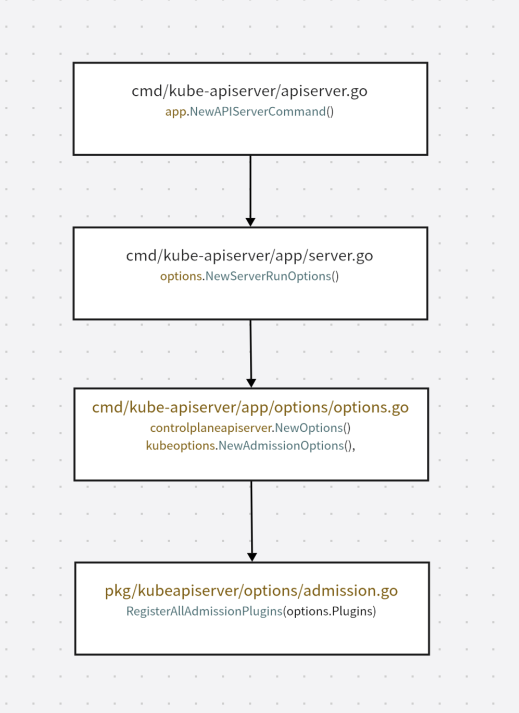
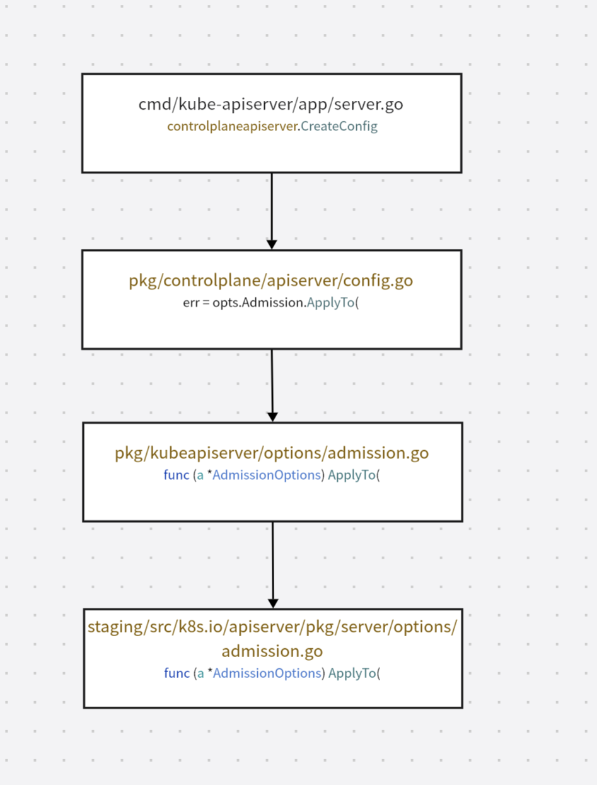
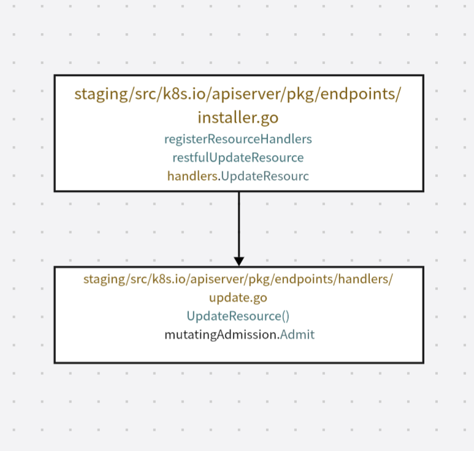
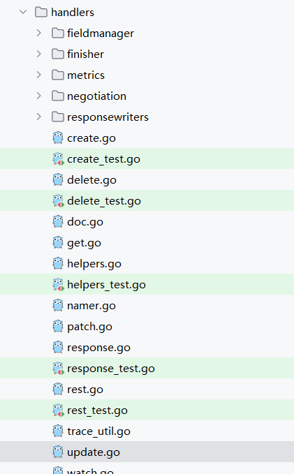

# 5.9 准入 admission control


## **Admission简介**

Admission Controller在[HTTP请求](https://so.csdn.net/so/search?q=HTTP%E8%AF%B7%E6%B1%82\&spm=1001.2101.3001.7020)经过登录和鉴权之后并且在Request真正被处理并且存储到[Etcd](https://so.csdn.net/so/search?q=Etcd\&spm=1001.2101.3001.7020)之前去执行，可以修改请求对象（Mutation）或校验请求（Validation）

<figure><figcaption></figcaption></figure>

一个Request进入API Server后会经过如下的处理过程：

1. **Authentication Authorization**：登录和鉴权，校验Request发送者是否合法
2. **Decode & Conversion**：Request以JSON格式发过来，转换为Go结构体类型，将外部版本转换为API Server内部APIObject版本
3. **Admission - Mutation**：拿到Request对内容进行调整
4. **Admission - Mutation Webhook**：通过Webhook调用Kubernetes使用者扩展的Mutation逻辑
5. **Admission - Validation**：拿到Request对内容进行校验
6. **Admission - Validation Webhook**：通过Webhook调用Kubernetes使用者扩展的Validation逻辑
7. **ETCD**：将Request落实到ETCD中

## **内建的Admission Plugin**

在启动API Server时，有些Admission是默认启用的，使用者可以通过启动参数来启动或禁用指定Admission，但无法影响一个Admission内部的逻辑

```go
// pkg/kubeapiserver/options/plugins.go
// AllOrderedPlugins is the list of all the plugins in order.
var AllOrderedPlugins = []string{
    admit.PluginName,                        // AlwaysAdmit
    autoprovision.PluginName,                // NamespaceAutoProvision
    lifecycle.PluginName,                    // NamespaceLifecycle
    exists.PluginName,                       // NamespaceExists
    antiaffinity.PluginName,                 // LimitPodHardAntiAffinityTopology
    limitranger.PluginName,                  // LimitRanger
    serviceaccount.PluginName,               // ServiceAccount
    noderestriction.PluginName,              // NodeRestriction
    nodetaint.PluginName,                    // TaintNodesByCondition
    alwayspullimages.PluginName,             // AlwaysPullImages
    imagepolicy.PluginName,                  // ImagePolicyWebhook
    podsecurity.PluginName,                  // PodSecurity
    podnodeselector.PluginName,              // PodNodeSelector
    podpriority.PluginName,                  // Priority
    defaulttolerationseconds.PluginName,     // DefaultTolerationSeconds
    podtolerationrestriction.PluginName,     // PodTolerationRestriction
    eventratelimit.PluginName,               // EventRateLimit
    extendedresourcetoleration.PluginName,   // ExtendedResourceToleration
    setdefault.PluginName,                   // DefaultStorageClass
    storageobjectinuseprotection.PluginName, // StorageObjectInUseProtection
    gc.PluginName,                           // OwnerReferencesPermissionEnforcement
    resize.PluginName,                       // PersistentVolumeClaimResize
    runtimeclass.PluginName,                 // RuntimeClass
    certapproval.PluginName,                 // CertificateApproval
    certsigning.PluginName,                  // CertificateSigning
    ctbattest.PluginName,                    // ClusterTrustBundleAttest
    certsubjectrestriction.PluginName,       // CertificateSubjectRestriction
    defaultingressclass.PluginName,          // DefaultIngressClass
    denyserviceexternalips.PluginName,       // DenyServiceExternalIPs

    // new admission plugins should generally be inserted above here
    // webhook, resourcequota, and deny plugins must go at the end

    mutatingadmissionpolicy.PluginName,   // MutatingAdmissionPolicy
    mutatingwebhook.PluginName,           // MutatingAdmissionWebhook
    validatingadmissionpolicy.PluginName, // ValidatingAdmissionPolicy
    validatingwebhook.PluginName,         // ValidatingAdmissionWebhook
    resourcequota.PluginName,             // ResourceQuota
    deny.PluginName,                      // AlwaysDeny
}
```

其中有三个特殊的Admission Plugin：ImagePolicyWebhook、MutatingAdmissionWebhook、ValidatingAdmissionWebhook，它们会根据设置去调用使用者自己写的Web服务，传入请求的目标Object，让该服务判断是否需要拒绝、允许或进行修改。这是Kubernetes所提供的标准扩展方式之一


## **Admission Plugin 的注册**

**1）注册 Admission Option**

函数之间调用逻辑如下：

<figure><figcaption></figcaption></figure>

最核心的是`RegisterAllAdmissionPlugins()`方法，代码如下：

```go
// pkg/kubeapiserver/options/plugins.go
// RegisterAllAdmissionPlugins registers all admission plugins.
// The order of registration is irrelevant, see AllOrderedPlugins for execution order.
func RegisterAllAdmissionPlugins(plugins *admission.Plugins) {
    admit.Register(plugins) // DEPRECATED as no real meaning
    alwayspullimages.Register(plugins)
    antiaffinity.Register(plugins)
    defaulttolerationseconds.Register(plugins)
    defaultingressclass.Register(plugins)
    denyserviceexternalips.Register(plugins)
    deny.Register(plugins) // DEPRECATED as no real meaning
    eventratelimit.Register(plugins)
    extendedresourcetoleration.Register(plugins)
    gc.Register(plugins)
    imagepolicy.Register(plugins)
    limitranger.Register(plugins)
    autoprovision.Register(plugins)
    exists.Register(plugins)
    noderestriction.Register(plugins)
    nodetaint.Register(plugins)
    podnodeselector.Register(plugins)
    podtolerationrestriction.Register(plugins)
    runtimeclass.Register(plugins)
    resourcequota.Register(plugins)
    podsecurity.Register(plugins)
    podpriority.Register(plugins)
    serviceaccount.Register(plugins)
    setdefault.Register(plugins)
    resize.Register(plugins)
    storageobjectinuseprotection.Register(plugins)
    certapproval.Register(plugins)
    certsigning.Register(plugins)
    ctbattest.Register(plugins)
    certsubjectrestriction.Register(plugins)
}
```

**2）根据Admission Option配置 APIServer Config**

函数之间调用逻辑如下：

\


<figure><figcaption></figcaption></figure>

```go
func (a *AdmissionOptions) ApplyTo(
	c *server.Config,
	informers informers.SharedInformerFactory,
	kubeClient kubernetes.Interface,
	dynamicClient dynamic.Interface,
	features featuregate.FeatureGate,
	pluginInitializers ...admission.PluginInitializer,
) error {
	if a == nil {
		return nil
	}

	// Admission depends on CoreAPI to set SharedInformerFactory and ClientConfig.
	if informers == nil {
		return fmt.Errorf("admission depends on a Kubernetes core API shared informer, it cannot be nil")
	}
	if kubeClient == nil || dynamicClient == nil {
		return fmt.Errorf("admission depends on a Kubernetes core API client, it cannot be nil")
	}

	pluginNames := a.enabledPluginNames()

	pluginsConfigProvider, err := admission.ReadAdmissionConfiguration(pluginNames, a.ConfigFile, configScheme)
	if err != nil {
		return fmt.Errorf("failed to read plugin config: %v", err)
	}

	discoveryClient := cacheddiscovery.NewMemCacheClient(kubeClient.Discovery())
	discoveryRESTMapper := restmapper.NewDeferredDiscoveryRESTMapper(discoveryClient)
	genericInitializer := initializer.New(kubeClient, dynamicClient, informers, c.Authorization.Authorizer, features,
		c.DrainedNotify(), discoveryRESTMapper)
	initializersChain := admission.PluginInitializers{genericInitializer}
	initializersChain = append(initializersChain, pluginInitializers...)

	admissionPostStartHook := func(hookContext server.PostStartHookContext) error {
		discoveryRESTMapper.Reset()
		go utilwait.Until(discoveryRESTMapper.Reset, 30*time.Second, hookContext.Done())
		return nil
	}

	err = c.AddPostStartHook("start-apiserver-admission-initializer", admissionPostStartHook)
	if err != nil {
		return fmt.Errorf("failed to add post start hook for policy admission: %w", err)
	}

	admissionChain, err := a.Plugins.NewFromPlugins(pluginNames, pluginsConfigProvider, initializersChain, a.Decorators)
	if err != nil {
		return err
	}

	c.AdmissionControl = admissionmetrics.WithStepMetrics(admissionChain)
	return nil
}
```

**3）Admission Plugin注入到Request Handler中**

API Resource的装载流程中和Admission相关的逻辑如下：

<figure><figcaption></figcaption></figure>

## MutationInterface

以 put 请求为例， `registerResourceHandlers()`方法中调用逻辑如下：

<figure><figcaption></figcaption></figure>

staging/src/k8s.io/apiserver/pkg/endpoints/handlers 包下每一个文件对应一个http verb，负责构建对该verb 的handler

<figure><figcaption></figcaption></figure>

UpdateResource（）代码如下：

```go
// UpdateResource returns a function that will handle a resource update
func UpdateResource(r rest.Updater, scope *RequestScope, admit admission.Interface) http.HandlerFunc {
    return func(w http.ResponseWriter, req *http.Request) {
       ctx := req.Context()
       // For performance tracking purposes.
       ctx, span := tracing.Start(ctx, "Update", traceFields(req)...)
       req = req.WithContext(ctx)
       defer span.End(500 * time.Millisecond)

       namespace, name, err := scope.Namer.Name(req)
       if err != nil {
          scope.err(err, w, req)
          return
       }

       // enforce a timeout of at most requestTimeoutUpperBound (34s) or less if the user-provided
       // timeout inside the parent context is lower than requestTimeoutUpperBound.
       ctx, cancel := context.WithTimeout(ctx, requestTimeoutUpperBound)
       defer cancel()

       ctx = request.WithNamespace(ctx, namespace)

       outputMediaType, _, err := negotiation.NegotiateOutputMediaType(req, scope.Serializer, scope)
       if err != nil {
          scope.err(err, w, req)
          return
       }

       body, err := limitedReadBodyWithRecordMetric(ctx, req, scope.MaxRequestBodyBytes, scope.Resource.GroupResource().String(), requestmetrics.Update)
       if err != nil {
          span.AddEvent("limitedReadBody failed", attribute.Int("len", len(body)), attribute.String("err", err.Error()))
          scope.err(err, w, req)
          return
       }
       span.AddEvent("limitedReadBody succeeded", attribute.Int("len", len(body)))

       options := &metav1.UpdateOptions{}
       if err := metainternalversionscheme.ParameterCodec.DecodeParameters(req.URL.Query(), scope.MetaGroupVersion, options); err != nil {
          err = errors.NewBadRequest(err.Error())
          scope.err(err, w, req)
          return
       }
       if errs := validation.ValidateUpdateOptions(options); len(errs) > 0 {
          err := errors.NewInvalid(schema.GroupKind{Group: metav1.GroupName, Kind: "UpdateOptions"}, "", errs)
          scope.err(err, w, req)
          return
       }
       options.TypeMeta.SetGroupVersionKind(metav1.SchemeGroupVersion.WithKind("UpdateOptions"))

       s, err := negotiation.NegotiateInputSerializer(req, false, scope.Serializer)
       if err != nil {
          scope.err(err, w, req)
          return
       }
       defaultGVK := scope.Kind
       original := r.New()

       validationDirective := fieldValidation(options.FieldValidation)
       decodeSerializer := s.Serializer
       if validationDirective == metav1.FieldValidationWarn || validationDirective == metav1.FieldValidationStrict {
          decodeSerializer = s.StrictSerializer
       }

       decoder := scope.Serializer.DecoderToVersion(decodeSerializer, scope.HubGroupVersion)
       span.AddEvent("About to convert to expected version")
       obj, gvk, err := decoder.Decode(body, &defaultGVK, original)
       if err != nil {
          strictError, isStrictError := runtime.AsStrictDecodingError(err)
          switch {
          case isStrictError && obj != nil && validationDirective == metav1.FieldValidationWarn:
             addStrictDecodingWarnings(req.Context(), strictError.Errors())
          case isStrictError && validationDirective == metav1.FieldValidationIgnore:
             klog.Warningf("unexpected strict error when field validation is set to ignore")
             fallthrough
          default:
             err = transformDecodeError(scope.Typer, err, original, gvk, body)
             scope.err(err, w, req)
             return
          }
       }

       objGV := gvk.GroupVersion()
       if !scope.AcceptsGroupVersion(objGV) {
          err = errors.NewBadRequest(fmt.Sprintf("the API version in the data (%s) does not match the expected API version (%s)", objGV, defaultGVK.GroupVersion()))
          scope.err(err, w, req)
          return
       }
       span.AddEvent("Conversion done")

       audit.LogRequestObject(req.Context(), obj, objGV, scope.Resource, scope.Subresource, scope.Serializer)
       admit = admission.WithAudit(admit)

       // if this object supports namespace info
       if objectMeta, err := meta.Accessor(obj); err == nil {
          // ensure namespace on the object is correct, or error if a conflicting namespace was set in the object
          if err := rest.EnsureObjectNamespaceMatchesRequestNamespace(rest.ExpectedNamespaceForResource(namespace, scope.Resource), objectMeta); err != nil {
             scope.err(err, w, req)
             return
          }
       }

       if err := checkName(obj, name, namespace, scope.Namer); err != nil {
          scope.err(err, w, req)
          return
       }

       userInfo, _ := request.UserFrom(ctx)
       transformers := []rest.TransformFunc{}

       // allows skipping managedFields update if the resulting object is too big
       shouldUpdateManagedFields := true
       admit = fieldmanager.NewManagedFieldsValidatingAdmissionController(admit)
       transformers = append(transformers, func(_ context.Context, newObj, liveObj runtime.Object) (runtime.Object, error) {
          if shouldUpdateManagedFields {
             return scope.FieldManager.UpdateNoErrors(liveObj, newObj, managerOrUserAgent(options.FieldManager, req.UserAgent())), nil
          }
          return newObj, nil
       })

      // **************************** 判断是否实现了 MutationInterface 接口
       if mutatingAdmission, ok := admit.(admission.MutationInterface); ok {
          transformers = append(transformers, func(ctx context.Context, newObj, oldObj runtime.Object) (runtime.Object, error) {
             isNotZeroObject, err := hasUID(oldObj)
             if err != nil {
                return nil, fmt.Errorf("unexpected error when extracting UID from oldObj: %v", err.Error())
             } else if !isNotZeroObject {
                if mutatingAdmission.Handles(admission.Create) {
                   return newObj, mutatingAdmission.Admit(ctx, admission.NewAttributesRecord(newObj, nil, scope.Kind, namespace, name, scope.Resource, scope.Subresource, admission.Create, updateToCreateOptions(options), dryrun.IsDryRun(options.DryRun), userInfo), scope)
                }
             } else {
                if mutatingAdmission.Handles(admission.Update) {
                   return newObj, mutatingAdmission.Admit(ctx, admission.NewAttributesRecord(newObj, oldObj, scope.Kind, namespace, name, scope.Resource, scope.Subresource, admission.Update, options, dryrun.IsDryRun(options.DryRun), userInfo), scope)
                }
             }
             return newObj, nil
          })
          transformers = append(transformers, func(ctx context.Context, newObj, oldObj runtime.Object) (runtime.Object, error) {
             // Dedup owner references again after mutating admission happens
             dedupOwnerReferencesAndAddWarning(newObj, req.Context(), true)
             return newObj, nil
          })
       }

       createAuthorizerAttributes := authorizer.AttributesRecord{
          User:            userInfo,
          ResourceRequest: true,
          Path:            req.URL.Path,
          Verb:            "create",
          APIGroup:        scope.Resource.Group,
          APIVersion:      scope.Resource.Version,
          Resource:        scope.Resource.Resource,
          Subresource:     scope.Subresource,
          Namespace:       namespace,
          Name:            name,
       }

       span.AddEvent("About to store object in database")
       wasCreated := false
       requestFunc := func() (runtime.Object, error) {
          obj, created, err := r.Update(
             ctx,
             name,
             rest.DefaultUpdatedObjectInfo(obj, transformers...),
             withAuthorization(rest.AdmissionToValidateObjectFunc(
                admit,
                admission.NewAttributesRecord(nil, nil, scope.Kind, namespace, name, scope.Resource, scope.Subresource, admission.Create, updateToCreateOptions(options), dryrun.IsDryRun(options.DryRun), userInfo), scope),
                scope.Authorizer, createAuthorizerAttributes),
             rest.AdmissionToValidateObjectUpdateFunc(
                admit,
                admission.NewAttributesRecord(nil, nil, scope.Kind, namespace, name, scope.Resource, scope.Subresource, admission.Update, options, dryrun.IsDryRun(options.DryRun), userInfo), scope),
             false,
             options,
          )
          wasCreated = created
          return obj, err
       }
       // Dedup owner references before updating managed fields
       dedupOwnerReferencesAndAddWarning(obj, req.Context(), false)
       result, err := finisher.FinishRequest(ctx, func() (runtime.Object, error) {
          result, err := requestFunc()
          // If the object wasn't committed to storage because it's serialized size was too large,
          // it is safe to remove managedFields (which can be large) and try again.
          if isTooLargeError(err) {
             if accessor, accessorErr := meta.Accessor(obj); accessorErr == nil {
                accessor.SetManagedFields(nil)
                shouldUpdateManagedFields = false
                result, err = requestFunc()
             }
          }
          return result, err
       })
       if err != nil {
          span.AddEvent("Write to database call failed", attribute.Int("len", len(body)), attribute.String("err", err.Error()))
          scope.err(err, w, req)
          return
       }
       span.AddEvent("Write to database call succeeded", attribute.Int("len", len(body)))

       status := http.StatusOK
       if wasCreated {
          status = http.StatusCreated
       }

       span.AddEvent("About to write a response")
       defer span.AddEvent("Writing http response done")
       transformResponseObject(ctx, scope, req, w, status, outputMediaType, result)
    }
}
```

`UpdateResource()`方法中使用Mutation Admission来构造Transformer，用于更改被更新的目标Object，然后调用`r.Update()`方法，该方法实现如下：

```go
// Update performs an atomic update and set of the object. Returns the result of the update
// or an error. If the registry allows create-on-update, the create flow will be executed.
// A bool is returned along with the object and any errors, to indicate object creation.
func (e *Store) Update(ctx context.Context, name string, objInfo rest.UpdatedObjectInfo, createValidation rest.ValidateObjectFunc, updateValidation rest.ValidateObjectUpdateFunc, forceAllowCreate bool, options *metav1.UpdateOptions) (runtime.Object, bool, error) {
    key, err := e.KeyFunc(ctx, name)
    if err != nil {
       return nil, false, err
    }

    var (
       creatingObj runtime.Object
       creating    = false
    )

    qualifiedResource := e.qualifiedResourceFromContext(ctx)
    storagePreconditions := &storage.Preconditions{}
    if preconditions := objInfo.Preconditions(); preconditions != nil {
       storagePreconditions.UID = preconditions.UID
       storagePreconditions.ResourceVersion = preconditions.ResourceVersion
    }

    out := e.NewFunc()
    // deleteObj is only used in case a deletion is carried out
    var deleteObj runtime.Object
    err = e.Storage.GuaranteedUpdate(ctx, key, out, true, storagePreconditions, func(existing runtime.Object, res storage.ResponseMeta) (runtime.Object, *uint64, error) {
       existingResourceVersion, err := e.Storage.Versioner().ObjectResourceVersion(existing)
       if err != nil {
          return nil, nil, err
       }
       if existingResourceVersion == 0 {
          if !e.UpdateStrategy.AllowCreateOnUpdate() && !forceAllowCreate {
             return nil, nil, apierrors.NewNotFound(qualifiedResource, name)
          }
       }

       // Given the existing object, get the new object
       obj, err := objInfo.UpdatedObject(ctx, existing)
       if err != nil {
          return nil, nil, err
       }

       // If AllowUnconditionalUpdate() is true and the object specified by
       // the user does not have a resource version, then we populate it with
       // the latest version. Else, we check that the version specified by
       // the user matches the version of latest storage object.
       newResourceVersion, err := e.Storage.Versioner().ObjectResourceVersion(obj)
       if err != nil {
          return nil, nil, err
       }
       doUnconditionalUpdate := newResourceVersion == 0 && e.UpdateStrategy.AllowUnconditionalUpdate()

       if existingResourceVersion == 0 {
          // Init metadata as early as possible.
          if objectMeta, err := meta.Accessor(obj); err != nil {
             return nil, nil, err
          } else {
             rest.FillObjectMetaSystemFields(objectMeta)
          }

          var finishCreate FinishFunc = finishNothing

          if e.BeginCreate != nil {
             fn, err := e.BeginCreate(ctx, obj, newCreateOptionsFromUpdateOptions(options))
             if err != nil {
                return nil, nil, err
             }
             finishCreate = fn
             defer func() {
                finishCreate(ctx, false)
             }()
          }

          creating = true
          creatingObj = obj
          if err := rest.BeforeCreate(e.CreateStrategy, ctx, obj); err != nil {
             return nil, nil, err
          }
          // at this point we have a fully formed object.  It is time to call the validators that the apiserver
          // handling chain wants to enforce.
          if createValidation != nil {
             if err := createValidation(ctx, obj.DeepCopyObject()); err != nil {
                return nil, nil, err
             }
          }
          ttl, err := e.calculateTTL(obj, 0, false)
          if err != nil {
             return nil, nil, err
          }

          // The operation has succeeded.  Call the finish function if there is one,
          // and then make sure the defer doesn't call it again.
          fn := finishCreate
          finishCreate = finishNothing
          fn(ctx, true)

          return obj, &ttl, nil
       }

       creating = false
       creatingObj = nil
       if doUnconditionalUpdate {
          // Update the object's resource version to match the latest
          // storage object's resource version.
          err = e.Storage.Versioner().UpdateObject(obj, res.ResourceVersion)
          if err != nil {
             return nil, nil, err
          }
       } else {
          // Check if the object's resource version matches the latest
          // resource version.
          if newResourceVersion == 0 {
             // TODO: The Invalid error should have a field for Resource.
             // After that field is added, we should fill the Resource and
             // leave the Kind field empty. See the discussion in #18526.
             qualifiedKind := schema.GroupKind{Group: qualifiedResource.Group, Kind: qualifiedResource.Resource}
             fieldErrList := field.ErrorList{field.Invalid(field.NewPath("metadata").Child("resourceVersion"), newResourceVersion, "must be specified for an update")}
             return nil, nil, apierrors.NewInvalid(qualifiedKind, name, fieldErrList)
          }
          if newResourceVersion != existingResourceVersion {
             return nil, nil, apierrors.NewConflict(qualifiedResource, name, fmt.Errorf(OptimisticLockErrorMsg))
          }
       }

       var finishUpdate FinishFunc = finishNothing

       if e.BeginUpdate != nil {
          fn, err := e.BeginUpdate(ctx, obj, existing, options)
          if err != nil {
             return nil, nil, err
          }
          finishUpdate = fn
          defer func() {
             finishUpdate(ctx, false)
          }()
       }

       if err := rest.BeforeUpdate(e.UpdateStrategy, ctx, obj, existing); err != nil {
          return nil, nil, err
       }

       // Ignore changes that only affect managed fields timestamps.
       // FieldManager can't know about changes like normalized fields, defaulted
       // fields and other mutations.
       obj, err = fieldmanager.IgnoreManagedFieldsTimestampsTransformer(ctx, obj, existing)
       if err != nil {
          return nil, nil, err
       }

       // at this point we have a fully formed object.  It is time to call the validators that the apiserver
       // handling chain wants to enforce.
       if updateValidation != nil {
          if err := updateValidation(ctx, obj.DeepCopyObject(), existing.DeepCopyObject()); err != nil {
             return nil, nil, err
          }
       }
       // Check the default delete-during-update conditions, and store-specific conditions if provided
       if ShouldDeleteDuringUpdate(ctx, key, obj, existing) &&
          (e.ShouldDeleteDuringUpdate == nil || e.ShouldDeleteDuringUpdate(ctx, key, obj, existing)) {
          deleteObj = obj
          return nil, nil, errEmptiedFinalizers
       }
       ttl, err := e.calculateTTL(obj, res.TTL, true)
       if err != nil {
          return nil, nil, err
       }

       // The operation has succeeded.  Call the finish function if there is one,
       // and then make sure the defer doesn't call it again.
       fn := finishUpdate
       finishUpdate = finishNothing
       fn(ctx, true)

       if int64(ttl) != res.TTL {
          return obj, &ttl, nil
       }
       return obj, nil, nil
    }, dryrun.IsDryRun(options.DryRun), nil)

    if err != nil {
       // delete the object
       if err == errEmptiedFinalizers {
          return e.deleteWithoutFinalizers(ctx, name, key, deleteObj, storagePreconditions, newDeleteOptionsFromUpdateOptions(options))
       }
       if creating {
          err = storeerr.InterpretCreateError(err, qualifiedResource, name)
          err = rest.CheckGeneratedNameError(ctx, e.CreateStrategy, err, creatingObj)
       } else {
          err = storeerr.InterpretUpdateError(err, qualifiedResource, name)
       }
       return nil, false, err
    }

    if creating {
       if e.AfterCreate != nil {
          e.AfterCreate(out, newCreateOptionsFromUpdateOptions(options))
       }
    } else {
       if e.AfterUpdate != nil {
          e.AfterUpdate(out, options)
       }
    }
    if e.Decorator != nil {
       e.Decorator(out)
    }
    return out, creating, nil
}
```

在Storage Object的Update方法前，先调用Transformers，完成Mutation Admission，然后使用Validation Admission，如果Validation出错直接返回。

## limitRanger

### 接口

一般 admission 插件会实现两个接口 :

```go
type MutationInterface interface {
    Interface

    // Admit makes an admission decision based on the request attributes.
    // Context is used only for timeout/deadline/cancellation and tracing information.
    Admit(ctx context.Context, a Attributes, o ObjectInterfaces) (err error)
}

// ValidationInterface is an abstract, pluggable interface for Admission Control decisions.
type ValidationInterface interface {
    Interface

    // Validate makes an admission decision based on the request attributes.  It is NOT allowed to mutate
    // Context is used only for timeout/deadline/cancellation and tracing information.
    Validate(ctx context.Context, a Attributes, o ObjectInterfaces) (err error)
}
```

一个请求进来，我们可以决定对某个资源的某个操作设置 admission，可以是 validate ，也可以是 mutation。

### limitranger

默认情况下， Kubernetes 集群上的容器运行使用的[计算资源](https://kubernetes.io/zh-cn/docs/concepts/configuration/manage-resources-containers/)没有限制。 使用 Kubernetes [资源配额](https://kubernetes.io/zh-cn/docs/concepts/policy/resource-quotas/)， 管理员（也称为**集群操作者**）可以在一个指定的[命名空间](https://kubernetes.io/zh-cn/docs/concepts/overview/working-with-objects/namespaces/)内限制集群资源的使用与创建。 在命名空间中，一个 [Pod](https://kubernetes.io/zh-cn/docs/concepts/workloads/pods/) 最多能够使用命名空间的资源配额所定义的 CPU 和内存用量。 作为集群操作者或命名空间级的管理员，你可能也会担心如何确保一个 Pod 不会垄断命名空间内所有可用的资源。

LimitRange 是限制命名空间内可为每个适用的对象类别 （例如 Pod 或 [PersistentVolumeClaim](https://kubernetes.io/zh-cn/docs/concepts/storage/persistent-volumes/#persistentvolumeclaims)） 指定的资源分配量（限制和请求）的策略对象。

一个 **LimitRange（限制范围）** 对象提供的限制能够做到：

* 在一个命名空间中实施对每个 Pod 或 Container 最小和最大的资源使用量的限制。
* 在一个命名空间中实施对每个 [PersistentVolumeClaim](https://kubernetes.io/zh-cn/docs/concepts/storage/persistent-volumes/#persistentvolumeclaims) 能申请的最小和最大的存储空间大小的限制。
* 在一个命名空间中实施对一种资源的申请值和限制值的比值的控制。
* 设置一个命名空间中对计算资源的默认申请/限制值，并且自动的在运行时注入到多个 Container 中。

只要特定命名空间中至少有一个 LimitRange 对象，Kubernetes 就会限制对该命名空间中的 Pod 的资源分配。

例如，你使用如下清单定义一个 LimitRange：

```yaml
apiVersion: v1
kind: LimitRange
metadata:
  name: cpu-resource-constraint
spec:
  limits:
  - default: # 此处定义默认限制值
      cpu: 500m
    defaultRequest: # 此处定义默认请求值
      cpu: 500m
    max: # max 和 min 定义限制范围
      cpu: "1"
    min:
      cpu: 100m
    type: Container
```

### 源码

当我们创建一个资源时候，会触发  validate 操作， k8s 会判断是否能创建新资源，主要原理就是先获取某个明命名空间下的资源，计算资源总量，判断新资源加入后是否超出设置的总量，如果超出则拒绝。

```go
// Admit admits resources into cluster that do not violate any defined LimitRange in the namespace
func (l *LimitRanger) Admit(ctx context.Context, a admission.Attributes, o admission.ObjectInterfaces) (err error) {
    return l.runLimitFunc(a, l.actions.MutateLimit)
}

// Validate admits resources into cluster that do not violate any defined LimitRange in the namespace
func (l *LimitRanger) Validate(ctx context.Context, a admission.Attributes, o admission.ObjectInterfaces) (err error) {
    return l.runLimitFunc(a, l.actions.ValidateLimit)
}

func (l *LimitRanger) runLimitFunc(a admission.Attributes, limitFn func(limitRange *corev1.LimitRange, kind string, obj runtime.Object) error) (err error) {
    if !l.actions.SupportsAttributes(a) {
       return nil
    }

    // ignore all objects marked for deletion
    oldObj := a.GetOldObject()
    if oldObj != nil {
       oldAccessor, err := meta.Accessor(oldObj)
       if err != nil {
          return admission.NewForbidden(a, err)
       }
       if oldAccessor.GetDeletionTimestamp() != nil {
          return nil
       }
    }

    items, err := l.GetLimitRanges(a)
    if err != nil {
       return err
    }

    // ensure it meets each prescribed min/max
    for i := range items {
       limitRange := items[i]

       if !l.actions.SupportsLimit(limitRange) {
          continue
       }

       err = limitFn(limitRange, a.GetResource().Resource, a.GetObject())
       if err != nil {
          return admission.NewForbidden(a, err)
       }
    }
    return nil
}
```
