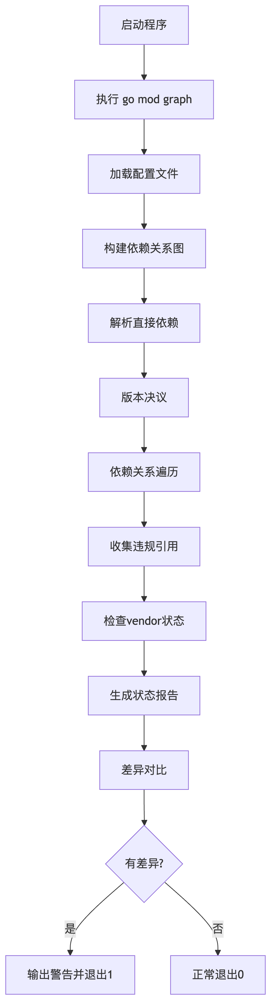

# 2025-0521-Add a list of modules that should be pinned at current versions #131871

在 k8s 源码中有个工具：**dependencyverifier.go** ，作用是跟踪不需要的依赖项。当我们运行 **./hack/lint-dependencies.sh 时：**

* 检查 forbidden\_​​repos，如果已禁用则退出，用户应在 unwanted-dependencies.json 中更新它
* 检查 unwanted-dependencies，如果没有则退出，用户应在 unwanted-dependencies.json 中更新它

测试结果输出样例：

```
➜  kubernetes git:(track-unwanted-dependencies-1) hack/lint-dependencies.sh
Check all unwanted dependencies and update its status.
2021/09/18 13:32:05 The following dependencies **are not allowed:**
github.com/hashicorp/golang-lru
2021/09/18 13:32:05 !!! Please update status in ./hack/unwanted-dependencies.json
exit status 1

➜  kubernetes git:(track-unwanted-dependencies-1) ✗ hack/lint-dependencies.sh
Check all unwanted dependencies and update its status.
2021/09/18 13:33:36 The following dependencies **are removed:**
k8s.io/klog
2021/09/18 13:33:36 !!! Please update status in ./hack/unwanted-dependencies.json
exit status 1

➜  kubernetes git:(track-unwanted-dependencies-1) ✗ hack/lint-dependencies.sh
Check all unwanted dependencies and update its status.
2021/09/18 13:33:19 The following dependencies are removed:
k8s.io/klog
2021/09/18 13:33:19 The following dependencies are not allowed:
k8s.io/klog/v2
2021/09/18 13:33:19 !!! Please update status in ./hack/unwanted-dependencies.json
exit status 1

➜  kubernetes git:(track-unwanted-dependencies-1) hack/lint-dependencies.sh
Check all unwanted dependencies and update its status.
All pinned versions of checked dependencies match their preferred version.

```

<figure><figcaption></figcaption></figure>
