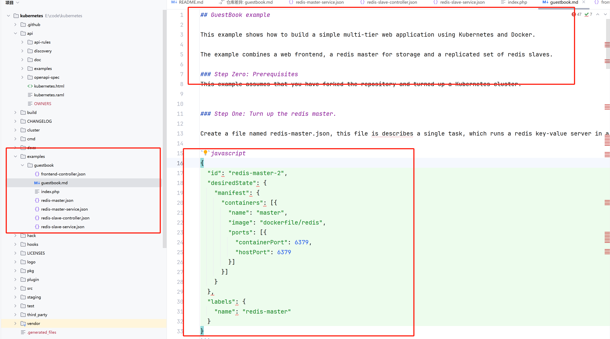

# k8s 早期那些事-01-json

k8s 已经出来10年了，这个改变了应用部署的革命性项目，极大的减轻了运维部署应用的复杂度。这个系列文章我想带大家了解下 k8s 早期的一些设计。

k8s 早期还没有 yaml 格式，创建的资源用 json 格式表示。在最初代码的中有个 examples 文件夹，文件夹中有个 guestbook 示例项目，我们来看看这个项目。

<figure><figcaption></figcaption></figure>

我们创建一个 controller 资源的命令和配置如下：

```
./src/scripts/cloudcfg.sh -c redis-slave-controller.json create /replicationControllers
```

```json

  {
    "id": "redisSlaveController",
    "desiredState": {
      "replicas": 2,
      "replicasInSet": {"name": "redis-slave"},
      "taskTemplate": {
        "desiredState": {
           "manifest": {
             "containers": [{
               "image": "brendanburns/redis-slave",
               "ports": [{"containerPort": 6379, "hostPort": 6380}]
             }]
           }
         },
         "labels": {"name": "redis-slave"}
        }},
    "labels": {"name": "redis-slave"}
  }
```

然后我们创建一个 service 资源：

```
{
  "id": "redisslave",
  "port": 10001,
  "labels": {
    "name": "redis-slave"
  }
}
```
