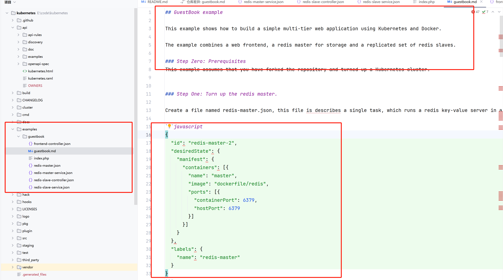

# Kubernetes源码探秘：从早期设计看容器编排的演进


## 引言：Kubernetes十年回眸

Kubernetes（简称k8s）已经走过了十个年头，这个革命性的项目彻底改变了应用部署的方式，极大地降低了运维复杂度。作为云原生时代的基石，k8s的成功并非一蹴而就，而是源于一系列精妙的设计决策。本文将带您穿越回k8s的早期版本，通过分析最初的代码结构和设计理念，揭示这个容器编排系统背后的演进历程。

## 初识k8s的"Hello World"：guestbook示例

在k8s的最初代码库中，有一个名为`examples`的文件夹，其中包含了一个名为`guestbook`的示例项目，这可以说是k8s世界的"Hello World"程序。这个简单的留言板应用展示了k8s最基础但核心的功能。

<figure><figcaption></figcaption></figure>

我们创建一个 controller 资源的命令如下：

```
./src/scripts/cloudcfg.sh -c redis-slave-controller.json create /replicationControllers
```

```json

  {
    "id": "redisSlaveController",
    "desiredState": {
      "replicas": 2,
      "replicasInSet": {"name": "redis-slave"},
      "taskTemplate": {
        "desiredState": {
           "manifest": {
             "containers": [{
               "image": "brendanburns/redis-slave",
               "ports": [{"containerPort": 6379, "hostPort": 6380}]
             }]
           }
         },
         "labels": {"name": "redis-slave"}
        }},
    "labels": {"name": "redis-slave"}
  }
  {
  "id": "redisslave",
  "port": 10001,
  "labels": {
    "name": "redis-slave"
  }
}
```


### JSON时代：k8s的资源配置雏形

现代k8s用户可能难以想象，在早期版本中，k8s还没有采用现在普遍使用的YAML格式，而是使用JSON来描述资源。这种选择反映了k8s最初的设计理念：

1. **机器友好优先**：JSON作为当时Web服务的事实标准，更易于机器解析和处理
2. **API驱动设计**：k8s从一开始就强调API优先，JSON天然适合API交互
3. **简洁性考量**：早期功能相对简单，JSON的冗长问题还不突出

以下是一个早期k8s Pod定义的JSON示例：

```json
{
  "kind": "Pod",
  "apiVersion": "v1",
  "metadata": {
    "name": "frontend",
    "labels": {
      "app": "guestbook",
      "tier": "frontend"
    }
  },
  "spec": {
    "containers": [
      {
        "name": "php-redis",
        "image": "gcr.io/google-samples/gb-frontend:v4",
        "ports": [
          {
            "containerPort": 80
          }
        ]
      }
    ]
  }
}
```

#### guestbook示例的架构解析

guestbook示例虽然简单，但已经包含了k8s的几个核心概念：

1. **前端部署**：运行PHP应用的多个副本
2. **Redis主从**：一个主Redis实例和多个从实例
3. **服务抽象**：通过Service暴露前端和后端

这种架构清晰地展示了k8s早期的设计哲学——将应用拆分为多个可独立扩展的组件，并通过声明式API管理它们之间的关系。

### 从JSON到YAML：配置格式的演进

随着k8s功能日益复杂，JSON格式的局限性逐渐显现：

1. **可读性差**：大括号和引号使得文件难以阅读和维护
2. **注释缺失**：JSON不支持注释，不利于文档化
3. **手动编写困难**：复杂的资源配置容易出错

YAML作为JSON的超集，解决了这些问题：

* 支持注释
* 更简洁的缩进语法
* 保留与JSON的互操作性

这种格式转变反映了k8s从纯机器可读向兼顾人类可读性的演进，也标志着k8s从技术专家工具向更广泛开发者群体的扩展。

## 早期设计中的持久理念

尽管技术细节不断变化，k8s早期版本中确立的一些核心理念至今未变：

1. **声明式API**：用户声明期望状态，系统负责实现
2. **控制器模式**：通过控制循环协调实际状态与期望状态
3. **松耦合组件**：通过API交互的模块化架构
4. **标签系统**：灵活的键值对标签实现多维分类

这些设计选择使k8s能够适应不断变化的技术需求，同时保持核心架构的稳定性。


## 结语：从历史看未来

通过分析k8s的早期设计，我们不仅能够理解其成功的原因，还能洞察云原生技术的发展轨迹。guestbook示例虽然简单，却蕴含了k8s最本质的价值主张——简化分布式系统管理。随着k8s生态的不断壮大，这些早期设计决策仍在影响着新一代云原生技术的演进。

对于希望深入理解k8s的开发者来说，研究其历史版本和演进过程是掌握系统设计精髓的绝佳途径。在后续文章中，我们将继续探索k8s其他关键组件的设计演进，敬请期待。
