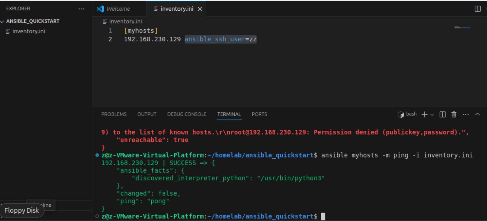
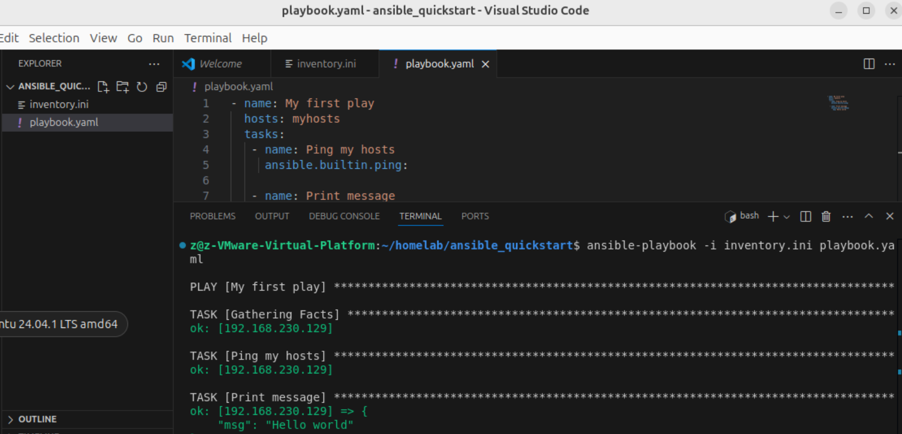

# 01- ansible 介绍

## &#x20;介绍

Ansible 提供开源自动化方案。使用简单的、人类可读的脚本（称为 playbook）来自动执行您的任务，可以在任何地方自动化任何任务。以下是 Ansible 的一些常见用例：

* 消除重复并简化工作流程
* 管理和维护系统配置
* 持续部署复杂的软件
* 执行零停机滚动更新

## &#x20;架构图

<figure><figcaption></figcaption></figure>

如上图所示，大多数 Ansible 环境都包含三个主要组件：

**Control node**

安装了 Ansible 的系统。您可以在控制节点上运行 Ansible 命令，例如`ansible`或`ansible-inventory` 。

**Inventory**&#x20;

在控制节点上创建的清单来描述 Ansible 管理的主机列表

**Managed node**

Ansible 控制的远程系统或主机。

## 安装

1. 安装 ansible

```
pip install ansible
```

2. 创建一个文件夹

```
mkdir ansible_quickstart && cd ansible_quickstart
```

3. 创建一个 inventory.ini 文件

```
touch inventory.ini
```

4. 将主机列表添加到 inventory.ini 文件

```
[myhosts]
192.0.2.50
192.0.2.51
192.0.2.52
```

5. 验证 inventory

```
ansible-inventory -i inventory.ini --list
```

6. 对清单中的主机进行 ping 操作

```
ansible myhosts -m ping -i inventory.ini

// 首先要能够免密 ssh 到主机列表
// 可以使用 ssh-copy-id -i ~/.ssh/{rsa.pub} {username}@{192.0.2.50} 来免密登录
// 记得替换括号里的参数

// 如果发现报错 Failed to connect to the host via ssh ,可能是control node 和 managed node用户不一致
// 可以在 ip 地址后面加上 ansible_ssh_user = xxx
```

<figure><figcaption><p>执行结果截图</p></figcaption></figure>

## inventory&#x20;

### 格式

你可以创建 ini 或 yaml 格式的 inventory 文件， init  格式对于少量被管节点来说非常简单且易于读取。

随着托管节点数量的增加，yaml 格式更好。例如，以下内容与`inventory.ini`等效，它声明受管节点的唯一名称并使用`ansible_host`字段：

```yaml
myhosts:
  hosts:
    my_host_01:
      ansible_host: 192.0.2.50
    my_host_02:
      ansible_host: 192.0.2.51
    my_host_03:
      ansible_host: 192.0.2.52
```

### metagroups

组可以包含组，下面示例中 network 可以包含  leafs 和 spines

```yaml
leafs:
  hosts:
    leaf01:
      ansible_host: 192.0.2.100
    leaf02:
      ansible_host: 192.0.2.110

spines:
  hosts:
    spine01:
      ansible_host: 192.0.2.120
    spine02:
      ansible_host: 192.0.2.130

network:
  children:
    leafs:
    spines:

webservers:
  hosts:
    webserver01:
      ansible_host: 192.0.2.140
    webserver02:
      ansible_host: 192.0.2.150

datacenter:
  children:
    network:
    webservers:
```

### 变量

```yaml
webservers:
  hosts:
    webserver01:
      ansible_host: 192.0.2.140
      http_port: 80
    webserver02:
      ansible_host: 192.0.2.150
      http_port: 443
  vars:
    ansible_user: my_server_user
```

## playbook

Playbook 是`YAML`格式的自动化蓝图，Ansible 使用它来部署和配置托管节点。

以下示例创建一个 playbook，该 playbook 可以自动帮你 ping 主机并打印“Hello world”消息：

```yaml
- name: My first play
  hosts: myhosts
  tasks:
   - name: Ping my hosts
     ansible.builtin.ping:

   - name: Print message
     ansible.builtin.debug:
       msg: Hello world
```

你可以运行以下命令来执行你的 playbook

```
ansible-playbook -i inventory.ini playbook.yaml
```

<figure><figcaption></figcaption></figure>
