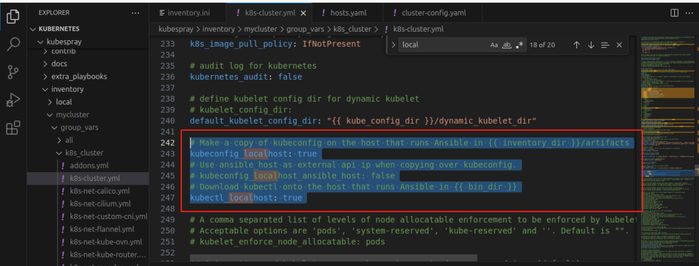
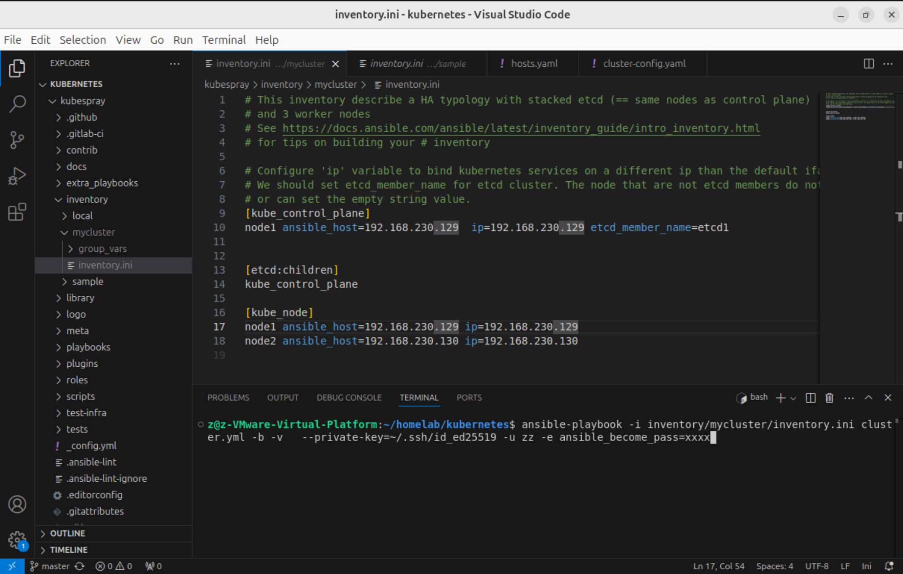

# 02-使用 kubespray安装 k8s集群

## &#x20;常见集群部署方式

在Kubernetes（K8s）中部署集群的方式多种多样，根据环境和需求的不同，常见的部署方式包括：

1. **手动二进制部署**
   * 从零开始手动配置每个节点上的所有组件。这包括安装Docker或容器运行时、设置网络插件、安装etcd集群、配置kube-apiserver、kube-controller-manager、kube-scheduler等控制面组件，并启动kube-proxy与kubelet服务。这种方式需要对Kubernetes架构有深入理解，适用于学习和实验场景。
2. **kubeadm部署**
   * `kubeadm`是Kubernetes官方提供的工具，用于快速搭建生产级别的Kubernetes集群。它简化了初始化Master节点以及加入Worker节点的过程，可以方便地创建一个最小化的高可用集群。
3. **第三方自动化部署工具**
   * Kubespray（Ansible playbook驱动的部署工具）：通过Ansible Playbooks自动化执行一系列步骤来部署Kubernetes集群，适用于生产环境，方便快捷。

## Kubespray

### 介绍

Kubespray 是一个开源项目，旨在帮助用户在多云环境中部署和管理Kubernetes集群。为了实现这个目标，Kubespray 使用了 Ansible 这个强大的工具。Ansible 是一个深受信赖的开源自动化运维工具，主要用于自动化应用部署、配置管理和任务执行。基于此，Kubespray 能够在各种云平台，如 AWS、GCE、Azure、OpenStack 等以及裸机等硬件上进行部署。

使用 Kubespray，用户可以选择执行一个 Ansible 脚本，然后 Ansible 会使用 SSH 协议与各个目标主机进行通信，并基于该脚本实现集群部署、清理、升级等任务。

<figure><figcaption></figcaption></figure>

### 安装

#### 克隆代码

```
git clone git@github.com:kubernetes-sigs/kubespray.git
```

#### 安装 ansible

需要提前安装下 python 和 pip ， 以下命令主要是创建一个 python 虚拟环境，并安装依赖，复制命令执行即可

```sh
VENVDIR=kubespray-venv
KUBESPRAYDIR=kubespray
python3 -m venv $VENVDIR
source $VENVDIR/bin/activate
cd $KUBESPRAYDIR
pip install -U -r requirements.txt
```

### 配置 inventory

将项目中 sample 文件夹目录拷贝一份，然后修改里面的主机和配置：

```
cp -r inventory/sample inventory/mycluster 
```

我使用了2台虚拟机，你可以参考我的写法和命令:

<figure><figcaption></figcaption></figure>

<figure><figcaption></figcaption></figure>

