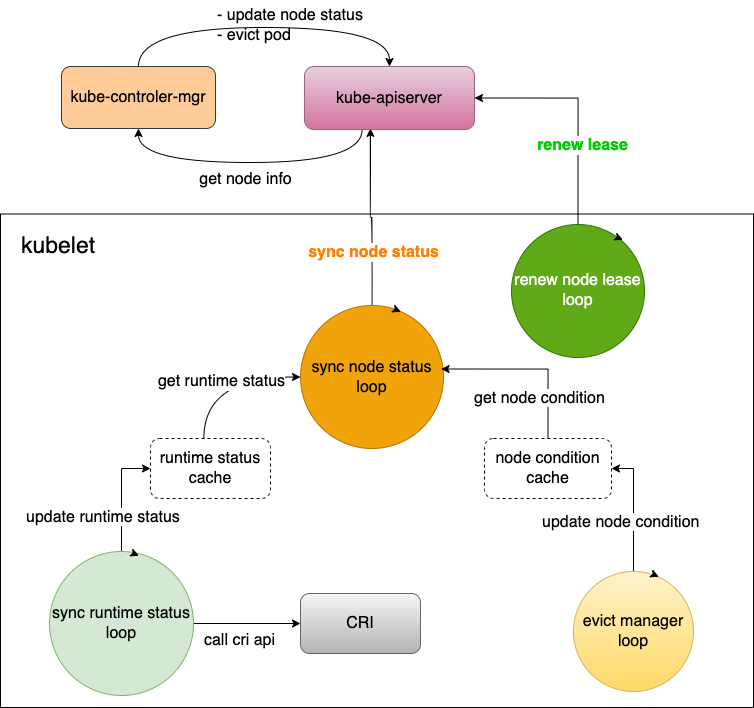

# 01-怎么运行一个容器

The best way to learn about containers is to first see it in action. We have created a welcome container for you.

You can check it out in the **Containers** tab (**welcome-to-docker**).

This one is a simple web application. Select [8088:80⁠](http://localhost:8088/) in the **Port(s)** column to see it running.

<figure><figcaption></figcaption></figure>

Containers are an isolated environment to run any code. Select the container, and go to the **Files** tab to see what's in it.

<figure><figcaption></figcaption></figure>

A container runs until you stop it. Do this by simply clicking on the **Stop** icon for your container.

You just saw a container in action. Next, you will learn how to run a container.


In this guide, you create an image using a Dockerfile and a sample application.

Clone the repository at [https://github.com/docker/welcome-to-docker⁠](https://github.com/docker/welcome-to-docker).

```
git clone https://github.com/docker/welcome-to-docker
```

The rest of this guide requires you to run commands in the new project directory. Run the following command before moving on.

```
cd welcome-to-docker
```

Open the sample application in your IDE. Note that it already has a **Dockerfile**. For your own projects you need to create this yourself.

<figure><figcaption></figcaption></figure>

You can build an image using the following **docker build** command via a CLI in your project folder.

```
docker build -t welcome-to-docker .
```

**Breaking down this command**

The **-t** flag tags your image with a name. (**welcome-to-docker** in this case). And the **.** lets Docker know where it can find the Dockerfile.\
Once the build is complete, an image will appear in the **Images** tab. Select the image name to see its details. Select **Run** to run it as a container. In the **Optional settings** remember to specify a port number (something like **8089**).

<figure><figcaption></figcaption></figure>

You now have a running container. If you don't have a name for your container, Docker provides one. View your container live by selecting the link below the container's name.

<figure><figcaption></figcaption></figure>

You learned how to run a container from a single image. Next, learn how you can run other people's images from Docker Hub.
