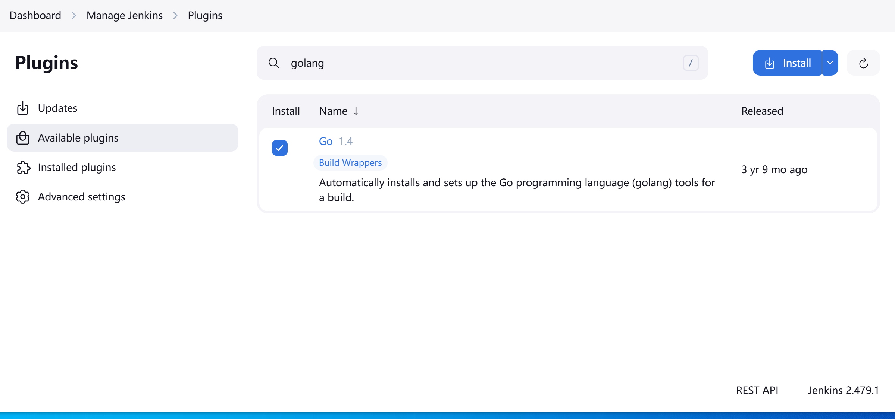

# 05、Jenkins CI/CD 管道实战1 【go-k8s】


在开始之前，本指南中的所有示例均基于[此 GitHub 存储库](https://github.com/shadowshot-x/micro-product-go/tree/Testing-CICD)中找到的代码。

### 设置 Docker 和 Golang&#x20;

你需要先安装 golang，docker  插件，这让 Jenkins 节点知道 Docker 和 Golang 在插件中可用。

<figure><figcaption></figcaption></figure>


接下来，您需要通过转到全局配置这些插件 `Manage Jenkins -> Global Tool Configuration.`

设置配置如下图所示。这将使 Docker 和 Golang 可用于运行 CI/CD 工作流程的 Jenkins 节点。


现在，您可以开始构建 Jenkins CI/CD 管道。转到`Dashboard`并选择`New Item` 。在 Jenkins 上构建整个应用程序时，您可以选择 pipeline 项目。


选择 Pipeline 后，您必须配置并添加 Jenkins 将跟踪的 GitHub 存储库。这可以定期、手动或在 GitHub 事件（例如拉取请求和提交）之后完成。此时，您需要添加具有要跟踪的相应分支的 GitHub 存储库。

最后，添加我们的代码和 Jenkins 用于 GitHub 和 Dockerhub 的凭据。创建这两个凭据，如下所示：


恭喜您设置了 Jenkins 服务器！这将自动跟踪您的应用程序的 GitHub 更改。

### &#x20;定义您的 CI/CD 步骤

Jenkins 包含一个称为 Jenkinsfile 的描述性文件，它概述了要运行的命令。当您指定 GitHub 分支时，Jenkins 将自动在那里搜索 Jenkinsfile。当找到这样的文件时，Jenkins将根据该文件运行命令。

首先，我们为 Jenkins 节点设置 Golang 版本。这与我们在全局列中配置的相同。接下来，我们分阶段具体说明步骤：

* 我们运行命令`make unit-test`单元测试用例，它将引用 Makefile。
* 功能测试，之后我们将构建 Docker 镜像。
* 通过使用 Dockerhub 凭据登录并推送映像来交付映像。

```go
pipeline {
    // install golang 1.14 on Jenkins node
    agent any
    tools {
        go 'go1.14'
    }
    environment {
        GO114MODULE = 'on'
        CGO_ENABLED = 0 
        GOPATH = "${JENKINS_HOME}/jobs/${JOB_NAME}/builds/${BUILD_ID}"
    }
    stages {
        stage("unit-test") {
            steps {
                echo 'UNIT TEST EXECUTION STARTED'
                sh 'make unit-tests'
            }
        }
        stage("functional-test") {
            steps {
                echo 'FUNCTIONAL TEST EXECUTION STARTED'
                sh 'make functional-tests'
            }
        }
        stage("build") {
            steps {
                echo 'BUILD EXECUTION STARTED'
                sh 'go version'
                sh 'go get ./...'
                sh 'docker build . -t shadowshotx/product-go-micro'
            }
        }
        stage('deliver') {
            agent any
            steps {
                withCredentials([usernamePassword(credentialsId: 'dockerhub', passwordVariable: 'dockerhubPassword', usernameVariable: 'dockerhubUser')]) {
                sh "docker login -u ${env.dockerhubUser} -p ${env.dockerhubPassword}"
                sh 'docker push shadowshotx/product-go-micro'
                }
            }
        }
    }
}
```


### 持续交付与持续部署

在 Kubernetes 中可以看到 CD 的一个非常简单的场景是在设置 Pod 时设置镜像拉取策略为 always。 一旦我们更新镜像，Kubernetes 就会拉取镜像并更新 Pod。

```yaml
kind: Pod
apiVersion: v1

metadata:
  name: product-micro-go
  labels:
    app: product-micro-go
spec:
  containers:
  - name: product-micro-go
    image: shadowshotx/product-micro-go
    imagePullPolicy: Always
```

