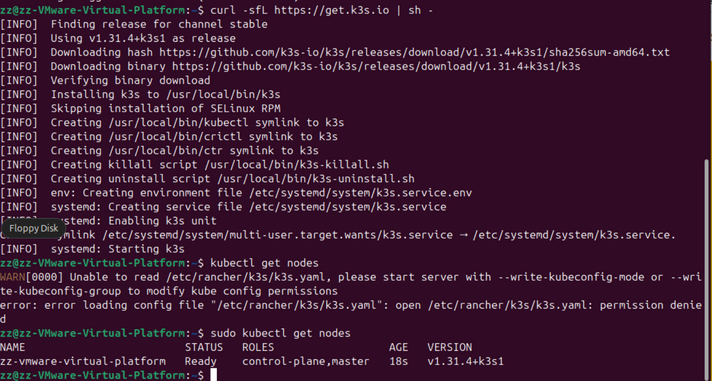

# 01-初识k3s

## 什么是 k3s

大家比较熟悉 k8s , 那什么是k3s?

k3s 是轻量级的 Kubernetes，易于安装，相比 k8s 只占用一半内存(100MB)，所有的组件都嵌入进一个二进制中。基于sqlite3的轻量级数据存储作为默认存储后端。 etcd3、MySQL 和 Postgres 也可用。

k3s 非常适合用来做边缘节点，物联网，嵌入式k8s，持续集成\


## 如何安装

K3s 提供了一个安装脚本，可以方便地将其作为服务安装在基于 systemd 或 openrc 的系统上。该脚本可从[https://get.k3s.io](https://get.k3s.io/)获取。要使用此方法安装 K3s，只需运行：

```bash
curl -sfL https://get.k3s.io | sh -
```

运行此脚本后，`kubectl` 、 `crictl` 、 `ctr` 、 `k3s-killall.sh`和`k3s-uninstall.sh` 等工具会被安装，[kubeconfig](https://kubernetes.io/docs/concepts/configuration/organize-cluster-access-kubeconfig/) 文件将被写入`/etc/rancher/k3s/k3s.yaml`

要安装其他代理节点并将其添加到集群，请使用`K3S_URL`和`K3S_TOKEN`环境变量运行安装脚本。以下是显示如何加入代理的示例：

```bash
curl -sfL https://get.k3s.io | K3S_URL=https://myserver:6443 K3S_TOKEN=mynodetoken sh -
```

设置`K3S_URL`参数会导致脚本程序将 K3s 配置为 agent，而不是 server。 `K3S_TOKEN`的值存储在 `/var/lib/rancher/k3s/server/node-token`&#x20;

<figure><figcaption></figcaption></figure>

