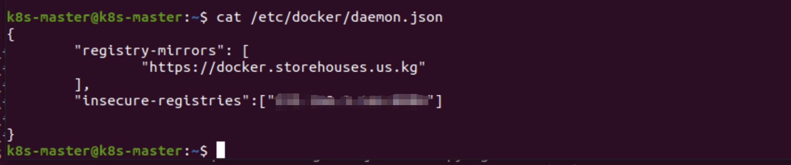
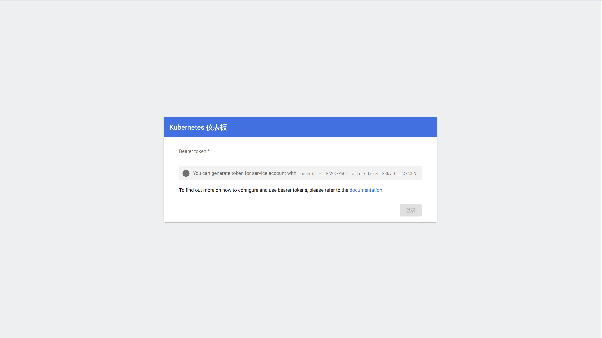
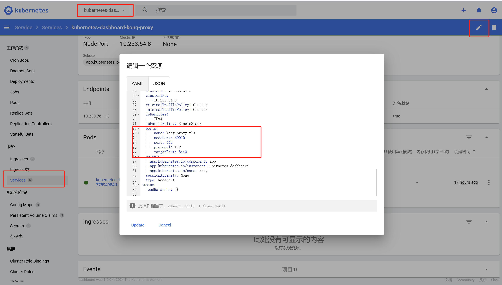

# 03-dashboard

## 引言

前面一篇文章，我们使用 kubekey 在两台 ubuntu 主机上安装了 k8s 集群，今天我们给k8s集群安装一个 dashboard ，方便对 kubectl 操作不太熟悉的小伙伴能够简单操作集群。

## 介绍

Kubernetes Dashboard is a general purpose, web-based UI for Kubernetes clusters. It allows users to manage applications running in the cluster and troubleshoot them, as well as manage the cluster itself.\
Kubernetes Dashboard 是一个通用的、基于 Web 的 UI，适用于 Kubernetes 集群。它允许用户管理集群中运行的应用程序并对其进行故障排除，以及管理集群本身。

As of version 7.0.0, we have dropped support for Manifest-based installation. Only Helm-based installation is supported now. Due to multi-container setup and hard dependency on Kong gateway API proxy it would not be feasible to easily support Manifest-based installation.\
从版本 7.0.0 开始，我们放弃了对基于清单的安装的支持。目前仅支持基于 Helm 的安装。由于多容器设置和对 Kong 网关 API 代理的硬依赖，轻松支持基于清单的安装是不可行的。

<figure><figcaption></figcaption></figure>

## 安装

Kubernetes Dashboard 目前仅支持基于 Helm 的安装，因为它速度更快，并且可以让我们更好地控制 Dashboard 运行所需的所有依赖项。我们现在使用单容器 DBless [Kong](https://hub.docker.com/r/kong/kong-gateway)安装作为连接所有容器并公开 UI 的网关。然后，用户可以使用 kong 网关前面的任何入口控制器或代理。要了解有关自定义安装方法的更多信息，请查看 [helm chart values](https://github.com/kubernetes/dashboard/blob/master/charts/kubernetes-dashboard/values.yaml).

为了安装 Kubernetes Dashboard，只需运行下面两条命令：

```
# Add kubernetes-dashboard repository
helm repo add kubernetes-dashboard https://kubernetes.github.io/dashboard/
# Deploy a Helm Release named "kubernetes-dashboard" using the kubernetes-dashboard chart
helm upgrade --install kubernetes-dashboard kubernetes-dashboard/kubernetes-dashboard --create-namespace --namespace kubernetes-dashboard
```

然后运行 kubectl get pods -n kubernetes-dashboard 查看容器启动情况，如果发现容器拉不下来，可以配置 daemon.json, 只需要配置 registry-mirrors 就可以了，我这里 配置的 insecure-registries 是为了让docker 能够访问私有镜像仓库(insecure)。

<figure><figcaption></figcaption></figure>

## 访问

对于基于 Helm 的安装，当我们的 Helm 图表安装`kong`时，只需运行：

```
kubectl -n kubernetes-dashboard port-forward svc/kubernetes-dashboard-kong-proxy 8443:443
```

现在访问仪表板： [https://localhost:8443](https://localhost:8443/) , 出现登录界面，要求我们输入 token，这个 token 怎么获得呢？

<figure><figcaption></figcaption></figure>

我们首先新建一个 sc.yaml ，将下面内容复制进去

```yaml
apiVersion: v1
kind: ServiceAccount
metadata:
  name: admin-user
  namespace: kubernetes-dashboard

---
apiVersion: rbac.authorization.k8s.io/v1
kind: ClusterRoleBinding
metadata:
  name: admin-user
roleRef:
  apiGroup: rbac.authorization.k8s.io
  kind: ClusterRole
  name: cluster-admin
subjects:
  - kind: ServiceAccount
    name: admin-user
    namespace: kubernetes-dashboard
```

执行以下命令，控制台会输出 token ，这里我添加了 duration 参数，作用是将 token 过期时间设置长一点，你可以根据自身情况设置，如果是自己玩，那就设置长一点 。

```
kubectl apply -f sc.yaml
kubectl -n kubernetes-dashboard create token admin-user --duration=8760h
```

到此，安装完毕，你可以登录界面访问，那么如何不用 kubectl portforward 也能访问？你需要修改[kubernetes-dashboard-kong-proxy](https://192.168.3.241:30010/#/service/kubernetes-dashboard/kubernetes-dashboard-kong-proxy?namespace=kubernetes-dashboard) 服务类型为 NodePort 并设置暴露的端口号 ，如下图：

<figure><figcaption></figcaption></figure>

如果你有任何安装问题，欢迎找我交流！
