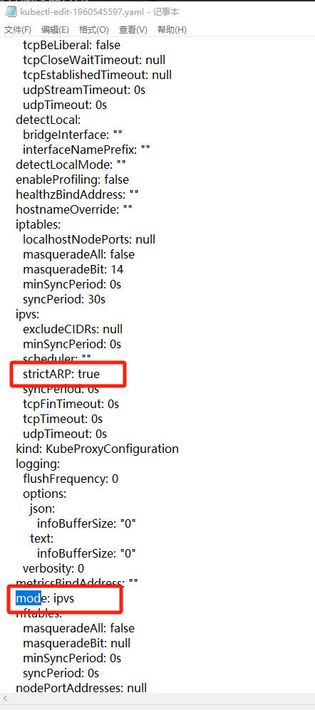
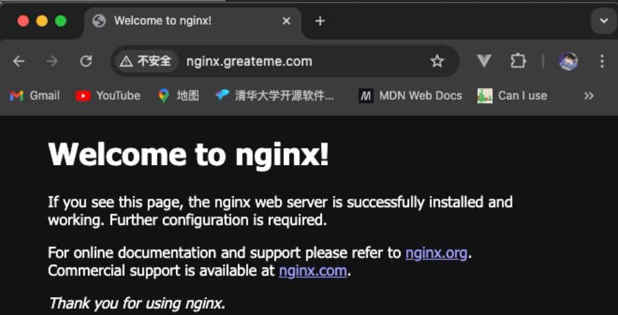
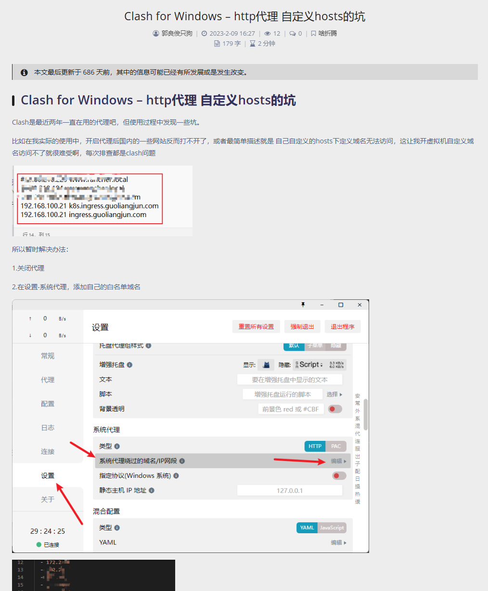

# 04-自建k8s集群支持 LoadBalancer

## 引言

当我们使用k8s集群部署好应用的Service时，默认的Service类型是ClusterIP，这种类型只有 Cluster 内的节点和 Pod 可以访问。如何将应用的Service暴露给Cluster外部访问呢，Kubernetes 提供了多种类型的 Service，如下：

### ClusterIP <a href="#at9k9" id="at9k9"></a>

ClusterIP服务是Kuberntets的默认服务。它在集群内部生成一个服务，外部无法访问。

ClusterIP服务的 YAML 文件如下：

```yaml
apiVersion: v1
kind: Service
metadata:  
  name: my-internal-service
selector:    
  app: my-app
spec:
  type: ClusterIP
  ports:  
  - name: http
    port: 80
    targetPort: 80
    protocol: TCP
```

如果不能从互联网访问ClusterIP服务，那我们还介绍它干啥？其实不是所有服务都需要被外部访问，比如我们内部有个 mysql 服务，这个服务就不用暴露到外网，他是给集群内其他服务使用。如果你真的需要访问内部服务，你可以使用  **kubectl portforward** 。

`kubectl port-forward` 是 Kubernetes 命令行工具 kubectl 提供的一个功能，用于在本地主机和 Kubernetes 集群中的 Pod 之间建立端口转发。

<figure><figcaption></figcaption></figure>

当你运行 kubectl port-forward 命令时，它会将本地主机上的一个端口与 Kubernetes 集群中的一个 Pod 的端口进行绑定。这样，在本地主机上监听的端口上收到的流量将被转发到 Pod 的端口上。

**kubectl port-forward** 命令的基本语法和示例如下：

```
  kubectl port-forward TYPE/NAME [options] [LOCAL_PORT:]REMOTE_PORT [...[LOCAL_PORT_N:]REMOTE_PORT_N]
  # Listen on ports 5000 and 6000 locally, forwarding data to/from ports 5000 and 6000 in the pod
  kubectl port-forward pod/mypod 5000 6000
  
  # Listen on ports 5000 and 6000 locally, forwarding data to/from ports 5000 and 6000 in a pod selected by the deployment
  kubectl port-forward deployment/mydeployment 5000 6000
  
  # Listen on port 8443 locally, forwarding to the targetPort of the service's port named "https" in a pod selected by the service
  kubectl port-forward service/myservice 8443:https
  
  # Listen on port 8888 locally, forwarding to 5000 in the pod
  kubectl port-forward pod/mypod 8888:5000
  
  # Listen on port 8888 on all addresses, forwarding to 5000 in the pod
  kubectl port-forward --address 0.0.0.0 pod/mypod 8888:5000
  
  # Listen on port 8888 on localhost and selected IP, forwarding to 5000 in the pod
  kubectl port-forward --address localhost,10.19.21.23 pod/mypod 8888:5000
  
  # Listen on a random port locally, forwarding to 5000 in the pod
  kubectl port-forward pod/mypod :5000
```

### NodePort <a href="#fsnn7" id="fsnn7"></a>

NodePort服务是让外部流量直接访问服务的最原始方式。NodePort，顾名思义，在所有的节点（虚拟机）上开放指定的端口，所有发送到这个端口的流量都会直接转发到服务。

<figure><figcaption></figcaption></figure>

NodePort服务的YAML文件如下：

```yaml
apiVersion: v1
kind: Service
metadata:  
 name: my-nodeport-service
selector:   
 app: my-app
spec:
 type: NodePort
 ports:  
 - name: http
  port: 80
  targetPort: 80
  nodePort: 30036
  protocol: TCP
```

从本质上来看，NodePort服务有两个地方不同于一般的“ClusterIP”服务。首先，它的类型是“NodePort”。还有一个叫做“nodePort"的端口，能在节点上指定开放哪个端口。如果没有指定端口，它会选择一个随机端口。这种方式有一些不足：

1. 一个端口只能供一个服务使用；
2. 只能使用30000–32767的端口；
3. 如果节点 / 虚拟机的IP地址发生变化，需要进行处理。

因此，我不推荐在生产环境使用这种方式来直接发布服务。如果不要求运行的服务实时可用，或者在意成本，这种方式适合你。例如用于演示的应用或是临时运行就正好用这种方法。

### LoadBalancer <a href="#id-1ksh9" id="id-1ksh9"></a>

在使用支持外部负载均衡器的云平台时，如果将 `type` 设置为 `"LoadBalancer"`， 则平台会为 Service 提供负载均衡器。 负载均衡器的实际创建过程是异步进行的，关于所制备的负载均衡器的信息将会通过 Service 的 `status.loadBalancer` 字段公开出来。 例如：

```yaml
apiVersion: v1
kind: Service
metadata:
  name: my-service
spec:
  selector:
    app.kubernetes.io/name: MyApp
  ports:
    - protocol: TCP
      port: 80
      targetPort: 9376
  clusterIP: 10.0.171.239
  type: LoadBalancer
status:
  loadBalancer:
    ingress:
    - ip: 192.0.2.127
```

这里最大的不足是，使用LoadBalancer发布的每个服务都会有一个自己的IP地址，你需要支付每个服务的LoadBalancer 费用，这是一笔不小的开支。

### Ingress  <a href="#b8gll" id="b8gll"></a>

Ingress 可以在多个服务前面充当“智能路由”的角色，或者是集群的入口。一般生产环境都比较推荐使用这种方式。

默认的 GKE ingress控制器会启动一个 Load Balancer，管理员基于路径或者是基于子域名的方式可以配置流量路由到不同的后端服务，如下图：

<figure><figcaption></figcaption></figure>

一个最小的 Ingress 资源示例：

```yaml
apiVersion: networking.k8s.io/v1
kind: Ingress
metadata:
  name: minimal-ingress
  annotations:
    nginx.ingress.kubernetes.io/rewrite-target: /
spec:
  ingressClassName: nginx-example
  rules:
  - http:
      paths:
      - path: /testpath
        pathType: Prefix
        backend:
          service:
            name: test
            port:
              number: 80

```

一般只有云平台支持LoadBalancer，如果脱离云平台，自己搭建的K8S集群，Service的类型使用LoadBalancer是没有任何效果的，ingress 也不支持。为了让私有网络中的K8S集群也能体验到LoadBalabcer，Metallb成为了解决方案。

## Metallb

### 为什么需要 metallb

为什么需要MetalLB Kubernetes没有为裸机集群提供网络负载均衡器(LoadBalancer类型的服务)的实现。Kubernetes所提供的网络负载平衡器的实现都是调用各种IaaS平台(GCP、AWS、Azure…)的粘合代码。如果你不是运行在一个受支持的IaaS平台上(GCP, AWS, Azure…)，loadbalancer在创建时将无限期地保持在“pending”状态。&#x20;

MetalLB的官方文档地址为:[https://metallb.io/](https://metallb.io/)

### 安装

**修改kube-proxy配置**

```
kubectl edit configmap -n kube-system kube-proxy
```

<figure><figcaption></figcaption></figure>

**安装 metallb**

```bash
kubectl apply -f https://raw.githubusercontent.com/metallb/metallb/v0.14.9/config/manifests/metallb-native.yaml
```

**定义地址池和操作模式**

```yaml
# 创建一个文件 metallb.yaml ,复制以下内容并修改 address 字段为你的集群 ip 地址段，具体参考官方文档。
apiVersion: metallb.io/v1beta1
kind: IPAddressPool
metadata:
  name: default-ip-pool
  namespace: metallb-system
spec:
  addresses:
  - 172.18.8.83-172.18.8.89
---
apiVersion: metallb.io/v1beta1
kind: L2Advertisement
metadata:
  name: default-l2
  namespace: metallb-system
spec:
  ipAddressPools:
  - default-ip-pool
```

```bash
kubectl apply -f metallb.yaml
```

**安装 ingress controller**

本次安装的ingress控制器是 `Ingress-Nginx Controller` ，官方文档地址：[https://kubernetes.github.io/ingress-nginx/deplo](https://kubernetes.github.io/ingress-nginx/deploy) helm安装和 yaml 安装，这里讲解 yaml安装，只需要执行以下命令：

```
kubectl apply -f https://raw.githubusercontent.com/kubernetes/ingress-nginx/controller-v1.12.0-beta.0/deploy/static/provider/cloud/deploy.yaml
```

yaml 文件中有些镜像国内无法访问，请上传镜像到私有镜像仓库或者国内镜像提供商如阿里云，腾讯云。

我已经改好了，你可以不用官方的yaml，直接使用我提供的yaml进行安装即可。执行这行命令：

```
kubectl apply -f https://raw.githubusercontent.com/xiaohh-me/kubernetes-yaml/main/network/ingress/deploy-v1.11.2.yaml
```

可执行这行命令检查是否安装成功：

```
kubectl get svc -o wide -n ingress-nginx
```

如果你发现 ingress-nginx-controller 的 external-ip 分配了ip 而不是 pending 状态，那说明成功了。

### 验证

接下来需要部署一个应用程序测试一下ingress是否安装成功, 执行下面命令：

```bash
kubectl create deployment nginx --image=registry.cn-shenzhen.aliyuncs.com/xiaohh-docker/nginx:1.25.5 --port=80 --replicas=3
kubectl expose deployment nginx --name=nginx --port=80 --target-port=80 --protocol=TCP --type=ClusterIP
kubectl create ingress nginx --class=nginx --rule="nginx.greateme.com/*=nginx:80"

# 注意里面的参数：
# –class: 使用哪个类型的ingress，可通过这行命令获取已存在的ingressclass：kubectl get ingressclass
# –rule: 路由规则，格式：域名/*=服务名:端口[,tls=https的secret名字]，上面格式代表我的域名为 nginx.greateme.com 我的服务名字为 nginx 我的端口为 80，且不使用https
```

修改 hosts 文件，添加域名解析  xxx.xxx.xxx.xxx  nginx.greateme.com

然后可以直接访问你的域名，可以看到nginx访问成功：

<figure><figcaption></figcaption></figure>

我最后一步卡了好久，访问域名报错，发现是我电脑 clash 和 hosts 冲突了，可以这样修改：

<figure><figcaption></figcaption></figure>
