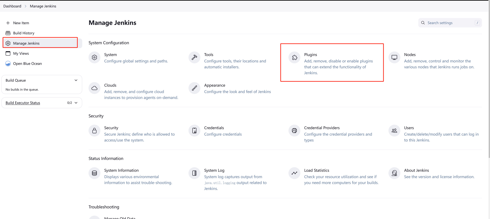
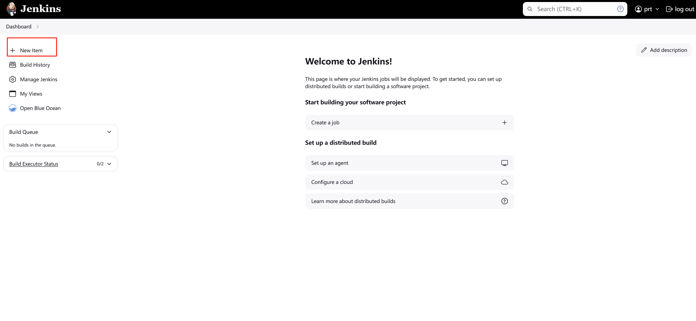
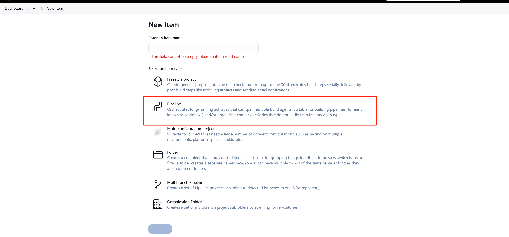
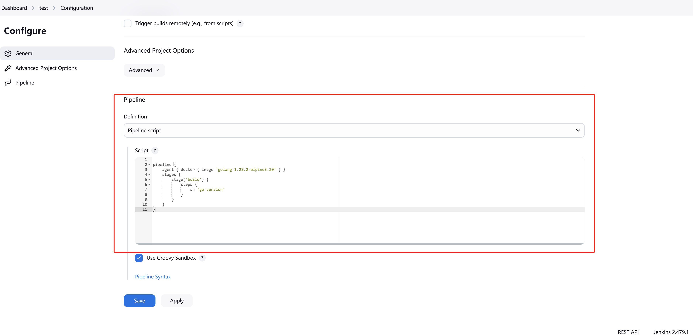
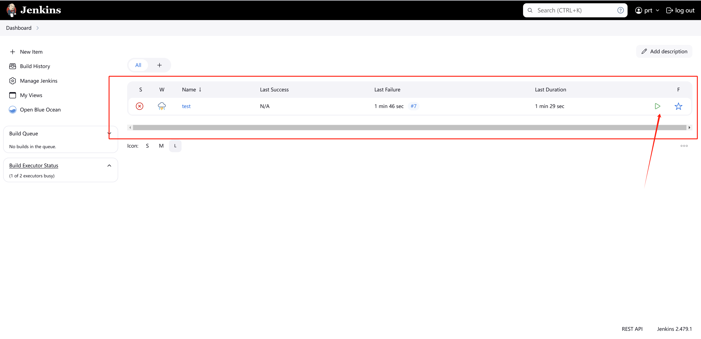
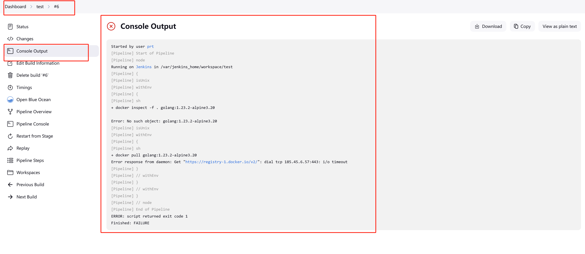

# 02、创建你的第一条pipeline

## 什么是 jenkins

上一节我们安装好了 jenkins，这节课我们熟悉下什么是 pipeline。

Jenkins Pipeline（或简称“Pipeline”）是一套插件，支持在 Jenkins 中实施和集&#x6210;_&#x6301;续交付管道_。

Jenkins Pipeline 提供了一组可扩展的工具，用于将简单到复杂的交付管道“作为代码”进行建模。 Jenkins Pipeline 的定义通常写入文本文件（称为`Jenkinsfile` ），然后将其嵌入项目的源码存储库。&#x20;

## 前置条件

需要安装 docker pipeline 插件，默认是已经安装了，你也可以去插件列表检查下。

<figure><figcaption></figcaption></figure>

## 快速入门示例

点击主页 New item, 选择 Pipeline，在 Script 下面填入流水线配置：


<figure><figcaption></figcaption></figure>

<figure><figcaption></figcaption></figure>

<figure><figcaption></figcaption></figure>

下面是一些各种语言的简单示例，笔者比较熟悉go，所以我配置了go 语言的流水线任务。

### java

```
pipeline {
    agent { docker { image 'maven:3.9.9-eclipse-temurin-21-alpine' } }
    stages {
        stage('build') {
            steps {
                sh 'mvn --version'
            }
        }
    }
}
```

### node/js

```

pipeline {
    agent { docker { image 'node:22.11.0-alpine3.20' } }
    stages {
        stage('build') {
            steps {
                sh 'node --version'
            }
        }
    }
}
```

### go

```
pipeline {
    agent { docker { image 'golang:1.23.2-alpine3.20' } }
    stages {
        stage('build') {
            steps {
                sh 'go version'
            }
        }
    }
}
```

## 运行流水线

当配置完流水线，返回主页会发现多了个任务,点击绿色箭头即可执行：

<figure><figcaption></figcaption></figure>

想要查看执行日志的话可以点击具体的流水线任务，点击Console Output:

<figure><figcaption></figcaption></figure>

如图，任务执行失败，访问 docker 镜像仓库的时候有问题，这个是因为 GFW 的原因，你可以替换国内镜像仓库，也可以执行更加简单的流水线任务：

```
pipeline {
    agent any 
    stages {
        stage('Stage 1') {
            steps {
                echo 'Hello world!' 
            }
        }
    }
}
```
