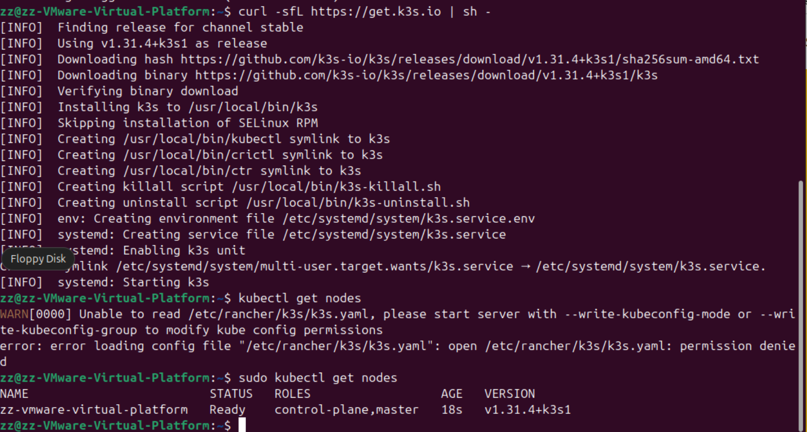

# 01-初识k3s

## 什么是 k3s

大家比较熟悉 k8s , 那什么是k3s?

k3s 是轻量级的 Kubernetes，易于安装，相比 k8s 只占用一半内存(100MB)，所有的组件都嵌入进一个二进制中。基于sqlite3的轻量级数据存储作为默认存储后端。 etcd3、MySQL 和 Postgres 也可用。

k3s 非常适合用来做边缘节点，物联网，嵌入式k8s，持续集成\


## 如何安装

K3s 提供了一个安装脚本，可以方便地将其作为服务安装在基于 systemd 或 openrc 的系统上。该脚本可从[https://get.k3s.io](https://get.k3s.io/)获取。要使用此方法安装 K3s，只需运行：

```bash
curl -sfL https://get.k3s.io | sh -
```

运行此脚本后，`kubectl` 、 `crictl` 、 `ctr` 、 `k3s-killall.sh`和`k3s-uninstall.sh` 等工具会被安装，[kubeconfig](https://kubernetes.io/docs/concepts/configuration/organize-cluster-access-kubeconfig/) 文件将被写入`/etc/rancher/k3s/k3s.yaml`

要安装其他代理节点并将其添加到集群，请使用`K3S_URL`和`K3S_TOKEN`环境变量运行安装脚本。以下是显示如何加入代理的示例：

```bash
curl -sfL https://get.k3s.io | K3S_URL=https://myserver:6443 K3S_TOKEN=mynodetoken sh -
```

设置`K3S_URL`参数会导致脚本程序将 K3s 配置为 agent，而不是 server。 `K3S_TOKEN`的值存储在 `/var/lib/rancher/k3s/server/node-token`&#x20;

<figure><figcaption></figcaption></figure>

安装 k3s 的最低硬件要求如下：

| Node  节点    | CPU | RAM     |
| ----------- | --- | ------- |
| Server  服务器 | 2核  | 2 GB    |
| Agent  代理   | 1 核 | 512 MB  |

K3s 服务器需要端口 6443 才能被所有节点访问。安装不同的网络插件会要求某些端口开放，如下：

| Protocol   | Port      | Source      | Destination  | 描述                                                                      |
| ---------- | --------- | ----------- | ------------ | ----------------------------------------------------------------------- |
| TCP        | 2379-2380 | Servers  服  | Servers      | <p>Required only for HA with embedded etcd<br>仅对于具有嵌入式 etcd 的 HA 需要</p> |
| TCP        | 6443      | Agents      | Servers      | <p><br>K3s Supervisor 和 Kubernetes API Server</p>                       |
| UDP        | 8472      | All nodes   | All nodes    | <p><br>仅 Flannel VXLAN 需要</p>                                           |
| TCP        | 10250     | All nodes   | All nodes    | Kubelet metrics                                                         |
| UDP        | 51820     | All nodes   | All nodes    | <p><br>仅适用于具有 IPv4 的 Flannel Wireguard</p>                              |
| UDP        | 51821     | All nodes   | All nodes    | <p><br>仅适用于具有 IPv6 的 Flannel Wireguard</p>                              |
| TCP        | 5001      | All nodes   | All nodes    | <p><br>仅嵌入式分布式注册表 (Spegel) 需要</p>                                       |
| TCP        | 6443      | All nodes   | All nodes    | <p><br>仅嵌入式分布式注册表 (Spegel) 需要</p>                                       |

## 配置

默认情况下，安装时将使用位于`/etc/rancher/k3s/config.yaml`的 YAML 文件中存在的值。

基本`server`配置文件的示例如下：

```yaml
write-kubeconfig-mode: "0644"
tls-san:
  - "foo.local"
node-label:
  - "foo=bar"
  - "something=amazing"
cluster-init: true
```

这相当于以下 CLI 参数：

```bash
k3s server \
  --write-kubeconfig-mode "0644"    \
  --tls-san "foo.local"             \
  --node-label "foo=bar"            \
  --node-label "something=amazing"  \
  --cluster-init
```

## 离线安装

1. 准备集群所需镜像压缩包，可以到 github release 页面下载
2. 将 k3s 二进制和 install.sh 脚本下载到本地
3. 执行安装命令&#x20;

我写了个脚本给你参考,将依赖下载下来后，放入指定目录就可以离线安装：

```bash
mkdir -p /var/lib/rancher/k3s/agent/images/
curl -L -o /var/lib/rancher/k3s/agent/images/k3s-airgap-images-amd64.tar.zst "https://github.com/k3s-io/k3s/releases/download/v1.31.4%2Bk3s1/k3s-airgap-images-amd64.tar.zst"
curl -L -o /usr/local/bin/k3s https://github.com/k3s-io/k3s/releases/download/v1.31.4%2Bk3s1/k3s
chmod +x /usr/local/bin/k3s

curl https://raw.githubusercontent.com/k3s-io/k3s/refs/tags/v1.31.4%2Bk3s1/install.sh > install.sh
chmod +x install.sh
INSTALL_K3S_SKIP_DOWNLOAD=true ./install.sh
```


## 卸载

要从 server 节点卸载 K3s，请运行：

```bash
/usr/local/bin/k3s-uninstall.sh
```

要从 agent 节点卸载 K3s，请运行：

```bash
/usr/local/bin/k3s-agent-uninstall.sh
```
