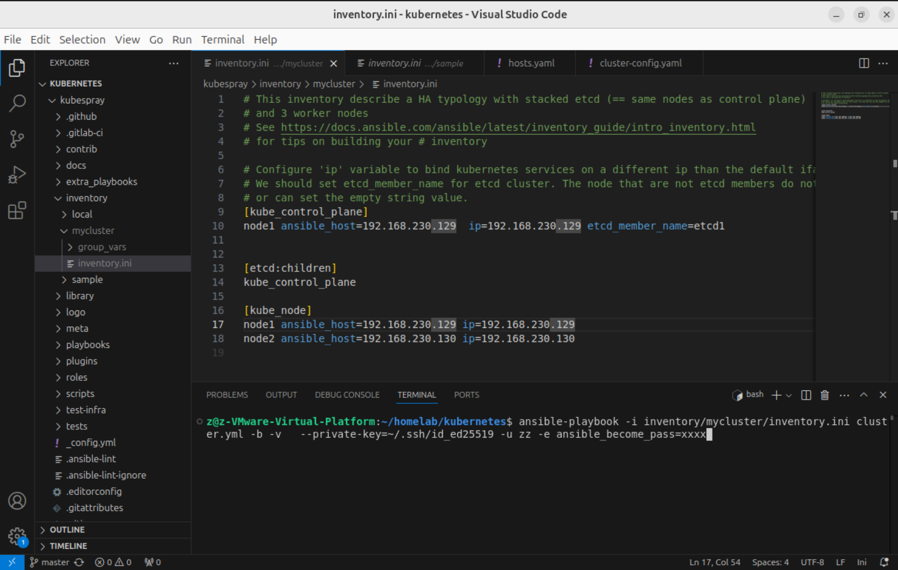

# 02-使用 kubespray、kubekey安装 k8s集群

## &#x20;常见集群部署方式

在Kubernetes（K8s）中部署集群的方式多种多样，根据环境和需求的不同，常见的部署方式包括：

1. **手动二进制部署**
   * 从零开始手动配置每个节点上的所有组件。这包括安装Docker或容器运行时、设置网络插件、安装etcd集群、配置kube-apiserver、kube-controller-manager、kube-scheduler等控制面组件，并启动kube-proxy与kubelet服务。这种方式需要对Kubernetes架构有深入理解，适用于学习和实验场景。
2. **kubeadm部署**
   * `kubeadm`是Kubernetes官方提供的工具，用于快速搭建生产级别的Kubernetes集群。它简化了初始化Master节点以及加入Worker节点的过程，可以方便地创建一个最小化的高可用集群。
3. **第三方自动化部署工具**
   * Kubespray（Ansible playbook驱动的部署工具）：通过Ansible Playbooks自动化执行一系列步骤来部署Kubernetes集群，适用于生产环境，可以高度定制化
   * kubekey: 不使用 ansible，直接使用go语言编写的部署工具，对于国内用户比较友好，安装方便（个人推荐）

## Kubespray

### 介绍

Kubespray 是一个开源项目，旨在帮助用户在多云环境中部署和管理Kubernetes集群。为了实现这个目标，Kubespray 使用了 Ansible 这个强大的工具。Ansible 是一个深受信赖的开源自动化运维工具，主要用于自动化应用部署、配置管理和任务执行。基于此，Kubespray 能够在各种云平台，如 AWS、GCE、Azure、OpenStack 等以及裸机等硬件上进行部署。

使用 Kubespray，用户可以选择执行一个 Ansible 脚本，然后 Ansible 会使用 SSH 协议与各个目标主机进行通信，并基于该脚本实现集群部署、清理、升级等任务。

<figure><figcaption></figcaption></figure>

### 安装

#### 1. 设置免密登录

首先在你的 Ansible 节点上为你的本地用户生成 SSH 密钥：

```
$ ssh-keygen
```

使用 `ssh-copy-id` 命令复制 SSH 密钥：

```
$ ssh-copy-id -i ~/.ssh/{rsa.pub} {username}@{192.168.1.241}
$ ssh-copy-id -i ~/.ssh/{rsa.pub} {username}@{192.168.1.242}
```

#### 2. 克隆代码

```
git clone git@github.com:kubernetes-sigs/kubespray.git
```

#### 3. 安装 ansible

需要提前安装下 python 和 pip ， 以下命令主要是创建一个 python 虚拟环境，并安装依赖，复制命令执行即可

```sh
VENVDIR=kubespray-venv
KUBESPRAYDIR=kubespray
python3 -m venv $VENVDIR
source $VENVDIR/bin/activate
cd $KUBESPRAYDIR
pip install -U -r requirements.txt
```

### 配置 inventory

将项目中 sample 文件夹目录拷贝一份，然后修改里面的主机和配置：

```
cp -r inventory/sample inventory/mycluster 
```

我使用了2台虚拟机，你可以参考我的写法和命令:

<figure><figcaption></figcaption></figure>

<figure><figcaption></figcaption></figure>

### 安装集群

```
ansible-playbook -i inventory/mycluster/inventory.ini cluster.yml -b -v \
  --private-key=~/.ssh/private_key -u xx -e ansible_become_pass=xxxx
```

### 访问集群

`kubectl_localhost: true`和`kubeconfig_localhost: true`&#x20;

如果启用了`kubectl_localhost` ， `kubectl`将下载到`/usr/local/bin/`，还会生成一个`inventory/mycluster/artifacts/kubectl.sh` 脚本

如果`kubeconfig_localhost`启用了`admin.conf`会出现在 `inventory/mycluster/artifacts/`

注意：admin.conf 文件中的控制器主机名可能是私有 IP。如果是这样，请将其更改为使用控制器的公共 IP 或集群的负载均衡器。&#x20;

您可以通过运行以下命令查看节点列表：

```
cd inventory/mycluster/artifacts
./kubectl.sh get nodes
```

## kubekey

### 介绍

KubeKey是一个开源的轻量级工具，用于部署Kubernetes集群。它提供了一种灵活、快速、方便的方式来安装Kubernetes/K3s、Kubernetes/K3s和KubeSphere，以及相关的云原生附加组件。它也是扩展和升级集群的有效工具。

此外，KubeKey还支持定制离线包（artifact），方便用户在离线环境下快速部署集群。

### 安装

1. 修改主机 /etc/hosts ,添加主机名

```
// 假设我们有两台机器，分别叫做node1，node2, 我们需要修改 hosts 文件
sudo vim /etc/hosts


192.168.3.121 node1
192.168.3.122 node2
```

2. 在安装必要组件

```
apt install -y socat conntrack ebtables ipset ipvsadm
```

3. 下载 kk 工具

```
curl -sfL https://get-kk.kubesphere.io | sh -
```

4. 创建 config

```
./kk create config
```

5. 修改 config
6. 创建集群

<pre><code>export KKZONE=cn
<strong>./kk create config -f config.yaml
</strong></code></pre>
