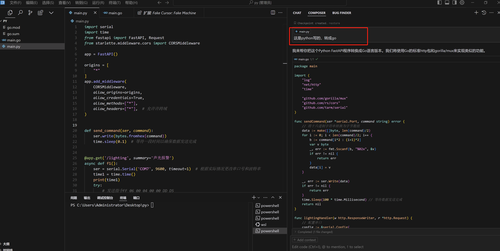
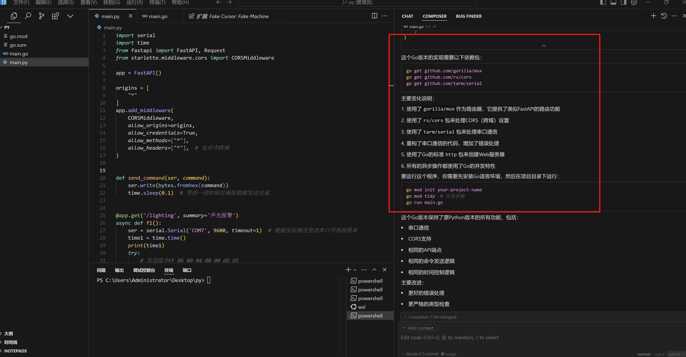
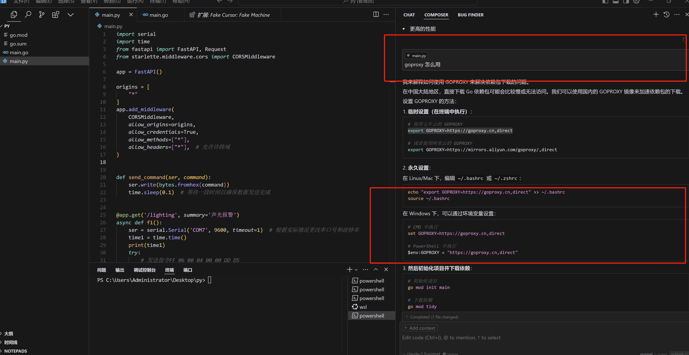

# 02-AI 写代码写文章

最近遇到了个需求，要把一段 python 控制小灯的代码转成 go实现，AI 时代，谁还亲自写代码啊？


我打开了最近爆火的 AI 代码编辑器：Cursor ，将 python 代码放入，如下图：


<figure><figcaption></figcaption></figure>

仅仅一句话，我就有了个帮我写代码的小弟，原本需要花费半天的工作，现在只要10秒钟了，Cursor 甚至还贴心的告诉我如何运行 golang 代码，生怕我是个 golang 小白！

<figure><figcaption></figcaption></figure>

但是我发现我被墙了！！！ 这个我能理解，毕竟我没说我人在中国，但是我发现我不知道怎么在 windows 系统上设置 goproxy ，于是我又问它：goproxy 怎么用

<figure><figcaption></figcaption></figure>

这 AI 也太智能了把，贴心的给我列出了所有操作系统的使用姿势。运行代码，一切完美，我的灯亮了！

<figure><figcaption></figcaption></figure>


最后的最后，**我让他给我写了篇文章，你们帮我看看写的怎么样！**


## ppython代码使用AI助手重写为Go代码的实践分享

### 一、项目背景

最近我有一个需求，需要将一个基于Python FastAPI开发的串口通信服务重写为Go语言版本。这个服务的主要功能是通过串口发送特定的十六进制命令来控制设备。原始Python代码使用了以下主要组件：

* FastAPI 作为Web框架
* pyserial 处理串口通信
* CORS中间件处理跨域请求

### 二、代码转换过程

#### 2.1 框架选择

在Go版本中，我们选择了以下替代方案：

* gorilla/mux 替代 FastAPI 作为路由框架
* tarm/serial 替代 pyserial 处理串口通信
* rs/cors 处理跨域请求

#### 2.2 主要代码对比

**Python版本（原始代码）**

```python
@app.get('/lighting', summary='声光报警')
async def f1():
    ser = serial.Serial('COM7', 9600, timeout=1)
    time1 = time.time()
    try:
        send_command(ser, 'FF0600040000DDD5')
        send_command(ser, 'FF0600040000DDD5')
        send_command(ser, 'FF0600040000DDD5')
        send_command(ser, 'FF06000D00000DD7')
        while True:
            if time.time() - 5 > time1:
                break
        send_command(ser, 'FF06000F05016E87')
    finally:
        ser.close()
```

**Go版本（重写后）**

```go
ser, err := serial.OpenPort(config)
if err != nil {
    http.Error(w, "无法打开串口", http.StatusInternalServerError)
    return
}
defer ser.Close()

commands := []string{
    "FF0600040000DDD5",
    "FF0600040000DDD5",
    "FF0600040000DDD5",
    "FF06000D00000DD7",
}

for _, cmd := range commands {
    if err := sendCommand(ser, cmd); err != nil {
        http.Error(w, "发送命令失败", http.StatusInternalServerError)
        return
    }
}

time.Sleep(5 * time.Second)

if err := sendCommand(ser, "FF06000F05016E87"); err != nil {
    http.Error(w, "发送复位命令失败", http.StatusInternalServerError)
    return
}

w.WriteHeader(http.StatusOK)
```

### 三、主要改进

* 错误处理
* Python版本使用try-finally结构
* Go版本使用更细致的错误检查和返回
* 代码结构
* 将命令序列整理为数组，使用循环处理
* 使用defer确保资源释放
* 更清晰的错误状态返回
* 并发处理
* 去除了Python的异步特性
* 采用Go原生的并发模型

4\. 类型系统

* 利用Go的静态类型系统
* 更严格的类型检查

### 四、性能提升

Go版本相比Python版本有以下优势：

* 编译型语言，执行效率更高

2\. 更低的内存占用

* 更好的并发处理能力
* 启动时间更短

### 五、注意事项

1\. 依赖管理   go mod init main   go mod tidy

* GOPROXY设置   export GOPROXY=https://goproxy.cn,direct
* 串口权限

确保程序有足够的权限访问串口设备

### 六、总结

通过AI助手的帮助，我们成功将Python代码重写为Go版本。新版本不仅保持了原有功能，还在错误处理、代码结构和性能方面都有所提升。这个过程展示了AI辅助编程的效率和可行性，同时也体现了Go语言在系统编程方面的优势。
